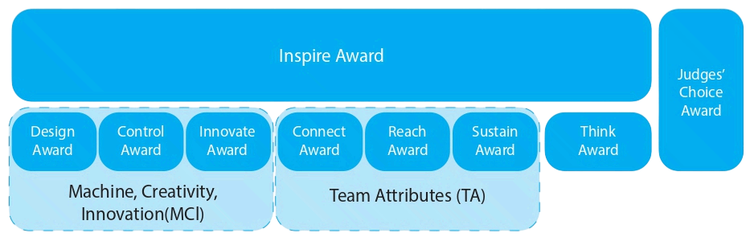

.. include:: <isonum.txt>

Types of Awards
===============

Advancing Awards
----------------

There are 8 awards for FTC\ |reg| teams (excluding optional awards). For more information on the exact requirements for these awards, see |cm|.

These are:

- **The Inspire Award** recognizes teams who excel in MCI, TA, and Think award accomplishments. This team is an all-around inspiration for others.
- **MCI awards** recognize the technical accomplishments of teams in the brainstorming, design, construction, operation, and control of their ROBOTS.
- **TA awards** recognize teams who have expanded their skillset, created a plan to sustain their program and team, and spread the message of FIRST throughout their outreach.
- **The Think Award** recognizes teams who masterfully document their team's process and ROBOT using their PORTFOLIO.
- **Judges' Choice Award** recognizes a team whose unique efforts, performance, or dynamics merit recognition, but does not fit into any of the other award categories.

Inspire Award
~~~~~~~~~~~~~

Official |cm| Description
^^^^^^^^^^^^^^^^^^^^^^^^^

.. admonition:: Term

   .. glossary::

      The team that receives this award is a strong ambassador for FIRST programs and a role model FIRST team. This team is a top contender for many other judged awards and is a gracious competitor. The Inspire Award winner is an inspiration to other teams, acting with Gracious Professionalism\ |reg| both on and off the playing FIELD. This team shares their experiences, enthusiasm, and knowledge with other teams, sponsors, their community, and the JUDGES. Working as a unit, this team will have shown success in performing the task of designing and building a ROBOT.

A portfolio is required for this award. The Inspire Award is the top award for an FTC team. It is given to a team that consistently rises to the top in other awards categories.

Of all the awards, this one is arguably the most subjective, as it is about how good a team does overall, including how much they weigh outreach as compared to robot performance and documentation.

While the description is comprehensive, here are the key, unwritten tips for winning the top award:

.. tip::
   - Be a "Complete Package": You cannot win Inspire by being excellent in just one area. Your robot must be competitive (a top contender), your portfolio must be comprehensive and professional, and your outreach must be meaningful. Excellence in all judged categories is the goal.
   - Demonstrate Leadership, Not Just Participation: Show how your team leads and inspires others. Did you host a scrimmage for newer teams? Create shared resources? Mentor an FLL team? This goes beyond sharing your own experiences; it's about actively elevating your entire FIRST community.
   - Exemplify Gracious Professionalism\ |reg| in Action: Judges will observe you in the pit and on the field. Be helpful to other teams, share tools, cheer for opponents, and handle both wins and losses with grace. Your actions speak as loudly as your portfolio.
   - Tell a Cohesive Story: In your judge interview, connect the dots between your robot design, your outreach, and your team's growth. Show how your core values drove your success in every aspect of the season.

Inspire Award Criteria
^^^^^^^^^^^^^^^^^^^^^^

+--------------+---+-------------------------------------------------------------------------------------------------------------------------------------------------------------------------------------------+
| **Required** | 1 | Team must submit a PORTFOLIO.                                                                                                                                                             |
+--------------+---+-------------------------------------------------------------------------------------------------------------------------------------------------------------------------------------------+
| **Required** | 2 | The Inspire Award celebrates the strongest qualities of all the judged awards. A team must be a strong contender for at least one award in each of the following judged award categories: |
|              |   |                                                                                                                                                                                           |
|              |   | A. Machine, Creativity, and Innovation Awards,                                                                                                                                            |
|              |   | B. Team Attributes Awards, and                                                                                                                                                            |
|              |   | C. Think Award.                                                                                                                                                                           |
+--------------+---+-------------------------------------------------------------------------------------------------------------------------------------------------------------------------------------------+
| **Required** | 3 | Team must be positive and inclusive, and each team member contribute to the success of the team.                                                                                          |
+--------------+---+-------------------------------------------------------------------------------------------------------------------------------------------------------------------------------------------+
| **Required** | 4 | Team is able to describe, demonstrate, document, or display their experiences and knowledge to the JUDGES.                                                                                |
+--------------+---+-------------------------------------------------------------------------------------------------------------------------------------------------------------------------------------------+

Think Award
~~~~~~~~~~~

Official |cm| Description
^^^^^^^^^^^^^^^^^^^^^^^^^

.. admonition:: Term

   .. glossary::

      This judged award is given to the team that best reflects the journey the team took as they experienced their season. The content within the PORTFOLIO is the key reference for JUDGES to help identify the most deserving team. The team could share or provide additional detailed information that is helpful for the JUDGES.

A portfolio is required for this award. The Think Award is based entirely on the |EP|. In order to have a chance at winning, the |EP| should include as much math and physics as possible, document the entire journey of the robot through iterations, and other documentation of design and game strategy.

In addition, the portfolio should be well laid out and contain information on various non-technical aspects of the team, such as plan how and from where they get new skills, how they recruit people into FIRST, how the team tracks goal settings and task execution during the season. While these categories aren't as strictly important as robot documentation, they are generally recommended for a strong |EP|.

Think Award Criteria
^^^^^^^^^^^^^^^^^^^^

+----------------+---+----------------------------------------------------------------------------------------------------------------------------+
| **Required**   | 1 | Team must submit a PORTFOLIO. The PORTFOLIO must include engineering content which includes at least one of the following: |
|                |   |                                                                                                                            |
|                |   | A. evidence of use of the engineering process                                                                              |
|                |   | B. lessons learned and implemented related to the design of their ROBOT                                                    |
|                |   | C. trade off analysis / cost benefit analysis                                                                              |
|                |   | D. mathematical analysis used to make design decisions                                                                     |
+----------------+---+----------------------------------------------------------------------------------------------------------------------------+
| **Encouraged** | 2 | Team PORTFOLIO may include information about resources which includes any number of the following examples:                |
|                |   |                                                                                                                            |
|                |   | A. how the team learns from team mentors, and/or a development plan for team members to learn new skills                   |
|                |   | B. how the team recruited new people into FIRST                                                                            |
|                |   | C. how the team identified goals and tracked progress towards their goals throughout the season                            |
+----------------+---+----------------------------------------------------------------------------------------------------------------------------+
| **Encouraged** | 3 | PORTFOLIO information is organized in a clear and intuitive manner                                                         |
+----------------+---+----------------------------------------------------------------------------------------------------------------------------+

Tips for this award:

.. tip::
   - It's All About the Portfolio: Remember, this award is judged entirely on the Engineering Portfolio. The interview is to clarify its contents. Every key point must be documented in writing.
   - Show the "Journey," Not Just the Destination: Document every failure, every prototype, and every iteration. Include photos of failed mechanisms, notes from brainstorming sessions, and data from test logs. Judges want to see your thought process and how you overcame obstacles.
   - Quantify Your Engineering Decisions: Don't just say "we made it stronger." Say "After the polycarbonate arm failed under 10N of force, we switched to 6061 aluminum, which withstood 50N in testing." Use math, physics, and data to justify every major design choice.
   - Structure for Readability: A wall of text will lose the judges' interest. Use clear headings, bullet points, diagrams, and captioned images. Make it easy for a judge to quickly understand your process.

Connect Award
~~~~~~~~~~~~~

Official |cm| Description
^^^^^^^^^^^^^^^^^^^^^^^^^

.. admonition:: Term

   .. glossary::

      This judged award is given to the team that connects with their local science, technology, engineering, and math (STEM) community to learn and adopt new tools through effort and persistence. This team has a team plan and has identified steps to achieve their goals. A PORTFOLIO is not required for this award.

Be prepared for judges to ask you how your outreaches were meaningful, and try to avoid doing STEM outreaches just for the sake of saying you did a STEM connections. Successful STEM outreaches are those that are undertaken for a specific purpose and have a clear intent and goal, such as meeting with an expert on computer vision to ask for advice on a vision task for the game. If you are struggling to find STEM outreaches, local colleges and businesses are a good start.

Connect Award Criteria
^^^^^^^^^^^^^^^^^^^^^^

+----------------+---+----------------------------------------------------------------------------------------------------------------------------------------+
| **Required**   | 1 | Team must describe, display, or document a team plan that covers all of the following:                                                 |
|                |   |                                                                                                                                        |
|                |   | A. The team's goals for the development of team member skills, and                                                                     |
|                |   | B. The steps the team has taken or will take to reach those goals                                                                      |
+----------------+---+----------------------------------------------------------------------------------------------------------------------------------------+
| **Encouraged** | 2 | Provide examples of developing in person or virtual connections with individuals in the engineering, science, or technology community. |
+----------------+---+----------------------------------------------------------------------------------------------------------------------------------------+
| **Encouraged** | 3 | Provide examples of how it actively engages with the engineering community.                                                            |
+----------------+---+----------------------------------------------------------------------------------------------------------------------------------------+

The core of this award is depth, purpose, and learning, not just quantity.

**Focus on the "Why," Not Just the "What."** For every STEM connection, be prepared to answer:

- Why did you reach out to this specific person or organization? (e.g., "We needed help with a persistent odometry error, so we contacted a local university's robotics lab.")
- What did you learn from them? (e.g., "They taught us about sensor fusion, which we implemented and documented in our |EP|.")
- How did it change your approach? (e.g., "This conversation led us to redesign our dead wheel assembly, improving our accuracy by 40%.")

**Document the Relationship, Not Just the Event.** Don't just list "Visited XYZ Engineering." Create a small case study for key connections. Include:

- The problem you were trying to solve.
- Who you met (e.g., "Dr. Anna Smith, Professor of Computer Vision").
- Key takeaways and advice received.
- Photos of your team with the expert or implementing of their advice.

**Show a Spectrum of Connections.** A strong portfolio shows you seek help for different needs:

- Technical: Engineers, programmers, machinists.
- Strategic: Business professionals for marketing, budgeting, and project management.
- Academic: Teachers and professors for foundational science and math.

Reach Award
~~~~~~~~~~~

Official |cm| Description
^^^^^^^^^^^^^^^^^^^^^^^^^

.. admonition:: Term

   .. glossary::

      This award celebrates a team that has introduced and recruited new people into FIRST. Through their efforts, they have sparked others to embrace the FIRST culture. A PORTFOLIO is not required for this award.

Starting from DECODE season, the Motivate Award is divided into Reach and Sustain Awards. Reach Award includes outreach objectives and how it affects FIRST community as well as how team recruitment new teams/coaches/mentors/volunteers who were not previously involved in FIRST.

Reach Award Criteria
^^^^^^^^^^^^^^^^^^^^

+----------------+---+-----------------------------------------------------------------------------------------------------------------------------------------------------------------------------------------------+
| **Required**   | 1 | Team must discuss, describe, display, or document their outreach objectives and how their outreach activities support the FIRST community                                                     |
+----------------+---+-----------------------------------------------------------------------------------------------------------------------------------------------------------------------------------------------+
| **Required**   | 2 | Team must discuss, describe, display, or document their successful recruitment of new teams, or coaches, or mentors and/or volunteers who are not otherwise active within the FIRST community |
+----------------+---+-----------------------------------------------------------------------------------------------------------------------------------------------------------------------------------------------+
| **Encouraged** | 3 | Is an ambassador for FIRST programs in a way that makes FIRST loud                                                                                                                            |
+----------------+---+-----------------------------------------------------------------------------------------------------------------------------------------------------------------------------------------------+
| **Encouraged** | 4 | Has a creative and evolving approach to outreach materials that market their team and FIRST                                                                                                   |
+----------------+---+-----------------------------------------------------------------------------------------------------------------------------------------------------------------------------------------------+

This award is about growth, inclusion, and creating new FIRST enthusiasts.

**Track Your "FIRST Conversions."** The most powerful metric is not just "people reached," but new people brought into FIRST. Document:

- Number of new students you inspired to join an FLL team, your FTC team, or another FTC team.
- Number of new coaches, mentors, or volunteers you recruited who had no prior FIRST experience.
- Stories of individuals you brought in (e.g., "We convinced our school's art teacher to mentor us on design principles, and she is now a registered volunteer for our event.").

**Broaden Your Definition of "Recruitment."** Reach isn't just for students. Actively recruit:

- New Mentors: Reach out to parents' professional networks, local tech companies, and retiree engineering groups.
- New Volunteers: Promote judge, referee, and field reset volunteer opportunities at your outreach events.
- New Coaches: Help interested parents or teachers understand the commitment and guide them through starting a new FLL team.

**Make your outreach the "first step" into FIRST.** At public events, don't just display a cool robot - actively engage your audience and show them how to begin their own journey:

- Have a simple, hands-on activity (e.g., drive a past season's robot, build a simple LEGO mechanism).
- Have clear, take-home information on how to start or join a team.
- Use the "FLL/FTC Pipeline" strategy: Have information for both programs. A 3rd grader can't join FTC, but they can get excited about FLL because of your demo.

Sustain Award
~~~~~~~~~~~~~

Official |cm| Description
^^^^^^^^^^^^^^^^^^^^^^^^^

.. admonition:: Term

   .. glossary::

      Sustainability and planning are essential for a FIRST team, because they ensure the program's long-term success. This award celebrates the team that has considered their future team members and has worked to ensure that their team or program will continue to exist long after they have gone on to develop their careers. A PORTFOLIO is not required for this award.

The next Award which was previously included in the Motivate Award is Sustain. This Award answers the question "How will your team exist in the future and what are you doing to make it happen?".

Sustain Award Criteria
^^^^^^^^^^^^^^^^^^^^^^

+----------------+---+-----------------------------------------------------------------------------------------------------------------------+
| **Required**   | 1 | Team must discuss, describe, display, or document their plan(s) which includes at least one of the following:         |
|                |   | A. finances and financial sustainability plan,                                                                        |
|                |   | B. season project planning, and/or                                                                                    |
|                |   | C. team sustainability plans and/or objectives.                                                                       |
+----------------+---+-----------------------------------------------------------------------------------------------------------------------+
| **Required**   | 2 | Team must discuss, describe, display or document how a team tracks their progress towards their plan(s) listed above. |
+----------------+---+-----------------------------------------------------------------------------------------------------------------------+
| **Encouraged** | 3 | Team has clear team roles for all members of the team and a process for developing leadership.                        |
+----------------+---+-----------------------------------------------------------------------------------------------------------------------+
| **Encouraged** | 4 | Team can discuss, describe, display, or document how they manage the team's constraints and/or risks.                 |
+----------------+---+-----------------------------------------------------------------------------------------------------------------------+

This award is about systems, processes, and forward-thinking to ensure the team thrives for years to come.

**Implement a "Mentor-Mentee" Pipeline.** The goal is to make the team mentor-light over time.

- Have veteran students formally train and shadow new members in specific roles (e.g., "Lead Programmer," "Drive Team Captain," "Outreach Coordinator").
- Document this process. Show the judges: "Our 10th-grade mechanical lead is training two 8th-graders, ensuring knowledge is passed down."

**Develop a Multi-Year Financial Plan.** Show you're thinking beyond the current season.

- Have a budget that includes a line item for "Future Season Seed Money."
- Show how you are diversifying funding (e.g., grants, sponsorships, fundraising) to avoid reliance on a single source.
- Document your sponsor retention strategy (e.g., how you keep sponsors engaged year after year).

**Build a Robust Alumni Network.** Your past members are your greatest sustainability asset.

- Create an alumni contact list and engage them as remote mentors, judges for off-season events, or donors.
- Show how alumni have contributed (e.g., "Our alum from 2022, now an engineering student, held a virtual CAD workshop for the team.").

**Have a Formal "Off-Season" Plan.** A team that only exists during the competition season is fragile. Show your plan for:

- Recruitment: Hosting a "Robotics 101" camp for new members.
- Training: Skill-building workshops (CAD, Java, soldering).
- Retention: Fun, non-competitive build projects or community service events.

.. tip::
   Tips for Connect, Reach & Sustain

   - Present numbers, but only emphasize them if they're large with a wow factor
   - Make sure your numbers are somewhat accurate! If you are at a large event, you can get a rough headcount from the organizers, but it's generally better to know roughly how many people actually stopped and looked at your team.
   - Present stories to the judges, not just overviews. Tell personal stories.
   - Log all your outreach events, with who went and how many hours each person did in its own place separate from the |EP|. This makes it easier to compile total numbers and shows the judges every outreach activity/event in one place.
   - For a bigger impact make sure you have more resources then just your team's information at an event, having details for FIRST Lego League teams in addition to your FIRST Tech Challenge information can broaden how many people you reach.
   - Follow up, follow up, follow up! If a person gives you a business card or a student expresses interest, it doesn't hurt to follow up if they don't reach out as promised. People can forget or get busy, sometimes a reminder is useful!

Innovate Award
~~~~~~~~~~~~~~

Official |cm| Description
^^^^^^^^^^^^^^^^^^^^^^^^^

.. admonition:: Term

   .. glossary::

      The Innovate Award celebrates a team that thinks imaginatively and has the ingenuity, creativity, and inventiveness to make their designs come to life. This judged award is given to the team that has an innovative and creative ROBOT design solution to any specific components in the FIRST Tech Challenge game. Elements of this award include design, robustness, and creative thinking related to design. This award may address the design of the whole ROBOT or of a MECHANISM attached to the ROBOT and should work consistently during MATCHES, but does not have to work all the time to be considered for this award. A PORTFOLIO is not required for this award.

The Innovate award is what it sounds like - it's for teams with innovative robots or robot mechanisms.

The Innovate award is mainly for hardware, but some teams have been able to also present software as innovative. Some judges think it's great to present software as part of innovation, but others feel that software only fits under Control.

While it may be tempting to sell your entire robot as innovative, it is often much more effective to focus on one or two aspects of your robot instead. Judges will often ask what the most innovative part of your robot is, and this is your opportunity to focus in on the one or two mechanisms that you can sell.

The |EP| should contain information on your robot's mechanisms, and your presentation should also mention the innovative parts of your robot. However, refrain from over-describing the mechanisms you intend to sell as innovative, as you want to leave room for the judges to ask questions, which gives you more opportunities and time to sell your mechanisms. In addition, practice what aspects of the mechanisms you want to sell as innovative, and make sure you are able to thoroughly describe why they are innovative when asked.

Innovate Award Criteria
^^^^^^^^^^^^^^^^^^^^^^^

+----------------+---+----------------------------------------------------------------------------------------------------------------------------------------------------+
| **Required**   | 1 | Team must describe, display, or document examples of the team's engineering content that illustrate how the team arrived at their design solution. |
+----------------+---+----------------------------------------------------------------------------------------------------------------------------------------------------+
| **Required**   | 2 | ROBOT or ROBOT MECHANISM is creative and/or unique in its design.                                                                                  |
+----------------+---+----------------------------------------------------------------------------------------------------------------------------------------------------+
| **Required**   | 3 | The innovative element must be stable, robust, and contribute positively to the team's game objectives most of the time.                           |
+----------------+---+----------------------------------------------------------------------------------------------------------------------------------------------------+
| **Encouraged** | 4 | Designs often come with risks, the team should discuss, describe, display or document how they mitigated that risk.                                |
+----------------+---+----------------------------------------------------------------------------------------------------------------------------------------------------+

The Innovate Award is about celebrating a unique and clever solution to a game challenge. It's not just about what you built, but why your approach was uniquely smart, creative, and effective.

Tips for this award:

.. tip::
  1. Identify and Isolate Your "Hero Mechanism"

  - Focus is Everything: Do not try to sell your entire robot as innovative. Judges will ask, "What is the most innovative part?" Have a clear, confident answer. Pick one or two mechanisms that are truly special.
  - Define "Innovative" for Your Design: Innovation can mean many things. Which category does your mechanism fit into?
    - Novel Concept: Is it a mechanism rarely seen in FTC? (e.g., a "full-roller" intake when everyone uses compliant wheels, a novel linkage no one else thought of).
    - Elegant Simplicity: Does it solve a complex problem in a surprisingly simple and reliable way? (e.g., a passive alignment guide that works perfectly vs. a complex active system).
    - Creative Use of Materials: Did you use a material in an unconventional way? (e.g., using nitinol (memory wire), casting silicone rubber for grips, using fiberglass rods).
    - Cross-Pollination: Did you adapt a mechanism from a completely different field? (e.g., a mechanism inspired by bicycle gears, a construction crane, or a sewing machine).

  2. Build Your Narrative: The Story of Innovation

  You need a compelling story that proves your mechanism wasn't just copied, but born from creative problem-solving.

  - Start with the Problem: Frame the game challenge you were solving in a way that makes your solution necessary.
    - Example: "Everyone was struggling with inconsistent pixel intake from the stack. The problem wasn't power, it was alignment."
  - Show the Journey, Not Just the Result: Document the dead ends and prototypes that led to your innovation.
    - Example: "We tried a standard roller intake (show photo), but it jammed. We tried a pincher (show photo), but it was slow. Our breakthrough was realizing we could use a counter-rotating roller system that self-centers the pixel every time."
  - Quantify the "Innovation Payoff": How did your creative solution provide a tangible advantage?
    - Use Data: "...which increased our cycle time by 2 seconds."
    - Use Reliability: "...which worked 19 out of 20 times in testing, compared to our old design which worked 10 out of 20 times."
    - Use a Unique Capability: "...which allowed us to be the only robot in our region capable of consistently scoring the [specific, difficult task]."

  3. Portfolio and Presentation: Selling the Sizzle

  - Create an "Innovation Spotlight": In your portfolio, have a dedicated 1-2 page section for your "hero mechanism." This section should include:
    - CAD Renderings from multiple angles.
    - Diagrams explaining the core mechanical principle (e.g., a kinematic diagram for a linkage).
    - Photos of prototypes and the final build.
    - A clear, concise narrative following the "Problem -> Failed Ideas -> Breakthrough -> Result" structure.
  - The "Tease" Strategy: As the description suggests, don't dump all the information in your initial pitch. Give a high-level overview that sparks curiosity.
    - In your presentation: "We're most proud of our intake. It uses a non-standard method that makes it incredibly reliable. We'd love to tell you more about it if you're interested."
    - This invites the judge to ask: "Oh, what's the non-standard method?" This gives you the floor to deliver your well-practiced, passionate explanation.
  - Prepare for the "Why?": Be ready to answer these questions deeply:
    - "Why is this better than the common solution?" (Have a specific, comparative answer.)
    - "What was the moment of inspiration?" (Have a story-even a small one.)
    - "Did you invent this whole cloth, or adapt it from somewhere?" (Be honest! Adapting an existing concept cleverly is still innovation.)

  4. Handling the Hardware/Software Gray Area

  - If your innovation is purely software, it is generally better to focus on the Control Award. However, if a software algorithm enables a mechanical system to do something truly unique that it otherwise couldn't, you can present it under Innovate.
    - Example: "Our innovative mecanum drift compensation algorithm allows us to use a simple passive intake in a way that requires active intakes for other teams." Here, the software enables the mechanical simplicity.

  5. Common Pitfalls to Avoid

  - Confusing Complexity with Innovation: A mechanism with 20 parts that performs the same function as a mechanism with 5 parts is not innovative-it's over-engineered. Innovation is about a smarter concept, not more parts.
  - Claiming Innovation on a Standard Solution: Calling a standard 4-motor direct drive chassis or a basic arm "innovative" will hurt your credibility. Be realistic about what is common in the FTC ecosystem.
  - Failing to Articulate the "Why": You can't just say "it's innovative." You must prove it by contrasting it with other approaches and demonstrating its unique benefits.
  - The Mechanism Doesn't Work: While it "does not have to work all the time," it must work sometimes and the concept must be sound. A completely non-functional "innovation" is just a theory.

  The Innovate Award goes to the team that can best tell the story of a clever, creative, and effective solution to a specific game challenge. It's about proving that your team didn't just build a robot-you solved a puzzle in a way that no one else did.

Control Award
~~~~~~~~~~~~~

Official |cm| Description
^^^^^^^^^^^^^^^^^^^^^^^^^
.. admonition:: Term

   .. glossary::

      The Control Award celebrates a team that uses sensors and software to increase the ROBOT'S functionality during gameplay. This award is given to the team that demonstrates innovative thinking and solutions to solve game challenges such as autonomous operation, improving mechanical systems with intelligent control, or using sensors to achieve better results. The solution(s) should work consistently during MATCHES but does not have to work all the time. Solutions considered for this award are not solely limited to the AUTO period of the MATCH and may also be used during TELEOP. The team's PORTFOLIO must contain a summary of the software, sensors, and mechanical control but would not include copies of the code itself.

The Control award is meant to recognize a team that has a good software solution to make their robot "intelligent". It's known as the "software award" and is for the team with the best or most innovative software and sensor solution for the game.

Do not directly put code into your portfolio, the judges will not care. Instead, focus on explaining key algorithms that you use, and explain the software in an easy to understand way. Remember, your control award judges may not be software engineers or programmers, so make sure you can explain everything to someone without a software background.

In addition, control award software is more then just your autonomous mode programs. Driver assistance, feedback, and automation all are vital to the control award.

Control Award Criteria
^^^^^^^^^^^^^^^^^^^^^^^

+----------------+---+------------------------------------------------------------------------------------------------------------------------------------------------------------------------------------------------+
| **Required**   | 1 | Team must submit a PORTFOLIO. The PORTFOLIO must include all of the following:                                                                                                                 |
|                |   |                                                                                                                                                                                                |
|                |   | A. hardware and/or software control COMPONENTS on the ROBOT,                                                                                                                                   |
|                |   | B. which challenges each COMPONENT or system is intended to solve, and                                                                                                                         |
|                |   | C. how does each COMPONENT or system work.                                                                                                                                                     |
+----------------+---+------------------------------------------------------------------------------------------------------------------------------------------------------------------------------------------------+
| **Required**   | 2 | Team must use one or more hardware or software solutions to improve ROBOT functionality by using external feedback and control.                                                                |
+----------------+---+------------------------------------------------------------------------------------------------------------------------------------------------------------------------------------------------+
| **Encouraged** | 3 | The control solution(s) should work consistently during most MATCHES.                                                                                                                          |
+----------------+---+------------------------------------------------------------------------------------------------------------------------------------------------------------------------------------------------+
| **Encouraged** | 4 | Team could discuss, describe, display, or document how the solution may consider reliability either through demonstrated effectiveness or identification of how the solution could be improved |
+----------------+---+------------------------------------------------------------------------------------------------------------------------------------------------------------------------------------------------+
| **Encouraged** | 5 | Use of the engineering process to develop the control solutions (sensors, hardware and/or algorithms) used on the ROBOT includes lessons learned.                                              |
+----------------+---+------------------------------------------------------------------------------------------------------------------------------------------------------------------------------------------------+

Design Award
~~~~~~~~~~~~

Official |cm| Description
^^^^^^^^^^^^^^^^^^^^^^^^^

.. admonition:: Term

   .. glossary::

      The Design Award celebrates the team that demonstrates an understanding of industrial design principles by striking a balance between form, function, and aesthetics while meeting the needs of this season's challenge. The design process used should result in a ROBOT which is efficiently designed and effectively addresses the game challenge. A PORTFOLIO is not required for this award.

The Design Award is one of the robot awards that primarily focuses on the hardware aspect of the robot. It is for robots that are both functional, aesthetic, and use good design practices, including CAD.

In order to be considered for the Design Award, it's recommended that your team uses CAD and designs the robot before it is built, with |EP| sections about the development of the robot through iterations of the engineering design process. Its important to include CAD screenshots and drawings in your portfolio, and your design should be consistent with any team goals listed.

While functionality is what most teams focus on, the Design Award also takes into account aesthetics, and most judges will generally be turned off by an ugly robot for this award (no cardboard on the robot!), so make sure your robot looks presentable.

Design Award Criteria
^^^^^^^^^^^^^^^^^^^^^

+----------------+---+------------------------------------------------------------------------------------------------------------------------------------------------+
| **Required**   | 1 | A team must be able to describe or demonstrate how their ROBOT is elegant, efficient (simple/executable), and practical to maintain.           |
+----------------+---+------------------------------------------------------------------------------------------------------------------------------------------------+
| **Required**   | 2 | The entire machine design, or the detailed process used to develop the design, is worthy of this recognition, and not just a single COMPONENT. |
+----------------+---+------------------------------------------------------------------------------------------------------------------------------------------------+
| **Encouraged** | 3 | The ROBOT distinguishes itself from others by its aesthetic and functional design.                                                             |
+----------------+---+------------------------------------------------------------------------------------------------------------------------------------------------+
| **Encouraged** | 4 | The basis for the design is well considered (that is inspiration, function, etc.).                                                             |
+----------------+---+------------------------------------------------------------------------------------------------------------------------------------------------+
| **Encouraged** | 5 | Design is effective and consistent with the team's game plan and/or strategy.                                                                  |
+----------------+---+------------------------------------------------------------------------------------------------------------------------------------------------+

Judges Choice Award
~~~~~~~~~~~~~~~~~~~

This award is optional and not given at all FIRST Tech Challenge events. During the competition, the judging panel may meet a team whose unique efforts, performance, or dynamics merit recognition, but does not fit into any of the other award categories. To recognize these unique teams, FIRST offers a Judges' Choice Award.

Individual Awards
-----------------

There are some awards that events are not required to present; these do not advance teams.

Dean's List Award
~~~~~~~~~~~~~~~~~

Official |cm| Description
^^^^^^^^^^^^^^^^^^^^^^^^^

.. admonition:: Term

   .. glossary::

      In an effort to recognize the leadership and dedication of the most outstanding secondary school STUDENTS from FIRST, the Kamen family sponsors awards for selected 10th or 11th grade STUDENTS known as the FIRST Tech Challenge FIRST Dean's List Award. The STUDENTS who earn FIRST Dean's List status as a semi-finalist, finalist or winner, are great examples of current STUDENT leaders who have led their teams and communities to increased awareness for FIRST and its mission, champion FIRST Core Values such as Inclusion, and embody Gracious Professionalism\ |reg| . It is the goal of FIRST that these individuals will continue, post-award, as great leaders, STUDENT alumni, and advocates of FIRST. Please visit the Dean's List Award Website to see complete award submission details and to see past FIRST Tech Challenge winners. For regions of the world that do not use grade levels such as this to identify years of schooling: This award is intended for STUDENTS who are two (2) to three (3) years away from entering college or university. STUDENTS that would be attending college or university in the next academic year are not eligible. Mentors will be asked for the year of graduation during the nomination process.

There are three (3) "categories" of FIRST Dean's List Award students:

1. **FIRST Dean's List Semi-finalists** - comprised of the two (2) students in their 10th or 11th grade school year* nominated by each team.

   Officially the semi-finalists from a team are chosen by a coach. But it's not forbidden to make a voting in a team to choose the best candidates.

   The coach/dean's submittor is required to fill the form on firstinspires.org in dashboard where essays and some personal information about the students are attached. Every year FIRST sets a deadline till which you can nominate candidates. You can find nominative instruction and more information `here <https://info.firstinspires.org/hubfs/web/program/ftc/deans-list-nomination-guide.pdf>`_.

2. **FIRST Dean's List Finalists** - comprised of the students (2, 3, or 4, depending on the region) selected at each State/Regions Championship.

   Upon the nomination window closing, every semi-finalist will receive an email from FIRST which provides the Semi-finalist with the nomination written by the coach. Semi-finalists should make sure to read the nomination to help prepare for the interview. Be prepared to discuss topics written in your nomination and anything else that you might want to mention that is relevant. It is also helpful to prepare a list of topics you want to discuss during the interview.

   The interview is where the Dean's List Interviewers can meet you and potentially learn some new information about you. There is no need to dress up for your interview, but we do recommend that you prepare for it as if it were a job interview. Come up with some talking points so you can remember things that you want to tell the judges in response to questions, do mock interviews, and come into the interview planning to be confident and engaging. Remember that this is a conversational interview, there are no presentations, video links provided to the interviewer for post-interview review, or informational handouts involved.

   During the interview, please remember that it is about YOU, your contributions, leadership, etc. in relation to the criteria of the award. For example, if you are discussing accomplishments of your team as a whole, make sure to specify how your individual efforts were vital in the success of those accomplishments. Do not be shy about sharing your personal successes!

   The number of semi-finalists that will move onto the next level as finalists depends upon the region. Regions with larger team numbers will have additional spots to advance students based on the previous year's registration numbers. You can find number of advancing finalists by region `here <https://info.firstinspires.org/hubfs/web/program/ftc/deans-list-nomination-guide.pdf>`_.

3. **FIRST Dean's List Winners** - comprised of the ten (10) FIRST Robotics Competition and ten (10) FIRST Tech Challenge students selected from the applicable FIRST Dean's List Finalists at the FIRST Championship.

Compass Award
~~~~~~~~~~~~~

Official |cm| Description
^^^^^^^^^^^^^^^^^^^^^^^^^

.. admonition:: Term

   .. glossary::

      This is an optional award and is only offered at the Regional Championship tournament level of competition. All teams attending FIRST Championship will have an opportunity to submit for this award. The Compass Award recognizes an adult coach or mentor who has given outstanding guidance and support to a team throughout the year and demonstrates to the team what it means to be a Gracious Professional. The winner of the Compass Award will be chosen from candidates nominated by FIRST Tech Challenge STUDENT team members, via a 40-60 second video submission. The video must highlight how their mentor has helped them become an inspirational team. The video should emphasize what sets the mentor apart.

The Compass award is an optional award that is usually given only at state championships and world championships. It is submitted as a video no longer than 1 minute. The Compass award is for recognizing an outstanding mentor. Submitting this award is usually made on a case-by-case basis, where the event organizer sends teams instructions on how to submit.

Compass Award Criteria
^^^^^^^^^^^^^^^^^^^^^^

+--------------+---+-------------------------------------------------------------------------------------------------------------------------+
| **Required** | 1 | Team must be able to clearly articulate this mentor's contribution to the team and explain what sets this mentor apart. |
+--------------+---+-------------------------------------------------------------------------------------------------------------------------+
| **Required** | 2 | Submission must be in video format and meet the following requirements:                                                 |
|              |   |                                                                                                                         |
|              |   | A. submitted by the deadline established by the Event Director or local Program Delivery Partner instructions,          |
|              |   | B. be in one of the following formats: .mp4, .mov, .avi, or .wmv (no links to streaming services will be accepted),     |
|              |   | C. one video submission per team per event (videos can be updated or changed between events),                           |
|              |   | D. all music must be used with permission from the copyright owners and be indicated in the video credits, and          |
|              |   | E. videos cannot be longer than 60 seconds, including credits.                                                          |
+--------------+---+-------------------------------------------------------------------------------------------------------------------------+

Some good Compass award submissions include:

- `Team 11206 in 2025 <https://www.youtube.com/watch?v=GD6snNGpSNM>`_
- `Team 5356 in 2024 <https://www.youtube.com/watch?v=qVfcVa6nIms>`_
- `Team 14010 in 2023 <https://www.youtube.com/watch?v=XN-TyxRsGxg>`_
- `Team 18457 in 2023 <https://www.youtube.com/watch?v=zlCELaCZox4>`_

Project-Based Global Awards
---------------------------

Digital Animation Award
~~~~~~~~~~~~~~~~~~~~~~~

This award, sponsored by Worcester Polytechnic Institute (WPI), celebrates STEAM (Science, Technology, Engineering, Art, and Mathematics) and emphasizes the ability to tell a story through animation that integrates technological, social, and humanistic concepts. The 2026 Digital Animation Award is offered to help encourage students to cultivate skills in design and creation of animation while telling a story about the impact of technology on society. This award is open to all FIRST Robotics Competition teams and FIRST Tech Challenge teams and is optional. More information can be found on `the Digital Animation Award webpage <https://www.firstinspires.org/resource-library/frc/digital-animation-award>`_.

Safety Animation Award
~~~~~~~~~~~~~~~~~~~~~~

The 2025-26 theme for the Safety Animation Award, sponsored by UL Solutions, is: Unearth Safety! For this animation teams are invited to dig deep to uncover impactful ways to implement safe and sustainable practices. Use both storytelling and imaginative artistry to create a memorable message that inspires responsible exploration and careful stewardship of our resources. More information can be found on `the Safety webpage <https://www.firstinspires.org/robotics/frc/safety>`_.

FIRST believes that teams that take the lead in developing safety programs and policies have a positive and lasting impact on each team member and mentor in addition to their communities and present and future workplaces. FIRST recognizes the teams that demonstrate safety throughout their programs and are deeply committed to developing a culture of safety.

Everyone is responsible for safety during team meetings and the design, build, travel, and event phases of the competition.
