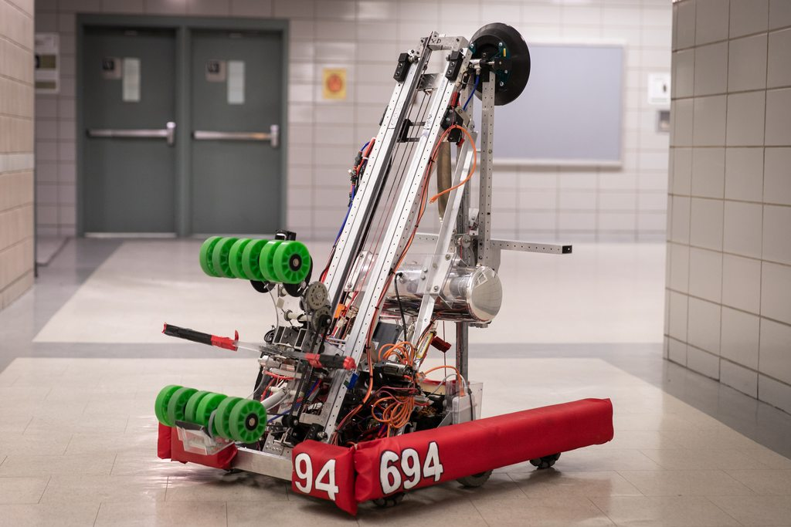

.. include:: <isonum.txt>

Active Intake
=============

There's one main rule when it comes to intakes in FTC: you need one. Before diving in, what *is* an intake in the first place?

Intake
   A mechanism designed to pick up game elements using some component of rotational motion powered by a motor.

An intake is differentiated from a claw as an intake does not grasp individual game elements using a pinching motion, but rather sucks the element in through a variety of means such as wheels, tubes, etc.

There are multiple parts of an effective intake: intake geometry, intake type and material, and speed. However, a common rule of them is the faster the intake, often the more effective it is. For example, near the end of Rover Ruckus, many of the top performing teams used a 3.7:1 (1600 RPM) motor or a 5.2:1 (1000 RPM) motor on their intake.

.. tip:: While not a necessity, it is highly recommended that teams dedicate at least one motor to their intake if possible.

.. attention:: When it comes to intakes: "**Touch it, own it**" is a really valuable concept.

When your intake comes in contact with game elements, you want it to instantly control them. You should design with a margin for error, both in the orientation of the game piece and in the alignment of the robot. For example, look at FRC\ |reg| Team 694's ball intake on their 2019 robot:

   FRC 694 StuyPulse, Deep Space

When this robot drives up to a ball, it barely has to point itself at the ball before the ball is instantly locked in between the two rows of wheels. What makes it so effective is the immense amount of testing that went into its design. The team tried a number of intake shapes, initially building with wood and rubber bands, and recorded which shapes were most effective. By testing their intake design out before competition, they didn't have to guess whether it would work as intended: they put it on the field with confidence.

.. toctree::
   :maxdepth: 1

   principles-of-an-intake
   types-of-intakes
