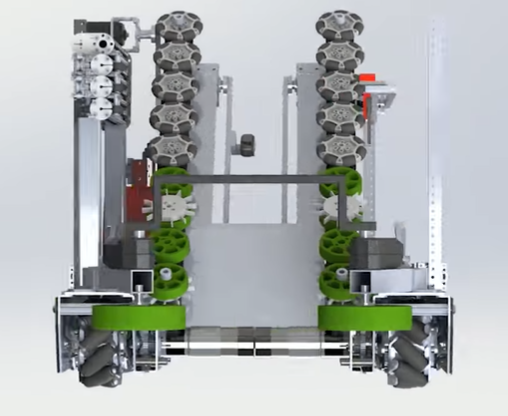
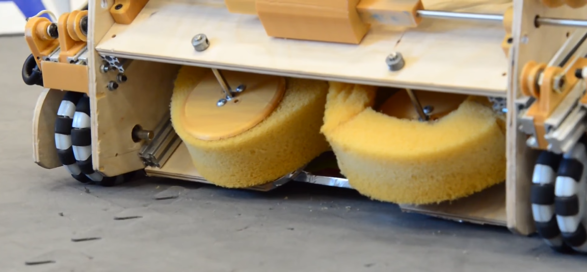
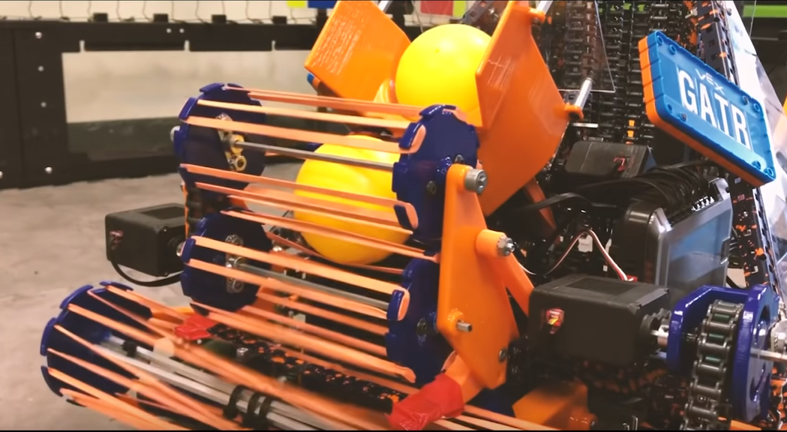

Types of Intake
===============

Horizontal/Top Intake
   A horizontal intake generally is a wider style of intake that has the intake rotating on a horizontal axis or plane. Horizontal intakes are generally used for intaking smaller game elements, as these types of intakes can control more than one piece at a time. Horizontal intakes have been used successfully in games such as Res-Q and Rover Ruckus, where teams needed to pick up small cubes and balls from the floor.

Vertical Intake
   A vertical intake typically has wheels or other intake components rotating on a vertical axis (the z-axis). Vertical intakes are more controllable, as they can only pick up one element at a time. Vertical intakes excel at picking up large game elements which would be impossible to control more than one piece at once, such as the foam glyphs in Relic Recovery.

Below are different implementations of horizontal and vertical intakes:

Roller and Wheeled Intakes
--------------------------

Roller and wheeled intakes refer to types of intakes which work by having some sort of hard or pliable object rotate along an axis. Wheeled intakes use different kinds of wheels (solid traction, compliant, or foam wheels) that propel the game element to the collection bin. Roller intakes are wider, and can sometimes intake more than one game element.

.. admonition:: Term

   .. glossary::

      Compliant Wheel
         A compliant wheel is a flexible rubber wheel that is primarily used for intakes. These are **NOT** designed for use in drivetrains.

         The available bore options vary depending on the vendor. As with the compliant wheels, durometer (hardness of rubber) affects both traction and longevity, sacrificing one for the other. However, in the case of intakes, a lower durometer is recommended to have maximum grippiness for intaking game elements.

         Durometer refers to the hardness of rubber. Having a high durometer translates to a harder rubber surface, more durability, but less traction. A low durometer means a softer rubber, worse durability, but improved traction.

         Examples of compliant wheel are Andymark's Compliant Wheels, and goBILDA's Gecko Wheels.

         .. figure:: images/compliant-wheel-2-inch.png
            :alt: A 2" green compliant wheel
            :width: 200

            A 2" compliant wheel

         .. figure:: images/compliant-wheel-4-inch.png
            :alt: A 4" green compliant wheel
            :width: 200

            A 4" compliant wheel

Solid Wheel Intake
^^^^^^^^^^^^^^^^^^

Solid wheel intakes use wheels such as grip and traction wheels to pick up game elements. They can be effective in picking up large game elements which do not have much tolerance difference.

However, compliant wheel intakes generally will be more effective because compliant wheels offer more adjustability and forgiveness for the game elements. Compliant wheels also accounting for different game element orientations (the game pieces can get rotated when being controlled) and intake angles (the orientation of the game piece before it reaches the intake).

Compliant Wheel Intake
^^^^^^^^^^^^^^^^^^^^^^

.. sidebar:: Spring-Loaded Intakes

   A spring-loaded intake is able to pivot in order to accommodate a game element when it is passing through the intake, but will snap back when the element has gone through. A spring-loaded intake requires more thought, but guarantees that the intake wheel will always be in contact with the desired element.

   A locked intake simply means that the wheels are locked into place and cannot pivot.

The compliant wheel intake is most commonly used with large game elements such as the glyphs in the 2017-2018 season, Relic Recovery. Compliant wheel intakes excel at controlling elements with flat surfaces such as cubes or rectangular prisms. They suffer at picking up balls.

In this game, robots had to pick up glyphs, which were 6 inch foam cubes, from the center pit and place them in the cryptobox. This game had many wheeled intakes primarily because the wheels had consistent and controllable contact with the glyphs. Wheeled intakes were able to propel the glyphs in a consistent fashion from the point of contact to the deposit plate, which would flip up to deposit the glyphs.

Wheeled intakes can be spring-loaded or locked into place. Teams could choose one or mix; in Relic Recovery, some teams spring-loaded the set of wheels that made contact first, and then had a fixed set in the back. This is up to the design team's choosing.

Wheeled intakes operate at much slower RPM than surgical tubing intakes, as wheeled intakes are meant to pick up **one** element at a time. They generally require more torque than a surgical tubing intake, which is geared for speed.

.. admonition:: Term

   .. glossary::

      Surgical Tubing
            Surgical tubing is generally latex or rubber tubing. Its most common use case is in active intakes, and has been popular among teams for many seasons. Surgical tubing has a hollow center and is sold in different diameters and wall thicknesses. Teams can experiment with different kinds of surgical tubing, as well as adding polyurethane tubing (clear tubing that is stiffer than rubber or latex tubing) in order to make the tubing more stiff.

            .. image:: images/surgical-tubing.png
               :alt: A roll of surgical tubing
               :width: 200

Advantages
~~~~~~~~~~

- Very controllable
- Propels elements to desired location
- Great at picking up large elements

Disadvantages
~~~~~~~~~~~~~

- Picks up only one element at a time
- Elements can get jammed in a bad position
- Not generally used for picking up small elements
- Can generally only pick up one specific element shape

.. figure:: images/compliant-wheel-intake/9971-intake.png
   :alt: 9971's Relic Recovery intake

   9971 LanBros, Finalist Alliance First Pick (Detroit), Relic Recovery, springloaded

.. figure:: images/compliant-wheel-intake/8680-intake.png
   :alt: 8680's Relic Recovery intake

   8680 Kraken-Pinion, Relic Recovery

   2856 Tesseract, Relic Recovery, 2 & 4 in. compliant wheels, 2 in. omni wheels

.. figure:: images/compliant-wheel-intake/11115-intake.png
   :alt: 11115's Relic Recovery intake

   11115 Gluten Free, Finalist Alliance Captain (Detroit), Relic Recovery, springloaded

Foam Wheel Intake
^^^^^^^^^^^^^^^^^

A foam wheel intake has the same principles as a compliant wheel intake, except that it uses foam wheels. It is generally recommended that teams stick to compliant wheels as they are grippier and easier to control.

   6299 ViperBots QuadX, Res-Q

Rubber Band Intake
^^^^^^^^^^^^^^^^^^

Rubber band intakes, commonly used by in VRC, generally feature sprockets, wheels, or gears at two ends, with rubber bands interlaced in between to form a pliable and bendable roller. Generally, it can be actuated or adjustable with a servo, although this is not necessary.

Rubber band intakes are great with intaking balls, but not so great with other types of game elements such as cubes. It generally is slower than a surgical tubing intake, and requires multiple stages to transfer elements from collection to deposit. Zip ties can be added to increase the intake's range to accommodate for smaller balls.

   Ball intake for VRC Game Turning Point

Tubing Intakes
--------------

Tubing or noodle intakes typically use some sort of pliable tubing, which is rotated at high RPM to intake game pieces. Tubing intakes are particularly efficient at picking up small objects such as the balls and cubes from Res-Q, Velocity Vortex, and Rover Ruckus.

Surgical Tubing Intake
^^^^^^^^^^^^^^^^^^^^^^

Surgical tubing or spearfishing rubber tubing, sold by many different manufacturers, is a great option for picking up small game elements such as the minerals from Res-Q or Rover Ruckus.

Surgical tubing intakes can, and often, have multiple sets of tubing in order to move minerals from the collection point to the holding box. This was most often seen in games where robots had to transfer minerals from the field to an elevated location.

Unlike wheeled and rubber band intakes, which can be spring-loaded, surgical tubing intakes are practically always fixed at a certain height and angle.

Surgical tubing by itself is soft and pliable. Teams have two options

#. Increase the RPM to 800-1000+ RPM
#. Use polyurethane tubing at a lower RPM (100-250 RPM).

   Polyurethane tubing can be purchased at a local hardware store and is a clear tubing that is quite stiff. Using some lubricant, insert the clear tubing into the surgical tubing for added stiffness.

It is encouraged that teams test different RPMs and stiffness to develop the optimal intake. You will be surprised how changing one small variable such as the diameter of tubing or how far the tubing extends can affect intake effectiveness.

Surgical tubing intakes are especially good at picking up multiple elements at a time, due to the high RPM (sometimes >1000 RPM) of the rollers. However, it suffers from a lack of controllability, as sometimes the driver may accidentally pick up more than needed, and have to spit it out.

Advantages
~~~~~~~~~~

- Able to collect multiple elements at a time
- Generally more efficient than wheeled intakes
- Specializes in small and odd-shaped elements

Disadvantages
~~~~~~~~~~~~~

- Requires high RPM
- Less controllable
- Harder to pick up large elements easily

.. figure:: images/tubing-intake/8375-intake.png
   :alt: 8375's surgical tubing intake

   8375 Vulcan Robotics, Res-Q - great example of funneling

.. figure:: images/tubing-intake/8393-intake.png
   :alt: 8393's surgical tubing intake

   8393 Giant Diencephalic BrainSTEM Robotics Team, Semifinalist Alliance Captain (St. Louis), Velocity Vortex

.. figure:: images/tubing-intake/11115-intake.png
   :alt: 11115's surgical tubing intake

   11115 Gluten Free, Winning Alliance First Pick (Detroit), Rover Ruckus

.. figure:: images/tubing-intake/7203-intake.png
   :alt: 7203's surgical tubing intake

   7203 KNO3, Rover Ruckus

Zip Tie Intake
^^^^^^^^^^^^^^

Instead of using surgical tubing, some teams opt for heavy zip ties instead. This can work, but we recommend surgical tubing as it is one of the most tried and tested methods for picking up nearly any game element. Zip ties lack the friction of rubber tubing.

3D printed intake (NinjaFlex/TPU Filament)
^^^^^^^^^^^^^^^^^^^^^^^^^^^^^^^^^^^^^^^^^^

TPU/NinjaFlex 3D printer filament is a great low-RPM intake flap option, if designed right they work well with servos, and several teams have successfully used this configuration in competition.

We recommend 3D printed intakes only if your team has had experience in 3D printing parts.

.. figure:: images/3d-printed-intake/731-3dp-intake.png
   :alt: 731's 3D printed intake

   731 Wannabee Strange, Rover Ruckus

.. figure:: images/3d-printed-intake/8417-3dp-intake.png
   :alt: 8417's 3D printed intake

   8417 Lectric Legends, Rover Ruckus - TPU intake flaps
