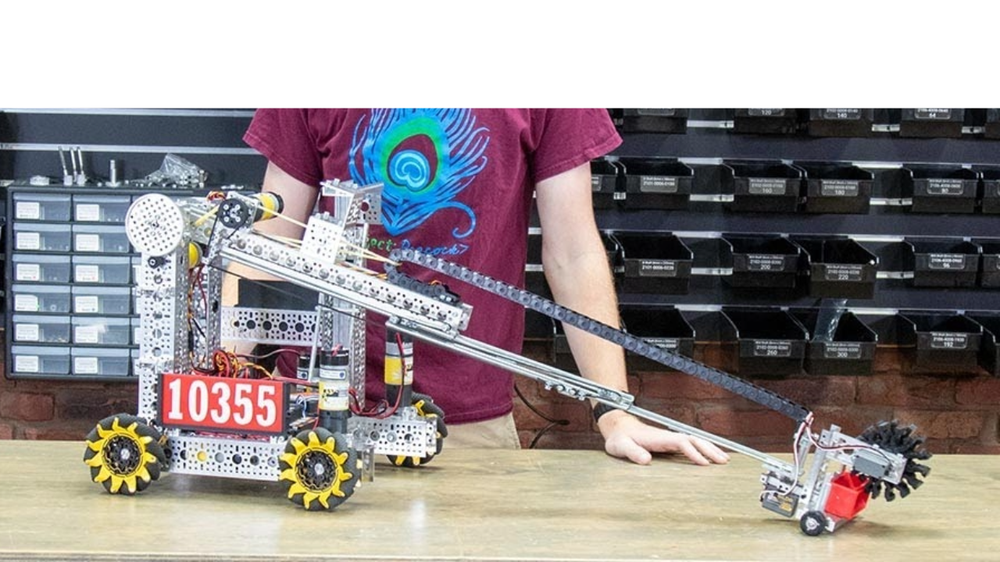
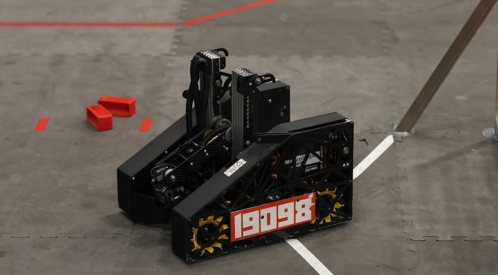
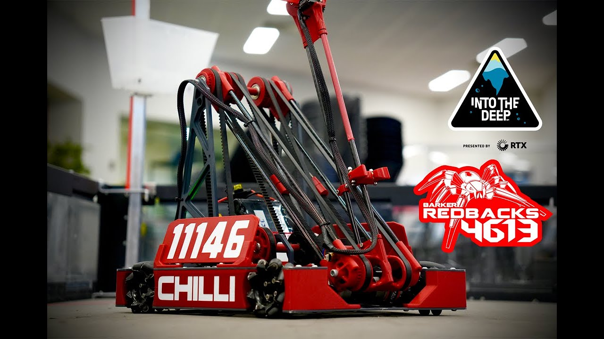
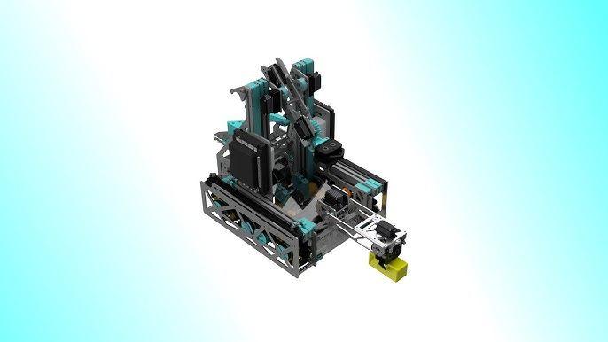
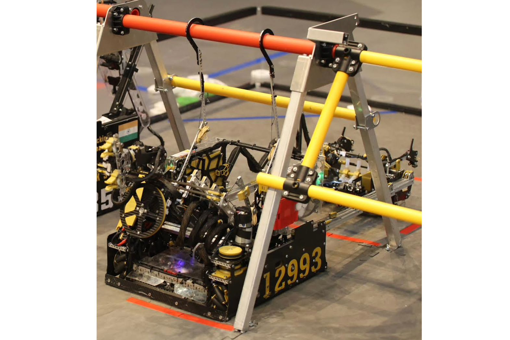

.. include:: <isonum.txt>

Arms
====

Arms encompass a large variety of mechanisms. In FTC, they are used to add extension and flexibility to end effectors. Arms are especially powerful when paired with other mechanisms such as linear extension and mini-turrets.

Arms for Extension
------------------

Arms can be a useful tool for extension. Long arms need large reduction ratios to drive. The example in the :ref:`Single Arm section <single-arm>` uses a 254.5:1 reduction. It is recommended to transfer torque to the arm through a gear, chain, or belt rather than directly mounting to a motor shaft due to axial forces and the ability to get a larger reduction. Due to the large amount of momentum these arms can carry, if suddenly stopped they may be able to break a motor's gearbox or even tip your robot over. Software control can help to reduce the load on motor gearboxes (see :doc:`/docs/software/concepts/control-loops`).

Depending on the application and implementation, arms can be either faster or slower than other extension options.

.. _single-arm:

Single Arm
^^^^^^^^^^

The most simple type of arm, a single arm refers to an arm on one axis of rotation. These arms are relatively easy and quick to build, however they have little high-level competitive viability as a main extension system since the extension it provides is limited due to the length restrictions of the starting cube, only being able to provide around 16" of extension whereas over 24" of extension is desired for most games.

.. figure:: images/single-arm/gb-single-arm.jpg
   :alt: goBILDA starter bot, Into The Deep, single arm.

   goBILDA starter bot, Into The Deep, single arm used for extension.

Pivot Extension
^^^^^^^^^^^^^^^

A pivot extension mechanism is an arm with a linear extension (typically linear slides) attached. This allows the linear extension to provide the desired extension length for both horizontal and vertical extension along with removing the need for a transfer stage.

   goBILDA Robot in 3 Days, Into The Deep, pivoting linear slides

   19098 Eastern Foxes, Into The Deep, Winning Alliance First Pick (Franklin), pivoting linear slides

.. figure:: images/pivot-extension/8417-pivot-extension.png
   :alt: 8417's single arm attached to a belt driven linear extension

   8417 'Lectric Legends, Rover Ruckus, Finalist Alliance First Pick (Ochoa), single arm + custom belt driven linear extension

Multi-Axis Arms
^^^^^^^^^^^^^^^

A multi-axis arm consists of multiple rotational joints. A multi-axis arm provides the extension single arms lack in addition to providing much more flexibility in positioning the end effector. While multi-axis arms seem like the obvious solution to the problems single axis arms face, they are much more difficult to design, manufacture, and control, having issues with accuracy, backlash, and packaging, while providing little benefit over linear slides and other extension methods.

.. warning:: This is highly discouraged for inexperienced FTC teams.

   11146 Barker Redbacks, Into The Deep, multi-axis arm

.. figure:: images/multi-axis-arm/20700-snap.png
   :alt: 20700's multi-axis arm

   20700 Snap, Freight Frenzy, multi-axis arm

Arms for End Effectors
----------------------

Arms are the most common way to add flexibility and control to end effectors. These arms typically have one or more rotational joints and/or linear extension. Due to the relatively small power requirement of these arms, they are often driven by servos instead of motors.

.. attention:: End effectors are likely to see collisions and with arms acting as a lever, it is imperative to take extra caution to mount and support these servos properly (see :doc:`/docs/power-and-electronics/servo-guide/usage-tips`).

Single and multi-axis arms can add control to the vertical and horizontal distance of an end effector. In Into The Deep, this type of arm was common in intakes to allow the intake on a horizontal extension to go over the submersible barrier and then "reach down" for samples. They can be used to line up intakes and outtakes to facilitate transfers or just generally add flexibility to where end effectors can act.

Linear extension is usually seen on outtakes to increase the range of the robot's deposit.

   15972 TehnoZ, Into The Deep, Finalist Alliance Captain (Edison), arms used on both intake and outtake, linear extension is used on outtake.

   12993 RoboKings Aurum, Centerstage, Finalist Alliance 1st Pick, high degree of freedom outtake arm with horizontal extension.
