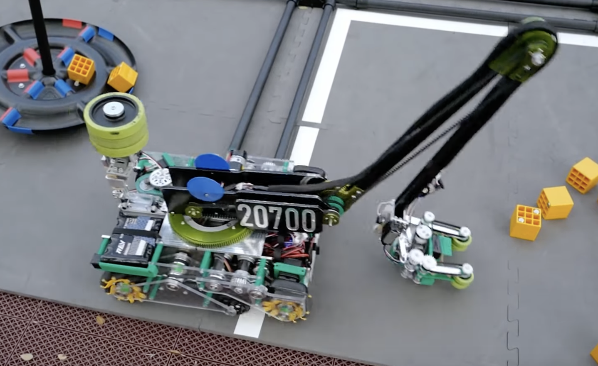
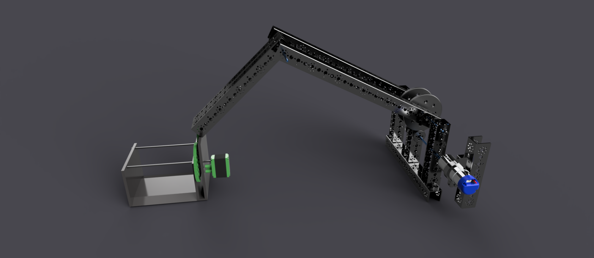

.. include:: <isonum.txt>

Arms
====

Arms are another way to achieve extension past the 18" x 18" dimension of the robot. Unlike linear extensions, arms require lots of torque - a standard 40:1 or even 60:1 gearbox will not be suitable in most applications. For example, many teams will run a 256:1 gearbox for their rotation motor.

.. attention:: Such motors must be very well supported, or else the motor may torque itself free from its mount.

Rarely should an arm be directly mounted to the driving motor. Instead, torque should be transferred via gear, chain, or belt. Large arms can also be hard to control (with the addition of momentum adding load to the gearbox, it is hard to stop a three-foot arm that weighs five pounds quickly without breaking a gearbox). In many cases, this issue can be mitigated with software (see the :doc:`/docs/software/concepts/control-loops` section).

Depending on the application and implementation, arms can be either faster or slower than extension options.

The different types of arms in FTC\ |reg| include single arm and multi-axis arms.

Advantages
----------

- Single bar arms can be relatively simple to build.
- Arms can be useful in low-load applications;
  however, most mechanisms in FTC are not very light.

Disadvantages
-------------

- Arms require a large amount of torque, and in order to do so, teams must purchase high-torque gearboxes, such as `UltraPlanetary gearbox from REV <https://www.revrobotics.com/rev-41-1600/>`_ or the high gear ratio `goBILDA planetary gearbox motors <https://www.gobilda.com/yellow-jacket-planetary-gear-motors>`_.

- While single arms may be more simple, they cannot provide enough extension for most games.

Single Arms
-----------

The most simple type of arm in FTC, a single arm refers to an arm on one axis of rotation. While it is possible to successfully build this kind of arm, generally a single axis arm will only afford around 15-16" of extension, which is inadequate for nearly every game.

The reason for this is that the longest a channel can be is 18" (technically you could have a longer channel by placing it diagonally, but this complicates matters). Thus, with a maximum of 18" of extension, a couple inches must be subtracted, since the point of rotation is inside the 18" sizing cube; therefore the extension is around 15-16".

Therefore, a single arm with further linear extension is optimal. For example, some teams built a single arm with an added linear extension mechanism to reach the desired extension length, which is generally >24".

The advantages of a single arm are that it is relatively easy to build, and can be a quick way to gain some form of extension outside of the robot cube.

However, there are many disadvantages such as having a high gear ratio, requiring much more support than a linear slide, and being hard to control without the proper software.

.. figure:: images/single-arm/8103-single-arm.png
   :alt: 8103's single arm attached to a belt driven linear extension

   8103 Null Robotics, Rover Ruckus, single arm + custom belt driven linear extension

.. figure:: images/single-arm/8417-single-arm.png
   :alt: 8417's single arm attached to a belt driven linear extension

   8417 'Lectric Legends, Rover Ruckus, Finalist Alliance First Pick (Ochoa), single arm + custom belt driven linear extension

Multi-Axis Arms
---------------

A multi-axis arm is an arm which has multiple points of rotation. Multi-axis arms introduce many variables that exponentially complicate matters and can really only be modeled through complex kinematic equations.

.. warning:: This is highly discouraged for inexperienced FTC teams due to the difficulty of building as well as the need for machine tools.

   20700 Snap, Freight Frenzy

.. figure:: images/multi-axis-arm/8148-multi-axis-arm.png
   :alt: 8148's multi-axis arm

   8148 Aleph Bots, Relic Recovery

   15692 Rust In Pieces, Rover Ruckus

