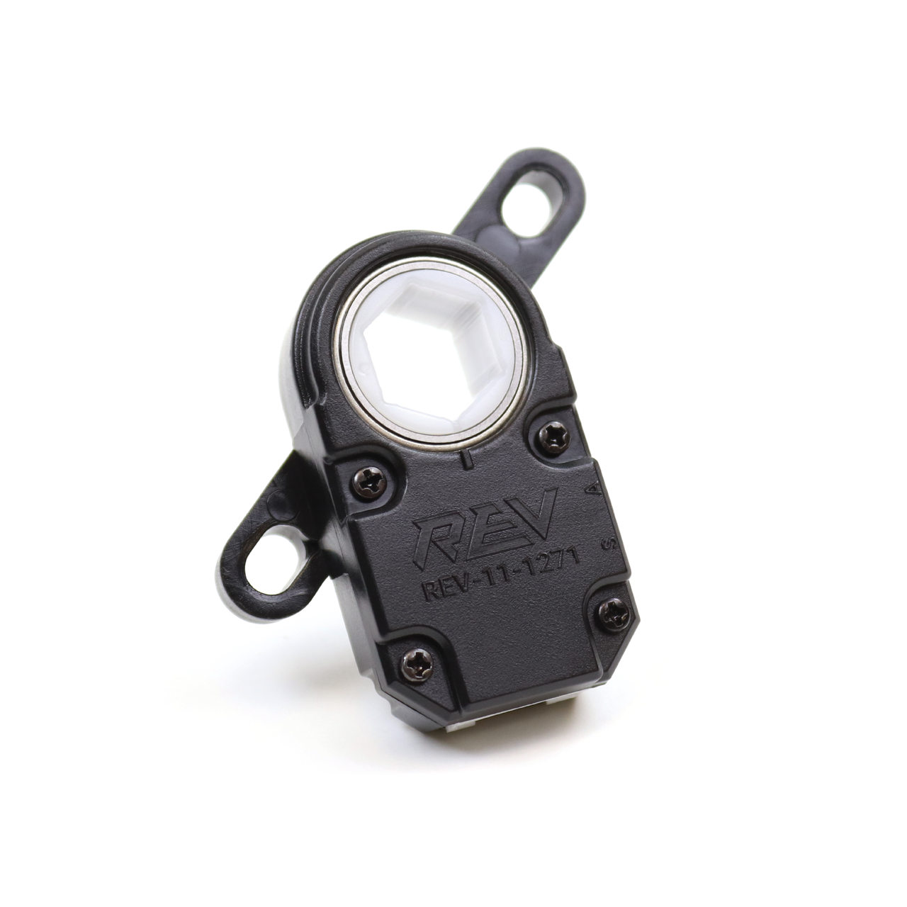
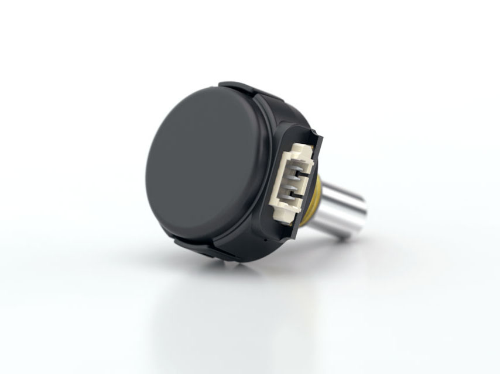
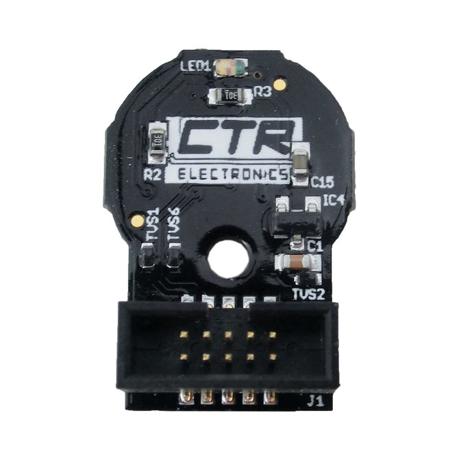
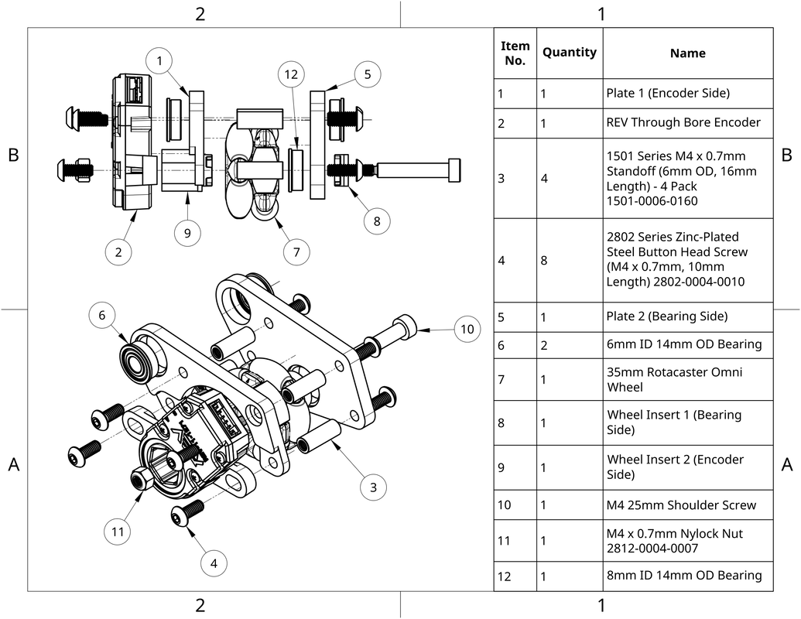
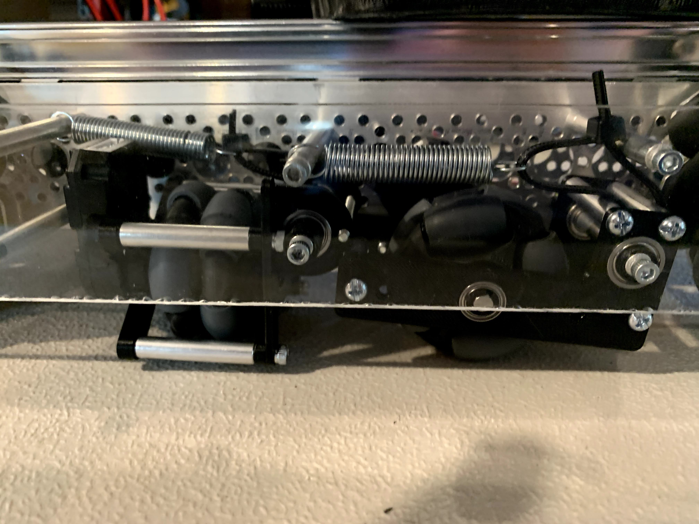
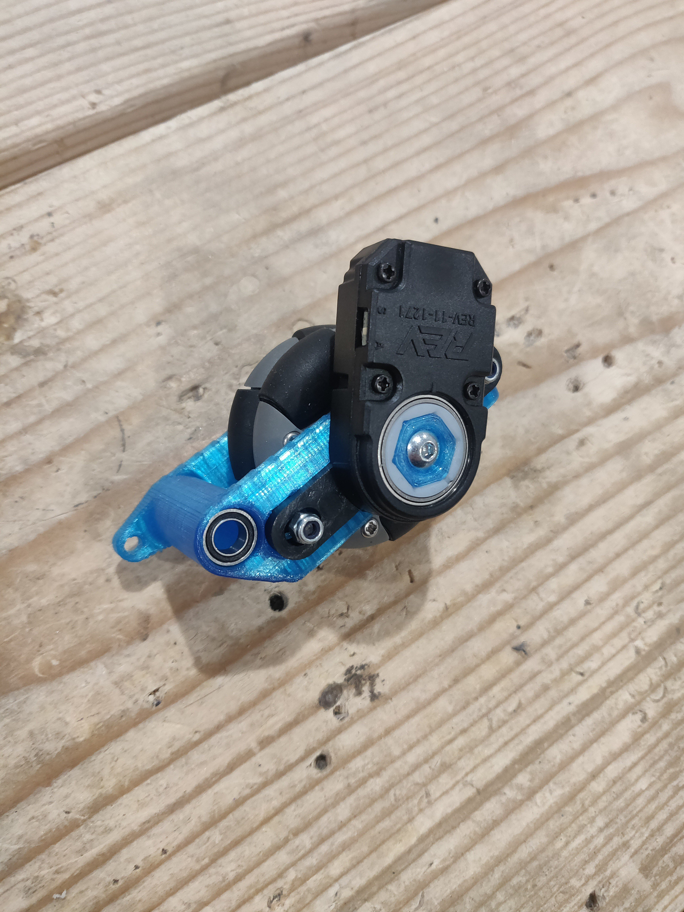

.. include:: <isonum.txt>

Dead Wheels
===========

.. warning:: This is a very niche aspect of design in FTC\ |reg|. Generally it is something done by more experienced teams who have had time to repeatedly test their designs and mechanisms with software during the off-season.

The term dead wheels, tracking wheels, odometry pods, and odometry are often conflated in the FTC community. However, there are a few key differences one must keep in mind. Odometry is an umbrella term and refers to the general use of motion sensors for localization purposes. Meanwhile, dead wheels, tracking wheels, and odometry pods are all synonymous terms.

.. admonition:: Term

   .. glossary::

      Dead Wheel
         A small unpowered wheel (usually an :term:`omni wheel <Omni Wheel>`) that tracks the distance the robot has traveled through the encoder attached to the wheel's axle.

         Usually, there will be two or three wheels - one or two on the x and y axis each to track the front-back and left-right position relative to the starting point. Generally, odometry wheels are sprung so that the wheel is in contact with the floor tiles at all times to ensure accuracy.

Odometry refers to the use of motion sensors for localization. Localization is a means for being able to locate the position of the bot at some point in time. Localization is crucial in path following and advanced autonomous modes as one needs to know where they are to generate the necessary movements needed to reach a desired destination. :doc:`Localization software </docs/software/concepts/odometry>` plays a major role in odometry; however, in order to produce accurate results, reliable and accurate hardware design is a necessity.

The simplest form of odometry is drive encoder localization. This is the use of encoders measuring the rotation of motors that power the drive train. One is able to read the encoder data and feed it through the kinematic equation for that specific drive train to derive the body's velocity. Drive encoder localization is generally quite simple and easy to setup as almost all of the FTC legal motors have built-in encoders. Getting drive encoder localization setup is simply a matter of plugging in wires, no additional hardware needed.

Many teams in the community have converged on a unique solution that isn't seen very much outside of FTC: the use of "dead wheels," "tracking wheels," or "odometry pods" (these terms are all synonymous). These refer to small "dead" or non-driven (not powered by a motor) wheels attached to an `encoder sensor <#encoders>`_. Two or three dead wheel pods are often sprung to the ground to ensure accurate tracking. The two-wheel design utilizes one parallel and one perpendicular pod (parallel and perpendicular with respect to the drive wheel axis), measuring x and y movement respectively. Change in heading is measured via a gyroscope. The three-wheel design utilizes two parallel and one perpendicular pod, measuring x and y movement respectively. However, this design forgoes the gyroscope and instead measures heading via the difference with the two parallel wheels. This is often more accurate in the context of the FTC control system because the BNO055 IMU (used for the gyroscope in the two-wheel design) utilizes I2C which is slower than the rest of the I/O on the REV Hub and cannot be bulk read. These two issues lead to minute drift issues which can compound over time, thus leading to a more inaccurate localization system when using the two-wheel design.

However, designing consistently accurate dead wheels proves to be a difficult design challenge. It is often quite pricey. A set of three dead wheels will cost a minimum of $100 for the encoders alone, prior to any hardware.

Let's go through the advantages and disadvantages of each system.

Drive Encoder Localization
--------------------------

- **Pros**:

  - Cheap (the motors you're using most likely already have encoders built in)
  - Accessible
  - Very little configuration necessary
- **Cons**:

  - Drive encoder localization on mecanum drive can be quite inaccurate due to lack on traction on mecanum wheels.
  - Will drift on high acceleration on mecanum drive. Accuracy will be good enough for basic autonomous modes if acceleration is limited

Two-Wheel Odometry Pods
-----------------------

- **Pros**:

  - Cheaper than 3-wheel design
  - Pretty good accuracy
  - No tuning of the heading necessary
- **Cons**:

  - Subject to more drift than the 3-wheel design

Three-Wheel Odometry Pods
-------------------------

- **Pros**:

  - Relatively accurate tracking. Great accuracy in a 30-second autonomous mode
- **Cons**:

  - Quite pricey
  - Tuning of the heading is very important

Encoders
--------

A lot of the localization done in software relies on readings from encoders. :ref:`encoders` are sensors that track "counts" or "ticks," which are values that represent a certain amount of a rotation. Different encoders might have a different number of counts per revolution (CPR), which is also sometimes also called ticks per revolution. The greater the number of counts, the more precise the data.

Encoders are plugged into the JST-PH ports in the REV hubs. These encoders can either be built-in to the motors or external. External encoders will still need to be plugged into an encoder port but are not related to the motor in that port. Through software, we can use the motor object to determine the position of the encoder. This should be done with motors that do not use encoders. If you're using dead wheels, you will not need the drive motor encoder ports, so those are potential ports you might want to use.

If one chooses to design dead wheels, there are only two recommended encoders that one should use for FTC: REV Through-Bore Encoders and U.S. Digital S4T Encoders.

REV Through-Bore
^^^^^^^^^^^^^^^^

Often short-handed to "REVcoders" or "revcoders," the `REV Through-Bore encoders <https://www.revrobotics.com/rev-11-1271/>`_ has quickly become the de facto option the FTC community. The REV encoders have gained such a reputation due to its relative affordability, much improved reliability, and ease of use. The through-bore design proves to be a *significant* improvement over previous optical disc encoder designs. Optical disc encoders are very fragile, prone to scratching, and are much less tolerant to design flaws.

   REV Through-Bore Encoder

**Advantages:**

- Through-bore design is very robust and easy to design with
- Relatively cheap
- High CPR
- Easy wiring

**Disadvantages:**

- Quite large relative to other encoders. May be challenging to create a compact design
- Many Through-Bores seem to experience slight, uneven resistance when rotating. REV says this is normal and will subside as the encoder wears in

  - To forcefully wear in a REV Through-Bore encoder a 1/2" hex shaft can be spun on a drill through the encoder for a couple of minutes
- Odd mounting points

.. note:: The Through-Bore encoders have a very high CPR (8k). The REV Hub transmits velocity in a 16-bit signed integer. This means it can only communicate a maximum value of 2^15 (which is 32768). Thus, it only takes 4 rotations a second (32k / 8k = 4) for the velocity value on the REV Hub to experience an `integer overflow <https://en.wikipedia.org/wiki/Integer_overflow?oldformat=true>`_. This is primarily a concern when dealing with motion profiling. The popular, existing tools (Road Runner and FTCLib) have `mechanisms for dealing with this issue <https://github.com/acmerobotics/road-runner-ftc/blob/e79f8a900f45c9058b67716b5289a52e17769e40/RoadRunner/src/main/java/com/acmerobotics/roadrunner/ftc/Encoders.kt#L66>`_ so this is not a concern and should not sway your design decision. Just keep this detail in mind once you start programming.

U.S. Digital S4T
^^^^^^^^^^^^^^^^

The `S4T <https://www.usdigital.com/products/encoders/incremental/shaft/S4T>`_ miniature shaft encoder is another viable option used in dead wheel designs. These encoders are very small and may significantly reduce the footprint of your dead wheel design. Gearing these encoders is ideal to prevent shock loads.

   S4T Encoder

*****Advantages:**

- Very compact

**Disadvantages:**

- More expensive (nearly double the price)
- Less durable

  - Very thin wires. Prone to breaking easily if not secured properly

- Ideally requires external gearing

SRX Mag Encoder
^^^^^^^^^^^^^^^

The `SRX Mag Encoder <https://store.ctr-electronics.com/srx-mag-encoder/>`_ from Cross The Road Electronics is a magnetic encoder. It is not used by many FTC teams due to its slightly higher complexity to use and lack of FTC centric documentation. It is more popular in FRC\ |reg|.

   CTRE SRX Mag Encoder

**Advantages:**

- Very compact
- Relatively cheap

**Disadvantages:**

- Requires assembly
- Not much information exists for use in FTC

U.S. Digital E8T (deprecated)
^^^^^^^^^^^^^^^^^^^^^^^^^^^^^

Once the de facto option for most FTC teams, the `E8T <https://www.usdigital.com/products/encoders/incremental/kit/E8T>`_ optical encoders are no longer recommended as the REV Through-Bores are a superior option at an equivalent price. The open-hole optical disc design of these encoders face a number of frustrating design flaws that made them very fragile and prone to breaking. The only advantage that they have relative to the REV Through-Bores is their smaller footprint.

.. figure:: images/odometry/e8t.jpg
   :alt: An US Digital E8T encoder
   :width: 20em

   E8T Encoder

Design
------

There are few open source dead wheel designs. Dead wheels are often designed around a team's own drive train and FTC teams seldom publicly release their own robot CADs.

Here are a few publicly available dead wheel designs:

- **Open Odometry by 18219**

  - https://openodometry.weebly.com
  - Utilizes the REV Through-Bore Encoder
  - Most popular and robust publicly available design
  - Compact enough to fit into a goBILDA channel

  - **Things to consider**:

    - Utilizes Rotacaster 35mm wheels from Australia. Shipping may take a while

- **goREVdometry**

  - https://discord.com/invite/Cvz3MbM9dX
  - Utilizes the REV Through-Bore Encoder
  - Compact enough to fit into a goBILDA channel

  - **Things to consider**:

    - Information only available through their Discord channel
    - Hasn't been iterated on in a while

- **11115 Gluten Free Design - 2019**

  - https://drive.google.com/file/d/16ZQRSiWdzTKSH92VpKrxKpXy3TTh0sA5/view?usp=sharing
  - The above link the entire robot assembly for 11115's CAD for the 2018-19 season

  - **Things to consider**:

    - Uses LEGO\ |reg| gears
    - Uses US Digital S4T's. Quite pricey

- **9794 Wizards.exe Design**

  - https://www.youtube.com/watch?list=PLICNg-rquurYgWAQGhu6iC0At75vgqFJp&v=OjNvAD350M4&feature=emb_title
  - Compact enough to fit into a goBILDA channel
  - **No longer recommended as it utilizes the E8T**

Spring Tensioning
^^^^^^^^^^^^^^^^^

It is *highly* recommended that your dead wheel design includes some form of spring tensioning that pushes the wheel into the ground. This ensures that the wheel is always in contact with ground and has adequate traction. Sufficient force is required to ensure constant traction to prevent the wheels from slipping. Keep in mind that too much force may lift a light drive train off the ground and disrupt driving.

The most popular method of spring tensioning is to pivot your pod around a point and provide a rotational force via a spring or rubber band.

.. figure:: images/odometry/14320-pivot-half.jpg
   :alt: A demonstration of pivoting spring tensioning
   :width: 40em

   FTC 14320's spring tensioning

A much more niche option is to vertically spring odometry pods. The idea is that springing around a pivot will cause the dead wheels to move in the axis parallel to the ground if the height of the dead wheels relative to the ground changes. Vertically sprung odometry pods will not experience such an issue. However, this is not really an issue that most teams will experience. Vertically springing is much harder to design well and is not recommended for the relatively minor improvement in accuracy it yields.

.. figure:: images/odometry/18172-vertical-odo.jpg
   :alt: An example of vertical spring tensioning
   :width: 40em

   FTC 18172's vertical springing

Gallery
-------

Open Odometry (REV Through Bore Encoder)
^^^^^^^^^^^^^^^^^^^^^^^^^^^^^^^^^^^^^^^^

.. image:: images/odometry/openodo-sectionview.png
   :alt: Section view of Open Odometry
   :width: 40em

FTC\ |reg| Team 14310 (REV Through Bore Encoder)
^^^^^^^^^^^^^^^^^^^^^^^^^^^^^^^^^^^^^^^^^^^^^^^^

FTC Team 8802 (REV Through Bore Encoder)
^^^^^^^^^^^^^^^^^^^^^^^^^^^^^^^^^^^^^^^^

.. image:: images/odometry/8802.jpg
   :alt: 8802's odometry
   :width: 40em

FTC Team 14320 (US Digital S4T)
^^^^^^^^^^^^^^^^^^^^^^^^^^^^^^^

.. image:: images/odometry/14320.png
   :alt: 14320's odometry
   :width: 40em

FTC Team 11115 (US Digital S4T)
^^^^^^^^^^^^^^^^^^^^^^^^^^^^^^^

.. figure:: images/odometry/11115-cover.jpg
   :alt: 11115's odometry
   :width: 40em

   `FTC Team 11115 Photo Album <https://photos.google.com/share/AF1QipPx5inCdVxK6wAqtIznFE-KqvnuzgRq9rFxrhzI50r0DeYYo2o11hWB4hroYObm8A?key=UWwxd3hFdXpYaHFqaFhTSFJnWFlEWjgtV1FTN3Zn>`_

FTC Team 14481 (REV Through Bore Encoder)
^^^^^^^^^^^^^^^^^^^^^^^^^^^^^^^^^^^^^^^^^

.. image:: images/odometry/14481.png
   :alt: 14481's odometry
   :width: 40em

FTC Team 3658 (REV Through Bore Encoder)
^^^^^^^^^^^^^^^^^^^^^^^^^^^^^^^^^^^^^^^^

.. figure:: images/odometry/3658.png
   :alt: Render of 3658's odometry
   :width: 40em

   FTC Team 3658 CAD

FTC Team 7236 (REV Through Bore Encoder)
^^^^^^^^^^^^^^^^^^^^^^^^^^^^^^^^^^^^^^^^

.. figure:: images/odometry/7236-cad-exploded.png
   :alt: Exploded view of 7236's odometry
   :width: 40em

   FTC Team 7236 CAD

