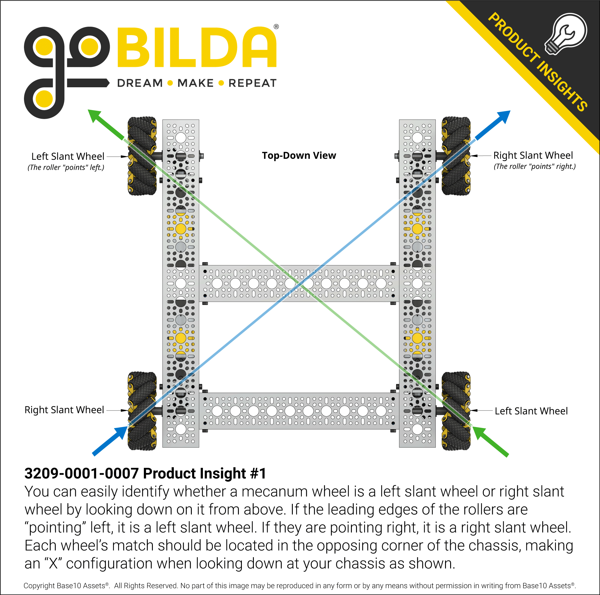

.. include:: <isonum.txt>

Holonomic Drivetrains
=====================

Mecanum Drive
-------------

Mecanum drivetrains consist of four mecanum wheels which are powered independently by one motor. This configuration angles the velocity of each wheel, allowing the robot to strafe.

.. admonition:: Term

   .. glossary::

      Mecanum Wheel
         Mecanum wheels are a special type of wheel that enable maneuverability and holonomic strafing as opposed to traditional wheels. They consist of a series of rubber rollers rotated 45 degrees to either the left or right.

         In a conventional mecanum drivetrain, running the wheels on one diagonal in the opposite direction to those on the other diagonal causes sideways movement. Combinations of these wheel motions allow for vehicle motion in any direction with any vehicle rotation (including no rotation at all).

The primary advantage to mecanum drive is the maneuverability it affords, especially because the robot can strafe instead of turn and drive. The rollers on mecanum wheels form a 45 degree angle with the wheel's axis of rotation, which means that mecanum drivetrains can't strafe as fast as they can drive forward.

This can be explained by discussing the forces involved. When each wheel rotates, it applies a friction force to the ground, which moves the robot. When moving forward, both sets of left wheels rotate in the same direction at the same speed, and both sets of right wheels rotate in the same direction at the same speed, meaning that the forces do not oppose each other. However, when strafing, neither the two left wheels nor the two right wheels are rotating at the same speed. In many cases, they even rotate in opposite directions.

These two opposing forces cause the rollers to slip more and more, which angles the robot's velocity at the expense of traction (more slipping results in a loss of speed). However, the wheels do still slip when moving forward but not as drastically as they do when strafing.

This is the primary disadvantage to mecanum drivetrains: they tend not to have much pushing power and thus, are vulnerable to defense by a sturdy tank drive.

Due to the fact that mecanum wheels are more likely to slip because of the diagonal rollers, an optional addition to mecanum drives is a separate odometry mechanism in order to track the robot's location during autonomous.

.. attention::

   It is important to note that in order to maximize the efficiency and stability of mecanum drives, when viewed from above, the rollers of each wheel should point towards the center of the robot, forming an X shape, rather than a rhombus.

   The primary reason for this is that it allows the drivetrain to turn significantly faster than it would otherwise be able to. When using the suggested setup, when viewed from the robot's underside, the rollers form a rhombus. This allows the force applied by the wheels on the ground to act tangent to the turn radius, leading to faster turning.

   See `this video <https://www.youtube.com/watch?v=xgWf_t8owI0&t=3152s>`_ and `this other video <https://youtu.be/YJaX3vQ6kHw?t=123>`_ for a more in depth explanation.

Advantages
^^^^^^^^^^

- Fantastic maneuverability and agility due to strafing, can avoid defense very well
- Good acceleration, can have high top speed
- Very versatile drivetrain for nearly any game

Disadvantages
^^^^^^^^^^^^^

- Suffers in traction, as mecanum rollers have a lower coefficient of friction than traction wheels; cannot traverse terrain
- Able to be pushed around on defense
- Wheels must be powered independently, so there is no redundancy

.. dropdown:: CAD Examples of Mecanum Drive (Click to expand)

   .. tab-set::

      .. tab-item:: goBILDA COTS

         .. raw:: html

            
            <model-viewer alt="goBILDA COTS Mecanum Drive" src="https://cdn.statically.io/gh/gamemanual0/3d-models/main/Mecanum/gobildaCots.glb" ar ar-modes="webxr scene-viewer quick-look" seamless-poster shadow-intensity="1" camera-controls enable-pan style="width:100%; height:500px;overflow:auto; --poster-color: transparent"></model-viewer>

         `Click here to explore this model in OnShape online CAD <https://cad.onshape.com/documents/45549489f570f3694569a2df/w/85ff26b9fca4988ebc4df3b4/e/df9bcea72fcdd7e4aee4134b>`__

      .. tab-item:: REV COTS

         .. raw:: html

            <model-viewer alt="REV COTS Mecanum Drive" src="https://cdn.statically.io/gh/gamemanual0/3d-models/main/Mecanum/REV-Mec-Drive-Assem.glb" ar ar-modes="webxr scene-viewer quick-look" seamless-poster shadow-intensity="1" camera-controls enable-pan style="width:100%; height:500px;overflow:auto; --poster-color: transparent"></model-viewer>

         `Click here to explore this model in OnShape online CAD <https://cad.onshape.com/documents/45549489f570f3694569a2df/w/85ff26b9fca4988ebc4df3b4/e/b8d4a6cfe4f26c5170f40a6c>`__

      .. tab-item:: goBILDA Custom

         .. raw:: html

            <model-viewer alt="Gobilda Custom Mecanum Drive" src="https://cdn.statically.io/gh/gamemanual0/3d-models/main/Mecanum/gobildaCustom.glb" ar ar-modes="webxr scene-viewer quick-look" seamless-poster shadow-intensity="1" camera-controls enable-pan style="width:100%; height:500px;overflow:auto; --poster-color: transparent"></model-viewer>

         `Click here to explore this model in OnShape online CAD <https://cad.onshape.com/documents/45549489f570f3694569a2df/w/85ff26b9fca4988ebc4df3b4/e/cc2df2fbce0e9ca393696b54>`__

      .. tab-item:: REV Custom

         .. raw:: html

            <model-viewer alt="Gobilda Custom Mecanum Drive" src="https://cdn.statically.io/gh/gamemanual0/3d-models/main/Mecanum/revCustom.glb" ar ar-modes="webxr scene-viewer quick-look" seamless-poster shadow-intensity="1" camera-controls enable-pan style="width:100%; height:500px;overflow:auto; --poster-color: transparent"></model-viewer>

         `Click here to explore this model in OnShape online CAD <https://cad.onshape.com/documents/45549489f570f3694569a2df/w/85ff26b9fca4988ebc4df3b4/e/40c3266dab2e444011cce79c>`__

   Configuration for mecanum wheels, courtesy goBILDA

Mecanum Wheels Miniguide
^^^^^^^^^^^^^^^^^^^^^^^^

One of the most important features of a mecanum wheel is the mechanism that allows the roller to spin---either :term:`bushings <Bushing>` or :term:`ball bearings <Ball Bearing>`. Mecanums which use ball bearings strafe better than those which use bushings, as the rollers can spin with less friction.

.. note:: In the past, some teams have invested in 6 inch diameter mecanum wheels. These are generally much more expensive and generally do not provide significant performance benefits. We highly recommend sticking with wheels that are between 3 and 4 inches in diameter.

Recommended
~~~~~~~~~~~

These wheels are the gold standard of mecanum wheels, if you are buying new mecanum wheels there is very little reason to buy any mecanum wheels not from this section.

- `goBILDA Mecanum Wheels v2  <https://www.gobilda.com/96mm-mecanum-wheel-set-70a-durometer-bearing-supported-rollers/>`_ ($127.49 with team discount): The goBILDA v2 Mecanum Wheels are the gold standard for teams wanting a quality design in all aspects. They feature a 96mm diameter and a thickness of 38mm, with ball bearing supported, 70A durometer rollers that provide excellent strafing performance. With the use of recessed 16x16mm and 32x32mm holes, these wheels have the largest amount of mounting options and can fit all shaft styles commonly used in FTC\ |reg|.
- `REV Robotics Mecanum Wheels <https://www.revrobotics.com/rev-45-1655/>`_ ($127.50 with team discount): The REV Robotics Mecanum Wheels come in at only 75mm in diameter, providing a smaller mecanum wheel option to FTC teams; however, they are not the thinnest option at 40.8mm thick. They feature ball bearing supported rollers that provide exceptional strafing capabilities and traction. The hole pattern featured on these wheels is compatible with Andymark Nubs as well as the REV Robotics Universal Hex Adapter v2 (which is included); however, in order to use other shaft options the use of an adapter or physical modification will likely be required.

Viable
~~~~~~

These mecanums have acceptable performance but there is very little reason to buy them at this point, as they have been superseded by better ones. If you already own them, they are a viable option, but consider looking at some of the mecanums from the `Recommended`_ section.

- `Nexus Ball Bearing Mecanum Wheels <https://www.robotshop.com/en/100mm-mecanum-wheel-set.html>`_ ($134.00): These wheels are 100 mm in diameter and 59 mm wide. They strafe excellently because of the use of ball bearings. However, they are more expensive, take up more space, have less traction, and are harder to mount to than the recommended wheels.
- `goBILDA Mecanum Wheels v1 <https://www.gobilda.com/96mm-mecanum-wheel-set-70a-durometer-bearing-supported-rollers/>`_ (discontinued): These wheels are very similar to the Nexus Ball Bearing Mecanum Wheels, but with a different color scheme and better mounting options.
- `Andymark Heavy Duty Mecanum Wheels <https://www.andymark.com/products/4-in-hd-mecanum-wheel-set-options>`_ ($225): These are easily the most expensive mecanums on the list. These wheels are 4" in diameter and 1.65" wide. These are bushing based mecanums, so while they strafe decently they still perform worse than bearing based ones. They have a good amount of traction, more than the Nexus bearing or bushing wheels.
- `Nexus Bushing Mecanum Wheels <https://www.robotshop.com/en/100mm-aluminum-mecanum-wheel-set.html>`_ ($80.00): This is the Nexus Ball Bearing Mecanum Wheel with bushings instead of ball bearings. There is not much to say about them except that they strafe decently but worse than the ball bearing based equivalent.

Not Recommended
~~~~~~~~~~~~~~~

There is almost no reason to use these mecanum wheels---they perform very poorly and are not much cheaper than those in the `Recommended`_ section. We cannot recommend the use of these on an FTC robot, if at all possible replace them with mecanums from the `Recommended`_ section.

- `TETRIX Mecanum Wheels <https://www.pitsco.com/TETRIX-MAX-Mecanum-Wheels>`_ ($149.00): These mecanums are designed with a bushing based, hard plastic roller which in turn creates poor strafing performance. The integrated hub is a set screw based design with a round bore, causing unreliability as well as taking up extra space.
- `Andymark Standard Duty Mecanum Wheels <https://www.andymark.com/products/4-in-standard-mecanum-wheel-set>`_ ($77.00): These wheels barely strafe and are super fragile.

.. figure:: images/holonomic/8103-mecanum.png
   :alt: 8103 Null Robotics's mecanum drivetrain render

   8103 Null Robotics, Rover Ruckus, **using Nexus mecanum bearing**

.. figure:: images/holonomic/731-mecanum.png
   :alt: 731 Wannabee Strange's mecanum drivetrain render

   731 Wannabee Strange, Rover Ruckus, using **AndyMark HD mecanum wheels**

X-Drive
-------

X-Drive is a holonomic omni-wheel based drivetrain. This type of drive involves mounting 4 omni wheels at the corner of the robot at a 45 degree angle.

One notable difference between X-Drive and mecanum is strafe speed. While, as mentioned in the mecanum section, the ratio of strafe speed to forward speed is noticeably less than 1, the ratio on an X-Drive is exactly 1 due to the rotational symmetry of the wheel placement. This means that an X-Drive bot's strafe speed and forward speed are equivalent. The drivetrains are slower, however, when strafing at 45\ |deg| (approximately :math:`\frac{\sqrt{2}}{2}` of its forward speed).

Even though X-drive has good turning and acceleration, the main downside to the drive is packaging/form factor. Packaging refers to how easy/convenient the drivetrain fits into the overall design of the robot.

Ideally, the drivetrain should take up as little space as possible to make it easier to design mechanisms around. Because the omni wheels are offset, packaging a X-Drive is more difficult than other types of holonomic drive like mecanum or H-Drive. Also because of the strange packaging, it is relatively difficult to cleanly transfer power from the motors to wheels, meaning that most X-Drives end up being direct-driven, which is bad for the lifespan of the motor gearbox.

.. note::

   When using X-Drive, the robot moves forwards/backwards/straight side-to-side :math:`\sqrt{2}` times faster than a drivetrain with wheels in the normal orientation (with the same gear ratio and wheel size).

   For an explanation of why exactly this is, see `this analysis <https://www.chiefdelphi.com/t/paper-mecanum-and-omni-kinematic-and-force-analysis/106153>`_.

Advantages
^^^^^^^^^^

- Good maneuverability and agility
- Good acceleration

Disadvantages
^^^^^^^^^^^^^

- Prone to defense, pushed around easily
- Often uses direct drive due to awkward form factor

.. figure:: images/holonomic/731-xdrive.png
   :alt: 731 Wannabee Strange's X-Drive

   731 Wannabee Strange, Velocity Vortex

.. figure:: images/holonomic/5040-xdrive.png
   :alt: 5040 Nuts and Bolts's X-Drive

   5040 Nuts and Bolts, Relic Recovery

H-Drive
-------

H-Drive (also known as U-drive, depending on the configuration) is a holonomic type drive that uses all omni wheels. H-Drive relies on a set of "strafer wheels" that are perpendicular to the forward/backward wheels to achieve strafing. H-Drive is similar to a fusion of a tank drivetrain while retaining the maneuverability and strafing of holonomic drivetrains.

H-Drive is theoretically very easy to code, but most teams employ some sort of gyro correction to strafe straight, although it is not necessary with proper weight distribution.

H-Drive has a number of possible motor configurations - 1 or 2 motors can be put on each forward drive pod, and one or two motors can be put on the strafe wheels. In the configuration with one motor on each forward drive pod, H-Drive has slightly reduced acceleration compared to mecanum drive.

For the highest possible reliability, many FRC\ |reg| teams will suspend their strafe wheels on a rocker system to ensure that all wheels are in contact with the ground while the robot is not strafing.

By far the biggest advantage of H-drive is its ability to accommodate multiple motor distributions. For instance, if you want to dedicate only 3 motors to your mechanisms and you have a motor left over, using a 1 strafe motor, 4 drive motor configuration is absolutely viable. Or if you dedicate 5 motors for your mechanisms, H-drive with 2 drive motors and 1 strafe motor is definitely optimal.

Advantages
^^^^^^^^^^

- Combines tank and holonomic drivetrain advantages
- Can be used with 3 or 5 motors
- Good traction and top speed
- Great maneuverability and agility

Disadvantages
^^^^^^^^^^^^^

- Strafing is slightly less effective than mecanum
- Complex suspension occasionally needed, depending on design

.. figure:: images/holonomic/9804-hdrive.jpg
   :alt: 9804 Bomb Squad's H-Drive

   9804 Bomb Squad, Relic Recovery
