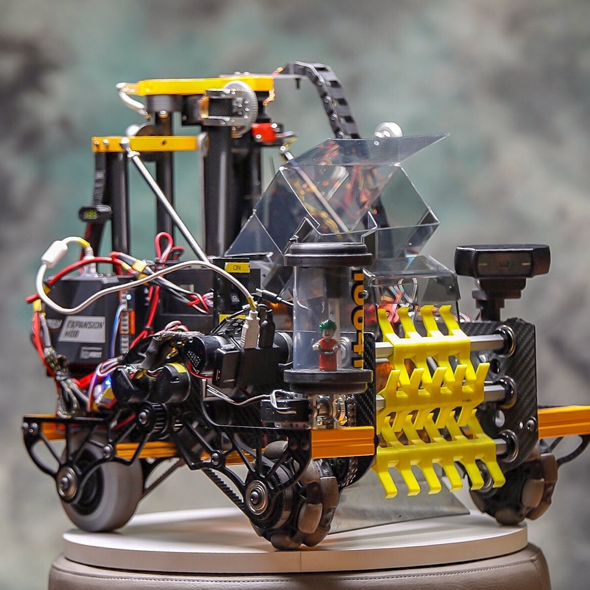
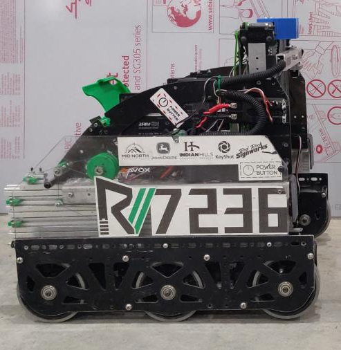
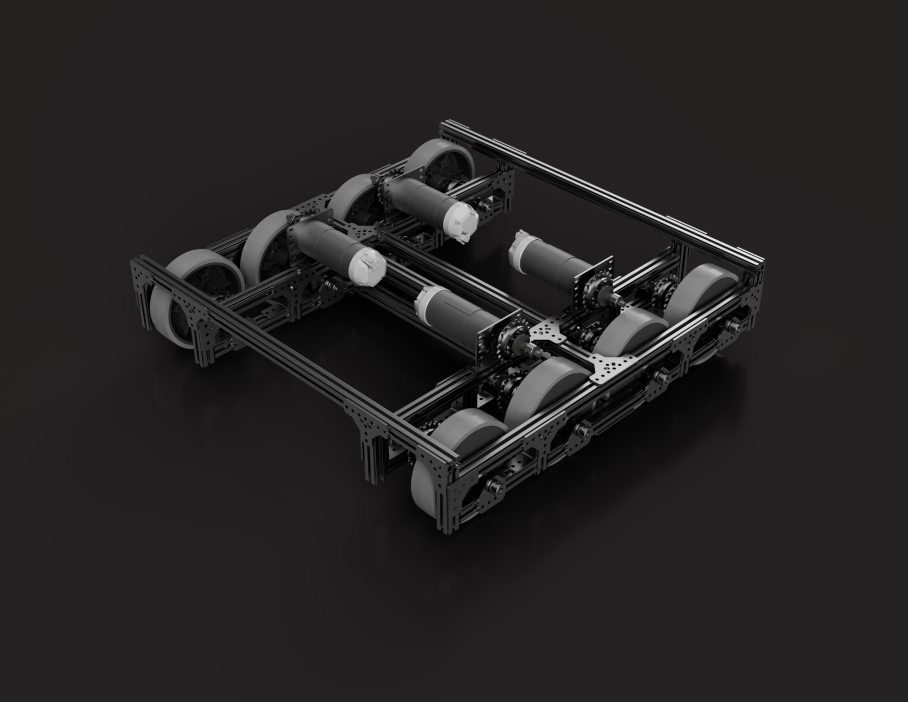

.. include:: <isonum.txt>

Tank (Skid-Steer) Drivetrains
=============================

2 Wheel Drive (Pushbot Drive)
-----------------------------

**Recommended only for first drivetrain, not for competitions**

This rookie drivetrain is considered one of the inferior drivetrains, though it is usable at low competition levels. This is the introductory drivetrain type for many rookies, as it is promoted in official guides published by *FIRST*\ |reg| (giving it the name pushbot). It often has :term:`direct driven <Direct Drive>` :term:`traction wheels <Traction wheel>` with unpowered :term:`omni wheels <Omni Wheel>`.

This type of drivetrain has poor turning as the center of turning is at the back of the robot between the two powered wheels. In comparison to other drivetrains, it has poor acceleration due to only using two motors.

Even though it may not be an optimal drivetrain, it is still possible to be competitive as long as the drivetrain is reliable. As a consensus, we would advise every new team to build the pushbot primarily to learn how to build with a kit. The pushbot is a good starting point and helps the team get familiarized with using kit parts, attaching wheels, mounting motors, etc. However, it is subpar to every other drivetrain in a competitive context.

.. attention:: While the pushbot is a good first drivetrain for new teams to get acquainted with the kit, it is recommended that teams move away from this drivetrain when building their competition robot.

Advantages
^^^^^^^^^^

- Most simple drivetrain to build
- No need to worry about powering all four wheels

Disadvantages
^^^^^^^^^^^^^

- Slower than other options
- Underpowered (all other drivetrain options typically use 4 motors)
- Uses the Tetrix MAX motor, which is prone to burning out easily, is underpowered, and has a fragile gearbox.
- Lacks agility and maneuverability due to 2 motor turning
- Poor acceleration due to 2 motors
- Often :term:`direct driven <Direct Drive>`,
  which is highly discouraged for drivetrains

.. figure:: images/tank/tetrix-pushbot.jpg
   :alt: Tetrix pushbot

   Example pushbot drivetrain included in the starter FTC\ |reg| guide

4 Wheel Drive
-------------

In its most common form, the drivetrain uses the same wheel layout as the two wheel drivetrain (2 traction wheels in the back, 2 omnis in the front), but with one notable difference: **all four wheels are powered**.

Some teams will put all four traction wheels or use all four omni wheels. It is not suggested to use all 4 traction wheels due to poor turning that results in this setup. This is caused by wheel scrub. Using omni wheels for all four wheels will result in incredible turning, with the robot rotating around its center.

.. admonition:: Term

   .. glossary::

      Wheel scrub
         Wheel scrub refers to friction between the side of the wheel and the floor tile. It inhibits turning as the drivetrain must overcome this frictional force in order to turn the robot. Wheel scrub is most common on 4 or 6 wheel tank drivetrains that do not have a :term:`center drop <Drop Center>`.

However, this advantage comes with a major loss of traction. For these reasons, many teams choose to use two traction wheels and two omni wheels for a balance between quick turning and traction. The primary advantage of this drivetrain over other tank drivetrains is its ability to easily move across raised terrain when the bot's center is raised above the terrain.

It is suggested that a four wheel drivetrain be close to, or exactly, a square. Otherwise, one may encounter problems turning.

.. note:: :term:`Weight distribution` is furthermore a large factor that should be considered: the more weight in the back, the better.

.. admonition:: Term

   .. glossary::

      Weight distribution
         Weight distribution generally refers to how the weight of the robot is proportioned. It is desirable to have a relatively 50-50 (50% of weight in the front half, 50% in back half) so that the drivetrain has optimal manuverability and turning.

Off-center turning, which may or may not be a drawback, is nearly ubiquitous among 4 wheel drives. This may not be a problem for teams, but it is good to be aware of it. Off-center turning can be an advantage, but be warned that turning will be slightly slower on 4 wheel drives than their six or eight wheel counterparts.

Advantages
^^^^^^^^^^

- More maneuverable than 2WD
- Solid acceleration and traction
- Can traverse terrain if the chassis is raised high enough
- Good pushing power for defense, yet maneuverable enough to avoid it

Disadvantages
^^^^^^^^^^^^^

- Can tip more easily than 6WD/8WD with a high center of mass
- All traction wheel 4WD can have decreased maneuverability
- Weight distribution factors into the turning point and turning radius of the robot

.. dropdown:: CAD Examples of Four Wheel Drive (Click to expand)

   .. tab-set::

      .. tab-item:: goBILDA COTS

         .. raw:: html

            
            <model-viewer alt="goBILDA COTS Mecanum Drive" src="https://cdn.statically.io/gh/gamemanual0/3d-models/main/4WD/goBilda4WD.glb" ar ar-modes="webxr scene-viewer quick-look" seamless-poster shadow-intensity="1" camera-controls enable-pan style="width:100%; height:500px;overflow:auto; --poster-color: transparent"></model-viewer>

         `Click here to explore this model in OnShape online CAD <https://cad.onshape.com/documents/45549489f570f3694569a2df/w/85ff26b9fca4988ebc4df3b4/e/873a6e756fd385a1b743bdc1>`__

      .. tab-item:: REV COTS

         .. raw:: html

            <model-viewer alt="REV COTS Mecanum Drive" src="https://cdn.statically.io/gh/gamemanual0/3d-models/main/4WD/rev4WD.glb" ar ar-modes="webxr scene-viewer quick-look" seamless-poster shadow-intensity="1" camera-controls enable-pan style="width:100%; height:500px;overflow:auto; --poster-color: transparent"></model-viewer>

         `Click here to explore this model in OnShape online CAD <https://cad.onshape.com/documents/45549489f570f3694569a2df/w/85ff26b9fca4988ebc4df3b4/e/e02b1ee98816af5505b528e2>`__

      .. tab-item:: goBILDA Custom

         .. raw:: html

            <model-viewer alt="Gobilda Custom Mecanum Drive" src="https://cdn.statically.io/gh/gamemanual0/3d-models/main/4WD/gobildaCustom4Wd.glb" ar ar-modes="webxr scene-viewer quick-look" seamless-poster shadow-intensity="1" camera-controls enable-pan style="width:100%; height:500px;overflow:auto; --poster-color: transparent"></model-viewer>

         `Click here to explore this model in OnShape online CAD <https://cad.onshape.com/documents/45549489f570f3694569a2df/w/85ff26b9fca4988ebc4df3b4/e/16bae3d8b801874d9b1daaff>`__

      .. tab-item:: REV Custom

         .. raw:: html

            <model-viewer alt="Gobilda Custom Mecanum Drive" src="https://cdn.statically.io/gh/gamemanual0/3d-models/main/4WD/revCustom4WD.glb" ar ar-modes="webxr scene-viewer quick-look" seamless-poster shadow-intensity="1" camera-controls enable-pan style="width:100%; height:500px;overflow:auto; --poster-color: transparent"></model-viewer>

         `Click here to explore this model in OnShape online CAD <https://cad.onshape.com/documents/45549489f570f3694569a2df/w/85ff26b9fca4988ebc4df3b4/e/fab2c2e33242281f0d46e524>`__

.. figure:: images/tank/7209-4wd.jpg
   :alt: 7209 Tech Hog's Relic Recovery Robot

   7209 Tech Hogs, Relic Recovery

   10641 Atomic Gears, Rover Ruckus

6 Wheel Drive (6WD)
-------------------

A 6 wheel drivetrain is a common competitive drivetrain in FTC for multiple reasons: it has fantastic traction, great turning, and by having 6 wheels, the drivetrain has more contact with the ground, helping with stability and traction. There are two main types of 6 wheel drivetrains: ones with **corner omnis** and ones with a **drop center**.

.. admonition:: Term

   .. glossary::

      **Drop Center**
         A drop center 6WD is a 6 wheel drive with the center wheel mounted slightly below the other two wheels. The drop should be anywhere from more than 1/16" up to 1/4". However, the recommended drop is around 1/8". Typically, lighter robots (<25 lbs.) can have less drop, while heavier robots (>25 lbs.) perform slightly better with more than 1/8" drop.

         The purpose of dropping the middle wheel is to ensure that only 4 wheels are in contact with the ground at all times. This is because turning with 6 wheels on the ground introduces lots of friction, making it very difficult to turn quickly. Note that the **required drop may vary depending on both field condition and weight of the overall robot**.

         Turning can drastically degrade due to a difference in material underneath the field, leading to the robot sinking down further than usual.

**Most drop center 6 wheel drives are made using custom drivetrains** because it is difficult to get the center wheel drop using a kit based build system (a notable exception being REV-based kit drivetrains). It is possible to execute a drop center using goBILDA and Actobotics using pillow blocks, but it is a little bit more awkward. However, with the new `goBILDA drop-center bearing plate <https://www.gobilda.com/1616-series-drop-center-bearing-plate-2mm-drop-4-pack/>`_, it is straightforward to make a drop center drivetrain on goBILDA channel.

6 wheel drives with corner :term:`omni wheels <Omni Wheel>` do not need to have a center drop. It attempts to solve the issue of turning by replacing the corner traction wheels with omni wheels, allowing the drivetrain to achieve better turning, albeit with slightly less traction than a center-drop. This is very easily buildable in kits, and is a great all-around drivetrain. Drop center and corner omnis can be combined for maximum turning reliability, although this comes with side effects like rocking and reduced traction.

Advantages
^^^^^^^^^^

- Great traction and maneuverability
- Good acceleration, can have a high top speed
- Great stability under all robot weights
- Able to play defense

Disadvantages
^^^^^^^^^^^^^

- Drop-center 6WD is tricky to build with :term:`channel <Channel>` based systems, though this has been partially mitigated with the `goBILDA drop-center bearing plate <https://www.gobilda.com/1616-series-drop-center-bearing-plate-2mm-drop-4-pack/>`_
- Drop-center 6WD is slightly worse at turning, but has more traction
- Drop-center 6WD is dependent on field conditions
- Corner omni 6WD has less traction
- Slow :term:`gear ratios <Gear Reduction>` will make a 6WD feel sluggish

.. dropdown:: CAD Examples of Six Wheel Drive (Click to expand)

   .. tab-set::

      .. tab-item:: goBILDA COTS

         .. raw:: html

            
            <model-viewer alt="goBILDA COTS Mecanum Drive" src="https://cdn.statically.io/gh/gamemanual0/3d-models/main/6WD/goBilda6WD.glb" ar ar-modes="webxr scene-viewer quick-look" seamless-poster shadow-intensity="1" camera-controls enable-pan style="width:100%; height:500px;overflow:auto; --poster-color: transparent"></model-viewer>

         `Click here to explore this model in OnShape online CAD <https://cad.onshape.com/documents/45549489f570f3694569a2df/w/85ff26b9fca4988ebc4df3b4/e/97e67997606a54fcabd367ac>`__

      .. tab-item:: REV COTS

         .. raw:: html

            <model-viewer alt="REV COTS Mecanum Drive" src="https://cdn.statically.io/gh/gamemanual0/3d-models/main/6WD/rev6WD.glb" ar ar-modes="webxr scene-viewer quick-look" seamless-poster shadow-intensity="1" camera-controls enable-pan style="width:100%; height:500px;overflow:auto; --poster-color: transparent"></model-viewer>

         `Click here to explore this model in OnShape online CAD <https://cad.onshape.com/documents/45549489f570f3694569a2df/w/85ff26b9fca4988ebc4df3b4/e/a787322363f7646a8b7cb69e>`__

      .. tab-item:: goBILDA Custom

         .. raw:: html

            <model-viewer alt="Gobilda Custom Mecanum Drive" src="https://cdn.statically.io/gh/gamemanual0/3d-models/main/6WD/gobildaCustom6WD.glb" ar ar-modes="webxr scene-viewer quick-look" seamless-poster shadow-intensity="1" camera-controls enable-pan style="width:100%; height:500px;overflow:auto; --poster-color: transparent"></model-viewer>

         `Click here to explore this model in OnShape online CAD <https://cad.onshape.com/documents/45549489f570f3694569a2df/w/85ff26b9fca4988ebc4df3b4/e/05fbe7b65c6c4be0b0cddabb>`__

      .. tab-item:: REV Custom

         .. raw:: html

            <model-viewer alt="Gobilda Custom Mecanum Drive" src="https://cdn.statically.io/gh/gamemanual0/3d-models/main/6WD/revCustom6WD.glb" ar ar-modes="webxr scene-viewer quick-look" seamless-poster shadow-intensity="1" camera-controls enable-pan style="width:100%; height:500px;overflow:auto; --poster-color: transparent"></model-viewer>

         `Click here to explore this model in OnShape online CAD <https://cad.onshape.com/documents/45549489f570f3694569a2df/w/85ff26b9fca4988ebc4df3b4/e/258524b3c7582178ba684ac5>`__

   7236 Recharged Green, Rover Ruckus; drop center 6WD

.. figure:: images/tank/ethan-6wd.jpg
   :alt: Ethan Doak's 6wd

   Ethan Doak, goBILDA 6 wheel drive with corner omni wheels

8 Wheel Drive
-------------

An 8 wheel drivetrain is less common than its 6WD counterpart, combining elements found in both 4 wheel and 6 wheel drivetrains. For example, the 6 wheel drivetrain generally will have a dropped center wheel so that the robot turns on four wheels instead of six, reducing friction and increasing turning mobility.

On an 8 wheel drive, the center four wheels are dropped. This means that when turning, only these middle four wheels are touching the ground. Thus, the 8 wheel drivetrain has slightly more stability while turning than a 6 wheel drive, whereas 6 wheel drives can turn more quickly. Furthermore, since the 8 wheel drive has wheels in the same place as a 4 wheel drive, it has the stability of a 4 wheel drive.

It is suggested that all eight wheels should be powered, and :term:`planetary <Planetary Gear>` motors should be used over a :term:`spur gear <Spur gearbox>` motor.

Teams also have the option of using doubled omni wheels on the outer four wheels. Doing so will reduce traction/pushing power and increase mobility.

Advantages
^^^^^^^^^^

- Combines the stability of 6WD with the agility of 4WD
- Even more stable than 6WD
- Fantastic traction and acceleration
- Great for defense

Disadvantages
^^^^^^^^^^^^^

- Takes up more space than 6WD
- Powering all 8 wheels can be tricky
- Without adequate center drop, turning can be drastically reduced

.. figure:: images/tank/3846-8wd.jpg
   :alt: 3846 Maelstrom's 8WD

   3846 Maelstrom, Rover Ruckus

.. figure:: images/tank/13075-8wd.png
   :alt: 13075 Coram Deo Academy Robotics' 8WD

   13075 Coram Deo Academy Robotics, Rover Ruckus

Tread Drive
-----------

Tread drive is the use of tank treads or wide belts to power movement, much like a real life tank. Unfortunately, in FTC, it is not a competitive drivetrain for a number of reasons.

Tread is complex, and has many points of failure. Treads are also very prone to defense, and a slight hit from another robot is enough to misalign the treads. :term:`Commercial Off-The-Shelf (COTS) <COTS>` tread options aren't great either - TETRIX tracks have a tendency to snap and derail when used on robot drivetrains, making them not suitable for competition use.

While it is possible to implement tread drive successfully, such as in the example below, most inexperienced teams do not have the capability and know-how to do so. Tread drive has negligible traction improvements at the cost of maneuverability. There are better options to traverse terrain, such as a 4WD.

Advantages
^^^^^^^^^^

- Very good at traversing terrain
- Fantastic traction and pushing power

Disadvantages
^^^^^^^^^^^^^

- Suffers in maneuverability and top speed
- Very complex to implement
- Treads are prone to breakage and can fall off easily

.. figure:: images/tank/5975-tread.png
   :alt: 5975 Cybots' Tread Drive Render

   5975 Cybots, Res-Q
