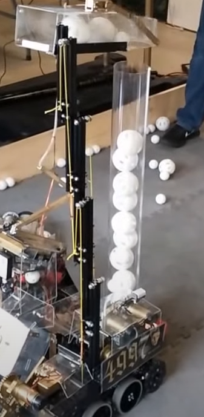

.. include:: <isonum.txt>

Extrusion Slides
================

Extrusion slides are made up of a stack of extrusions that extend by sliding along each other. There are two ways to make this happen: bushings or V-wheels. Bushing slides connect the two slides with two self-lubricating plastic pieces that slide smoothly along the slots in the extrusion. V-wheel slides have V-shaped groove bearings on both sides of the extrusion that bite intro grooves on the extrusion, allowing the stages to slide smoothly.

REV, Actobotics, and goBILDA all sell extrusion slide kits that integrate nicely with existing FTC\ |reg| kit parts. Beyond this, OpenBuilds sells a V-wheel extrusion slide kit suitable for heavier loads, and Misumi offers a few different sizes of bushing-based extrusion slides. REV furthermore sells a 8020 V-groove bearing slide kit for FRC\ |reg|, that is not recommended for FTC use cases.

.. note:: We recommend that newer teams using extrusion slides stick to kits designed for FTC instead of making their own.

REV Robotics 15mm Linear Motion Kit
-----------------------------------

The `REV 15mm Linear Motion Kit <https://www.revrobotics.com/rev-45-1507/>`_ is based on the 15mm extrusion system. **This extrusion kit does not perform well without modification.** This has been partially remedied by REV as they have developed a second iteration of their slide kit, which has much better tolerances on the Delrin sliders.

Still, you'll see some competitive teams use this kit with multiple modifications, such as adding lots of lubricant and mounting the sliders differently. Teams have also 3D printed their own sliders, though this is not a great idea for teams without much 3D printing experience. One of the biggest issues with the stock REV kit is the tendency of the slides to bind. Additionally, since the only thing attaching one extrusion to another is the plastic slider, the REV slides are not particularly sturdy, and require crossbeams to keep alignment.

Overall, this kit is lightweight, simple, and cheap. It can be a good start for teams using REV and needing a linear extension, and is generally usable out of the box. However, it is not very smooth and only achieves its maximum potential when modified and tweaked.

Advantages
^^^^^^^^^^

- REV has complete guide on how to rig the linear slides
- Easily interfaces with REV building system
- Lightweight, should be used for light/medium loads only
- If tweaked, can be a very efficient linear slide

Disadvantages
^^^^^^^^^^^^^

- Does not perform well out of the box
- Can flex under load, needs additional support
- May need some modifications such as custom sliders

.. image:: images/extrusion-slides/11115-slides.png
   :alt: 11115 Gluten Free's Rover Ruckus robot with slides extended

.. figure:: images/extrusion-slides/11115-slider.png
   :alt: 11115 Gluten Free's custom Rev slider

   11115 Gluten Free, Rover Ruckus, custom REV slides

.. figure:: images/extrusion-slides/8680-slides.jpg
   :alt: 8680 Kraken-Pinion's Rover Ruckus robot with slides extended

   8680 Kraken-Pinion, Rover Ruckus, REV slides

OpenBuilds Mini V Gantry Kit
----------------------------

The `OpenBuilds Mini V Gantry Kit <https://openbuildspartstore.com/mini-v-gantry-kit/>`_ is designed for use with OpenBuilds' 20mm V-slot extrusion, which can be mounted to other build systems using M3 screws and sliding T nuts. OpenBuilds slides are used for high precision applications such as 3D printers and CNC machines and have a **much higher load capacity** than REV and Actobotics slides. OpenBuilds slides are also much heavier than REV and Actobotics slides, but because they are so strong they can be used in applications where two sets of lighter duty slides would otherwise be required. Out of the box, OpenBuilds slides are tailored to single-stage belt lifts, but they could easily be adapted to work for multi-stage or string lifts given some thought and additional parts.

Advantages
^^^^^^^^^^

- Sturdy, doesn't flex even under a lot of load
- Interfaces with most other build systems thanks to sliding T nuts

Disadvantages
^^^^^^^^^^^^^

- Not designed for multi-stage lifts right out of the box
- **Heavy**, overkill for lifting lighter objects unless precision is important
- OpenBuilds only offers M3 and M5 T nuts, although other compatible sizes might be found on Amazon or McMaster-Carr

   4997 Masquerade, Cascade Effect, OpenBuilds slides

goBILDA goRAIL
--------------

`Linear motion guides <https://www.gobilda.com/gorail-based/>`_ are goBILDA's take on linear motion using goRAIL, which is a type of extrusion compatible with V-groove bearings. Similar to a standard 8020 V-groove carriage, used in FRC, goRAIL is a lighter option that is better suited for FTC.

Actobotics X-rail Slide Kit
---------------------------

.. attention:: ServoCity has discontinued the Actobotics X-rail Slide Kit.

Actobotics' `X-rail Slide Kit <https://www.servocity.com/cascading-x-rail-slide-kit>`_ works well out of the box. However, the main caveat is that the kit has a **very low maximum load (2lb. at maximum extension)**.

Teams will have to keep their designs on this kit particularly lightweight. This slide uses elastic retraction through the use of surgical tubing, which means that instead of having both an extend and return string, there is a retraction force applied at all times. This helps simplify tensioning and spooling, however, limits how fast the slide can be run. Additionally, the plastic end caps have a reputation of breaking regularly because they endure shock load every time the slide extends to maximum. 3D printed alternatives may be more sturdy than the stock end caps.

.. attention:: It is highly recommended that teams add an additional set of v-groove bearings at the end of each piece of extrusion to give each stage an additional point of support. This will increase load capacity and possibly smoothness.

Advantages
^^^^^^^^^^

- Easily interfaces with Actobotics building system
- Elastic retraction is a simple way to retract
- **Should be used for light/medium loads only**

Disadvantages
^^^^^^^^^^^^^

- Will flex under load, needs additional support
- Elastic retraction slows down extension speed and retraction will be slower than string retraction

.. figure:: images/extrusion-slides/12599-slides.jpg
   :alt: 12599 Overcharged's Relic Recovery robot with relic slide extended

   12599 Overcharged, Relic Recovery, Actobotics X-Rail slides

