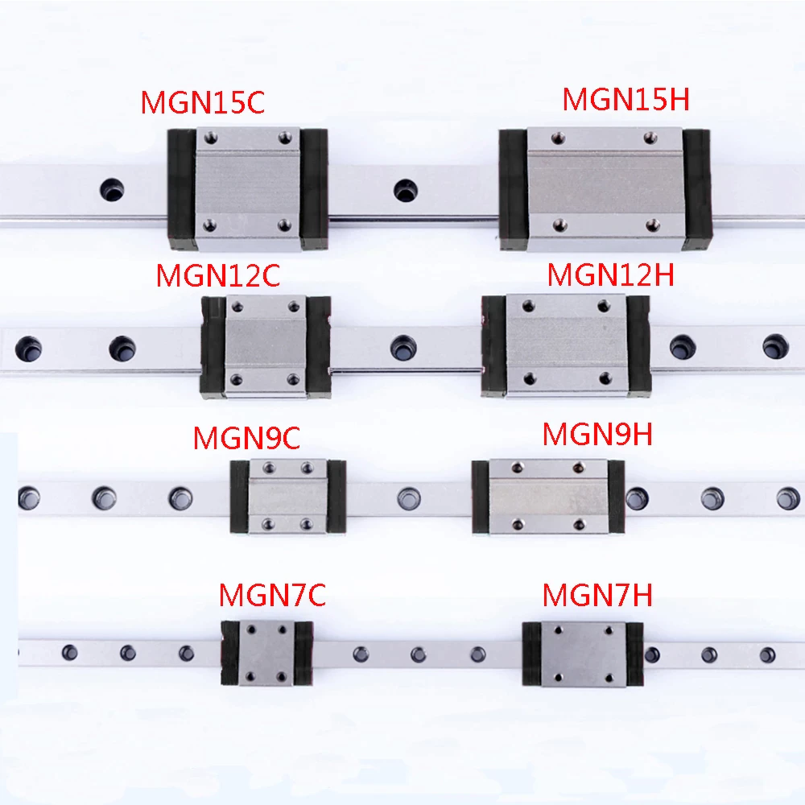

.. include:: <isonum.txt>

Linear Bearing Slides
=====================

Linear bearings are specialty ball bearings. Unlike radial ball bearings, they run balls through cyclical tracks along the length of a rail or shaft to create smooth, stable, precise linear motion. They are used in many industrial automation systems, including 3D printers and CNC machines.

.. attention:: Unlike with most slides, the balls of linear bearings are not well retained when the bearings are removed from their rails. Linear bearings with a few balls missing have slightly decreased performance. Be sure to handle and store the bearings with care and to be prepared if their balls fall out.

There are two types of linear bearings generally used in FTC: round linear bearings and linear bearing blocks.

MGN Series Linear Bearing Blocks
--------------------------------

MGN linear bearing blocks are the most common linear bearing blocks in FTC. They are the smallest of a larger classification of slides made by HIWIN Corporation. They come in several sizes, the smallest being MGN7 and the largest being MGN15.

It is **recommended that teams only use MGN7, MGN9, and MGN12 slides.** A pair of MGN12 slides is sufficient to lift a 40lb (20kg) robot. MGN9 slides are similar in weight and scale to MiSUMI drawer slides. MGN7 slides are smaller, but they are slightly more inconvenient to work with because they use smaller M2 screws for mounting.

If ordered directly through industrial supply centers such as HIWIN, these slides can be expensive. For hobbyists, however, they are sold at more reasonable prices through sellers on Amazon and eBay, although these sellers may have questionable quality control. You can find more information with a Google search of "improving cheap MGN slides"

Advantages
^^^^^^^^^^

- Extremely smooth thanks to usage of ball bearings
- Stiffer and stronger than almost any other type of slide
- Steel rails don't wear out the way aluminum slides do

Disadvantages
^^^^^^^^^^^^^

- Because MGN rails and sliders are made entirely of steel, they are generally much heavier than aluminum drawer slides. This is not an issue with MGN9 slides, which are marginally heavier, and MGN7 slides, which are marginally lighter.
- Simplest way to connect slides together and mount pulleys is using custom parts
- Cheap slides generally need some attention to clean and re-grease

.. figure:: images/linear-bearing-slides/8813-slides.png
   :alt: 8813 The Winter Soldiers' Rover Ruckus robot with lift extended
   :width: 20em

   8813 The Winter Soldiers, Rover Ruckus, MGN12 slides connected with custom box tubes

.. figure:: images/linear-bearing-slides/8221-slides.png
   :alt: 8221 Cubix's Res-Q robot with deposit extended

   8221 Cubix, Res-Q, MGN slides connected with 3D printed parts

Round Linear Bearings
---------------------

Round linear bearings are similar to bearing blocks and have similar properties, but they can be used on any round shaft rather than a specialized rail. They can also be used in applications where sliding mechanisms have to rotate on the same axis.

Round linear bearings can easily be sourced from most robotics suppliers, including goBILDA and Actobotics. However, there are currently no out-of-the-box lift kits using these bearings available from these suppliers. It is difficult to make a compact slide setup using only kit parts, and for this reason most teams using round linear bearings use custom parts to mount them.

Round linear bearings are often mounted with clamps, but they can also be mounted using inexpensive snap rings that snap onto the grooves on the outsides of the bearings.

Many teams use round linear bearings with inexpensive aluminum and carbon fiber tubes instead of steel tubes to save weight. Although slide assemblies made this way are extremely light, they are prone to wearing out over time as the steel balls wear into the softer materials. Teams should keep this in mind and try to design their slide systems so that the tubes can easily be replaced.

.. figure:: images/linear-bearing-slides/8417-slides.png
   :alt: 8417 'Lectric Legends' Rover Ruckus robot with slides extended

   8417 'Lectric Legends, Rover Ruckus, round linear bearings and carbon fiber tubes with 3D printed mounts

.. figure:: images/linear-bearing-slides/5975-carbon-fiber.png
   :alt: 5975 Cybots Relic Recovery robot with relic arm extended

   5975 Cybots, Relic Recovery, round linear bearings and carbon fiber tubes with 3D printed mounts

.. figure:: images/linear-bearing-slides/11115-slides.png
   :alt: 11115 Gluten Free Skystone linear slide arm

   11115 Gluten Free, Skystone, round linear bearings and metal shafts with 3D printed mounts

.. figure:: images/linear-bearing-slides/gb-slides.jpg
   :alt: goBILDA round linear bearing product insight

   goBILDA, round linear bearings with metal clamps and shafts
