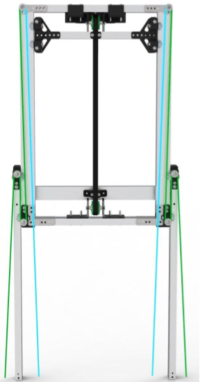
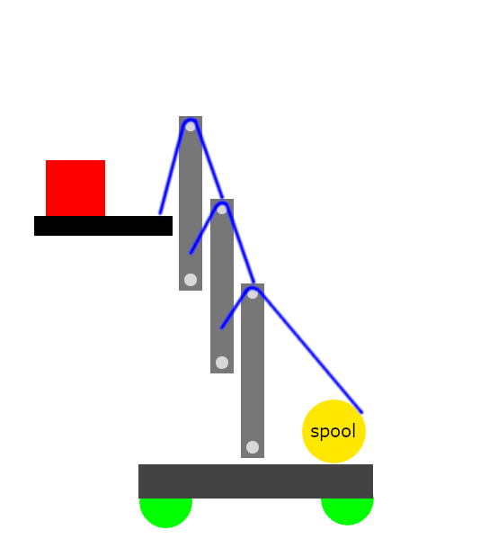
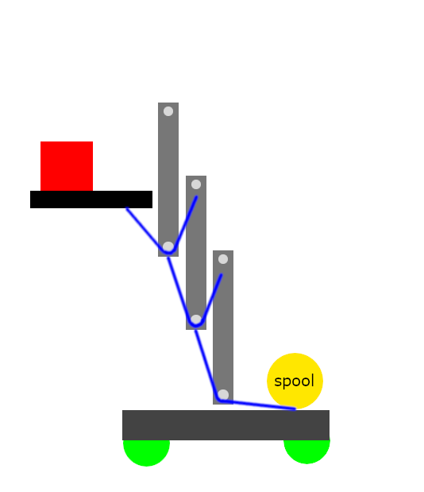
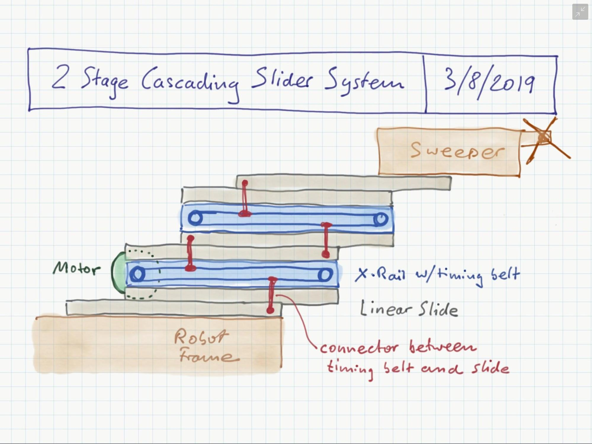
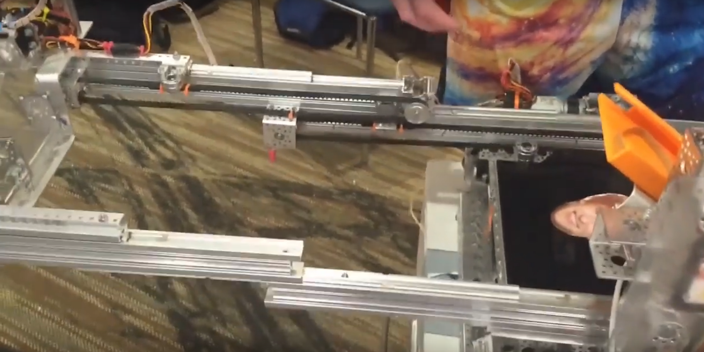
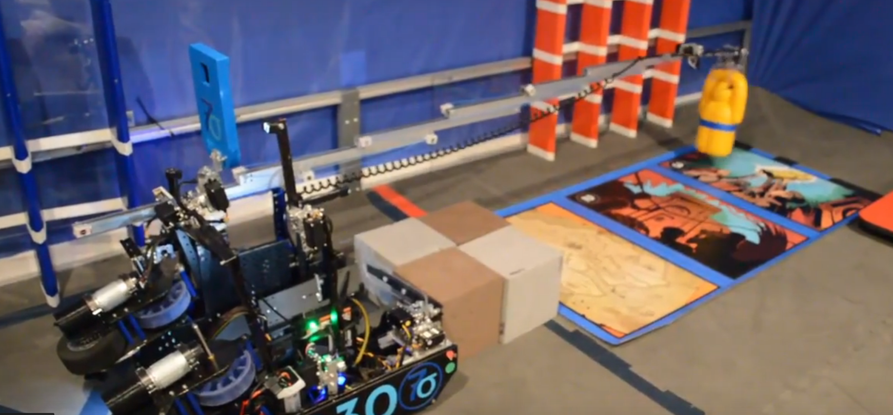
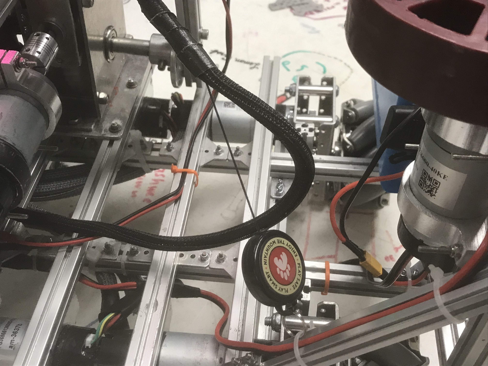
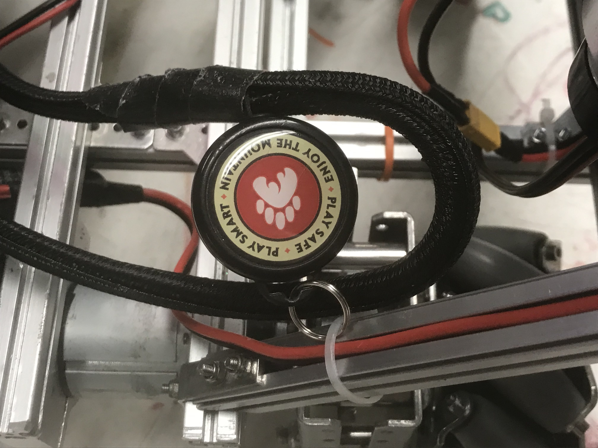

.. include:: <isonum.txt>

Rigging
=======

Rigging refers to the way that string, belt, or chain is set up to extend and retract a linear extension. This is an important and time-consuming requirement for any team that uses linear extension, so be sure to spend adequate time on it.

   Example rigging setup from team 7236 Recharged Green.
   This setup utilizes a continuous stringing setup for the first stage and a
   cascaded belt-driven second stage.

General Rigging Tips
--------------------

- Rig your extension string when the extension is retracted, and your retract string when the extension is at maximum extension
- Clamping a string with a bolt instead of tying it around something makes it much easier to quickly change the tension of a string
- If tying an abrasive material string, like kevlar, around a plastic part, you can tie the string around a washer to distribute the loads across the hole in the pulley instead of tying it directly into a hole in the pulley
- Its generally easier to start from the side with the pulley and go to the end of the slides then the other way around

Continuous Rigging
------------------

**Generally recommended**

Continuous rigging entails rigging one long **extension string**, originating from a motor-powered spool, to the top of the base stage, then to the bottom of the first stage, then to the top of the first stage, then to the bottom of the second stage, etc. A **retraction string**, originating from a second spool on the same axis as the extension spool, is then anchored to the top stage. When the motor rotates one direction, the extension spool reels in the extension string, so it becomes shorter. In doing so, the distance between the top of one stage and the bottom of the next stage decreases, causing the system to extend.

.. note:: The last stage always extends and retracts before the other stages (this can be either an advantage or a disadvantage, depending on the application).

Once the last stage hits its limit, the next to last stage extends outwards, and so on; the pattern repeats until every stage is fully extended. When the motor spins **in the opposite direction**, the retraction string is reeled in, pulling the top stage closer to its starting position until the system is back where it started. For the retraction string, it is often necessary to add an extra pulley near the back of the extension. This is because the retraction will only retract to the farthest point, which generally is the spool. However, the spool may not be mounted at the very back of the robot - thus an extra pulley is needed. Note that for this to work, the extension string should be wrapped around the spool in the opposite direction of the retraction string. Thus, if the extension is wrapped clockwise, the retraction must be wrapped counterclockwise.

Here are some additional considerations when rigging a continuous system.

- As a general rule, continuous spools can be powered by a system with a
  relatively low gear ratio.
- The extension string and retraction string **do not need to be separate
  strings, but it is much easier to tension the system if they are separate**.
- The extension spool and retraction spool should be the same diameter.
- You need to make sure, as with any time you work with strings and pulleys,
  that you are pulling the string straight. Any amount of misalignment can lead to the string coming off of your pulley.
- The width and diameter of your spool should be enough such that once fully
  wounded, your string never overlaps.
  The reason for this is because when the string starts to overlap,
  this can change the diameter of your spool,
  causing the tension in the string to change.

   Continuous rigging diagram

Cascade Rigging
---------------

**Generally recommended**

Cascade rigging is a bit more complicated than continuous rigging. Much like continuous rigging, an extension string originating from a spool is rigged to the top of the base, running down to the bottom of the first stage. However, instead of being rigged to the top of the stage, the extension string is anchored to the bottom of the first stage. A second extension string, anchored to the top of the base, is rigged to the top of the first stage and anchored at the bottom of the second stage. The pattern continues until all stages have been rigged.

.. note:: The number of strings required to extend is equal to the number of stages in the system.

When the motor rotates one direction, the extension spool reels in the first string, decreasing the distance between the base and the bottom of the first stage. This pushes the second string forward, decreasing the distance between the top of the first stage and the bottom of the second stage, and so on. Note that unlike continuous rigging, **every stage moves at the same time**. The second stage moves 2 times as fast as the first stage relative to the base, the third 3 times as fast, and so on.

A cascaded system can be retracted in three ways: using continuous retraction, elastic retraction, or reverse-cascade retraction.

   Cascade rigging diagram

Retraction Options
------------------

Continuous Retraction
^^^^^^^^^^^^^^^^^^^^^

As the name suggests, continuous retraction utilizes inverted continuous rigging to retract the slides. There are two main methods of doing this, **free floating retraction** where a string is run from the last stage directly back to the spool, and **with slide retraction** where the string is run in an inverse continuous pattern. Generally, **with slide retraction** should be used with extensions going outside the robot frame to prevent entanglement, and **free floating retraction** should only be used with purely vertical slides.

.. note:: If continuous retraction is being used with cascade extension, the two spools cannot be the same diameter. If the variable :math:`N` is the number of stages in the system, the diameter of the cascade extension spool must be :math:`N` **times smaller** than the continuous retraction spool.

.. figure:: images/rigging/continuous-retraction.png
   :alt: A diagram of continuous retraction

   Continuous Retraction

.. warning:: If free floating retraction is used, **make sure your retract string is always parallel to the slides**. If the string is misaligned, it can pull on your slide and cause excess bending forces on the stages.

Advantages:

- Simplest retraction rigging

Disadvantages:

- Can become tangled if free floating
- Requires different sized spools if used with cascade retraction

Elastic Retraction
^^^^^^^^^^^^^^^^^^

Instead of retracting using a retraction spool, one common way to retract is to attach a piece of elastic (commonly surgical tubing) to the last stage. The elastic applies a force on the last stage that is counteracted by the motor when extending. However, when retracting, the motor reels the last slide back in. While this is the retraction method recommended by many kit slide manuals, this method is not recommended.

Advantages:

- There is only one string to tension, instead of multiple, so tensioning is simpler.
- The elastic automatically tensions the extension string.

Disadvantages:

- Since the elastic applies a force to the slide at all times, this force opposes the force applied by the motor when extending the slides. **Thus, elastic retraction decreases extension speed considerably**.
- The elastic does not apply a constant force at all times. It applies force proportional to the amount that the slide is extended, so retraction may not be smooth and controlled, like other rigging methods.
- It is very easy to unwind your extension spool when using elastic retraction.

Cascade Retraction
^^^^^^^^^^^^^^^^^^

Cascade retraction entails simply rigging another set of cascade string that can retract the system when engaged (see the image below).

.. note:: If cascade retraction is being used with continuous extension, the two spools cannot be the same diameter. If the variable :math:`N` is the number of stages in the system, the diameter of the continuous extension spool must be :math:`N` **times bigger** than the cascade retraction spool.

Advantages:

- Very space-efficient
- All stages retract at the same speed at the same time

Disadvantages:

- Requires more string (less strings to tension, less strings that can become loose)
- Requires different sized spools if used with cascade extension

   Cascade retraction

Additional Considerations:

- If the system has only one stage, cascade rigging is **identical to continuous rigging**
- Unlike continuous rigging, each time a new stage is added to a cascaded system, the gear ratio required to maintain the same extension speed increases. For instance, if 2 stages are added to a 1 stage cascaded lift that is geared at a ratio of 3:1, the ratio must increase by a factor of :math:`\frac{2+1}{1}` to maintain the same speed, changing the ratio to 9:1.
- One disadvantage of cascade rigging is that each string must be kept tensioned. This is still the case with continuous rigging, but you have many more strings to keep track of, as tension must be maintained on all of them.

- You need to make sure, as with any time you work with strings and pulleys, that you are pulling the string straight. Any amount of misalignment can lead to the string coming off of your pulley.

Belt-driven slides
------------------

One increasingly popular alternative to traditional string-based rigging is belt-driven slides. This can be done continuously or using cascade rigging.

Advantages over string
^^^^^^^^^^^^^^^^^^^^^^

Unlike string, belts used on slides never need to be tensioned. As discussed in the linear motion section, in order for string-driven slides to remain efficient, string tension must be maintained. Naturally, string loosens over time, so you either need a mechanism that can provide extra tension (a spring) or manually tighten string, which can get a bit tedious (especially for cascade rigging).

However, belts do not have this issue. They tend not to stretch over time, meaning complex external tensioners are rarely needed. Belts are also on an automatic one to one loop, meaning that for every inch you pull in on the extension side, you always feed back out that inch on the retraction side, and vise versa. While this might not seem like a big deal, if a string winds itself up on a spool and overlaps at any point, the diameter of the spool changes, making the two spools out of sync.

Disadvantages over string
^^^^^^^^^^^^^^^^^^^^^^^^^

The main disadvantage of belt-driven slides is the amount of space they take up. Simply put, belt pulleys take up much more room than the 4mm thick, 12mm diameter pulley bearings REV sells. When using belt-driven slides, pulleys are at least double that thickness and have a considerably larger diameter, meaning each stage must be thicker.

.. figure:: images/rigging/7236-continuous-belt.png
   :alt: 7236's Rover Ruckus' robot's belt rigging

   7236 Recharged Green, Rover Ruckus, **continuous** rig

.. figure:: images/rigging/11190-continuous-belt.jpg
   :alt: 11190's Relic Recovery robot's belt rigging

   11190 Mechadojos, Relic Recovery, continuous belt rig

   5064 Aperture Science Rover Ruckus **cascade** belt-driven proof of concept drawing

   5064 Aperture Science Rover Ruckus **cascade** belt-driven final version

Belt or chain driven elevators
------------------------------

Almost ubiquitous in FRC\ |reg|, belt and chain elevators have existed seemingly forever. The basic premise is to have sprockets or pulleys mounted at the top and bottom of the elevator to the robot superstructure. Then, the belt or chain is hard bolted to the elevator near the bottom sprocket or pulley. When the chain or belt is driven, the elevator will move up and down. It is possible for elevators to have multi stage designs, but powering them will be more complex.

.. figure:: images/rigging/7236-belt-driven-elevator.jpg
   :alt: 7236's belt driven elevator

   7236 Recharged Green, Rover Ruckus

Tensioners
----------

Tensioning string is one of the most painstaking tasks for a builder in FTC. Ensuring that both sets of slides are tensioned evenly can be an arduous and annoying job. However, adding tensioners to your strings can help solve the uneven tension and ensure that both sides of slides run together. The most common type of tensioner is a spring that can be purchased at a hardware store. It generally will be placed at the end of the string run, near the part that extends farthest out from the robot's center. By doing so, the string will stretch out when the spool extends the arm, keeping tension so that the string does not detach from the pulleys in the linear slide extension.

Another form of tensioner can be a spring-loaded pulley. Since the pulley is spring-loaded, it will take up the slack in the string. Alternatively, it is possible to mount a pulley on a piece of extrusion, and slide it so the string is taut.

There are two main reasons that tensioners are highly recommended in string based linear slides, the first and oftentimes more important one, is that at its core, a run of string is a series of polygons, and as the slide extends the effective size of that polygon changes. Meaning that when fully extended, your slide may require more or less string compared to when halfway extended. Or partially extended. The closer each set of bearings are, the less this impracts string tension.

Another (but less impactful) thing to keep in mind that spool size changes as string is added/removed from the spool. If the spool radius increases, the speed of the extension will also increase, and torque, which opposes speed, will decrease. Consequently, tension will change as well. Therefore, a bit of slack is inherent in all linear extension designs using string.

.. attention:: It is highly encouraged that teams have at least one spring tensioner per linear slide set.

.. image:: images/tensioners/13075-slides.png
   :alt: An image of 13075 linear slides

.. figure:: images/tensioners/13075-string-tensioner.png
   :alt: An image of 13075 linear slide's string tensioner

   13075 Coram Deo Robotics, Rover Ruckus, string tensioner

Picking the right spool size
----------------------------

Spools have a special property that isn't often discussed, but is extremely useful when creating linear slide systems. Just as the system's speed and torque can be changed by changing its gear ratio, speed and torque can also be changed by changing the spool size. The motor rotates the spool at a constant angular speed. Thus, the translational speed (the speed of the slide) is proportional to the radius of the spool, and since torque is inversely proportional to speed, changing the spool size changes torque as well.

This is important to recognize, as changing spool size is often more convenient than changing gear ratio to get the desired combination of speed and torque. To illustrate this, say you have a linear extension system with a 3.7:1 gear ratio. You then decide that a 5:1 gear ratio would provide a more desirable combination of speed and torque than your current 3.7:1 ratio.

In many cases, instead of swapping gearboxes, it makes more sense to swap out spools to a smaller one. If your spool is currently 2 inches, your new size should be :math:`\frac{2*3.7}{5}` inches to achieve the same result.

You also need to make sure that when fully wrapped on the spool, your cable or string doesn't overlap. Overlapping can result in a change in spool diameter, which will change the tension in your string.

Cable management
----------------

When extending outwards, wire management becomes increasingly important. Obviously, it is a necessity to use wires slightly longer than the extension length. However, it is not recommended that these wires are left unprotected, as they can get tangled or caught in the slides much more easily than with protection.

In general, teams should ensure that wires never protrude outside the structural parts of the robot, because they can get caught on other robots or game pieces. This can be accomplished by cable ties or Velcro ties, or by using acrylic plate to keep wires inside.

However, for linear extensions, other forms of cable management are needed. The two types of cable management recommended are cable carrier and retractable coil cord. Refer to the :doc:`Electronics and Wiring </docs/power-and-electronics/index>` section for more information.

Cable Carrier/Drag Chain
^^^^^^^^^^^^^^^^^^^^^^^^

Cable carrier, the standard wire management method within industry, is plastic chain links with a hollow center. Cables are placed inside the chain, allowing the system to extend indefinitely. The links are somewhat stiff yet flexible, allowing cable chain to bend when the extension is retracted and straighten when extended. They typically are stiff enough not to sag excessively when retracted.

Here are some links to various drag chain products:

- `igus cable carrier <https://www.igus.com/info/energy-chains-e2-micro-small-cable-carrier>`_
- `uxcell 10x10mm drag chain, from Amazon <https://www.amazon.com/uxcell-InnerH-InnerW-Plastic-Carrier/dp/B01LX02PSW/ref=sr_1_1?keywords=drag%2Bchain&qid=1566188144&s=gateway&sr=8-1&th=1>`_

Advantages:

- Difficult to get tangled/hooked onto other objects or robots
- Sturdy and durable
- Protects wires very well

Disadvantages:

- Large form factor, takes up a lot of space
- Links need to be added if additional extension is needed
- Can be on the heavy side, especially with a long length of drag chain

.. figure:: images/cable-management/7236-cable-carrier.png
   :alt: 7236's Rover Ruckus robot with cable carriers visible

   7236 Recharged Green, Rover Ruckus: Cable carrier on the left side of their horizontal slides and the right side of vertical slides

Retractable Coil Cord
^^^^^^^^^^^^^^^^^^^^^

While not common within industry, coil cords are still very common (coil cord is a nearly ubiquitous staple of older telephones). Retractable coil cord is more flexible than cable carriers, stretching when extended.

Advantages:

- Very space-efficient
- Flexible and can usually extend to any length needed (unlike cable carriers, no new links ever need to be added)

Disadvantages:

- Can get tangled more easily, as it is less stiff than drag chain

.. figure:: images/cable-management/10030-coil-cord-2.png
   :alt: 10030's robot's coil cord

   10030 7 Sigma Robotics, Relic Recovery: Coil-cord on horizontal extension mechanism

Self-retracting Badge Holder
^^^^^^^^^^^^^^^^^^^^^^^^^^^^

While an uncommon technique, a self-retracting ID Badge holder can help manage wiring on an extension. These are common items; `here is one from Amazon <https://www.amazon.com/OFES-Retractable-Holder-Swivel-Alligator/dp/B07WPRJY9K/>`_.

This really only works for vertical or near-vertical slides, as there is still some sag in the cable which can easily get entangled if it extends outside of the robot frame.

To rig a self-retracting badge holder to a wire, mount the hard plastic part of the badge holder to the base of the slides, and mount end of the holder's string to the wire. The wires should be hard-mounted (using zip ties or whatever your team uses) towards the top of the retracted slide with plenty of slack. For best results, the badge holder should be almost completely retracted (leave a centimeter or two to allow for some slack) when the slide is retracted.

Advantages:

- Extremely simple and easy to implement
- Flexible and can usually extend to any length needed (unlike cable carriers, no new links ever need to be added)

Disadvantages:

- Similar to a coil, self-retracting cable management strings can get tangled more easily, as it is less stiff than drag chain
- Does not work well on long slides (over 2 stages) without substantial engineering work

   248 Fatal Error, Freight Frenzy: Badge retractor cable management on extension mechanism
