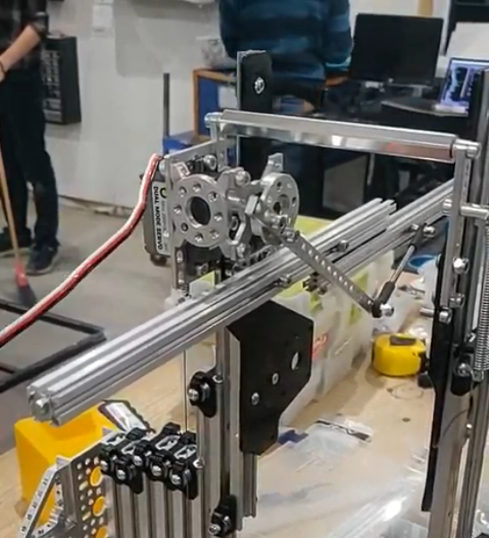
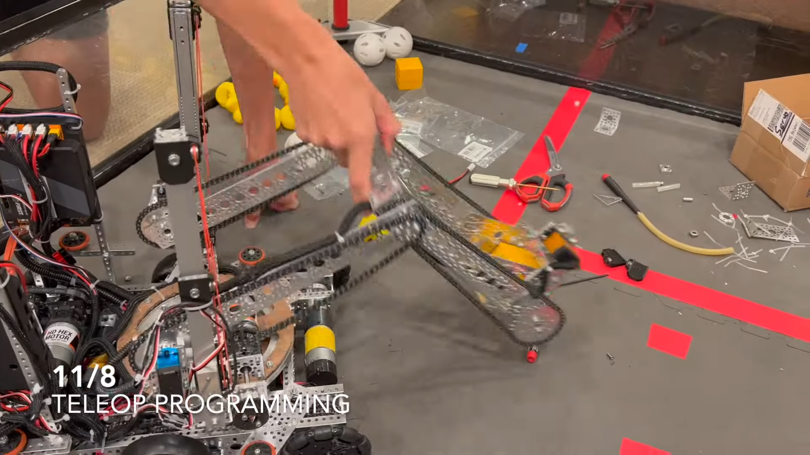

.. include:: <isonum.txt>

Linkages
========

There are many different types of linkages. Often, linkages are used to convert rotational motion, such as that from a servo or motor, to linear motion. Linkages can do this efficiently, and also have specialized movement patterns that can make them desirable for certain mechanisms.

.. admonition:: Term

   .. glossary::

      Linkage
         A system of solid links or bars connected to two or more other links by hinges, sliding joints, ball-and-socket joints, etc., so as to form a closed chain or a series of closed chains. Generally used to convert linear motion to rotational motion or vice versa.

Considerations
--------------

There are several things to consider when constructing a linkage.

- Over-centering is when a linkage is rotated past its center point (usually the point where both bars of the linkage are parallel). Driving a linkage over center can have some benefits, like making the linkage harder to backdrive. See this `informational youtube video <https://www.youtube.com/watch?v=I7iy8DCNmic>`_ for more details on this. Essentially, linkages can form a structure where pushing on the linkage moves the robot instead of rotating the linkage.
- Linkages will not have a constant linear speed or force. They generally reach a maximum speed and force when the bars are perpendicular, and the speed and force will decrease as the linkage is rotated farther.
- Cadding the linkage can be useful to check if it will do what you want it to do. See this `youtube video <https://www.youtube.com/watch?v=QsAC_seQHJY>`_ for an example of how to set up the mates in OnShape.

Common Linkage Types
--------------------

Linkage Slides
^^^^^^^^^^^^^^

A common use for linkages is to drive a linear extension. This allows for a compact method of converting the rotational motion from a motor or servo into linear motion moving a mechanism like drawer slides. Generally, a two bar linkage with multi degree ball linkage components are used to construct these linkages.

   7236 Recharged Green, Skystone

Four Bar
^^^^^^^^

One type of linkage is called a four bar linkage. This is a linkage that keeps the end bar at the same angle to the ground at all times. For example, if the end bar of a virtual four bar is parallel to the ground when retracted, it will be parallel to the ground at all times, even when rotated fully out. This is beneficial for mechanisms like claws, which you want parallel to the ground during operation. In addition, four bars can provide extension outside of the robot frame, and generally provide both vertical and horizontal extension due to the "arc" that the arm follows. Also, the construction material of the four bar can be carefully selected to save weight.

This mechanism is not widely used in FTC\ |reg| due to the space requirements. The linkage bars that keep the end bar parallel restrict a four bar to under 180 degrees of travel (less then 90 degrees in either direction) without specialized mechanical construction, and the bars also take up space in the robot frame.

.. dropdown:: CAD Example of Four Bar (Click to expand)

   .. raw:: html

      
      <model-viewer alt="goBILDA Four Bar" src="https://cdn.statically.io/gh/gamemanual0/3d-models/main/Linkages/FourBar.glb" ar ar-modes="webxr scene-viewer quick-look" autoplay seamless-poster shadow-intensity="1" camera-controls enable-pan style="width:100%; height:500px;overflow:auto; --poster-color: transparent"></model-viewer>

   `Click here to open this example in Onshape Cad, where you can click and drag parts to see how they move! <https://cad.onshape.com/documents/45549489f570f3694569a2df/w/85ff26b9fca4988ebc4df3b4/e/204f2654fb268fb556c1b7b1>`_.

.. image:: images/linkages/goBILDA-four-bar.png
   :alt: A picture of a goBILDA Four Bar

Virtual Four Bar
^^^^^^^^^^^^^^^^

The more popular alternative to the Four Bar linkage is a Virtual Four Bar. While not technically a linkage, a virtual four bar uses chains or belts to create an effect similar to a four bar, where the end effector is kept at a fixed angle to the ground at all times. Because the need for additional bars are eliminated, this "linkage" can travel more then 180 degrees, and also can take up less space then a traditional four bar linkage.

This mechanism is more widely used in FTC, as it is an easy addition to an arm to maintain the end effector's angle relative to the ground.

Note: Both chain and belt can be used to construct a virtual four bar, and there isn't a specific benefit to using either. Due to the fact that the chain doesn't have to completely rotate around the sprocket, a zip-tie can be used to tension the chain, making construction easier.

.. dropdown:: CAD Example of Virtual Four Bar (Click to expand)

   .. raw:: html

      
      <model-viewer alt="goBILDA COTS Virtual Four Bar" src="https://cdn.statically.io/gh/gamemanual0/3d-models/main/Linkages/V4B.glb" ar ar-modes="webxr scene-viewer quick-look" autoplay seamless-poster shadow-intensity="1" camera-controls enable-pan style="width:100%; height:500px;overflow:auto; --poster-color: transparent"></model-viewer>

   `Click here to open this example in Onshape Cad, where you can click and drag parts to see how they move! <https://cad.onshape.com/documents/45549489f570f3694569a2df/w/85ff26b9fca4988ebc4df3b4/e/62097ae7e6d154b9232d8957>`__.

.. figure:: images/linkages/7244-v4b.jpg
   :alt: 7244 OUT of the BOX Robotics Virtual Four Bar

   7244 OUT of the BOX Robotics, Ultimate Goal

Double-Reverse Four Bar
^^^^^^^^^^^^^^^^^^^^^^^

The double reverse four bar is an extension of the four bar linkage that allows for more extension. A double reverse four bar consists of a four bar linkage with a second four bar linkage mounted to the end of the first. This allows for purely linear extension, as opposed to the "arc" that a single four bar will take. The end effector will still stay at a fixed angle to the ground due to the purely linear extension.

This mechanism is not widely used in FTC due to the generally large space requirements needed, but is a fairly compact method of producing large amounts of linear extension. Care needs to be taken that each side of a double reverse four bar is driven equally so that issues do not arise from asymmetric lifting.

.. figure:: images/linkages/11115-dr4b.jpg
   :alt: 11115 Gluten Free Double Reverse Four Bar

   11115 Gluten Free, Skystone

Virtual Double-Reverse Four Bar
^^^^^^^^^^^^^^^^^^^^^^^^^^^^^^^

Similar to the virtual four bar, the virtual double-reverse four bar is a linkage that uses belts or chains to replace the linkage bars of the double-reverse four bar. The virtual double-reverse four bar is simply a virtual four bar where the end effector sprocket/pulley is half the size of the static sprocket/pulley, leading to a 2:1 driving ratio. Then, a bar is mounted to the end effector sprocket/pulley, and another chain/belt is run, which creates purely linear motion with an end effector that is always at the same angle to the ground. This creates much more compact linear motion then a double-reverse four bar, and can also extend in both directions.

   8644 Brainstormers, Freight Frenzy
