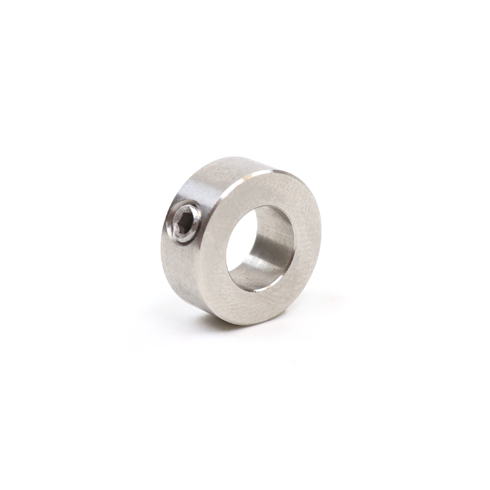
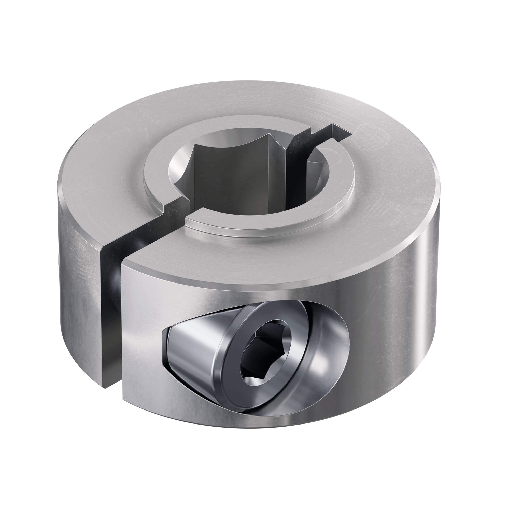
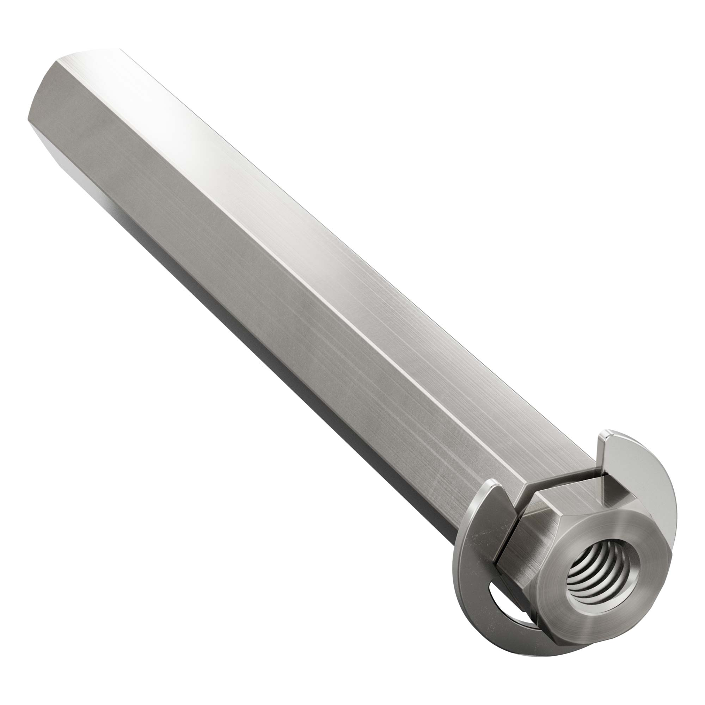

Shaft Retention
===============

If you are powering any mechanism with a :term:`live axle <Live Axle>` system, you will need a way to retain the shaft so that it does not move axially (along its length). It is necessary to constrain movement in both directions, and two methods can be mixed and matched on one shaft. Generally, this is done by having something contact the bearing's inner race that is constrained axially on the shaft. It is important to make sure the bearings themselves are also constrained.

.. note:: Make sure to use an appropriately sized shim/washer between the thing retaining the shaft and the bearing, such that it only touches the bearings inner race. Otherwise, the rubbing will lead to inefficiency.

Outlined below are some common methods FTC teams use for shaft retention.

Shaft Collars
-------------

Shaft collars are fitted onto a shaft in order to secure it. There are two primary types: set screw collars and clamping collars.

Set Screw Collars
^^^^^^^^^^^^^^^^^

Set screw collars use a set screw (typically a grub screw) to tighten down onto the shaft. While set screw collars are cheap and readily available, there are some disadvantages. The screw digs into the shaft, creating a raised burr, making it difficult to remove/adjust the collar or to use the shaft for something else in the future.

Clamping Collars
^^^^^^^^^^^^^^^^

A clamping shaft collar uses typical bolts to clamp the shaft, applying force all around the shaft instead of just in one place. They may or may not have a built-in shim to rest against a bearing race. They are generally recommended over set screw collars, especially for high-load applications. However, they do tend to be more expensive and larger.

Shaft Retaining Rings
---------------------

Shaft retaining rings clip into a groove in a shaft and provide a simple and compact way to retain it. Unlike collars, they cannot be moved along the shaft and are reliant on having a machined groove in the correct location. Many teams use E-clips, a type of retaining ring, with goBILDA's 8mm REX shafting, as it can be bought with an E-clip preinstalled.

Bolts and Washers
-----------------

When using a shaft with a threaded bore, you can use a bolt and washer on each end to retain it. It is important to use a thread locking compound to prevent the bolts from loosening over time.

.. figure:: ../drivetrains/images/holonomic/9804-hdrive.jpg
   :alt: 9804 Bomb Squad's H-Drive

   9804 Bomb Squad's Relic Recovery bot used bolts to retain its wheel shafts.
