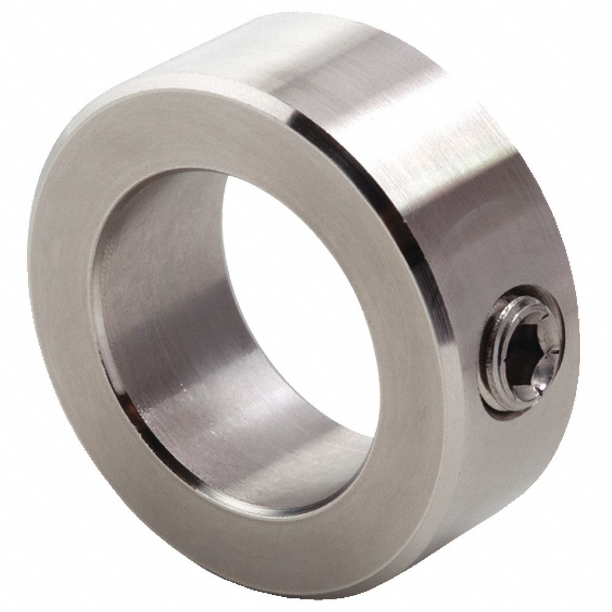
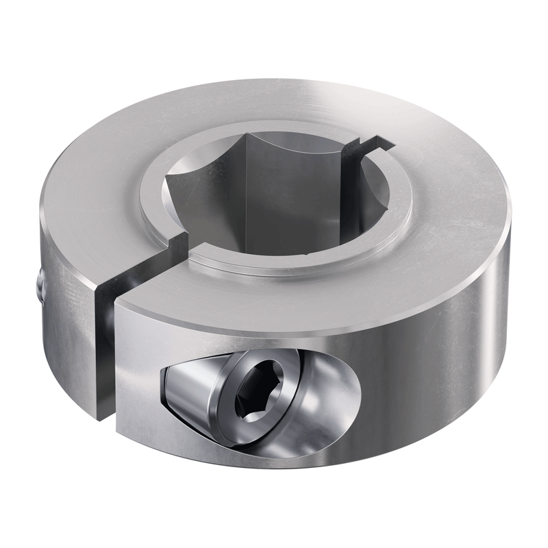

Shaft Retention
===============

If you are powering any mechanism with a :term:`live axle <Live Axle>` system, you will need a way to retain the shaft so that it does not move axially. 
Outlined below are some common methods FTC teams use for shaft retention.

Shaft collars
-------------

Shaft collars are fitted onto a shaft in order to secure it. 
There are two primary types; set screw collars and clamping collars.

Set Screw collars
^^^^^^^^^^^^^^^^^

Set screw collars use a recessed setscrew - usually a headless bolt - to tighten down onto the shaft.
While set screw collars are cheap and readily available, there are some disadvantages. 
The screw digs into the shaft, creating a raised burr, making it difficult to remove or adjust the collar.

Clamping Collars
^^^^^^^^^^^^^^^^

A clamping shaft collar uses bolts to clamp the shaft, applying force all around the shaft instead of just in one place, as with a set screw collar. 
Because of this, they are generally recommended over set screw collars, especially for high-load applications.

Shaft Retaining Rings
---------------------

.. figure:: images/shaft-retaining-rings.jpg
   :alt: a shaft with a shaft retaining ring
   :width: 30%

Shaft retaining rings clip onto a groove in a shaft and provide a simple and compact way to retain it. 
Unlike collars, they cannot be moved along the shaft and are reliant on having a machined groove in the correct location. 
Many teams use E-clips - a type of retaining ring - with goBILDA's 8mm REX shafting, which has grooves built in.

Bolts and Washers
-----------------

When using a shaft with a threaded bore, you can simply use a bolt and washer on each end to retain it. 
It is important to use a thread locking compound to prevent the bolts from loosening over time.

.. figure:: images/9804-hdrive.jpg
   :alt: 9804 Bomb Squad's H-Drive

   9804 Bomb Squad's Relic Recovery bot used bolts to retain its wheel shafts