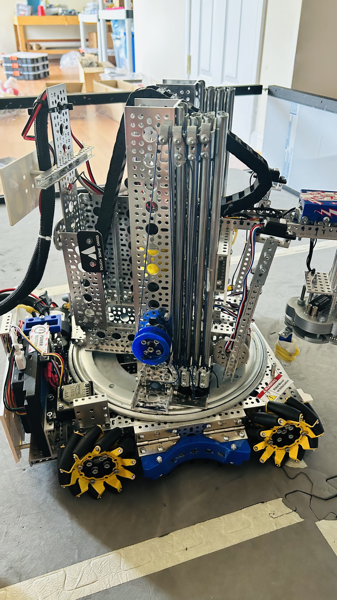
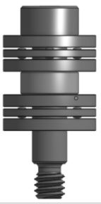

Full Turrets
============

Listed below are different techniques to implement a full turret. These mechanisms are commonly located at the base of a robot and rotate slide, arm, or shooter assemblies mounted to them.

Lazy Susan Turrets
------------------

Lazy susan turrets are based around a type of turntable called a lazy susan, which are available off the shelf.

Advantages
^^^^^^^^^^

- Lazy susans come prebuilt, meaning you don't need to design or manufacture your own platform for your turret.
- Decent lazy susans are relatively cheap.

Disadvantages
^^^^^^^^^^^^^

- Lazy susans are prebuilt, meaning they're generally harder to customize than other options.
- Lazy susans aren't designed to handle lateral forces, which means that e.g. the reaction force from a shooter could damage it.

   19818 Jade Innovations, Power Play, **lazy susan turret rotating slides**

Bearing Stack Turret
^^^^^^^^^^^^^^^^^^^^

Bearing stacks are stacks of bearings, usually consisting of a small bearing sandwiched between two large bearings on a screw shaft or standoff. A bearing stack turret has a disc that rotates smoothly because it is tangent to the small bearing on many bearing stacks, while the bigger bearings constrain the disc vertically. Usually, the small bearing is a radial bearing, while the big bearings may be thrust or radial bearings, depending on which loads the turret experiences.

   A sample bearing stack, with a radial bearing sandwiched between 2 thrust bearings on a shoulder screw. A plate (not pictured) rides on the radial bearing while being supported by the thrust bearings.

Advantages
^^^^^^^^^^

- Highly customizable, as the assembly can be designed specifically for your robot and mechanisms.

Disadvantages
^^^^^^^^^^^^^

- Requires a lot of design work and precision manufacturing capabilities to build.
- Many potential points of failure, though some bearing stacks can fail without the entire turret failing with redundancy.

.. figure:: images/18219-turret.jpg
   :alt: 18219 Primitive Data's Bearing Stack Turret

   18219 Primitive Data, Ultimate Goal, **bearing stack turret**

Center-Bearing Turrets
----------------------

Center-bearing turrets are based on a bearing (or bearings) coaxial with the turret's axis of rotation.

Advantages
^^^^^^^^^^

- These turrets are generally simpler than others, as they rotate similarly to any other mechanism on an axle.
- Do not require complex or custom-manufactured components.

Disadvantages
^^^^^^^^^^^^^

- If a radial bearing is used, thrust loads can cause significant problems. Thrust or x-contact bearings may be better suited for this task, especially in high load situations.
- Due to a bearing being in the center, unless you buy large diameter bearings (which can be very expensive), it may be hard to pass game elements (or other things) through the center. This is often relevant for shooters, where it may be desirable to load them in any orientation.

.. figure:: images/16379-turret.jpg
   :alt: 16379 KookyBotz's Turret

   16379 KookyBotz, Freight Frenzy, **center-bearing turret using an x-contact bearing**
