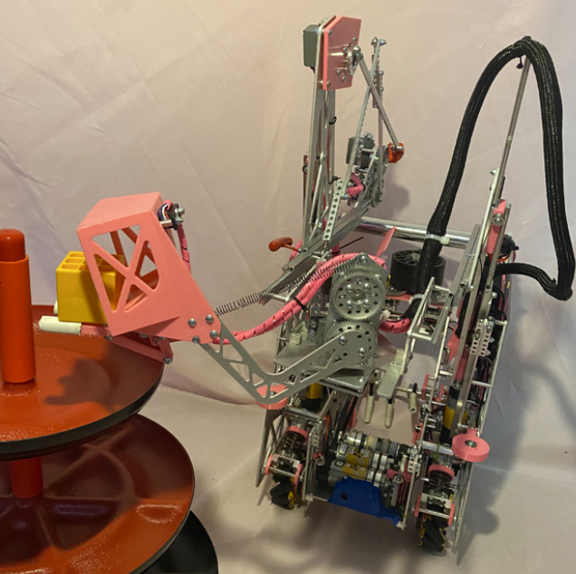

.. include:: <isonum.txt>

Mini Turrets
=====================

The following is a guide on common types of mechanisms often called "mini turrets" in the FTC community alongside their pros and cons. These mechanisms are commonly used to mount and rotate arms as part of the end effector of a different system. 
  
If you're curious about different ways this mechanism could be mounted, our guide on full turrets details common mounting methods including bearing stacks, lazy susans, and coaxial bearings.

Example
-------

   In the above image from Freight Frenzy, team 12518, Almond Robotics, is using a mini turret mounted on a coaxial bearing and powered by a servo on the end of their slide assembly in order to rotate an arm that scores that year's scoring element.

Advantages
^^^^^^^^^^

- Adjustability, having a mini turret on a robot could allow for adjustability that otherwise might not be possible. For example, if your mini turret has a scoring mechanism on it, you can rotate it in order to get a more accurate scoring attempt without having to move your drivetrain.

Disadvantages
^^^^^^^^^^^^^

- Heavier end effector, because these mechanisms are often (but not always) mounted to the end of slides, arms, or other mechanisms they usually result in heavier end effectors which could change a robot's center of gravity or a mechanism's movement speed.
