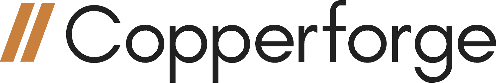

.. include:: <isonum.txt>

Contributors
============

|gm0| would not have been possible without the many contributors who have sacrificed their precious freetime (or merely found another excuse to procrastinate their work). I am especially grateful to Ben and Abi for helping port over |gm0| to Copperforge, and for all those who have continued to add and revise |gm0| during the busy school year. |gm0| had been my dream for quite some time, and as an alum tremendously grateful for all that *FIRST*\ |reg| has taught me, I wanted to create |gm0| to preserve and spread the knowledge base that might have been lost with the FTC\ |reg| class of 2019 and beyond. For this reason, I wanted to recognize all the contributors who have helped to make |gm0| a great resource for *FIRST* Tech Challenge teams. Feel free to contact any of the names listed below via the email (gamemanual0@gmail.com) or through the other contact emails - I'm sure that they would be more than willing to help you out!

**Kleptomaniac**

Managing Editors
----------------

- Tom - FTC Alum - 3736 Serious Business- seminole3736@gmail.com
- Abigail - FTC 7026 JDroids - gm0@dogbuilt.net
- Frank - FTC 8581 Aedificatores - fgportman00@gmail.com
- Justin - FTC 9656 Omega - ftc9656omega@gmail.com
- Nathanael/Kleptomaniac - FTC Alum - 13075 Coram Deo Robotics - nathanchu@utexas.edu
- Davy - FTC 16461 Infinite Turtles - davy@mcr.club

Other Contributors
------------------

- Adham - FTC 14875 LightSpeed
- Arjun - FTC 9794 Wizards.exe
- Baylor - FTC 10641 Atomic Gears
- Cole - FTC 7548 SPAREPARTS
- Cooper - FTC 19458 Equilibrium.exe
- David - FTC 2753 Team Overdrive
- David - FTC 7236 Recharged Green
- David - FTC 8680 Kraken Pinion
- Dom - FTC 15692 Rust in Pieces
- Eric - FTC Alum - 8417 'Lectric Legends
- Ethan - FTC 7236 Recharged Green - goBILDA
- Frank - FTC 8581 Aedificatores
- Frank - FTC 8581 Aedificatores
- Fulton - FTC 5143 Xcentrics
- Guineawheek - FTC Alum
- Ian - FTC 7842 Browncoats
- Jackson - FTC/FRC\ |reg| Mentor/Alum
- James - FTC 14298 Lincoln Robotics
- Justin - FTC 9656 Omega
- Karter - FTC 5975 Cybots
- Kelvin - FTC 731 Wannabee Strange
- Keval - FTC 731 Wannabee Strange/FTC 10195 Night Owls
- Kevin - FTC 9048 Philobots
- Nate - FTC 12897 Newton's Law of Mass
- Navya - FTC 7149 ENFORCERS
- Neo - FTC 6710 Sigmas
- Peter - FTC 12533 Inception
- Sam - FTC 2753 Team Overdrive
- Shurik - FTC 4137 Islandbots mentor
- Tom - FTC 3736 Serious Business
- Tyler - FRC 3184 Blaze Robotics
- Wes - FTC 3658 Bosons
- Whimsy - FTC 8417 'Lectric Legends

Hosting
-------

- Benjamin Ward - FRC/FTC Alum - Copperforge - blward@copperforge.cc

