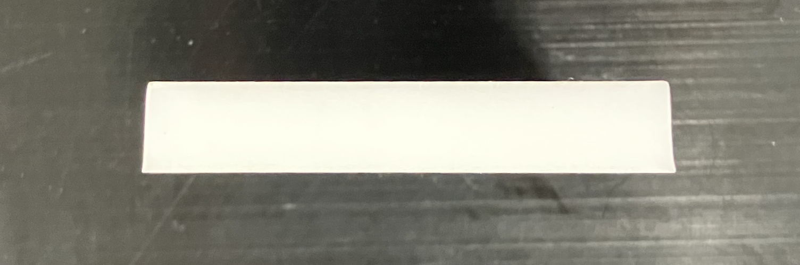

.. include:: <isonum.txt>

Laser Cutting
=============

Laser cutting can be a useful tool that allows FTC\ |reg| teams to quickly produce complex custom parts. This guide will cover the uses of laser cutting in FTC, common types of laser cutters, and how to optimize your design for laser cutting.

If your team does not have access to a laser cutter, consider checking with sponsors or local makerspaces, or using a service like `Fabworks <https://www.fabworks.com/>`_ or `SendCutSend <https://sendcutsend.com/>`_. These may have access to laser cutters that can cut more exotic materials. For example, Fabworks and SendCutSend both cut metals such as aluminum and steel, and SendCutSend specifically offers a wide variety of woods, plastics, metals, and composites. These services may also offer post-processing such as bending, tapping, and powder coating.

Common Types of Laser Cutters
-----------------------------

In general, there are three types of laser cutters FTC teams may have access to: **diode lasers**, **CO2 lasers**, and **fiber lasers**.

Diode
^^^^^

These tend to be the smallest, cheapest, and lightest duty. They move around a small (<20 watts) laser diode on an exposed gantry. Usually they can only cut paper, cardboard or thin wood. In FTC, these can be useful for quick cardboard prototypes and for engraving decorative items such as team numbers and sponsor logos.

CO2
^^^

These are typically enclosed machines, using a moving mirror to aim the light from a 30+ watt laser tube. These can cut wood and plastics, but can only mark metal. They can be very useful in FTC for custom parts.

Fiber
^^^^^

These combine beams from multiple laser diodes into a fiber optic cable and can cut metal. Desktop versions usually have a very limited working area, often just a couple inches. These are very expensive and few FTC teams have access to them.

.. warning:: These are generalizations, and are not always true. For example, some diode cutters can cut thin metals. For more information, always research your specific laser cutter.

What Can You Cut?
-----------------

As mentioned above, CO2 lasers---like those commonly available to FTC teams---can cut wood and some plastics. Some of the most useful materials you can cut with a CO2 laser in the 40 watt range are:

Wood
^^^^

Most thin wood can be easily lasercut and is great for prototypes as well as light-duty parts. For more info see :ref:`the material guide <materials-guide-plywood-and-mdf>`. Please note that some woods - such as MDF - contain glues that release fumes when cut. Oily or resinous woods may also have a heightened risk of catching on fire.

Acrylic
^^^^^^^

Acrylic is a very commonly used material for laser cutting. Due to its tendency to fracture under load, it mainly finds use on FTC bots as decorative plates or as guides to funnel game elements. For more information on using acrylic in FTC, see :ref:`the material guide <materials-guide-acrylic>`.

Delrin
^^^^^^

Delrin, also known as acetal, can be safely cut on most CO2 lasers with proper ventilation. Laser cut Delrin can be used to make everything from motor mounts to linear slide inserts to whole drivetrain plates. More information on delrin can be found in :ref:`the material guide <materials-guide-delrin>`.

What Can't You Cut?
-------------------

.. danger:: There are some materials, mostly plastics, you should **NEVER** try cutting on a desktop laser.

PVC
^^^

This emits toxic fumes which can damage your laser cutter and your lungs.

Polycarbonate
^^^^^^^^^^^^^

If you try to cut polycarbonate it will discolor and burn instead of cutting, releasing toxic fumes and potentially starting a fire.

ABS and HDPE
^^^^^^^^^^^^

These will both melt instead of cutting cleanly.

Any unknown plastic
^^^^^^^^^^^^^^^^^^^

If you don't know what a plastic is, don't take the risk of cutting it. It could potentially burn or release toxic gasses. Be careful, as some different plastics, such as acrylic and polycarbonate, can resemble each other.

.. warning:: This is not an exhaustive list and you should always research materials to ensure they will be safe before cutting them.

Design Guide
------------

.. note:: When using a sponsor, machine shop, or service like Fabworks or SendCutSend, parts may be adjusted by the vendor for you. Check with the service you are using before you make these adjustments!

There are a few quirks of laser cut parts that you should keep in mind when designing them

Kerf
^^^^

Most laser cutting software does not account for the width of the laser beam when cutting. This means if you require precise outer dimensions or hole diameters, you need to manually offset your paths in CAD.

Taper
^^^^^

As the lens in a laser cutter focuses light, it naturally creates a cone shaped beam. This leads to a beveled edge on parts. While this is usually not a problem for plates, it means pressfit non-flanged bearings may work their way out over time as they are squeezed harder at one side than another. One way to get around this is to lase holes undersized and then drill or ream them out to their final dimension to achieve vertical walls.

   Side view of a laser-cut acrylic part, showing the taper

Other Uses of Laser Cutting
---------------------------

A laser cutter can be used to precisely mark the positions of holes in a metal sheet, which can then be drilled out with a drill press to make metal plates.
