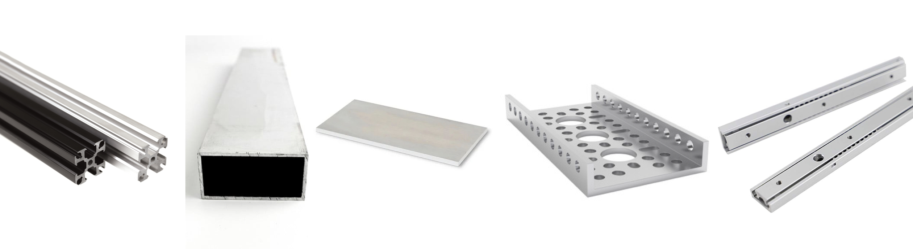
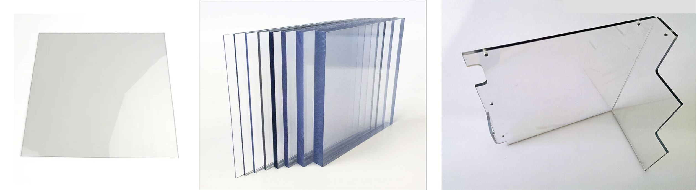
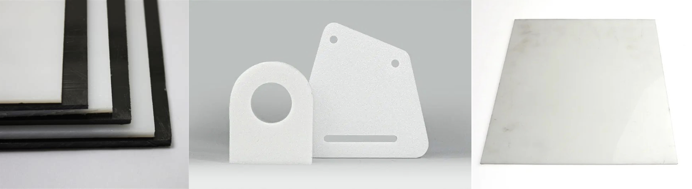

.. include:: <isonum.txt>

Materials Guide
===============

In FTC\ |reg|, teams have design freedom in terms of what raw materials to use. However, there are definitely some important recommendations regarding material usage.

Common raw materials may be found at your local hardware store. McMaster-Carr and OnlineMetals are two frequently used online vendors. For more vendors, check the Appendix.

Here are recommended materials listed in order of importance.

Recommended Materials
---------------------

- Aluminum channel & angle
- Aluminum extrusion (15 and 20 mm)
- Polycarbonate (Lexan\ |trade|)
- ABS
- Delrin
- HDPE

Conditionally Recommended
-------------------------

- Aluminum sheet
- Aluminum :term:`extrusion <Extrusion>` (1 inch)
- Plywood
- Polyvinyl chloride (PVC)

Not Recommended
---------------

- Medium-density fiberboard (MDF)
- Steel
- Acrylic

Metals
------

Aluminum
^^^^^^^^

- A high strength, medium-high density material. Suitable for use in nearly every application; recommended in load-bearing applications.
- Aluminum comes in :term:`channel <Channel>`, :term:`extrusion <Extrusion>`, flat, angle, sheet/plate, and is used in some drawer slides.

Aluminum :term:`channel <Channel>` is used in many build system kits and is very popular among teams of various skill levels. :term:`channel <Channel>` is strong yet relatively lightweight, and offers many mounting options for teams.

15 mm :term:`extrusion <Extrusion>` is compatible with M3 hardware, allowing teams to slide in bolts to their desired location. REV and MiSUMI offer 15 mm :term:`extrusion <Extrusion>`. REV :term:`extrusion <Extrusion>` is not as great structurally, but is lighter than MiSUMI :term:`extrusion <Extrusion>`. MiSUMI is more resistant to :term:`flexing and/or twisting under load <Torsional Rigidity>`. Both REV and MiSUMI :term:`extrusion <Extrusion>` are sold in bulk, and MiSUMI has the option to cut to the half millimeter. Keep in mind that a lot of :term:`extrusion <Extrusion>` can add up quickly in terms of weight.

.. admonition:: Term

   .. glossary::

      Torsional Rigidity
         Torsional rigidity refers to how difficult it is to twist an object due to an applied torque. This mainly refers to :term:`extrusion <Extrusion>`, as it is easier to twist extrusion than :term:`channel <Channel>` or an angle piece, for example.

         Torsional rigidity has consequences particularly in building drivetrains, as the drivetrain is the last mechanism on your robot that should flex or bend when weight or force is applied to it.

MiSUMI and 8020 also offer aluminum :term:`extrusions <Extrusion>` in other sizes, such as 20mm and 1". 20 mm :term:`extrusion <Extrusion>` can be a good choice if you need a sturdier frame than provided by 15mm :term:`extrusion <Extrusion>`. Note that then you would need to buy special nuts, as 20mm :term:`extrusion <Extrusion>` is not compatible with M3 nuts. 1" extrusion is regularly used as the primary building system in FRC\ |reg|, but is definitely overkill for FTC.

Aluminum flat and aluminum angle is widely available at hardware stores. In certain applications, such as adapting from different build systems, it is possible to drill custom adapter plates to mount mechanisms to the drivetrain. Aluminum angle is also a very sturdy structural support piece that takes up relatively little space, and can adapt to any build system. We suggest using 1/8" alumimum with drivetrain or mounting applications, and 1/16" aluminum for low-load situations.

Aluminum drawer slides, often with :term:`ball bearings <Ball Bearing>`, are recommended over steel drawer slides due to weight savings. Refer to the :doc:`Linear Motion section </docs/common-mechanisms/linear-motion-guide/index>` for more information.

Sheet aluminum is generally used for drivetrain plates on custom drivetrains. The recommended thickness is 1/8" or 3/16". Because it is a plate, sheet aluminum will bend if not supported correctly with :term:`standoffs <Standoff>` or :term:`channel <Channel>`. Only load the sheet in the plane that it is in (if the sheet is vertical, then only put vertical load on it; do not load it horizontally). However, there may be some applications that would benefit from a slight bit of flex for adjustability - in those cases, use your judgment and test it out for yourself!

Steel
^^^^^

- Steel is unnecessarily heavy for FTC structure. Aluminum provides plenty of strength at a fraction of the weight, and doesn't require welding.
- The proper uses of steel in FTC are in shafts (most are made out of precision-ground stainless steel) and gearboxes.
- Steel drawer slides can be used, but aluminum slides are highly recommended.

Plastics
--------

Lexan
^^^^^

- Polycarbonate, commonly known by its brand name Lexan, is a material that is great for applications such as drivetrain plates or intake collector boxes.
- Lexan can bear load and is very impact-resistant.
- Lexan is commonly used in intake and deposit mechanisms as it is clear, allowing the drive team to see into the intake itself, an advantage over wood.
- Thick Lexan can be used for drivetrain plates, though this is not recommended for inexperienced teams.

.. note:: Lexan is one of the most expensive materials per square foot, so make sure you have carefully planned out what you are cutting before doing so.

Thin Lexan can be bent with a metal brake or sheet bender. It is recommended for teams to use bends instead of connecting with bolts - bending tends to be much stronger than bolting as it means the part stays in one continuous piece. If a sheet bender is out of the question, it is possible to use a heat gun or camping burners to heat up the Lexan in order to bend it. This is not recommended as it can cause injury and bubbling if the Lexan is overheated. Alternatively, "cold bending", bending along a straight edge without applying heat can work for thinner sheets.

ABS
^^^

.. figure:: images/materials-guide/abs-banner.jpg
   :width: 100%
   :alt: Various ABS plates

- ABS is a hard low-friction plastic that is easily machinable.
- ABS sheet can be used for side panels, ramps, and even drivetrain plates.
- It is not as strong as Delrin, but strong enough for most purposes.
- ABS is cheaper than Lexan and Delrin.
- ABS can be machined using hand tools or CNC. ABS sheets can be also bent using sheet bender (recommended) or a heat gun.
- Thin (1/16 inch) ABS sheets can also be cut using shears.

.. _materials-guide-delrin:

Delrin
^^^^^^

.. figure:: images/materials-guide/acetal-banner.jpg
   :width: 100%
   :alt: Various acetal/Delrin items, including plates and three sprockets

- Acetal, also known under brand name Delrin, is a low-friction strong plastic. It is a common plastic used for wheels, plastic gears, and sprockets (especially in the REV system).
- It is a durable and strong plastic that is not easily cracked. Delrin can be used in drivetrain plates (use 1/4" or 3/16" thickness), but Delrin sheet is also quite expensive.
- Delrin can be machined in a variety of ways including laser cutting, CNC routing and hand sculpting. However, bending Delrin is much harder than bending Lexan or ABS.

HDPE
^^^^

- HDPE stands for High Density Polyethylene and usually comes in opaque white or black sheets and plates
- HDPE is a cheaper alternative with low-friction characteristics similar to Delrin and flexibility/structure near polycarbonate.
- HDPE is easily machined by both hand tools and machine tools. However, it will burn in a laser cutter, so **do not laser cut HDPE.**

Polyvinyl chloride (PVC)
^^^^^^^^^^^^^^^^^^^^^^^^

- PVC is a common lightweight plastic ubiquitous at any hardware store.
- PVC is most commonly sold as pipe, though PVC sheet does exist.
- FTC teams generally use PVC in order to customize intake rollers, especially for surgical tubing intakes. Due to the soft plastic, it is very easy to drill through, so teams often attach the surgical tubing to a PVC pipe. The PVC roller will then be attached to the intake motor.
- Since PVC is cheap, teams can easily experiment with different mechanism configurations.
- PVC pipe is sometimes used in cable management to run wires through, as it comes in different diameters and can easily be mounted.
- PVC sheet can be bought or made by cutting vertically along the pipe so that the profile looks like a C. Bake in oven. PVC sheet is pliable yet sturdy, making it a good option for backstops or customizing connectors that require some sort of flex.

.. _materials-guide-acrylic:

Acrylic
^^^^^^^

.. warning::

   Acrylic is not a load-bearing material. It will crack and possibly shatter under impact.

   Do not use it on drivetrains by any means!

- Acrylic is a transparent thermoplastic commonly known as Plexiglass.
- As acrylic is not a structural material, it should only be used in mechanisms where there is no chance of shock impact.
- It may be used for aesthetic purposes or as shielding (to protect game elements from falling into the robot or from other robots tangling with wires, etc.)
- Treat acrylic as fancy clear cardboard - it cannot be loaded and should only be used in very specific circumstances.

Other
-----

.. _materials-guide-plywood-and-mdf:

Plywood and MDF
^^^^^^^^^^^^^^^

- A medium to high strength material suitable for use in a wide variety of applications. Keep in mind that wood cannot be exposed to water or excessive humidity, as lumber for use in FTC isn't treated and may warp or expand. Do not try to use laser cut wood for a drivetrain. This is especially important if you live in a humid region such as Florida - wood expanding can completely ruin a custom drivetrain.
- Baltic Birch is the highest grade plywood, used in commercial applications and furniture. It contains 8+ layers (usually), is extremely dense, and is recommended for high-load applications or structure. It is quite an expensive material, so prototype and plan carefully before cutting.
- Plywood is not recommended for final iterations, but can be a cheap prototyping material. It doesn't bear load especially well and can flex quite a bit.
- MDF is generally discouraged as there are better options and absorbs water easily.

Carbon Fiber
^^^^^^^^^^^^

.. danger:: **Machining carbon fiber, like any fibrous substance, is a significant SAFETY HAZARD! Carbon fiber dust especially can cause cancer and is incredibly dangerous. DO NOT MACHINE/CUT carbon fiber unless you know what you are doing. When you do, make sure to either use machinery that is designed to cut carbon fiber, or cut in a well ventilated area with sufficient respiratory protection and running water over the carbon fiber.**

- Carbon fiber is one of the strongest materials for FTC use. For most teams, it is totally overkill, but it can be used in some specific applications.

  - Carbon fiber rods are used in custom linear slide extensions or multi-axis arms.
- It is probably the most expensive material to purchase.

Cardboard
^^^^^^^^^

**Please do not use cardboard as a load-bearing material.** We have seen too many teams use cardboard in ways that it shouldn't be used. Treat cardboard as a sheet of paper: it has no structural rigidity and only should be used as guides to channel pieces from A to B.
