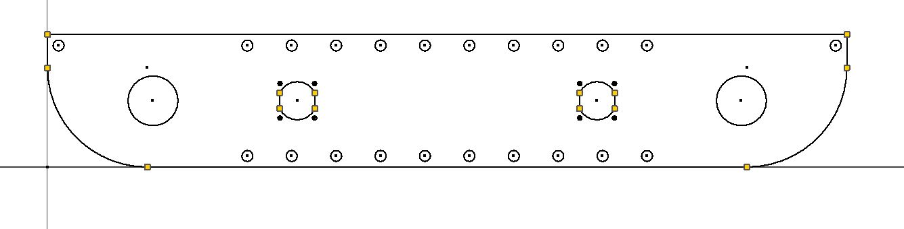
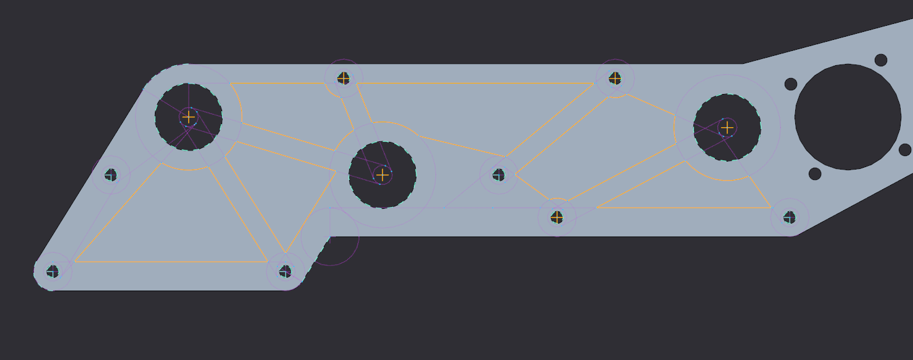
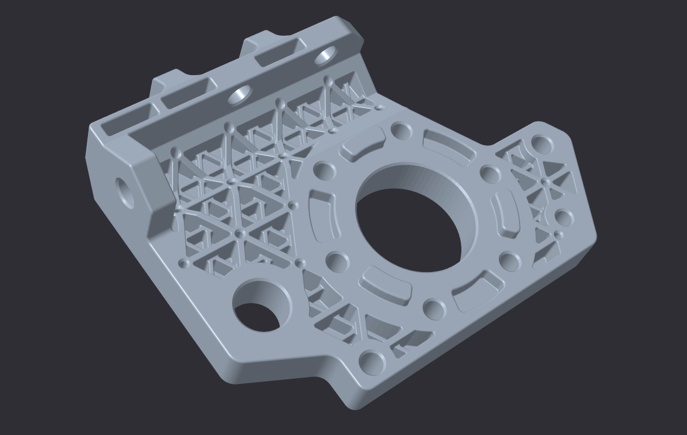

.. include:: <isonum.txt>

CAD Tutorials
=============

CAD Tutorial Part 1 - Drivetrain in an Hour
-------------------------------------------

Choosing the Drivetrain
^^^^^^^^^^^^^^^^^^^^^^^

After learning your :term:`CAD <Computer-aided design (CAD)>` program of choice, determine the necessary requirements for the drivetrain based on the current game. Teams should shoot for the wheelbase that works the best in that specific field's layout.

For instance, in Relic Recovery (2017-2018) a drivetrain required precision to not only grab glyphs from the center pit, but also to line up against the cryptobox. Thus, mecanum wheels and a wide center section of the robot proved an advantage over a 6 wheel tank drive. (However, it should be noted that with sufficient practice and competent drivers, any drive base can be competitive up to a certain extent).

After selecting a drivebase, determine the number of motors. Keep in mind the eight motor limit is a pain that shouldn't be ignored. A good rule of thumb is four motors for driving and four motors for the other mechanisms (e.g. intakes, linear slides, arm, etc.) For most modern FTC\ |reg| games, you need minimum 7 motors to be highly competitive, although 8 is a good rule of thumb.

Designing the Drivetrain Plates
^^^^^^^^^^^^^^^^^^^^^^^^^^^^^^^

After learning the CAD software, it's time to start the actual design. Here are some things to figure out before starting:

- Drive Type (mecanum, 6wd, 8wd, etc.)
- Number of Motors (four motors recommended in most cases)
- Type of wheels (:term:`Traction <Traction Wheel>`, :term:`omni <Omni Wheel>`, etc.)
- Drive power (:term:`belt <HTD Belt>`, :term:`chain <Sprocket>`, :term:`gear <Gear>`)

To keep it simple, this example uses a 4 wheel tank drive using four motors. The wheels selected are 2 Colson wheels for traction, and 2 omni wheels to aid in turning.

First, make the left side of the drivebase. After completing it, all you have to do is mirror the left side to the right, so you don't have to do each side individually. Start with a 2D sketch of everything before trying to extrude and make actual 3D objects.

.. image:: images/cad-tutorial/drivetrain-in-an-hour/dt-inner-plate-technical-drawing.jpg
   :alt: Drivetrain Plate Technical Drawing
   :width: 100%

This is a sketch of the inner plate of the drive base. Everything should be laid out in a 2D sketch to determine the mounting holes, :term:`bore <Bore>`, :term:`center-to-center distance <C2C>`, etc. 2D sketches are extremely helpful and are highly recommended in any project. After the sketch is completed, everything else falls into place and becomes pretty simple.

After this, extrude that sketch into the first plate of the drivetrain. Typically, a standard thickness of aluminum plate is 1/8". Thinner plate (3/32") can be used as well, but generally most teams stick to 1/8". Extrude the plate to that thickness. Below is the sketch after extruding.

.. image:: images/cad-tutorial/drivetrain-in-an-hour/dt-inner-plate.jpg
   :alt: Inner Drivetrain Plate

The next step will be making the outer plate for the drivebase. It is even faster to do than the inner. To do this, simply create a new part. Go back to your inner plate and start a 2D sketch.

.. image:: images/cad-tutorial/drivetrain-in-an-hour/dt-inner-plate-ui-chrome.jpg
   :alt: Drivetrain Plate, with entire face seleected
   :width: 100%

After starting the new sketch on the inner plate, hit "Project Geometry" and just click anywhere on the part. It should highlight every outline of the part. (Shown here is a yellow line; yours might be red, blue or some other color.) Now click and drag across the part selecting every line on the screen. Now go hit CTRL + C, then go to the new part and hit create 2D Sketch. Next hit CTRL + V.

It should look like an exact copy of the inner plate but now as a sketch. Delete your motor mounts out of the middle, then extrude the outer plate.

.. image:: images/cad-tutorial/drivetrain-in-an-hour/dt-outer-plate.jpg
   :alt: Outer Drivetrain Plate

This is what the outer plate looks like, an almost exact copy of the inner one without the holes for the motors. Now with those two plates made, it's really just time to assemble the rest of the drivetrain, which is by far the most time consuming. Now, for some info on what to use to attach the two plates together, generally standoffs or churro is highly recommended. To attach the two halves of the drivetrain, use either channel, extrusion, or a custom u-brace. Some teams prefer a custom brace as it is a good way to stiffen up the drivetrain while requiring very little maintenance over the season. It is possible to use peanut extrusion or kit channel, which alternatively works just as well.

Note that when using a custom drivetrain, you can cut out material from your drivetrain plates. This process is called **pocketing**. While not a vital step, pocketing helps you save weight. However, be careful not to remove too much material; if done, the plates become less sturdy. More about pocketing is in the next section.

Additional Considerations
^^^^^^^^^^^^^^^^^^^^^^^^^

Powering wheels can be done is a couple different ways through either belts and pulleys, chains and sprockets, gears, or even powered directly from the motor. Direct drive and chains are the simpler of the options, with direct drive not needing a calculated distance at all just have to set the motor exactly where the center of the wheel is. Chains allow for a little bit of slack not needing an exact center to center distance in the wrap like belts and pulleys do. Finally gears which need to be a certain distance apart from each other to mesh properly and not skip or bind.

Mounting motors is done in a plate style by face mounting the motor into the innermost drivetrain plate. It can also be done by mounting the motors to a 3rd plate, located in between the outside and inside. This allows for the motor to take up less space in the middle of the robot, but adds complexity. Motors should always be as low as possible and depending where you want the center of mass, either the middle or towards the back of the robot. It is also worth keeping in mind the type of power transmission and the expediency of doing so in light of the motor placement.

Ground clearance is all dependent on if there are any obstacles on the field, as well as what your team wants to do in that game in regards to said obstacles.

For example, in Rover Ruckus some teams with tank drivetrains decided to enter the crater. Therefore, they left enough space to not beach themselves on top of the crater, a common mistake that inexperienced teams often make.

Other teams decided to ignore driving over the crater and decided to reach over with an arm or slide system, which meant they didn't need a lot of ground clearance for their drivebase.

Typically, anywhere from .25 inches of clearance to .5 inches (if you want to be safe) on a completely flat field will allow for the weight of the robot to push into the foam tiles. Nothing else from the robot should touch the ground.

Something you can do is set the robot in CAD onto a field. Set up obstacles such as the crater and simulate driving over the crater by moving it across like you think it would in the real world.

If either of the plates intersect with the obstacle, add some more clearance so you don't get beached like a sad whale.

A general rule of thumb for most teams is the wider the intake, the better the chance of picking up the game piece. However, this is super game dependent. If you need to pick up a 6" cube like in Relic Recovery then you would not need 14" of space for your intake.

However, if you need to pick up a ball like in Velocity Vortex, the bigger the intake gives you better chances of grabbing the balls. Keep this in mind when designing drive pods - try to keep them as thin as possible without sacrificing rigidity and strength to maximize space for other mechanisms and wiring.

Connecting your two plates together is really simple. Some standoffs or churro extrusion from AndyMark is a relatively easy way to connect them together with a few bolts. Just make a few 1/4 in. holes in your sketch where you want the churro tube to be. Decide how long the churro needs to be. Remember to leave enough space between the plates for your wheels, pulleys, sprockets, and spacers. You don't need to go overkill on how many standoffs you need in between your plates; however, put them in strategic places where support is needed.

Shown below is a drive pod, which is one half of the drivetrain, including the shafts, bearings, wheels, motors, belts, etc. In short, the drive pod has everything that will be built in real life. This particular one is the left side, but to make the right side create an offset plane, select the mirror tool, then hit mirror.

.. image:: images/cad-tutorial/drivetrain-in-an-hour/drive-pod.jpg
   :alt: Left side drivetrain pod

After mirroring the drive pod to make your opposite side, connect those two halves together and you're done with the drivetrain. Below is a rendering of the complete drivetrain in CAD.

.. image:: images/cad-tutorial/drivetrain-in-an-hour/dt-render.png
   :alt: Left side drivetrain pod

CAD Tutorial Part 2 - Pocketing Guide
-------------------------------------

.. admonition:: Term

   .. glossary::

      Pocketing
         "Pocketing" is a common term in FTC and FRC\ |reg| lingo that refers to cutting out excess material from a CAD designed part. Pocketing helps to reduce weight and can increase strength of a part. This may seem counterintuitive (how can removing material strengthen a part?) but pocketing can reduce stress buildup, especially at corners.

         Pocketing is often seen on drivetrain sheet metal plates which will be CNC machined. In FRC, pocketing is often used to reduce weight of the rectangular aluminum tubes.

There are several ways to machine pockets into material including milling, routing, water jet cutting, laser cutting and even hand drilling. Depending on your access to tooling, pocketing can be more or less difficult for you.

CNC milling and routing excel at pocketing aluminum box tubing, whereas water jet and laser cutting excel at pocketing plates. Whether pocketing on box tubing or plates, the design is fairly similar.

When designing pockets, **it's important to consider the type of material, thickness, and how much stress will be on the part**. Materials that are weaker, thinner or under significant stress should have less "aggressive" pocketing and materials that are stronger, thicker or under less stress can have more "aggressive" pocketing. Aggressive pocketing refers to the amount of material removal from the blank part (more aggressive = more material removal).

Although a bit complex to understand, FEA (finite element analysis) can be used to determine appropriate strut thickness when pocketing. FEA can be used to generate pocketing geometry, but that is an entirely different rabbit hole.

.. figure:: images/cad-tutorial/pocketing-guide/fea-on-plate.png
   :alt: FEA of inner drivetrain plate

   731 Wannabee Strange, Rover Ruckus, FEA of inner drivetrain plate

Designing concise and advantageous pocketing is as simple as drawing circles and tangent lines. Parametric pockets can be defined by one or two offset values. The offset values determine the thickness of the remaining material.

Parametric means that the entire sketch is defined by a parameter, in this case is the offset value which when adjusted will automatically adjust the entire sketch (in terms of material thickness).

There are several references that can be drawn on every plate/tube which are screw holes, bearing holes, and corners. Each reference will get its own construction/sketch circle or two. Ideally all of the construction circles are one of less than 4 sizes to keep the pocketing consistent and simple.

First are the screw hole construction circles with radius of the screw hole radius plus the offset value. Next are bearing holes with radius of bearing hole radius plus offset value. Then are edges with construction circles with the radius of an offset value. Then the most important circles are at each of the screw and bearing holes, which will define the strut thickness.

The circles at the center of each screw and bearing hole will have the diameter of an offset value. After all of the construction circles are drawn, tangent lines can be drawn to create the pocketing geometry. Using the parametric offset value will make it easy to adjust strut thickness by just changing one or two values.

Tangent lines are drawn between the circles on the edges with other circles on edges and between the circles at the center of each bearing and screw hole. The circles with radius of bearing hole and screw hole plus offset value make sure that there is enough material around the bearing and screw holes. An example is below.

.. image:: images/cad-tutorial/pocketing-guide/outer-mechanism-plate2.png
   :alt: Outer mechanism plate with all functional geometry

.. figure:: images/cad-tutorial/pocketing-guide/outer-mechanism-plate3.png
   :alt: Outer mechanism plate fully pocketed

   731 Wannabee Strange, 2019 Summer VCC Cadathon, Outer Mechanism Plate

The last step in pocketing is adding rounds to each and every corner, especially inner corners. Rounds relieve stress buildup at corners and make it easier to machine. Some machines, such as mills and routers, are also unable to machine tight internal corners. For those parts that need minimum rigidity loss and a lot more machine time on their hands, pockets don't need to be cut all the way.

:term:`Waterjet cutters <Waterjet cutter>` and :term:`laser cutters <Laser cutter>` are only able to cut material all the way through, but routers and mills are able to make surface pockets. These pockets don't go all the way through the material and are multitudes more rigid than thru pocketing.

The downside is increased machining time. The increased time is from the "lawn mowing" tool cutting path verses simply cutting the edges of the geometry. It is also more difficult to machine, because more material is milled out and chip ejection becomes more important.

.. figure:: images/cad-tutorial/pocketing-guide/outer-mechanism-plate-surface-pocketing.png
   :alt: Outer mechanism plate surface pocketed

   Surface Pocketing Example

If you don't have access to any precision tools, a hand drill/drill press and large drill bit/flat bottom boring bits can create pockets in material. Although this is the simplest form of pocketing, there is a straightforward way to optimize the circular drill method.

Since the main goal of pocketing is to remove as much material as possible without significantly sacrificing the structural stability, the holes need to be drilled in specific positions with the right size bit.

The most effective way to find the specific positions and drill bit sizes, is to first create a pocketing design as you would do with circles and tangent lines. Then draw holes tangent to the struts created by the circles and tangent lines. An example is below with the orange as the holes to drill positioned tangentially to the regular pocketed edges.

.. image:: images/cad-tutorial/pocketing-guide/outer-mechanism-plate-tangent-circles.png
   :alt: Outer mechanism plate showing the tangent circles between the pockets

.. figure:: images/cad-tutorial/pocketing-guide/outer-mechanism-plate-drill-pocketing.png
   :alt: Outer mechanism plate showing optimal drill pockets

   Optimal Drill Pocketing Method Example

Although it may look like a random mess and it may take a while longer than just randomly "cheese holing", this method will yield the greatest weight reduction to structural rigidity loss ratio using the drill pocketing method.

A very important tip to pocketing is to do it last when designing a part. Parts should not be designed around the pocketing pattern, rather the pocketing should be designed around the part. If there are too many holes in a part, or the part is too small to be pocketed with an offset value, then it's probably not worth it to pocket.

Pocketing can reduce part weight, but when using traditional machining methods can take a significant amount of extra time. Although, when adding pockets to parts that are going to be 3D printed, it can in some cases decrease print time as well as material used.

The pocketing method above is the simplest parametric method to pocketing, but more complex methods exist. For instance, the image below is an example of a complex double iso-grid pocketing pattern optimized for metal 3D printing.

   731 Wannabee Strange, Rover Ruckus, Arm Pivot Mount

When the pockets are designed around a 3D printed part, many new possibilities open up in terms of minimum inner corner radius, resolution and dimensions. Now of course, 3D printed parts can be pocketed in the same way as traditional parts with similar results.

CAD Tutorial Part 3 - Custom Pulley Template
--------------------------------------------

When designing methods of power transmission, it's useful to have an adjustable pulley generator to rapidly rearrange C-C (center to center) distance for design changes. Typically, FTC teams use the HTD5 belt profile due to its deep tooth profile, which adds resistance to slipping and increases load capacity. This tutorial will focus on the HTD5 profile, but it is relatively easy to adapt for different profiles.

To make the pulley fully parametric (adjustable without redoing the base sketch), we will use Equations (in Solidworks and Creo), Parameters (Fusion 360 and Inventor) or Variables (Onshape). Equations allow a user to quickly adjust values and change multiple dimensions in a sketch or feature.

.. image:: images/cad-tutorial/custom-pulley-template/equations-view.png
   :alt: A screenshot of the "Equations, Global Variables, and Dimensions" view
   :width: 100%

First, define a new variable "n" and set a default value of 24. This is crucial since "n" will affect the number of teeth, which will define the angle between teeth and the circular pattern.

Copy the sketch below.

.. image:: images/cad-tutorial/custom-pulley-template/sketch-to-copy.png
   :alt: The sketch to copy

- The 15\ |deg| equation is done by typing =360/"n" into the text box.
- Note that 5mm dimension at the top describes arc length, which is done in Solidworks by first selecting the two points and the connecting arc.
- The two big circles are tangent to the two smaller circles, but the two smaller circles are not tangent to each other.

Leave this sketch as a reference and use "Convert Entities" to create sketches for additional features.

.. image:: images/cad-tutorial/custom-pulley-template/pulley-profile.png
   :alt: The profile of the pulley

Next, extrude the outer bold circle. Cut-extrude the profile in the reference sketch. Do these features separately.

.. image:: images/cad-tutorial/custom-pulley-template/circular-pattern.png
   :alt: A screenshot of the tool to create the circular pattern of the next step

Now, just create a Circular Pattern. Define Direction 1 as the top face and create "n" instances of the cut-extrude feature.

.. image:: images/cad-tutorial/custom-pulley-template/dimensioned-pulley.png
   :alt: The CAD of the pulley with dimensions

Now just sketch on the side plane and sketch the flanges. This is up to you, but I prefer to keep the outer point vertical to a point pierced through the outer circle. That way, the flange changes with respect to "n".

.. image:: images/cad-tutorial/custom-pulley-template/complete-pulley.png
   :alt: The complete CAD of the pulley
