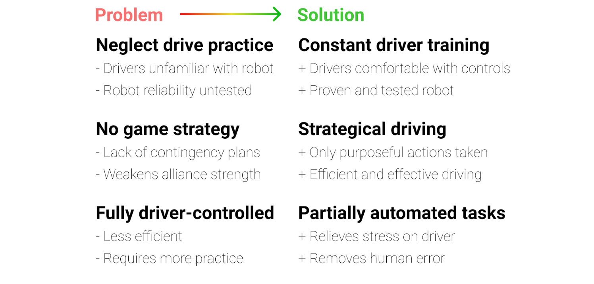

============================
Rookie Mistakes: Competition
============================

+---------------------------------+-------------------------------------+
|           **Problem**           |            **Solution**             |
+=================================+=====================================+
| **Neglect drive practice**      | **Constant driver training**        |
|                                 |                                     |
| * Drivers unfamiliar with robot | * Drivers comfortable with controls |
| * Robot reliability untested    | * Proven and tested robot           |
+---------------------------------+-------------------------------------+
| **No game strategy**            | **Strategical driving**             |
|                                 |                                     |
| * Lack of contingency plans     | * Only purposeful actions taken     |
| * Weakens alliance strength     | * Efficient and effective driving   |
+---------------------------------+-------------------------------------+
| **Fully driver-controlled**     | **Partially automated tasks**       |
|                                 |                                     |
| * Less efficient                | * Relieves stress on driver         |
| * Requires more practice        | * Removes human error               |
+---------------------------------+-------------------------------------+

Neglect driver practice → Constant driver training
==================================================
.. important:: A persistent problem with new teams is neglecting driver
    practice.
    Drive practice is to be done throughout the season,
    **not the week before competition.**

No matter how good your robot is, the robot is only 50% of the equation.
The driver(s) is the other 50% which determine the success of the team as a
whole.
Even if your robot is the best in the world,
an inferior robot with a competent drive team more than likely will beat your
robot with a poor drive team.
By April's world championships, most top teams have run hundreds of
practice matches.

This gives some obvious advantages compared to a team with lesser practice.

1. The driver(s) is totally familiar with handling the robot in every
   situation.
2. The robot is proven to be reliable enough to survive hours of operation.
3. The immense data that teams gather from test runs are used to optimize every
   element of the robot.

Driver practice not only familiarizes the driver(s) with the robot and serves
as a test of robot reliability, it also simulates in-game conditions.
**Learning to push the limits of your robot should be done in practice,
not at competition.**
This way, drivers will become more comfortable driving under stress and
pressure.
Teams with intensive driver practice will purposely make things more difficult
(such as placing a disabled robot in the middle of the field or unplugging a
drivetrain motor).
Extreme, you might say?
No, it's called preparedness.
If your driver doesn't know how to react, then you need more drive practice.

No game strategy → Strategic driving
====================================
Similar to drive practice,
this is something that many inexperienced teams ignore.
A sports example is handy - even with the most talented players,
a team won’t go far without good game strategy.

.. important:: A less capable team with better strategy execution can often pull
    off an upset.
    Planning a strategy ensures that every second in the 2:30 game time is used
    to maximum efficiency, which yields maximum points.

For example, drivers should know exactly where the robot needs to be positioned
after the autonomous → tele-op switch.
Practicing this switch will save a couple of seconds when drivers have to think
“what do I do now?”
In very competitive matches, these few seconds may be able to gain your team an
extra cycle.
Knowing when to transition from a tele-op to endgame objective is equally
important (hint: perfect one first) and will save valuable time.
Strategy should **always be used to maximize points** - whether this is a
positioning strategy to access the game elements, or a defensive strategy to
hinder the other alliance from scoring.

.. tip:: Remember, denying the other alliance 10 points is the same value as
    scoring 10 points.

*However, it is not advised for rookie teams to play defense* due to the
specific rules surrounding this strategy.
If a team wishes to execute a defensive strategy, be sure to read all the rules
as defense can easily incur penalties/cards if done improperly.

Fully driver-controlled → Partially automated tasks
===================================================
.. important:: Autonomous should not be limited to only the autonomous mode.
    Automating simple tasks can be a real time-saver and efficiency boost to
    teams.

1. Automating tasks can save time and reduce the need for driver multi-tasking.
   Drivers should always be controlling the robot with as few button presses
   as possible.
   For example, automatically stopping the intake mechanism when game elements
   have been collected saves a button press.
2. Autonomously operating some mechanisms has the advantage of eliminating
   driver error and relieves stress.
   For example, if a lift has to extend to exactly 30 inches,
   a motor with an encoder can complete that with 100% accuracy at full speed,
   compared to a human driver's minor error.

.. note:: Autonomous functions should be able to be overrided by manual input
    in case something goes wrong
    (e.g. encoder is unplugged, a part breaks, etc.)
    to prevent damage to the robot and to be compliant with game rules.
