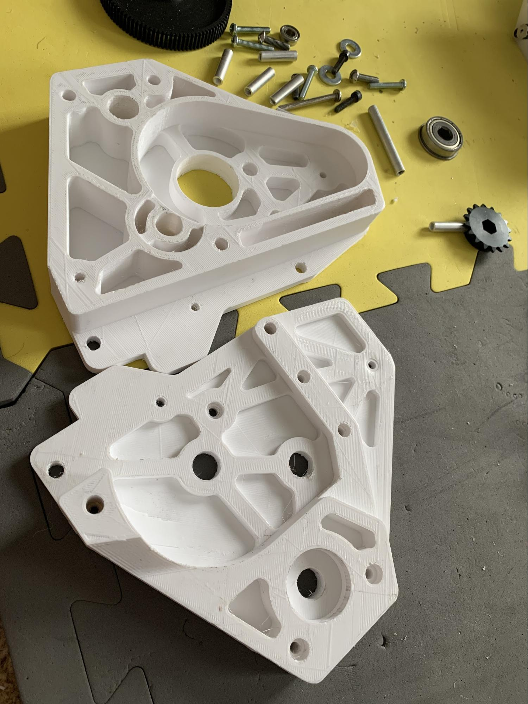
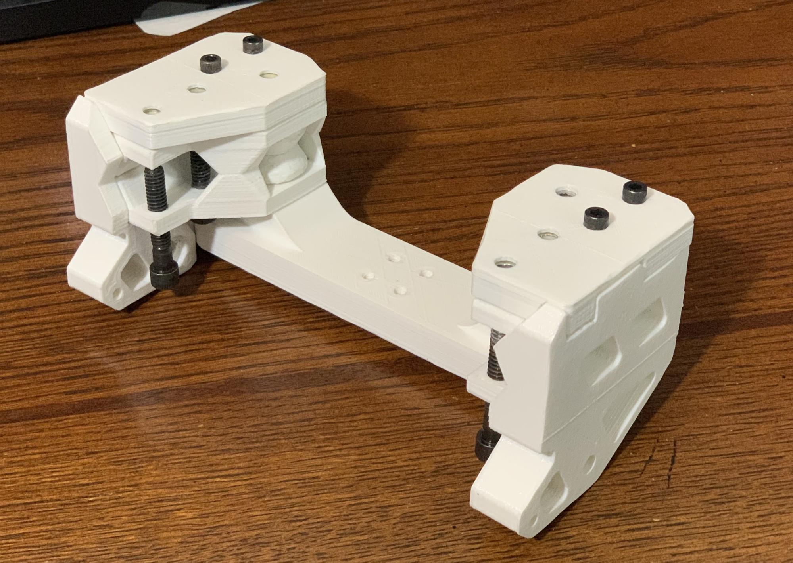

.. include:: <isonum.txt>

3D Printing
===========

Kinds of 3D Printing
--------------------

There are a few different kinds of 3D printing. FDM (Fused Deposition Modeling) (also known as Fused Filament Fabrication) extrudes a melted filament to create a part and is the most common type and the one we’ll focus on in this guide. SLA (stereolithography) and SLS (Selective Laser Sintering) are both options for 3D printing plastics, but they are generally more complex, expensive, or hold other disadvantages in FTC applications. For those reasons, they are not recommended.

Metal 3D printing (SLS and others) is also becoming more and more available, but is not in the scope of this guide.

Advantages of 3D Printing
-------------------------

- **3D printing allows teams to have customizable strain relief on wires and connections. This is a great project and well worth your time.**
- 3D printing allows for customizable sizing and perfect optimization; for example, teams can print a spool of the exact diameter needed for optimal speed.
- 3D printing allows teams to adapt between kits and individual parts easily, as not all kits have adaptable mounts or brackets. A good example of this are the Nexus :term:`mecanum <Mecanum Wheel>` bore adapters that teams 3D print.
- 3D printing allows teams to fabricate parts that would otherwise be impossible with materials such as aluminum due to machining restrictions.

Disadvantages of 3D Printing
----------------------------

- **If you are out of 3D printed spares at a competition, you’re probably out of luck. Teams are advised to print at least one set of every single 3D printed part as spares for competition**.
- 3D printed components are generally weaker than other materials such as aluminum. However, printing in the proper orientation can be very strong - teams have 3D printed hooks and other parts to support their FRC\ |reg| robot (120 pounds) and FTC robots (40 pounds).
- 3D printed parts should only be loaded in one orientation. That is, if the robot is hanging from a hook, the only load should be on the bottom face of the curved part of the hook. Try to eliminate side loads as much as possible to avoid part failure.
- The size of 3D printed parts is limited by the size of your print bed.
- Large and thick prints can take a long time (overnight) to print and can run the risk of failure.
- 3D printing can end up quite expensive, though filament can be found for a reasonable price on online vendors such as Amazon.

Common Filament Types
---------------------

PLA (Polyactic Acid)
^^^^^^^^^^^^^^^^^^^^

PLA is a common filament that does not require a heated bed. PLA is stiff but more brittle than other filament options and tends to have little to no warp when printing. PLA can be used in most robotics applications, but it does not hold up to stock loads (impacts to parts) as well as some other options, and as such parts should be designed accordingly.

- PLA hotend temperatures range from 190°-220° C
- PLA bed temperatures range from 20°-60° C

ABS (Acrylonitrile Butadiene Styrene)
^^^^^^^^^^^^^^^^^^^^^^^^^^^^^^^^^^^^^

ABS is another very common filament that can withstand higher temperatures than PLA. It is less brittle and more ductile than PLA, making it better for 3D printed parts that may be under load. Typically, ABS is used in higher-load applications such as 3D printed bores for mecanum wheels. It can be more difficult to print, however. And often requires an enclosure to help increase the ambient temperature of the print environment.

- ABS hotend temperatures range from 230°-250° C
- ABS bed temperatures range from 100°-120° C

PET/PETG (Polyethylene Terephthalate)
^^^^^^^^^^^^^^^^^^^^^^^^^^^^^^^^^^^^^

PET/PETG can be described as a mix of PLA and ABS. It is not as impact-resistant as ABS, and not as stiff as PLA, but it can withstand higher temperatures (it will hold shape in a hot car unlike PLA). It is comparable in printing difficulty to PLA and can be printed on most printers out of the box. It is a great option for many FTC parts.

- PETG hotend temperatures range from 230°-260° C
- PETG bed temperatures range from 60°-80° C

Exotic Filaments
----------------

Many filaments can hold advantages over the more common filament options, though they are almost always being more difficult to print.

Carbon Fiber-filled
^^^^^^^^^^^^^^^^^^^

Many filaments are also sold with the addition of small chunks of Carbon Fiber mixed into the filament itself. This generally makes the filament stiffer but can make it more brittle. Carbon Fiber-filled filaments generally require higher temperatures, and a hardened steel nozzle, but if you can print the pure variants of those filaments, you should be able to print their CF counterparts.

Nylon
^^^^^

Nylon filaments can be glass-filled, carbon fiber-filled, or pure. These have very good impact resistance and can be used for parts like drivetrain wheel covers and other parts that experience high shock loads. Nylon is the king of impact resistance in many situations where the part can flex out of the way, instead of completely breaking. Nylon requires very high temperatures and generally requires an enclosure. It also must be dried before printing.

- Nylon hotend temperatures range from 240°-260° C
- Nylon bed temperatures range from 55°-80° C

Polycarbonate (PC)
^^^^^^^^^^^^^^^^^^

Polycarbonate and its variants are also very very strong, technical materials. PC shines in its ability to be very rigid, and handle shock loads exceedingly well. PC also requires being dry, having a printer capable of **very** high temperatures, and an enclosure. It is also a very challenging material to print.

There are several PC blends that can be much easier to print, a standout example is PolyMaker PolyMax PC. It is an easier-to-print, lower temp PC that retains many of the advantages of pure PC. PolyLite is not quite as impact-resistant, but a lot cheaper. Both are much easier to print than pure PC.

- PC hotend temperatures range from 250°-320° C
- PC bed temperatures range from 80°-140° C

Others
^^^^^^

There are a few other materials that can have very high-end benefits, and push the envelope on what 3D printing can accomplish, but should not be printed if you are not *very* confident in your printing skills, these materials include but are not limited to PEI (Polyether Imide, brand name ULTEM), PEEK (Polyether Ether Ketone), and PEKK (Polyetherketoneketone). These materials often require heated chambers, and are extremely expensive.

3D Printing Design Guide
------------------------

Here is a quick guide on designing 3D printed parts that we hope is helpful for teams who may be unfamiliar with 3D parts.

The first consideration when designing 3D printed parts is print orientation. This refers to the side that contacts the print bed. Preferably, the part should have a flat bottom to maximize contact with the print bed.

.. tip:: Maximizing contact with the print bed will make sure the part doesn’t delaminate or warp from the bed and increase print quality.

If it is impossible for the part to have a flat side to print on, a simple solution is to split the part into multiple parts along a plane. For instance, the gearbox plate below didn’t have a flat side to print on, so it was split in half. The part was later sandwiched with numerous screws and plastic glue. If this plate was printed as one part instead of split in half, support would have to be used to create all of the necessary holes. Parts that use no support material make sure that the least amount of plastic is wasted.

.. tip:: Don't chamfer or round anything on the perimeter of the first layer on the bottom face of the part. Chamfering or rounding will increase the chances of the part warping, especially on unheated print plates.

Draft Angle
^^^^^^^^^^^

Draft angle refers to the overhang angle between the part side and normal vector from the print plate. The maximum draft angle refers to the maximum angle the printer can print without support material and is based on the printer, print settings (notably speed, temperature and cooling) and filament type. When trying to decrease support material, consider every overhang angle and make sure it is within the maximum draft angle. Staying within the maximum draft angle will also decrease the chances of part warping.

Stress Vectors
^^^^^^^^^^^^^^

Perhaps the most important consideration is stress vectors. 3D printed parts are inherently stronger on two axes and weaker on one axis. The weaker axis comes from the layering action that defines FDM 3D printing. A common fix to this is to simply increase the print temperature up to a certain limit until it starts decreasing print quality, but the weaker axis can be resolved by again splitting up into multiple parts. The point to get across is to try to increase strength by optimizing sections of the part on the plane they are being printed on. For instance, this assembly below was responsible for hanging the entire robot, so it had to be the maximum strength possible for a 3D printed part.

.. tip:: It might seem counterintuitive to split up a part into multiple parts to increase strength, but there is a logic behind it.

The part could have been easily printed as a single part, but it would be fairly weak when stresses are exerted in the upward direction. Splitting the part and creating new flat surfaces to print on will strengthen each axis. *If one small part failed, the robot might still be able to somewhat function.* This would be preferable to the entire piece failing at once. In this example the side pieces were printed as separate parts on a complementary axis to strengthen the assembly.

.. image:: images/3d-printing/printing-multipart.jpg
   :alt: A multipart assembly 3D printing
   :scale: 25%

This assembly is a good example of considering part orientation, draft angles, and stress vectors in each part of the design. Complex parts can be made strong and without any support by simply splitting it up in the right way.
