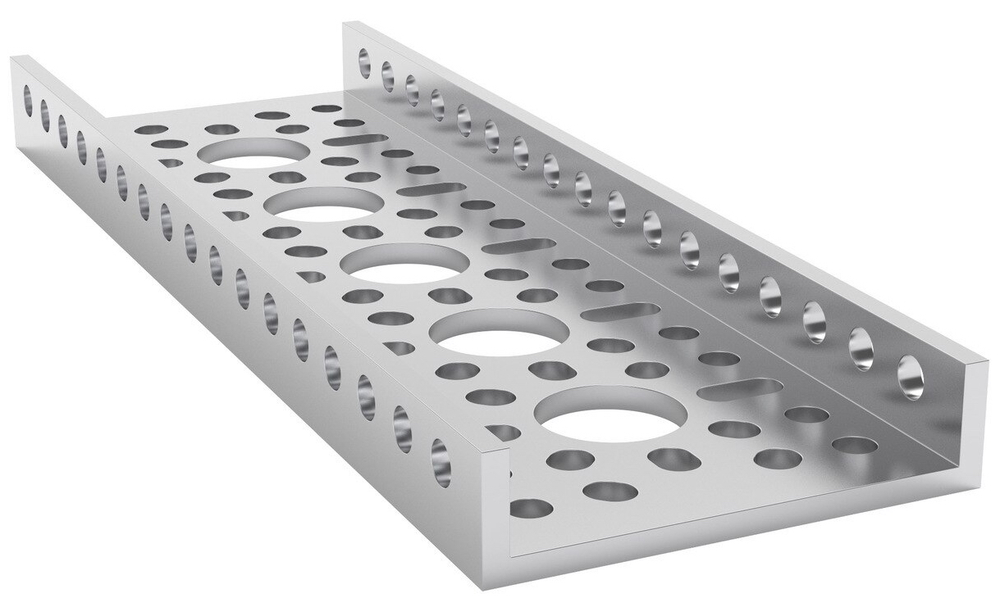
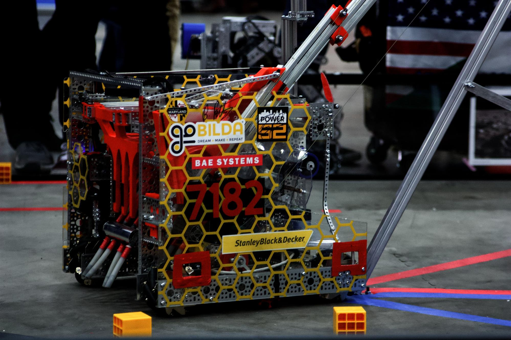

=======
goBILDA
=======
goBILDA (https://www.gobilda.com/) is a fixed-pitch, channel based building
system using metric units.
It was recently released in the 2018-2019 season and is made by the same
company as Actobotics.

Special Considerations
======================

* goBILDA is based on metric measurements using M4 hardware.
  The hole pattern has 4mm holes on 8mm grid.
* The kit is primarily structured around U-channel, which is strong and
  durable.
* goBILDA’s robust motion system allows teams to easily
  build drivetrains and mechanisms without worrying about placement and
  tensioning.
* It is arguable, but goBILDA has likely a low learning curve due to its simple
  yet extremely functional catalog of parts.
* goBILDA parts can generally be easily adapted to other kit parts such as REV.
* Additionally, goBILDA is still being developed at a quick pace and is
  responsive to the needs of the FTC community.
* **goBILDA offers a 25% discount for FIRST teams.**

Notable components
==================

* goBILDA uses 8mm pitch chain and HTD 3 or HTD 5 belts for motion.
* goBILDA mostly uses clamping hubs (called Sonic hubs), eliminating the
  unreliable set screws.
* goBILDA shafts are metric (6mm D and 8mm rounded hex).
* The primary structural component is the 48mm aluminum U-channel, shown below.

.. figure:: images/gobilda/gobilda_channel.jpg
    :alt: goBILDA U-channel

    goBILDA U-channel (48x48 mm)

* In addition, low-side channel (smaller profile channel)
  complements full size channel.
  Low side channel is just 12mm in height and allows for more compact builds.
  Additionally, low side channel opens up possibilities such as a kit-based
  parallel plate drivetrain.
  Low side channel also forms the basis of the cascading kit with a 2 or 4
  stage option.

    goBILDA low-side channel (12x48 mm)

* goRAIL is extrusion that complements the channel offerings well.
  goRAIL is used in the linear actuator kit for extending mechanisms.

Verdict
=======

goBILDA's kit is a solid, albeit slightly more expensive, option for new teams.
It offers a great deal of flexibility and part options from their catalog.
goBILDA is a solid choice due to reasonable pricing, low learning curve,
and thought-out design that reduces headaches.

Kit of Parts
============
https://www.gobilda.com/master-ftc-kit-2019-2020-season/

.. note:: This parts list is for the 2019-2020 season.

* 5202 Series, 26.9:1 Ratio, 223 RPM Planetary Gear Motor w/Encoder **x2**
* 5202 Series, 13.7:1 Ratio, 435 RPM Planetary Gear Motor w/Encoder **x2**
* 2000 Series Dual Mode Servo (25-1) **x4**
* Servo mount plates, attachments, accessories
* Matrix 12V 3000mAh battery with XT30 to Tamiya Adaptor
* U-channel, assorted lengths
* goRAIL extrusion, assorted lengths
* Pattern and grid plates
* Square beams, u-beams, l-beams
* Assorted brackets, standoffs, spacers
* Gears, sprockets, chain (8mm plastic chain)
* Bearings, hubs, collars
* Shafting (6mm D-shaft)

Advantages
==========
* goBILDA's low-side U-channel opens up many new possibilities due to its
  flexibility and compactness.
  For example, one can now make a parallel plate drivetrain without custom
  machining, or make custom width U-channel.
* goBILDA also has ServoBlocks
  (identical to Actobotics other than hole pattern) which drastically increase
  servo life.
* goBILDA has native large bore hex shaft support
  (12mm REX is comparable to 3/8" Thunderhex) which is one of the main
  advantages of custom fabrication brought to a kit based system.
* goBILDA also is able to interface with TETRIX channel because they share some
  holes.
  For more information about TETRIX-goBILDA compatibility,
  check out this `website <https://gobildatetrix.blogspot.com/>`_.
  It is also quite compatible with REV's ecosystem.
* goBILDA has a well thought-out ball bearing based motion system with smart
  motion transfer.
  It is easy to do chain or belt in channel.
  **8mm chain and HTD 3 and 5 mm  belt can do perfect C2C (center to center) on
  the goBILDA pattern.** This saves a lot of headache when needing to calculate
  C2C distances.
* goBILDA has plenty of shaft, ball bearing and pillow block options.
* goBILDA motors can face mount natively into channel,
  eliminating the need for motor mounts and providing a robust, reliable way to
  mount motors.
* goBILDA has some special parts are unavailable in other systems,
  like square beam shafts.
* goBILDA provides a large selection of 12V DC motors. Their Yellow Jacket
  motors use orbital gearboxes and are available in 10 different gear ratios
  ranging from 30 RPM to 1620 RPM. No other manufacturer offers such varied
  gear ratios out of the box.

Disadvantages
=============
* goBILDA is not the cheapest build system;
  it is relatively equivalent in pricing to Actobotics, but REV is cheaper.
* goBILDA U-channels are larger than the channels from Tetrix, resulting in
  larger builds. However, this is more than compensated by the fact that one
  can put a goBILDA motor *inside* a channel.
* Because of metric pattern spacing, goBILDA utilizes 8mm pitch chain,
  as opposed to the FTC standard #25 Imperial chain.
  This means that other kits' chain and sprockets won’t work with goBILDA chain
  and sprockets.

.. image:: images/gobilda/7182-rr2-hanging.png
    :alt: 7182 Mechanical Paradox Cubed's Rover Ruckus robot hanging on the lander

    An example of a successful goBILDA based robot, 7182 Mechanical Paradox
    Cubed: Finalist Alliance 1st Pick (Detroit), Rover Ruckus
