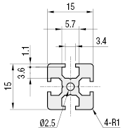
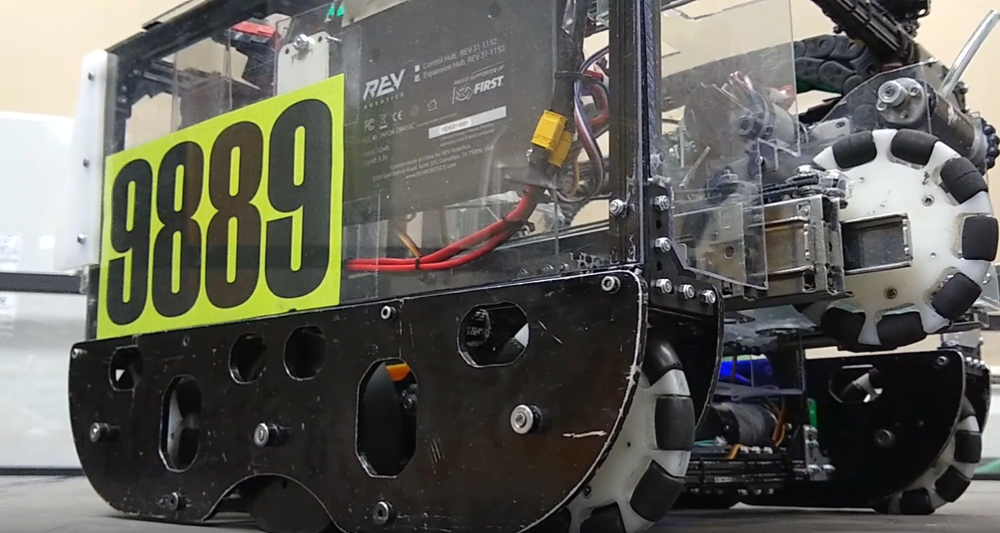
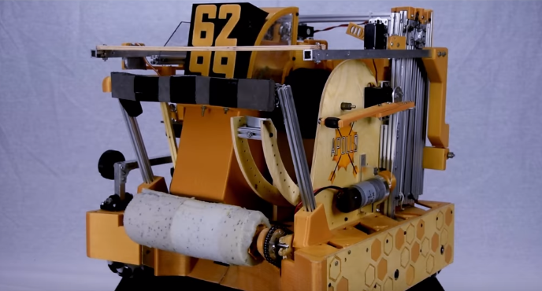

============
Rev Robotics
============
The REV kit is an infinite-pitch,
extrusion based building system which uses the metric system and M3 hardware.

Special Considerations
======================

* The REV ecosystem is based upon 15x15mm aluminum extrusion and is
  complemented by 45x45mm channels.
* With extrusion, there are no fixed mounting holes,
  increasing adjustability and flexibility.
  For example, tensioning chain is simple when sliding the mount or bracket
  increases tension.
* The REV system uses metric dimensions (15 mm extrusion, M3 hardware),
  with the exception of #25 roller chain (FTC standard, imperial).
* REV has purposefully designed with compatibility in mind, as pattern adapters
  ease compatibility issues.
* Many REV parts are made of Delrin, a high-wear resistance plastic,
  which reduces overall cost.
  However, REV offers aluminum options for high-load parts as well.
* REV does have a steeper learning curve than channel based build systems,
  owing to the fact that constructing structurally sound mechanisms requires
  just a little more thought.

Notable components
==================

* REV's bread and butter is the 15x15mm aluminum extrusion.
  It accepts M3 hex screws which slide along the grooves.
* In addition, REV also offers both 45x45mm U-channel and 15x45mm C-channel,
  which is stronger than extrusion and provides stiffness and support when
  needed.
* REV also offers punch tubing for teams wanting a more permanent mounting
  system while having the flexibility of channel.
* REV uses 5 mm hex steel shafts and a ball-bearing motion support system.
  The shaft may be cut to length, which can be very useful for certain use
  cases.
  Many vendors have added compatibility to 5 mm hex shaft.
* REV offers 3 types of HD HEX motors: spur gear, planetary, and UltraPlanetary
  motors.
  The UltraPlanetary has customizable planetary ring gear ratios for a very
  affordable price.
* The Core Hex Motor may be useful in certain use cases such as space
  constrained mechanisms.
* REV also has pattern adapters for other systems built into many parts such as
  the aluminum brackets.

Verdict
=======

**The REV kit is good for teams willing to invest the time into an extrusion
building system.**
It is the most flexible kit as it is extrusion based, yet it has the
ability to integrate channel along with extrusion. REV offers the option to
upgrade parts  for those wanting a further investment into the REV building
system.

.. note: REV and MiSUMI Compatibility

One advantage to the REV kit is the compatibility of
15x15mm Misumi extrusion.
15x15mm REV extrusion isn’t as structurally strong as Misumi for two reasons.

1.  REV extrusion is 6063 aluminum,
    while MiSUMI extrusion is made out of A6N01SS-T5 aluminum,
    a stronger and stiffer alloy.
2.  The MiSUMI extrusion has a larger surface area,
    so there is more area of contact.

Misumi offers greater strength at a lower bulk cost.
Additionally, Misumi will cut to the half millimeter for free, making it a
great option for teams needing an exact cut.
The drawback to Misumi is that it is quite a bit heavier than the REV
extrusion.
It is encouraged that teams use Misumi for drivetrain and structural support,
and REV for mechanisms that will be under low to medium load. REV also sells
punch tubing, which is 15 mm aluminum square tubing that is compatible with
1/8” rivets.
This will prevent bolts from loosening or sliding around, as punch tubing
requires teams to drill through the tubing in order to fasten parts to it.
Another easy option is to use REV 45x45mm channel.

.. figure:: images/rev-robotics/rev-extrusion.png
    :alt: A piece of rev extrusion

    REV 15x15mm Extrusion

    MiSUMI 15x15mm Extrusion Profile

Kit of Parts
============
http://www.revrobotics.com/rev-45-1270/

* 2 40:1 HD Hex Motors
* 2 Core Hex Motors
* 4 Smart Robot Servos with other attachments
* Smart Robot Servo Programmer
* 15 mm aluminum extrusion, various lengths
* Omni and traction wheels
* 32 gears in 7 different sizes
* 10 sprockets in 3 different sizes
* Delrin brackets
* Delrin bearings and pillow blocks
* Motor and servo power/data cables
* Slim Robot Battery and charger
* 5.5 mm nut driver and 5.5 mm hex wrench

Advantages
==========

* Extrusion systems don’t need to worry about tensioning as mounts are
  adjustable to your needs.
* Extrusion allows teams to save space as opposed to channel,
  and is lighter than aluminum channel.
* Extrusion allows infinite positioning options instead of being locked in to a
  specific distance - useful for fine-tuning a mechanism.
* Delrin products are inexpensive yet durable for most use cases.
* REV has the option to upgrade to aluminum parts if need be -
  something that no other build system offers.
  (not for all parts)
* 5 mm hex is a robust shaft and motion system and is easily adaptable to
  Ultrahex 1/2” hex shaft. Other companies have adapting options with 5 mm hex.
* Punch tubing is a great final iteration option if you are sure about
  placement.
* Channel complements extrusion extremely well -
  having the adjustability of extrusion and the rigidity of channel makes it a
  very solid build system.
* Generally, REV products are designed with affordability in mind, and so the
  components are of good value for money.

Disadvantages
=============

* 15x15mm extrusion is not as sturdy as channel options under high stress
  loads.
* Steeper learning curve, more time consuming to measure and cut extrusion to
  length.
* Requires tools such as a saw and bandsaw.
* Requires forethought and planning of extrusion length and placement.
* Parts loosen over time (to remediate: use punch tubing)
* M3 bolts, especially those sold directly by REV, are prone to bending under
  higher load (such as when used as an axle for a pulley)
* 5 mm hex shaft is also prone to bending, especially if the shaft is long.

.. figure:: images/rev-robotics/7161-rr1.png
    :alt: 7161 ViperBots Hydra's Relic Recovery robot

    7161 ViperBots Hydra, Finalist Alliance 1st Pick (Houston), Relic Recovery

    9889 Cruise Control, Rover Ruckus

    6299 ViperBots QuadX, Velocity Vortex

.. figure:: images/rev-robotics/11115-rr1.png
    :alt: 11115 Gluten Free's Relic Recovery robot

    11115 Gluten Free used both REV and Actobotics for the 2017-2018 season.
    Finalist Alliance Captain (Detroit), Relic Recovery
