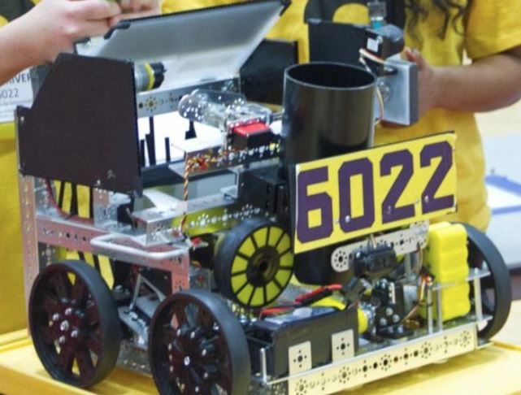

======
Tetrix
======
The TETRIX build system is a fixed pitch,
channel-based building system that uses both imperial and metric units.

Special Considerations
======================

* The TETRIX build system revolves around 32 mm aluminum c-channels and a 16mm
  bolt circle, on 16mm spacing (centers of the circles are 16mm apart).
  TETRIX is patterned along these channels to create many mounting options
  for building structures.
* These channels have a tendency to flex and bend under load,
  often requiring reinforcement using multiple channels to maintain their
  shape.
* While TETRIX channel is measured in metric units,
  the system employs Imperial (SAE) bolts and Imperial chain.
  This mix of units means that things often don’t quite line up how they’re
  supposed to, causing unforeseen problems.
* Additional tensioners are often required when using chain on TETRIX.
* TETRIX gears and sprockets offer very limited options for creating
  ratios.
  The aluminum gears tend to grind away very quickly,
  especially if they are not supported correctly on both sides.
* Tetrix parts generally do not have the best track record for reliability and
  longevity due to subpar material choices.
* Tetrix parts are slightly overpriced and lack bang-for-your-buck
  value found in kits such as REV and goBILDA.

Verdict
=======

While you may be considering TETRIX as a starter kit,
we encourage you to explore your options before selecting a kit.
While Tetrix does pick up quite a lot of flak from the community,
it isn’t a bad choice in terms of physical qualities such as strength,
but the mounting options and hole patterns leave more to be desired and
restrict teams in terms of flexibility.

Kit Parts
=========
https://asset.pitsco.com/sharedimages/resources/ftcset_productlist-0719.pdf

.. note:: This parts list is for the 2018-2019 season.

* 32x32mm Aluminum C-Channel, various lengths
* Assorted plates and brackets, flat and 90 degree
* Flat plates
* Axles (6mm d-shaft & 4.7mm d-shaft), hubs, spacers
* Aluminum gears
* Standoffs
* HS-485 HB servo (4x), assorted accessories
* TETRIX Torquenado motor (4x)
* Bars and angles
* omni and traction wheels
* Nuts, screws, fasteners
* Battery
* Tools (screwdrivers, etc.)

Advantages
==========
* The TETRIX kit, being the most basic of all kit options,
  is easy to learn and provides a variety of options in building.
  The kit itself comes with c-channel, which is aluminum shaped in a C.
  It has pre-cut holes so motors, gears, or drive shafts can be seamlessly
  integrated into the channel.
  For a beginner team with little to no experience,
  a TETRIX kit allows you to assemble a working drivetrain in a couple of hours
  (Note: Most other kits allow you to do the same thing, but with more
  customization options).
* Furthermore, TETRIX is decent in terms of structural integrity,
  as long as the channels are loaded in the correct orientation.
  Typically, the orientation should be like an “n”, with the top face upward.
  Connecting the channels with locknut instead of regular nuts aids in
  longevity.
  However, TETRIX is the weakest of the build systems and is very prone to
  bending, especially with long pieces of channel that have multiple axes of
  load.
* It is simple to build basic mechanisms such as an arm using the gears and
  d-shaft.
  However, there are potential drawbacks to doing so.

Disadvantages
=============
* The TorqueNADO motors are comparable with NeveRest 60:1.
  They are usable, however have more limited uses due to their slow gear ratio,
  which means high torque but relatively slow output speed.
  The TorqueNADO uses spur gearboxes, and will not handle as much shock load as
  other planetary options, namely AndyMark 20 Orbitals, REV HD Planetary,
  or the goBILDA Yellowjacket Planetaries.
* The aluminum gears seem to grind against each other often,
  even with correct spacing, and do not last very long,
  especially under high torque situations.
* TETRIX hubs are 6mm or 4.7mm round and are based on set screws which are
  torque transferring.
  These set screws are notorious for coming loose under load,
  so special care must be taken to continuously tighten these screws.
  Additionally, it is highly recommended that teams use some sort of
  threadlocker on set screws, whether it be Loctite Blue (removable) or Loctite
  Red (nonremovable).
  A possible workaround is purchasing 6mm D clamping hubs from goBILDA to use
  on TETRIX shafts, however, this also necessitates the use of a pattern
  adapter from the goBILDA pattern to TETRIX.
* Due to using a metric based pattern but using imperial based holes and chain
  standards, chain will not have perfect tension when running from one hole in
  channel to another.
  An external tensioner will be required to implement chain systems.
* TETRIX is also the most expensive kit on average while providing the most
  limited build options.
  Finally, the tight spacing and mix of units limits teams if they would want
  to integrate custom parts with TETRIX.
* Set screws on TETRIX hubs can mar motor shafts, and the bore of the hub
  itself can enlarge, leading to a wobbly or misaligned hub.

Tips for use
=============
In any build system, it is important to properly support the structure of your
robot.
This includes supporting axles at two or more points of contact,
or having multiple points of support for a piece of channel.
Due to TETRIX’s relatively fragile nature, this advice goes double with TETRIX.
Instead of just supporting a shaft at two points,
it is recommended to support the shaft at 4 or more
(if you are using a 4.7mm standard).
When mounting motors, it is recommended that two clamping motor mounts are used
to mount one motor. Using standoffs inside channel to prevent the channel from
bending inward or outward is also highly recommended.

    TETRIX based robots have succeeded in competition,
    albeit it has become rarer in recent years.

    6022 To Be Determined:
    Worlds Semifinalist (St. Louis), Velocity Vortex

