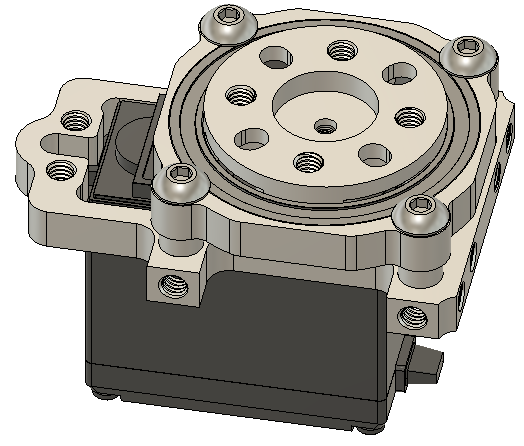

================
Servo Usage Tips
================

Below are some tips on using servos in FTC.

* Do not backdrive servos. Forcibly rotating a powered servo away from
  its position risks damaging the internal gears.

* Servo connectors provide no protection from plugging them the wrong way:
  if you rotate it 180 degrees, it will still fit -
  but the servo would not work.
  (It wouldn't be damaged, though). Thus, if you servo is not working, first
  check if they are plugged in correctly. Then check it again.

* When using servo wire extensions, use `retaining clips <https://www.gobilda.com/servo-connector-clip-yellow-6-pack/>`_
  to prevent the connection from coming apart when someone pulls on the wire.

* Do not use socket head screws to attach servos - when tightened, they will
  damage the plastic. Use button head crews or socket heads with a washer.

* Servos break very easily when subjected to lateral loads or bending of the
  shaft. For example, if you mount an arm or a claw directly on the servo
  without any additional precautions, it is very likely that you will break
  the servo first time you drive into the wall with the arm extended
  (and this will inevitably happen). To avoid that, use additional supports.
  The easiest way to do it is by using Servoblocks(TM)  from Actobotics or
  goBILDA. These assemblies act as exoskeletons for the servo,
  providing additional support.
  They are expensive, but worth every penny.

  .. figure:: images/servoblock.jpg
      :alt: servoblock
      :width: 40%

      A servo in a ServoBlock

There are also some alternative designs of servo supports; one of them, which
is not as strong as the original ServoBlock but much more compact, is shown
below (`CAD <https://a360.co/38POMq6>`_ is also available):

     Alternative servo support block

* Use linkages. Instead of mounting some rotating piece directly on a servo,
  mount it so it can rotate around a pivot point and then connect it to the
  servo using linkage as shown below:

  .. figure:: images/linkage.jpg
      :alt: linkage

      Linkage example, courtesy of team 4137 Islandbots. A goBILDA flat beam
      is used as the link.

* If you need more power, use
  `REV Servo Power Module <http://www.revrobotics.com/rev-11-1144/>`_.
  By itself, REV Expansion hub provides 5V power to servos, and the current
  is limited to 2A for each of 3 pairs of servo ports (0-1, 2-3, 4-5). Since
  stall current on a servo such as goBILDA Dual Mode servo is about 2.5A,
  it means that if one of the servos in a pair is stalled, the other one will
  not be getting enough power to maintain its position. REV Servo Power Module
  provides 6V and up to 15A current total for 6 servo ports.
