Fasteners Guide
===============
If you want your robot to stay in one piece, you will need fasteners. Fasteners are any pieces of hardware that mechanically join parts. This guide will discuss common types of fasteners, and how to use them on your robot.

Threaded Fasteners
------------------
Bolts, screws and nuts are all threaded fasteners -- meaning they use a helical thread to join parts.

Thread Basics
^^^^^^^^^^^^^
To understand threaded fasteners, you will need to know some basic terminology

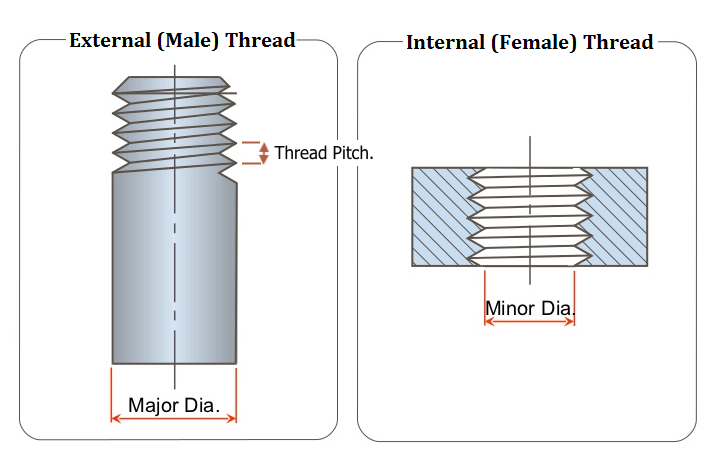

External thread
    A thread on an outside surface. Bolts have external threads
Internal thread
    A thread on an inside surface. Nuts have internal threads
Thread pitch
    The distance from one thread to another, measured along the length of the thread. This can also be expressed as the number of threads per unit of length, for example threads per inch
Major diameter
    The larger of the two diameters giving the height of the thread profile.
Minor diameter
    The smaller of the two diameters giving the height of the thread profile.

Thread Standards and Naming
^^^^^^^^^^^^^^^^^^^^^^^^^^^
There are 2 main systems of naming and sizing threads that you will encounter in FTC: ISO metric sizing and UTS imperial sizing.

**Imperial (UTS)**

The universal thread standard (UTS) is based on the imperial system and commonly used to size threads in the US and Canada. A UTS thread is named by a number indicating the major diameter of the thread, followed by the thread's pitch measured in threads per inch.

For major diameters of |frac14|" or greater, first number is simply the major diameter in inches. For those smaller than |frac14|", the following code is used:

.. table::
   :widths: auto

   =====  =====
    no.    major diameter (inches)
   =====  =====
   #0     0.0600
   #1     0.0730
   #2     0.0860
   #3     0.0990
   #4     0.1120
   #5     0.1250
   #6     0.1380
   #8     0.1640
   #10    0.1900
   #12    0.2160
   =====  =====

Some common imperial thread sizes in FTC include |frac14|-20 (one quarter inch major diameter, 20 threads per inch) and #6-32 (0.138 inch major diameter, 32 threads per inch)

**Metric (ISO)**

The ISO metric thread standard is commonly used worldwide, and for many products sold by FTC vendors.

A metric thread is designated by the letter M followed by the outer diameter in millimeters, for example M4 for a 4 mm major diameter bolt. This is then followed by a "x" and the pitch, also in millimeters. For example, "M4X0.7" means a m4 thread with a 0.7 mm pitch.

Bolts
^^^^^

Bolts are probably the most commonly used fastener in FTC.

There are several types of bolts you may encounter, such as:

**Socket Head Bolts**

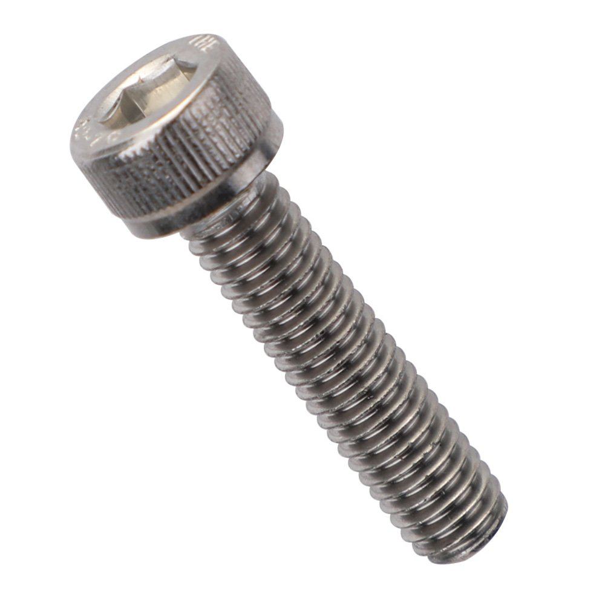

These bolts have a cylindrical head and are tightened and loosened with a hexagonal recess.

**Button Head Bolts**

.. figure:: images/botton-head.jpeg
   :alt: diagram showing thread terminology
   :width: 150px

These bolts have a domed head, in contrast to the flat top of a standard socket bolt.

**Grub Screws**

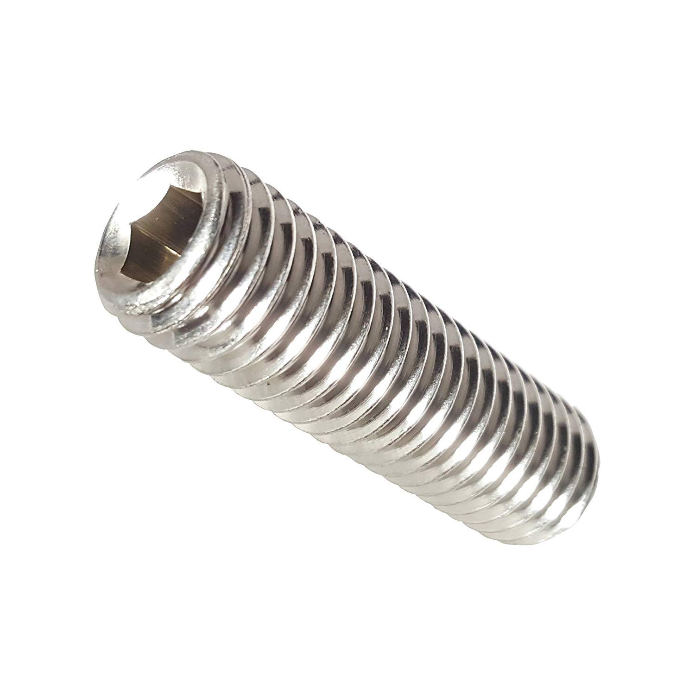

These bolts have no head, the recess is instead embedded within the threads. They are primarily used as set screws.

**Hex Bolts**

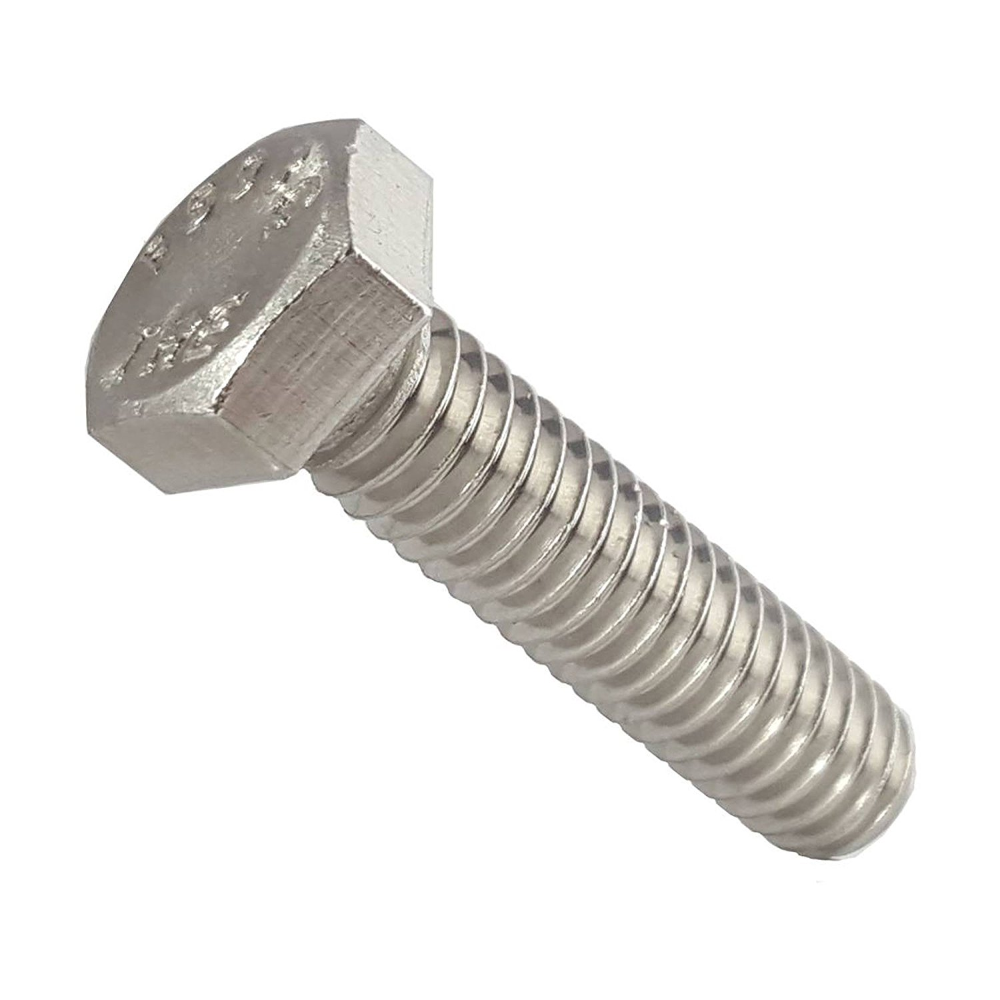

The bolts are tightened with an external hex-shaped head. When designing for these bolts, it is important to allow clearance on the side of the head for tightening.

Every bolt requires a "drive" -- meaning the recess which is used to turn and install it. Each of the bolts listed above can have a variety of different types of drives:

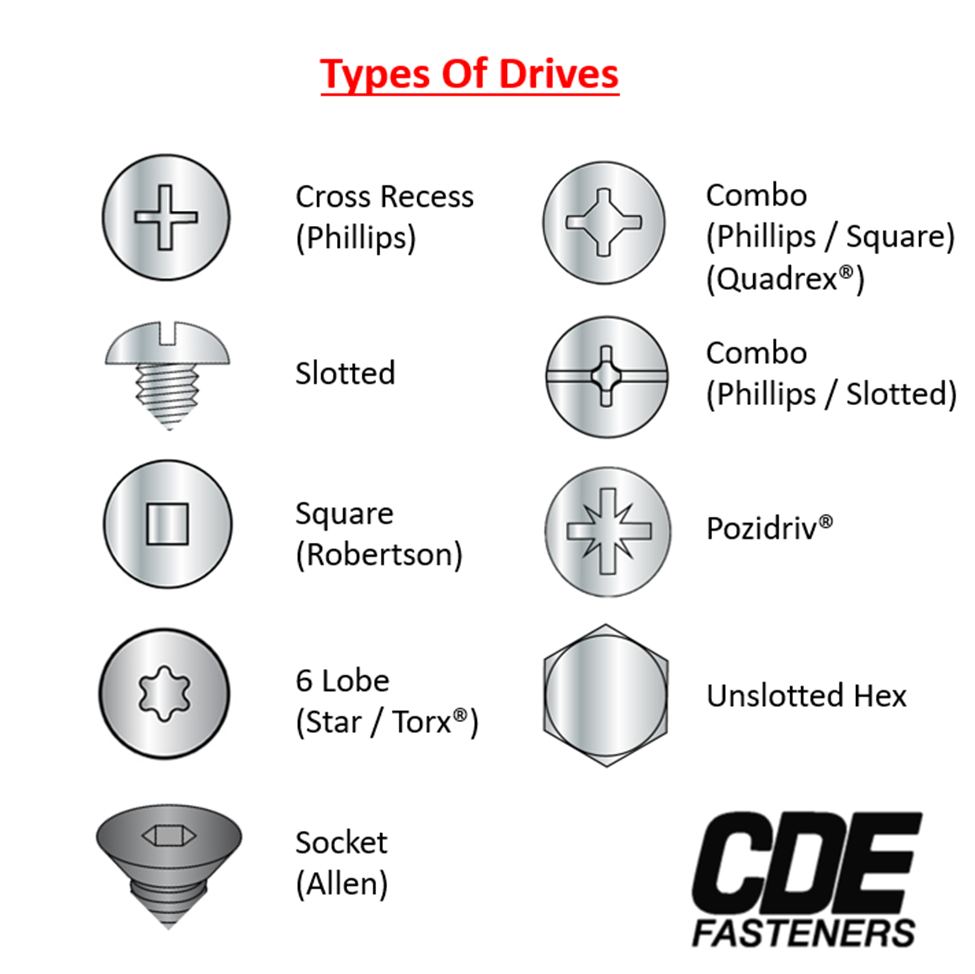

Nuts
^^^^

A nut is a fastener with an internally threaded hole. Together with a bolt, they're used to join parts together.

Here are some types of nuts you may encounter in FTC:

**Hex Nuts**

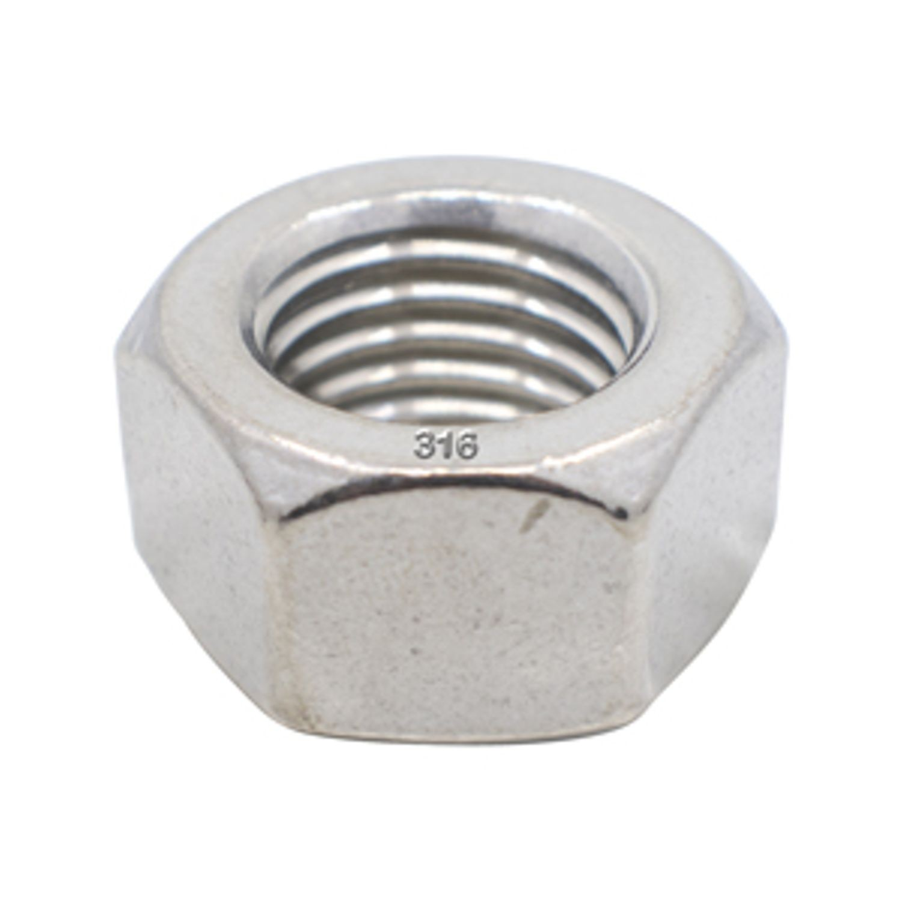

These most common type of nut. They can be tightened with a socket hex wrench

**Square Nuts**

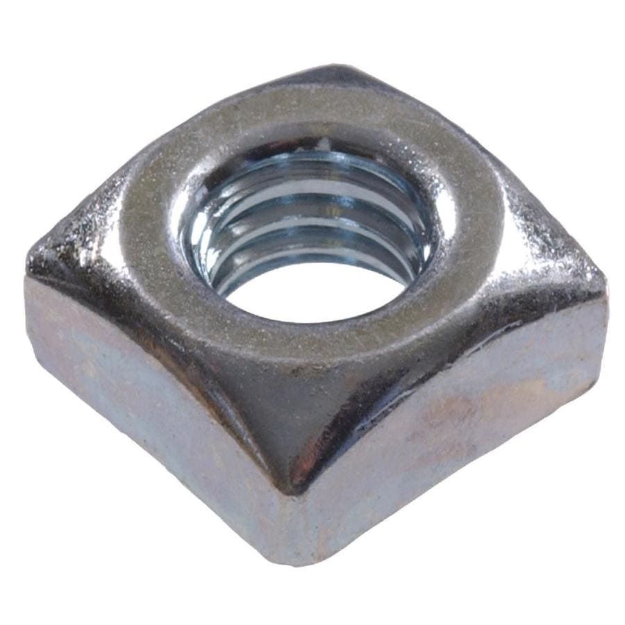

These are four-sided nuts.

**T-slot Nuts**

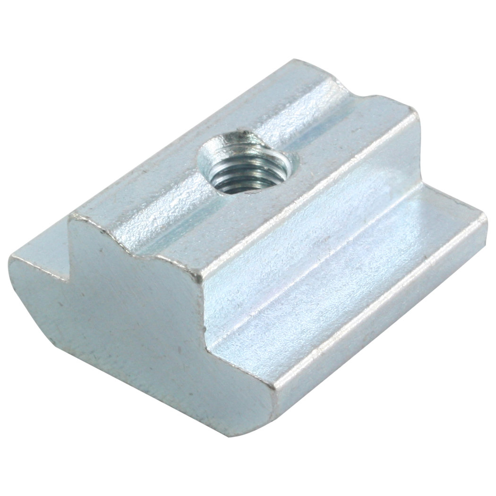

These can be inserted into t-slot extrusion to tighten parts onto it.

**Wing Nuts**

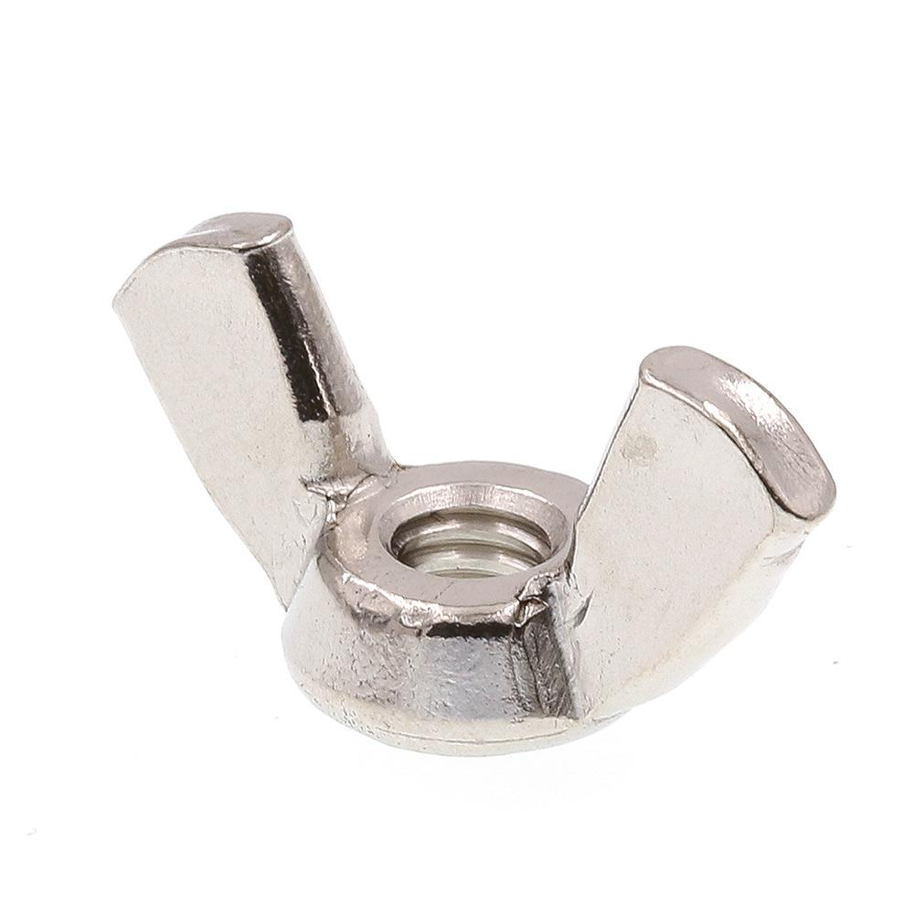

These nuts can be easily tightened without a wrench.

**Nyloc Nuts**

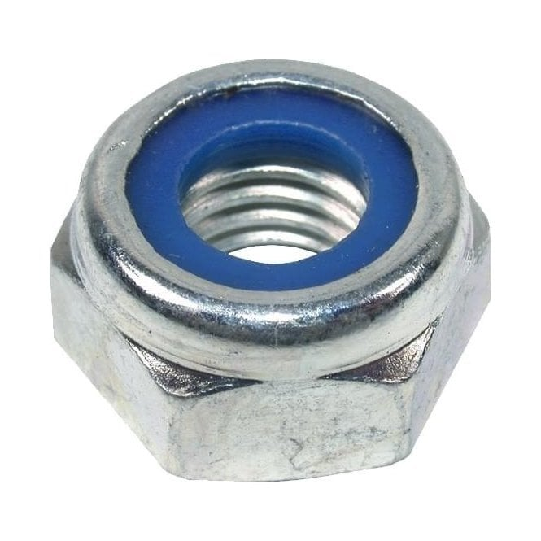

These nuts contain a nylon ring which prevents loosening. We recommend using these wherever possible.

Making Threads
^^^^^^^^^^^^^^

Sometimes, you will want to create new threads. This process is called threading.
To create internal threads, you can use a cutting tool called a tap -- essentially a sharper version of a screw.

To create external threads, you use a tool called a die.

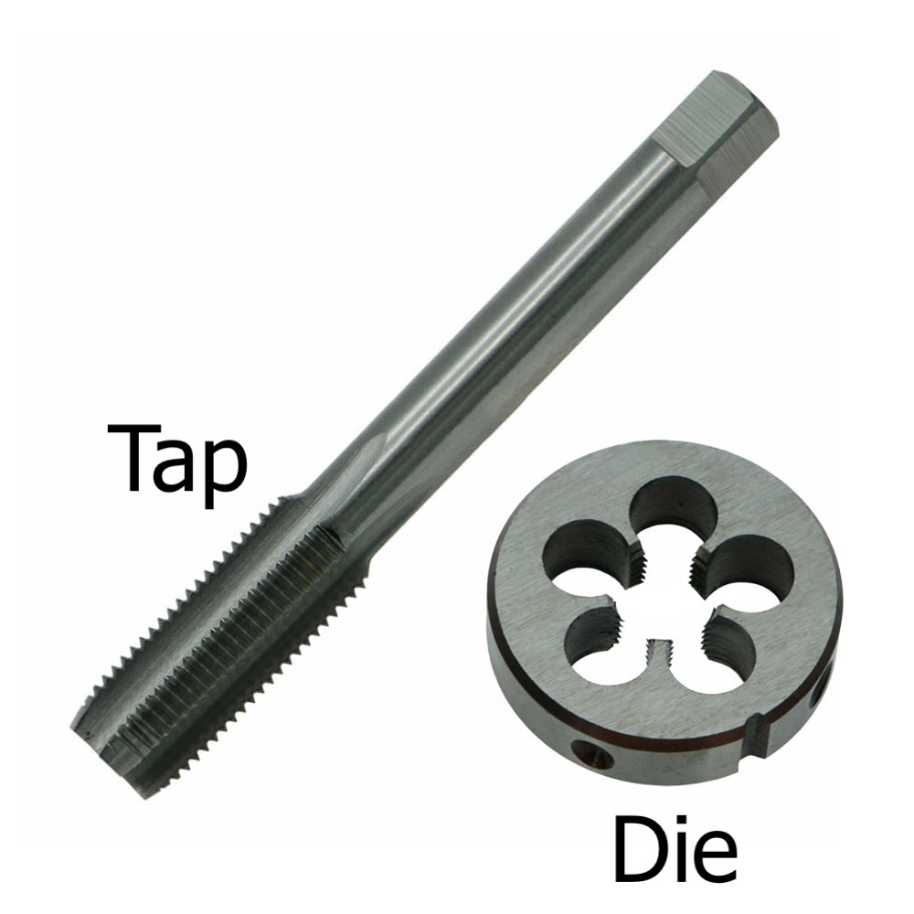

Threadlocker
^^^^^^^^^^^^

Bolts on your robot may loosen over time, especially if there are heavy vibrations. To prevent this you may use locking nuts or lock washers, which mechanically press against the thread. Another solution is to use a threadlocker, which is an adhesive compound that -- as it's name suggests -- locks threads in place.

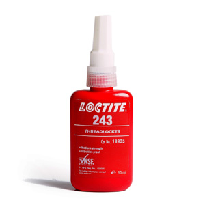
