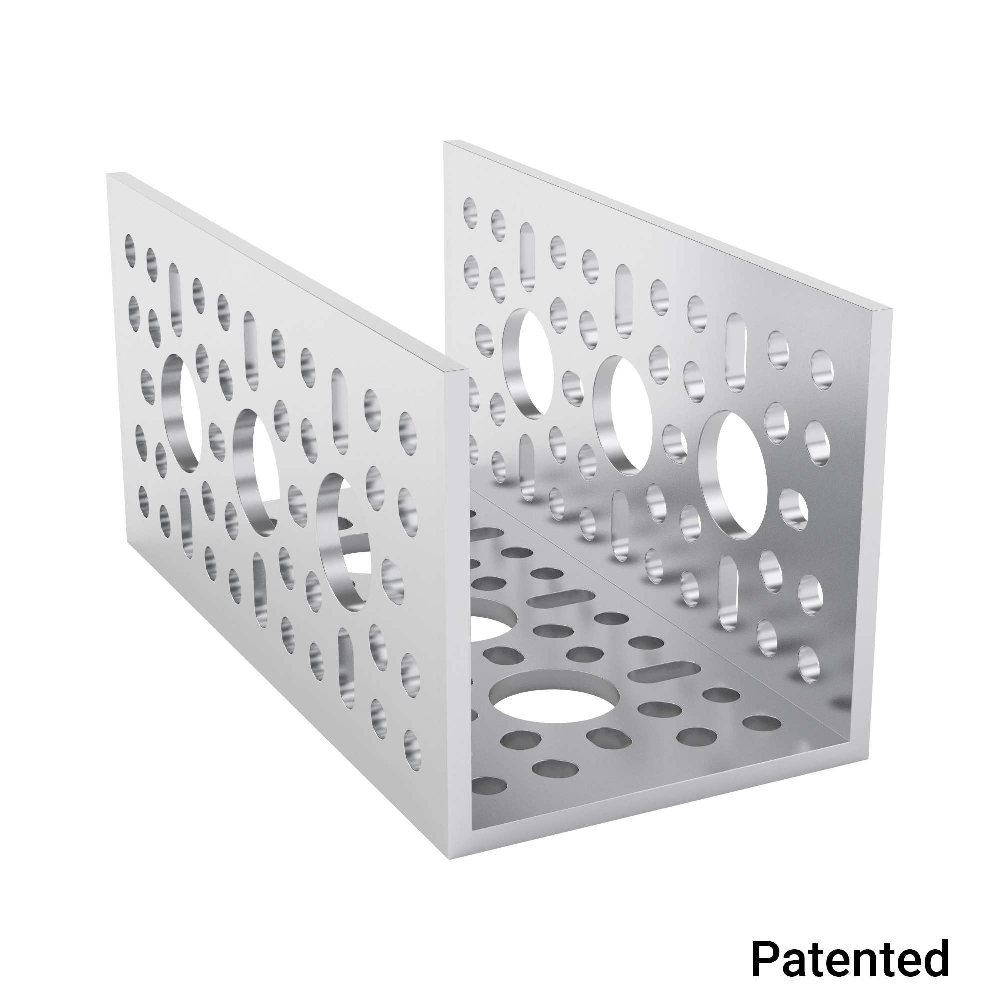
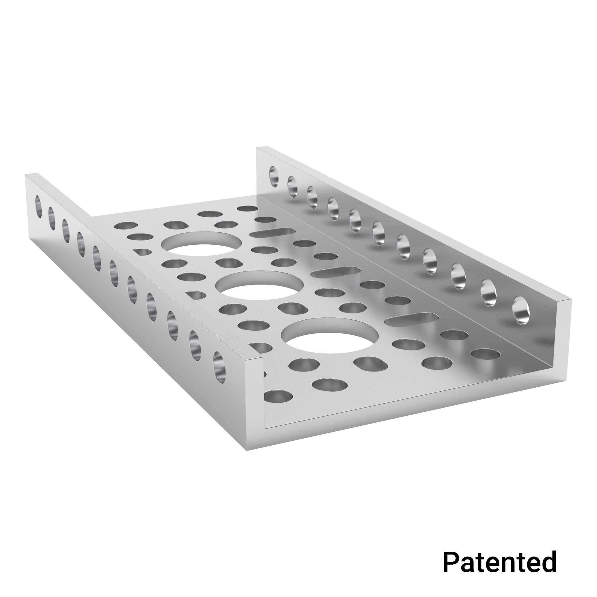
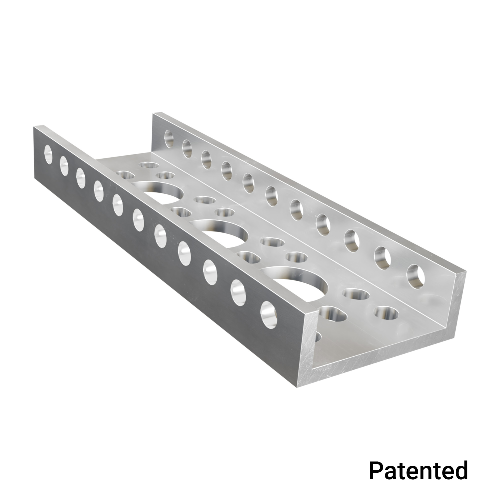

.. include:: <isonum.txt>

goBILDA
=======

goBILDA (https://www.gobilda.com/) is a fixed-pitch, :term:`channel <Channel>` based building system using metric units. It was first released in the 2018-2019 season and is made by the same company that previously made Actobotics.

Special Considerations
----------------------

- goBILDA is based on metric measurements using M4 hardware. The hole pattern has 4mm holes on an 8mm grid.
- The kit is primarily structured around :term:`U-channel <Channel>`, which is strong and durable.
- goBILDA's robust motion system allows teams to easily build drivetrains and mechanisms without worrying about placement and tensioning.
- goBILDA arguably has a low learning curve due to its simple yet extremely functional catalog of parts.
- goBILDA parts can generally be easily adapted to other kit parts such as REV.
- goBILDA arguably has the largest and widest parts library of any vendor in FTC, meaning that most any mechanism you can imagine can be quickly, easily, compactly, and robustly built with goBILDA.
- Additionally, goBILDA is still being developed at a quick pace and is responsive to the needs of the FTC\ |reg| community.
- **goBILDA offers a 25% discount for** *FIRST*\ |reg| **teams**.

Notable components
------------------

- goBILDA uses :term:`8mm pitch chain <Chain>`, 2mm :term:`GT2 belts <GT2 Belt>`, and 3mm and 5mm :term:`HTD belts <HTD Belt>` for motion.
- goBILDA mostly uses :term:`clamping hubs <Clamping Hub>` (called Sonic hubs), eliminating the unreliable :term:`set screws <Set Screw>`.
- goBILDA :term:`shafts <Shaft>` are metric (:term:`6mm D <Shaft>` and :term:`8mm rounded hex (REX) <Shaft>`).
- The primary structural component is the 48mm aluminum :term:`U-channel <Channel>`, shown below.

   goBILDA :term:`U-channel <Channel>` (48x48 mm)

- Low-Side channel (smaller profile :term:`channel <Channel>`) complements full size channel. Low-Side channel is just 12mm in height and allows for more compact builds. Additionally, Low-Side channel opens up possibilities such as a kit-based :term:`parallel plate drivetrain <Parallel Plate Drivetrain>`. Low-Side channel also forms the basis of the cascading kit with a 2 or 4 stage option.

   goBILDA low-side channel (12x48 mm)

- Mini-Low-Side channel (even smaller profile :term:`channel <Channel>`) that compliments Low-Side channel. Mini-Low-Side channel is 12mm tall and just 32mm wide, making it great for small structures.

   goBILDA mini-low-side channel (12x48 mm)

- Viper-Slides are goBILDA's version of the commonly used drawer slides for linear extension in 336mm and 240mm lengths. Notably, goBILDA sells a Viper-Slide kit, which contains all of the parts to assemble either a 2 stack or 4 stack of slides. In addition, they are one of the few vendors who sells a belted version of these slides. The 240mm slide is also uniquely bidirectional, sliding both ways.

- goRAIL is :term:`extrusion <Extrusion>` that complements the :term:`channel <Channel>` offerings well. goRAIL is used in the linear actuator kit for extending mechanisms.

Verdict
-------

goBILDA's kit is a solid, albeit slightly more expensive, option for new teams. It offers a great deal of flexibility and part options from their catalog. goBILDA is a solid choice due to reasonable pricing, low learning curve, and thought-out design that reduces headaches.

Kit of Parts
------------

- `FTC Starter Kit (2024-2025 Season) <https://www.gobilda.com/ftc-starter-kit-2024-2025-season/>`_
- `Strafer Chassis Kit (104mm GripForce Mecanum Wheels) <https://www.gobilda.com/strafer-chassis-kit-104mm-gripforce-mecanum-wheels/>`_

Advantages
----------

- goBILDA's Low-Side U-channel opens up many new possibilities due to its flexibility and compactness. For example, one can now make a :term:`parallel plate drivetrain <Parallel Plate Drivetrain>` without custom machining, or make custom width :term:`U-channel <Channel>`.
- goBILDA also has :term:`Servoblocks` (identical to Actobotics other than hole pattern) which drastically increase servo life.
- goBILDA has native large bore :term:`hex shaft <Shaft>` support (12 mm REX is comparable to 3/8" rounded hex) which is one of the main advantages of custom fabrication brought to a kit based system.
- goBILDA has a well thought-out :term:`ball bearing <Ball Bearing>` based motion system with smart motion transfer. It is easy to do :term:`chain <Chain>` or :term:`belt <HTD Belt>` in channel.

  .. note:: 8mm :term:`chain <Chain>`, HTD 3, and HTD 5 :term:`belt <HTD Belt>` can do perfect :term:`C2C (center to center) <C2C>` on the goBILDA pattern. This saves a lot of headache when needing to calculate :term:`C2C` distances.

- goBILDA has plenty of :term:`shaft <Shaft>`, :term:`ball bearing <Ball Bearing>`, and pillow block options.
- goBILDA motors can :term:`face mount <Face Mounting>` natively into :term:`channel <Channel>`, eliminating the need for motor mounts and providing a robust, reliable way to mount motors.
- goBILDA has some special parts are unavailable in other systems, like :term:`square beam shafts <Shaft>`.
- goBILDA provides a large selection of 12V DC motors. Their :term:`Yellow Jacket motors <Yellow Jacket Motor>` use orbital gearboxes and are available in 10 different gear ratios ranging from 30 RPM to 1620 RPM. No other manufacturer offers such varied gear ratios out of the box.

Disadvantages
-------------

- goBILDA is not the cheapest build system; while it is reasonably price-competitive, REV is cheaper.
- goBILDA :term:`U-channels <Channel>` are larger than the :term:`channels <Channel>` from Tetrix, resulting in larger builds. However, this is more than compensated by the fact that one can put a :term:`goBILDA motor <Yellow Jacket Motor>` *inside* a :term:`channel <Channel>`. In addition, the introduction of mini-low-side channel allows for more compact builds where needed.
- Because of metric pattern spacing, goBILDA utilizes 8mm pitch :term:`chain <Chain>`, as opposed to the FTC standard #25 Imperial :term:`chain <Chain>`. This means that other kits' :term:`chain <Chain>` and :term:`sprockets <Sprocket>` won't work with goBILDA :term:`chain <Chain>` and :term:`sprockets <Sprocket>`.

Example Robots
--------------

.. image:: images/gobilda/7182-rr2-hanging.png
   :alt: 7182 Mechanical Paradox Cubed's Rover Ruckus robot hanging on the lander

.. figure:: images/gobilda/7182-rr2-field.jpg
   :alt: 7182 Mechanical Paradox Cubed's Rover Ruckus robot hanging on the field

   An example of a successful goBILDA based robot, 7182 Mechanical Paradox Cubed: Finalist Alliance 1st Pick (Detroit), Rover Ruckus
