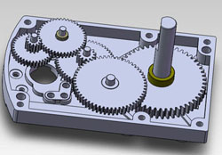

.. include:: <isonum.txt>

Gearbox Internals
=================

Fundamentally, a gearbox is just a collection of gears and an enclosure that connects them. Gearboxes have an **output ratio**, the final Gear Reduction between the motor input and the final output :term:`shaft <Shaft>`.

.. admonition:: Term

   .. glossary::

      Gear Reduction
         Also known as a gear ratio. In any rotational power transmission system (typically involving motors and :term:`servos <Servo>` in FTC\ |reg|), a gear ratio defines both the number of rotations of the system's input and the number of rotations of the output.

         For instance, a NeveRest 20 gearmotor consists of an unmodified :term:`NeveRest Motor` and a planetary gearbox that has a gear ratio of 20:1 (or, when spoken, "20 to 1"). This means that in order for the output shaft of the gearbox to rotate 1 time, the input shaft of the motor must rotate 20 times. Gear ratios are one of the most important design considerations about a power transmission component.

         Any FTC motor or servo has two properties: speed and torque (or rotational force). These two properties are inversely proportional, meaning that increasing speed decreases torque, and vice versa. For instance, if one wishes to make a mechanism faster at the expense of torque by doubling the speed of that 20:1 gearbox, they would decrease the gear ratio by a factor of 2. Since 20 divided by 2 is 10, the new desired ratio would be 10:1 (this is referred to as gearing up). However, if one wishes to double torque instead, making the system more powerful and robust at the expense of speed, they would increase the gear ratio by a factor of 2, leaving them with a 40:1 ratio (this is referred to as gearing down).

         The most common ways of gearing up or down are using gearboxes, gears, sprockets and belt-driven pulleys, all of which exist in various sizes.

In FTC, gearboxes may be more common than you think - every motor has a gearbox attached to it. These gearboxes are one of the following two types: spur or planetary. Below we give a detailed analysis of each of these gearbox types. **Just for clarification, the gearboxes below are separate from the base motor.**

Spur Gearboxes
--------------

.. admonition:: Term

   .. glossary::

      Spur gearbox
         A spur gearbox has spur gears which are stacked on top of each other. Gear reduction is achieved through different size gears on the same plane.

Spur gearboxes are an arrangement of :term:`gear ratios <Gear Reduction>`, often stacked to achieve a large compound ratio (e.g. 40:1). Each individual ratio only has two :term:`gears <Gear>`- one may be 8:1, another may be 5:1, but the final ratio will be 40:1. These gearboxes are used in the Andymark NeveRest Classic series and goBILDA's 5201 series motors, as well as :term:`REV HD Hex Motors <HD Hex Motor>`. Due to the nature of how these gearboxes are built, each reduction only has a few teeth from each :term:`gear <Gear>` engaged, and those teeth carry the entire load of the gearbox. It's easy to damage a spur gearbox from shock load, and if one :term:`gear <Gear>` breaks, the entire gearbox will stop functioning.

.. tip:: Using spur gearboxes on high-load applications such as drivetrains or arms is not recommended. Instead, use planetary gearboxes.

   Example of a spur gearbox. Note how all gears mesh with only one other gear.

Advantages of Spur Gearboxes
^^^^^^^^^^^^^^^^^^^^^^^^^^^^

Generally, spur gearboxes are cheaper than planetary gearboxes. However, in FTC that price change is often minimal. A 20:1 planetary gearbox from REV is only $4 more than a spur 20:1

Spur gearboxes from different vendors are not interchangeable. However, they are comparable and practically indistinguishable in performance. The main thing to consider here is your **desired reduction, your desired motor connections, and your desired output shaft type**.

Planetary Gearboxes
-------------------

Planetary gearboxes use a more complex system of gears to achieve a robust reduction in a compact space. In automotive engineering, planetary gear sets can achieve a few different ratios without changing gear size, but all planetary gearboxes that you will see in FTC only achieve one gear ratio.

.. admonition:: Term

   .. glossary::

      Planetary Gear
         Planetary gearing consists of a center gear (sun gear) which has smaller gears (planet gears) revolving around it. The outer radius has a ring gear which holds the other gears in place.

Planetary gearboxes are used in the Andymark Orbital series, some REV HD Hex Planetary and UltraPlanetary Motors and goBILDA's wide selection of :term:`planetary gear motors <Yellow Jacket Motor>`. Additionally, AndyMark sells a few aftermarket planetary gearboxes called NeveRest Sport and 57 Sport. As you can see from the graphic below, there are more teeth meshing per stage than in the spur gearbox.

.. figure:: images/motor-hardware/planetary-gearbox.png
   :alt: A planetary gearbox diagram

   Example of a planetary gearbox stage. Note how the sun gear meshes with more than one gear.

Advantages of Planetary Gearboxes
^^^^^^^^^^^^^^^^^^^^^^^^^^^^^^^^^

- Backlash is lower than spur gearbox equivalents. Backlash is defined as the clearance or lost motion caused by gaps between parts. This can easily be explained through putting a wheel or gear on a motor shaft and lightly rotating it. The part should be able to wiggle around a little without having considerable force imparted on it. This is caused because it is impossible for the gear teeth inside the gearbox to mesh perfectly, and is the same for :term:`chain <Chain>` and :term:`sprockets <Sprocket>`, or any other form of power transmission. However, planetary gearboxes have less backlash as they have less stages of gears.
- Efficiency is better than spur gearboxes. A typical two-stage spur gearbox is about 85% efficient, whereas most two stage planetary gearboxes are 94% efficient.
- Load capacity is higher for planetary gearboxes. This is due to having multiple teeth engaged per stage, which spreads the load.

  .. tip:: This means planetary gearboxes will not break as easily when used in high-load applications such as drivetrains.
