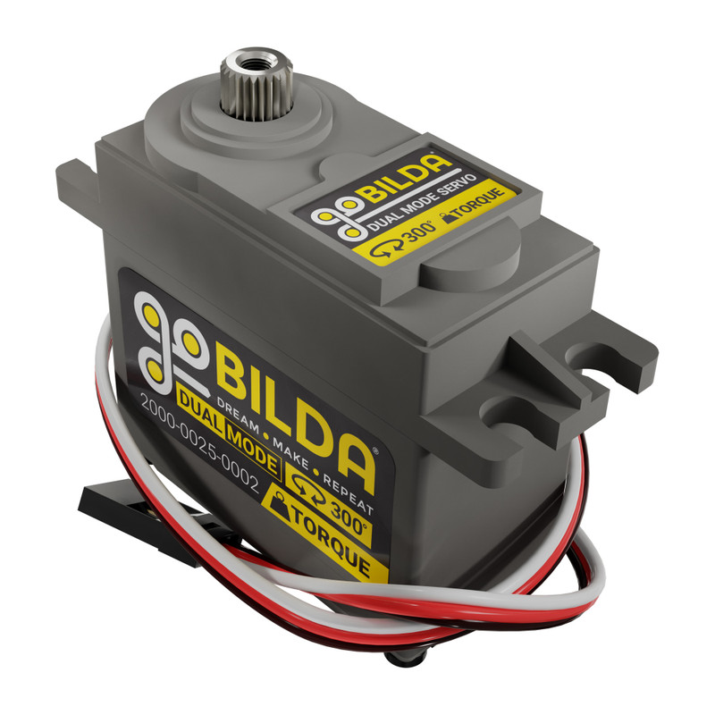

.. include:: <isonum.txt>

Servo Guide
===========

.. admonition:: Term

   .. glossary::

      Servo
         A small DC motor attached to servo gears that is very finely controllable and interfaces via a 3 wire PWM connector. Servos are generally used in FTC\ |reg| for high-precision applications - for example, actuating a claw or lightweight arm. Typically servos have limited range of rotation (180\ |deg| is common). The output has splines, which are the rigid teeth that are on top of the servo.

Servos are commonly used in RC cars (steering) and RC planes (moving ailerons). In FTC, servos are typically used for claws, grabbers, and arms.

   A common servo, the goBILDA Dual Mode Servo

.. note:: Historically, servos were designed for fine-tuned and accurate movement in low-load applications, not high-load or fast rotation applications. However, modern high-performance servos (often designed and marketed specifically towards FTC teams) have pushed the limits of how powerful a servo can be, resulting in many teams using one or more high-power servo(s) to power mechanisms that do not need the power of a full motor, such as horizontal extensions and active intakes.

There are many servos from different manufacturers, which vary widely in price, performance and value. Fortunately, virtually all servos use the standard 3-wire connector, and accept the same kind of controlling signal (PWM signal at 50 hz). Each REV Expansion Hub provides 6 servo ports, so you can plug in a servo from any manufacturer. Also, there is a standard size for servos for FTC use, so mounts can be interchanged between manufacturers.

Commonly used servos used in FTC are the `goBILDA Dual Mode Servos <https://www.gobilda.com/standard-size-servos>`_ and REV Smart Robot Servo, but you should check out other servos as well. Picking the right servo for your application is a question that's almost impossible to give a blanket answer for. To learn more, please read the :doc:`choosing-servo` section.

The most prevalent problem with servos is durability. Internal servo gears in cheaper servos strip easily when subjected to shock loads. Servos are also often poor at handling lateral loads or bending of the shaft. To avoid having to frequently replace servos, choose ones with steel gears and use :term:`ServoBlocks` or your kit's equivalent to prolong longevity.

.. toctree::
   :maxdepth: 1

   choosing-servo
   usage-tips
