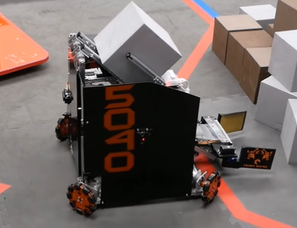
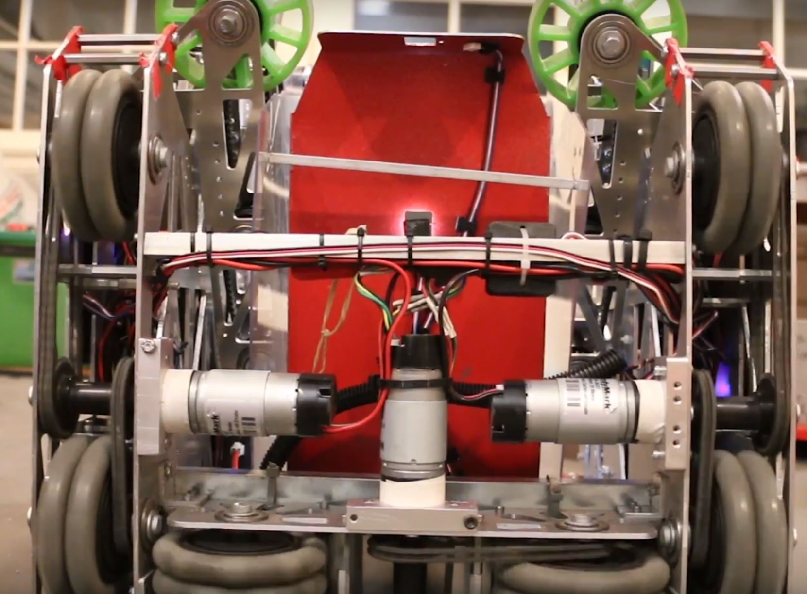

=====================
Holonomic Drivetrains
=====================
Mecanum Drive
=============
Mecanum drivetrains consist of four mecanum wheels which are powered
independently by one motor.
This configuration angles the velocity of each wheel,
allowing the robot to strafe (move side-to-side).
The primary advantage to mecanum drive is the maneuverability it affords,
especially because the robot can strafe instead of turn and drive.
The rollers on mecanum wheels form a 45 degree angle with the wheel’s axis of
rotation, which means that mecanum drivetrains can’t strafe as fast as they can
drive forward.
This can be explained by discussing the forces involved.
When each wheel rotates, it applies a friction force to the ground,
which moves the robot.
When moving forward, both sets of left wheels rotate in the same direction at
the same speed, and both sets of right wheels rotate in the same direction at
the same speed, meaning that the forces do not oppose each other.
However, when strafing, neither the two left wheels nor the two right wheels
are rotating at the same speed.
In many cases, they even rotate in opposite directions.
These two opposing forces cause the rollers to slip more and more,
which angles the robot’s velocity at the expense of traction
(more slipping results in a loss of speed).
However, the wheels do still slip when moving forward but not as drastically as
they do when strafing.
This is the primary disadvantage to mecanum drivetrains: they tend not to have
much pushing power and thus, are vulnerable to defense by a sturdy tank drive.
Due to the fact that mecanum wheels are more likely to slip because of the
diagonal rollers, an optional addition to mecanum drives is a separate odometry
mechanism in order to track the robot’s location during autonomous.

It is important to note that in order to maximize the efficiency and stability
of mecanum drives, when viewed from above, the rollers of each wheel should
point towards the center of the robot, forming an X shape,
rather than a rhombus.
The primary reason for this is that it allows the drivetrain to turn
significantly faster than it would otherwise be able to.
When using the suggested setup, when viewed from the robot’s underside,
the rollers form a rhombus.
This allows the force applied by the wheels on the ground to act tangent to the
turn radius, leading to faster turning.

Advantages
----------

* Fantastic maneuverability and agility due to strafing, can avoid defense very
  well
* Good acceleration, can have high top speed
* Very versatile drivetrain for nearly any game

Disadvantages
-------------

* Suffers in traction, as mecanum rollers have a lower coefficient of friction
  than traction wheels; cannot traverse terrain
* Able to be pushed around on defense
* Wheels must be powered independently, so there is no redundancy

.. figure:: images/holonomic/gobilda-mecanum-direction.png
    :alt: Diagram of mecanum wheel directions
    :width: 100%

    Configuration for mecanum wheels, courtesy goBILDA

Mecanum Wheels Miniguide
------------------------

There are plenty of mecanum wheels on the market,
and it can be very daunting to choose between the many vendors.
An important feature is the type of mechanism that facilitates the motion,
either **bushing** or **bearing**.
Bearing based mecanum wheels often have superior strafing because there is less
resistance for the rollers to overcome.
Another important note is that some FTC teams invest in 6 inch mecanum wheels
instead of 4 inch mecanum wheels, often at a much higher price.
**It is highly recommended that teams stick with 4 inch mecanum wheels**.
Here is a general list of the mecanum options ranked in order of
recommendation.

1. `goBILDA Mecanum Wheels`_ ($105 with team discount):
This recent addition to the lineup has become one of the strongest options for
its variety of positive attributes.
goBILDA Mecanum wheels are based on the tried and tested Nexus bearing mecanum
wheels, which means it has fantastic strafing.
It is also very robustly built, and is significantly more convenient to mount
to FTC standard build systems.
It has a built in goBILDA 16mm and 32mm hole pattern,
and has easy support for dead axle.
You can mount hubs in wheels and goBILDA mecanum wheels can easily mount to
1/2" Hex, 3/8" Hex, 12 mm REX, 6 mm D, 1/4" D, and many other shafts.
Hubs can also be mounted inside the wheel for very low profile mounting.
It is also the cheapest bearing mecanum on the market.
Due to its convenient mounting and fantastic strafing performance,
we recommend all teams consider goBILDA mecanum wheels.

2. `Nexus Bearing Mecanum Wheel`_ ($134):
This was the old gold standard,
and still has fantastic performance for the price.
This has identical performance with goBILDA mecanum wheels,
however is slightly less convenient to mount to.
However, these wheels feature the 1.875" bolt pattern commonly used in FRC
motion products.
It is also slightly heavier than goBILDA Mecanum wheels.
Many teams will 3D print adapters or build new cores for Nexus Mecanum wheels.
Even though the goBILDA mecanum offer advantages and very few disadvantages
over Nexus bearing wheels, these wheels remain a solid option.

3. `AndyMark Heavy Duty 4” Mecanum Wheel`_ ($225):
These are easily the most expensive mecanum wheels on the list.
These are bushing based mecanum, so they have decent strafing, albeit not as
good as the goBILDA and the Nexus bearing mecanum wheels.
What sets these mecanum wheels apart is the 80A roller material.
AndyMark HD mecanum wheels have higher traction than all other mecanum wheels,
which make them desirable for climbing terrain.
For example, during the Relic Recovery season,
teams had to climb a “balancing stone”,
and many teams chose to use the AndyMark HD mecanum wheels to be easily able to
climb the balancing stone.
However, in most cases, being able to more effectively strafe is more important
than having good traction.
For this reason, **teams are recommended to buy bearing based mecanum wheels
like the Nexus or the goBILDA mecanum wheels instead of the AndyMark HD wheels
due to the major price difference**.

4. `Nexus Bushing Mecanum Wheel`_ ($84):
This is the Nexus Bearing Mecanum wheel with bushings instead of bearings.
Before the introduction of the goBILDA mecanum wheels,
these were the best budget option, however,
it is now more sensible to spend the $21 premium to get the bearing goBILDA
mecanum wheels.

5. `VexPro Mecanum Wheels`_ ($119.96):
These mecanum wheels are most suited for vectored intakes on FRC robots.
They are relatively tough, but have somewhat poor strafing and are not quite as
durable as the other wheels higher on the list.
They are a decent choice if you already have them, but otherwise,
there is no reason to consider them.

6. `TETRIX Mecanum Wheels`_ ($113):
At the time of writing this guide, these haven’t been released so no verdict
can be reached.
However, they have a built in hub so they can be easily mounted on 6mm D shaft.
They are bushing based, and due to no testing and evaluation outside of TETRIX,
and its higher price than the goBILDA mecanum wheels, **we cannot recommend the
TETRIX Mecanum Wheels**.

7. `VEX EDR Mecanum Wheels`_ ($59.99):
These are the cheapest mecanum wheels,
but have a strange shaft standard (1/8" square) which require the use of 3D
printed adapters.
**There are not many reasons to purchase these wheels.**

8. `AndyMark Standard Duty Mecanum Wheels`_ ($92):
**DO NOT PURCHASE THESE WHEELS**.
These are terrible mecanum wheels.
They barely strafe and are super fragile.
Just buy goBILDA mecanum wheels for $13 more.

**Unrated:** `REV 75mm Mecanum Wheels`_ ($76.50 with team discount):
At the time of writing, these mecanum wheels were just released and teams have
not had a chance to test them.
They are bearing based, similar to the top-ranked wheels and have an included
adapter which allows them to attach to 5mm hex shaft.
Additionally, these mecanum wheels are 75mm (~3in) in diameter,
instead of the typical 4in.

.. _goBILDA Mecanum Wheels: https://www.gobilda.com/3606-series-mecanum-wheel-set-bearing-supported-rollers-100mm-diameter/
.. _Nexus Bearing Mecanum Wheel: https://www.superdroidrobots.com/shop/item.aspx/4-inch-nexus-mecanum-wheels-ball-bearing-set-of-4/1352/
.. _AndyMark Heavy Duty 4” Mecanum Wheel: https://www.andymark.com/products/4-in-hd-mecanum-wheel-set-options
.. _Nexus Bushing Mecanum Wheel: https://www.amazon.com/100Mm-Aluminum-Mecanum-Wheel-Right/dp/B01CTUT4GY
.. _VexPro Mecanum Wheels: https://www.vexrobotics.com/mecanum-wheels.html
.. _TETRIX Mecanum Wheels: https://www.pitsco.com/TETRIX-MAX-Mecanum-Wheels
.. _VEX EDR Mecanum Wheels: https://www.vexrobotics.com/vexpro/ftc/motion/edr-wheels.html
.. _AndyMark Standard Duty Mecanum Wheels: https://www.andymark.com/products/4-in-standard-mecanum-single-wheel?via=Z2lkOi8vYW5keW1hcmsvV29ya2FyZWE6OkNhdGFsb2
.. _REV 75mm Mecanum Wheels: http://www.revrobotics.com/rev-45-1655/

.. figure:: images/holonomic/8103-mecanum.png
    :alt: 8103 Null Robotics's mecanum drivetrain render

    8103 Null Robotics, Rover Ruckus, **using Nexus bearing mecanum**

.. figure:: images/holonomic/9829-mecanum.png
    :alt: 9829 MakBots's mecanum drivetrain

    9829 MakBots, Relic Recovery, using **VexPro mecanum**

.. figure:: images/holonomic/731-mecanum.png
    :alt: 731 Wannabee Strange's mecanum drivetrain render

    731 Wannabee Strange, Rover Ruckus, using **AndyMark HD mecanum wheels**

X-Drive
=======
X-Drive is a holonomic omni-wheel based drivetrain.
This type of drive involves mounting 4 omni wheels at the corner of the robot
at a 45 degree angle.
One notable difference between X-Drive and mecanum is strafe speed.
While, as mentioned in the mecanum section, the ratio of strafe speed to
forward speed is noticeably less than 1, the ratio on an X-Drive is exactly 1
due to the rotational symmetry of the wheel placement.
This means that an X-Drive bot’s strafe speed and forward speed are equivalent.
The drivetrains are slower, however, when strafing at 45°
(approximately :math:`\frac{\sqrt{2}}{2}` of its forward speed).
Even though X-drive has good turning and acceleration,
the main downside to the drive is packaging/form factor.
Packaging refers to how easy/convenient the drivetrain fits into the overall
design of the robot.
Ideally, the drivetrain should take up as little space as possible to make it
easier to design mechanisms around.
Because the omni wheels are offset, packaging a X-Drive is more difficult than
other types of holonomic drive like mecanum or H-Drive.
Also because of the strange packaging,
it is relatively difficult to cleanly transfer power from the motors to wheels,
meaning that most X-Drives end up being direct-driven,
which is bad on the lifespan of the motor gearbox.

Advantages
----------

* Good maneuverability and agility
* Good acceleration

Disadvantages
-------------

* Prone to defense, pushed around easily
* Slower top speed than forward-facing wheels
* Often uses direct drive due to awkward form factor

.. figure:: images/holonomic/731-xdrive.png
    :alt: 731 Wannabee Strange's X-Drive

    731 Wannabee Strange, Velocity Vortex

    5040 Nuts and Bolts, Relic Recovery

H-Drive
=======
H-Drive (also known as U-drive, depending on the configuration)
is a holonomic type drive that uses all omni wheels.
H-Drive relies on a set of “strafer wheels” that are perpendicular to the
forward/backward wheels to achieve strafing.
H-Drive is similar to a fusion of a tank drivetrain while retaining the
maneuverability and strafing of holonomic drivetrains.
H-Drive is theoretically very easy to code, but most teams employ some sort of
gyro correction to strafe straight,
although it is not necessary with proper weight distribution.
H-Drive has a number of possible motor configurations -
1 or 2 motors can be put on each forward drive pod,
and one or two motors can be put on the strafe wheels.
In this configuration,
H-Drive has slightly reduced acceleration compared to mecanum drive.
For the highest possible reliability,
many FRC teams will suspend their strafe wheels on a rocker system to ensure
that all wheels are in contact with the ground while the robot is not strafing.
By far the biggest advantage of H-drive is its ability to accommodate multiple
motor distributions.
For instance, if you want to dedicate only 3 motors to your mechanisms and you
have a motor left over, using a 1 strafe motor, 4 drive motor configuration is
absolutely viable.
Or if you dedicate 5 motors for your mechanisms,
H-drive with 2 drive motors and 1 strafe motor is definitely optimal.

Advantages
----------

* Combines tank and holonomic drivetrain advantages
* Can be used with 3 or 5 motors
* Good traction and top speed
* Great maneuverability and agility

Disadvantages
-------------

* Strafing is slightly less effective than mecanum
* Complex suspension occasionally needed, depending on design

    9804 Bomb Squad, Relic Recovery
