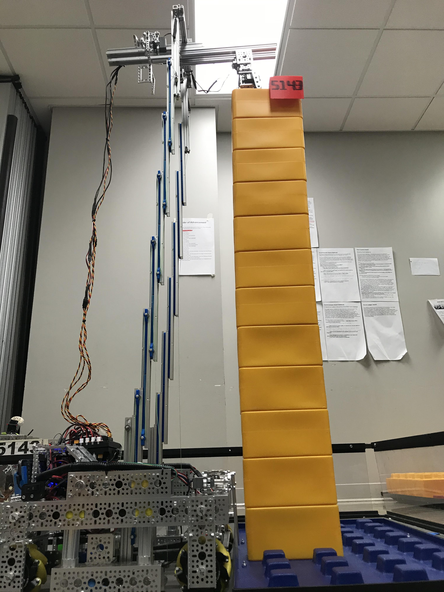

=============
Drawer Slides
=============
You’ve *definitely* used a drawer slide before -
at least two of them are mounted to almost any drawer that you’ve opened.
Teams use these drawer slides for linear motion,
often stacking them using 3D printed spacers to achieve plenty of extension.
These slides are available from a number of different vendors,
and come in many varieties, so choosing the right slide can seem overwhelming.
Steel drawer slides are common, but can be hard to mount,
as they aren’t made to be stacked.
Aluminum drawer slides, such as the MiSUMI slides or the Hafele slides listed
below, are generally the best option for teams.
The Hafele slides are less than $3.50 for a pair,
but the MiSUMI rails offer much smoother motion and have a better ball bearing
system.
Igus is a brand known and trusted by robotics teams and manufacturers,
but their parts are certainly not cheap, and can reach into the $100+ range.
**If linear slide kits aren't for you, we recommend the MiSUMI slides for newer
teams**, especially if you are using REV, as MiSUMIi uses the M3 standard.
**Drawer slides should be mounted oriented vertically, like in an actual
drawer.
They can be mounted horizontally, but this is not recommended as they will sag
much more.**

Listed below are the recommended drawer slides.

Steel-rolled cabinet drawer slides
==================================
Available from your local hardware store, steel slides aren’t a bad option for
FTC teams, as they are heavy-duty enough for most use cases.
However, these kinds of slides are much heavier than other aluminum slide
options.
Furthermore, these slides are not designed to have bearings or a second slide
attached to them, because they only contain mounting for a standard drawer.
Thus, these slides require drilling holes in order to mount the necessary parts
for linear extension.

Advantages
----------

* Commonplace at any hardware store
* Not very expensive

Disadvantages
-------------

* Heavier than other slide options (steel as opposed to aluminum)
* Sliding is usually good but not great
* Hard to adapt to building systems
* 3D printed spacers may be required

MiSUMI Telescopic Slide Rails
=============================
The `MiSUMI slide rails <https://us.misumi-ec.com/vona2/detail/110300072130/?HissuCode=SAR240>`_
are preferred by many top-tier teams because they are sturdy, very reliable,
and ridiculously smooth due to the ball bearing system.
**MiSUMI slides are able to withstand a significant amount of load with little
flex**.
They are also low-profile, and have a M3 mounting pattern,
making it easy to attach to REV extrusion.
However, MiSUMI slides have a higher price point, and it is often difficult to
attach one slide to the next.
An easy solution is to attach the end of one slide piece to REV extrusion, and
do the same with the next slide.
Then attach the REV pulley bearing on the top of the extrusion piece for the
string to run through.
Some teams have 3D printed an insert that goes between each slide instead of
using the 15mm extrusion piece,
as it takes up quite a bit of space.
In order to attach the slides to anything,
teams will need to purchase **countersunk M3 screws** from McMaster-Carr.
For attaching to REV extrusion, buy 6mm M3 screws with the M3 nut
(**not locknut**) to insert inside the extrusion.
As a tip, try to protect chips or sawdust from falling into the slides,
as the sliding will have a noticeable difference.

MiSUMI sells two different types of slides: SAR2 and SAR3.
The SAR2 is a two-piece slide,
while the the SAR3 is a three-stage slide
(has intermediate slider to increase the extension of the slide).
Teams have used both successfully, and there isn’t neither option is clearly
superior.

Rail length: 400 mm, part number SAR240 (SAR2) or SAR340 (SAR3)

Advantages
----------

* Best slide smoothness due to ball bearing cartridge
* Very little slide flex, robust build quality
* Can handle relatively heavy load use cases (within reason)
* Compatible with REV 15mm extrusion system

Disadvantages
-------------

* Not cheap
* Tricky to adapt if not using REV
* 3D printed spacers may be required

Hafele drawer slides
====================
`Hafele drawer slides <https://www.cabinetparts.com/p/hafele-drawer-slides-side-mount-drawer-slides-HAF42058373>`_
are a low-cost option for teams not wanting to invest in MiSUMI slides.
Hafele slides are less smooth than MiSUMI,
which is to be expected given their low price point.
They become unusable when handling large amount of load
(greater than 57 pounds).
However, they are great for low/medium-load use cases.
Hafele slides are a great option for teams looking for a cheap alternative to
the other more expensive options at the cost of robustness.

Advantages
----------

* Cheapest drawer slide option
* Great value for low/medium load applications

Disadvantages
-------------

* Not the best slide smoothness
* Suffers in build quality (after all, it is very cheap)

Igus
====
Igus slides used to be a popular option among top teams for linear extension
back in the earlier days of FTC.
However, with the arrival of MiSUMI slides,
they have decreased in popularity due to their tendency to bind.
However, if your team is looking for a high-load or special use case,
by all means explore this option.

.. figure:: images/drawer-slides/7236-sar3.png
    :alt: 7236's Rover Ruckus robot with its slides extended

    7236 Recharged Green, Rover Ruckus, Misumi SAR3

.. figure:: images/drawer-slides/6929-sar3.png
    :alt: 6929's Rover Ruckus robot with its slides extended

    6929 Data Force, Rover Ruckus, Misumi SAR3

    5143 Xcentrics, Skystone, Misumi SAR2

.. image:: images/drawer-slides/11115-hafele.png
    :alt: 11115's Relic Recovery robot with its relic slides extended

.. figure:: images/drawer-slides/11115-hafele-extended.png
    :alt: 11115's Relic Recovery robot with its relic slides mostly retracted

    11115 Gluten Free, Relic Recovery, Hafele slides

