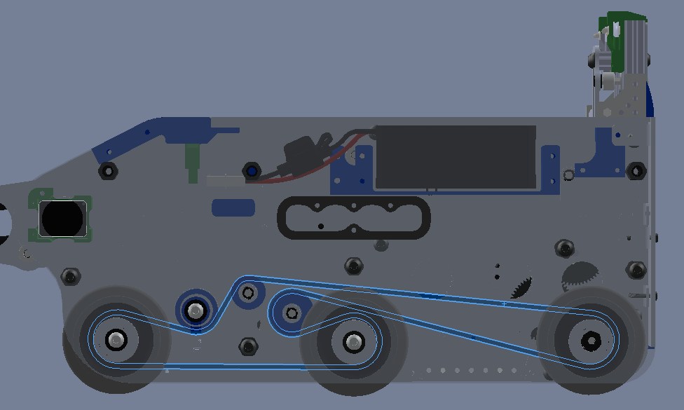

===========
Timing Belt
===========
When you think of a belt,
you’re probably thinking of a very important men’s fashion accessory.
However, there’s another type of belt, and it’s way more relevant to robotics -
the Timing Belt.
If you’ve ever tinkered with the insides of a car before,
you probably recognize timing belts as an important component designed to keep
everything under the hood in sync.
While a timing belt may complete a similar objective to chain,
its characteristics and strengths are very different.
Timing belts use a series of small,
wide teeth to engage a pulley with a number of matching grooves.
They earn their name because they can be very precise,
transmitting power with absolutely no slop and ensuring a snug connection
between shafts.
They’re lighter and more compact than chains,
but they lack the customizability of their bulkier brother -
belts come in a closed loop of predetermined length,
and there’s no changing that length on the fly.
Like chain, belt is identified by its **pitch** -
common pitches found on FTC robots include
HTD 5mm, HTD 3mm, GT2 3mm, and XL 0.2”.

When using timing belts, correct tension is very important.
There are two main ways to get your tension right.
The first is easy - goBILDA and Actobotics already have belts integrated into
their hole patterns.
You can buy correctly sized belt directly from each vendor,
and your tension will be perfect as soon as the belt is installed.
As your designs gain complexity, so will your belt runs -
maybe there are more than 2 pulleys,
and maybe your pulleys are all different sizes.
To compensate for this, the second way to ensure tension is to use a dynamic
tensioner, similar to those found in complex chain runs.
To design for these tensioners,
we recommend planning more complex belt runs in CAD before building them in
real life.

Terms
=====

* Pitch diameter (PD) refers to the imaginary circle which is traced by the
  middle of the belt as the pulley rotates.
  The outer edge of the circle is halfway between the outer face of the belt
  and the top face of the pulley groove. :math:`PD = (tooth * pitch)/\pi`
* Pitch refers to the arc length between the centerlines of two adjacent pulley
  grooves.
  Pitch is simply the amount of pitch diameter in inches per tooth.
* Outside diameter (OD) is an imaginary circle which is traced by the top face
  of the grooves as the pulley rotates.
  **For pulleys, OD<PD.**
* Pulley clearance diameter refers to the outer diameter of the pulley + belt
  when the belt is meshed properly to the pulley.
  The pulley clearance diameter is larger than both PD and OD and should be
  used to check for interference with other mechanisms.

Center-to-Center calculations
=============================
Just like chain, the actual calculations for precise c-c distances for belts are
complicated.
Here is a `calculator <https://www.engineersedge.com/calculators/Pulley_Center_Distance/toothed_pulley_center_distance_calculator_12900.htm>`_
or `two <https://www.sudenga.com/practical-applications/figuring-belt-lengths-and-distance-between-pulleys>`_
that simplifies the work.

.. math::
    C=\frac{P}{8}*`(2L-(N+n)+\sqrt{(2L-(N+n))^2-\frac{8}{\pi^2}*(N-n)^2})

    L=\frac{2C}{P}+\frac{N+n}{2}+\frac{P(\frac{N-n}{2\pi})^2}{C}

* :math:`C=` center-to-center distance, inches
* :math:`L=` belt length in pitches
* :math:`P=` pitch of belt
* :math:`N=` number of teeth in large pulley
* :math:`n=` number of teeth in small pulley

.. math::
    C=\frac{L-1.57(D+d)}{4}+\sqrt{[(\frac{L-1.57(D+d)}{4})^2-\frac{(D-d)^2}{8}}

* :math:`D=` chosen diameter of large pulley
* :math:`d=` chosen diameter of small pulley
* :math:`L=` length of belt
* :math:`C=` center distance
* (all units must be the same)

Belt Wrap
=========
**Belt should, at the very least, have 90° of contact with the pulley.
The best practice is to have 180° or more of contact**,
as it is very unlikely to fall off with proper tensioning.
Belt skipping, especially on drivetrains or arms,
is very possible without proper belt wrap or tensioning.
When tensioning belt, be sure to not undertension or overtension it.
Undertensioning belt can result in the belt falling off the pulley or belt
skipping, where the belt can skip along the pulley.
Overtensioning belt often results in the motor burning out, or less seriously,
a loss of efficiency.
Push along the belt, and if it moves slightly without significant resistance,
chances are you’ve done it correctly.
If it’s too tight, then the belt will barely move under a gentle press.

Best practices for wrap
-----------------------
.. figure:: images/belt/belt-wrap-1.png
    :alt: Properly done belt wrap without tensioners

    Ethan Doak, goBILDA

.. figure:: images/belt/8103-dt.png
    :alt: A drivetrain by 8103 using belt

    8103 Null Robotics, offseason prototype, properly done belt wrap with tensioners

Advantages:
===========

* **Pulleys can be made at home**.
  Pulleys can be 3D printed for most situations,
  allowing you to cut costs and create unique tooth counts easily.
* **Belts are very strong**. They’re reinforced with fiberglass cords that are
  incredibly hard to break, giving belts immense strength.
  (*If you break a belt, it’s most likely because it was out of alignment or
  tensioned far too tightly*.)
* **When tensioned correctly, there is absolutely no slop**.
  Engines use timing belt for a reason -
  because it’s the best possible solution for them to perfectly synchronize
  their shafts.
  There’s nothing that matches the rotational accuracy of a properly tensioned
  belt.
* **Belts are efficient and quiet**.
  Compared to the loud shredding sound of a chain run,
  belt runs are dead silent,
  and they’re more efficient than chains
  (although this makes zero practical impact in the robotics use case).

Disadvantages:
==============

* **Belts aren’t customizable**.
  You buy a belt of a specific length and you’re stuck with that length until
  you buy another one.
  This isn’t too bad if you’re planning out your robot properly,
  but chain will work better for prototypes where the chain length will be
  changing often.
* **Belts can be wider than alternatives (especially chain)**.
  This probably won’t have much of an impact, but belt can often be wider than
  other power transmission methods, so it may not always fit.
* **Belts can be expensive (but you’ll save money with pulleys)**.
  While you can buy chain 10 feet at a time,
  you’ll most likely be buying each belt brand new.
  While this can get expensive, you’ll be saving money on pulleys.

.. figure:: images/belt/belt-wrap-2.png
    :alt: Properly done belt wrap with tensioners

    7236 Recharged Green, Rover Ruckus

    8417 Lectric Legends, Rover Ruckus
