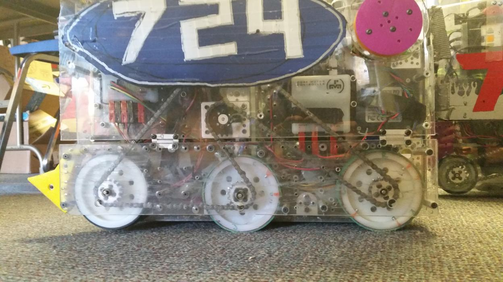
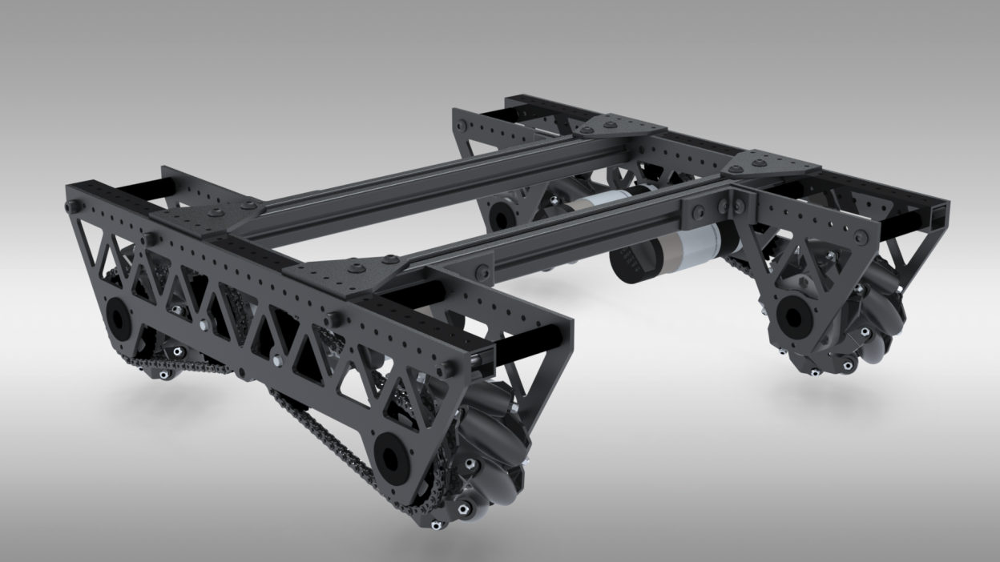
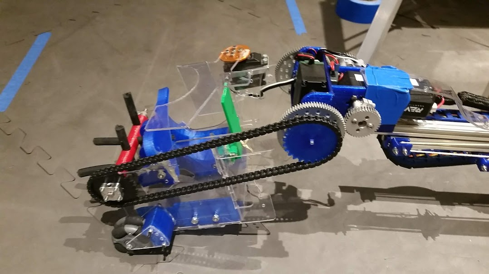

============
Roller Chain
============
When your shafts aren’t right next to each other,
roller chain and sprockets will allow you to transmit power securely between
your shafts.
Roller chain is made up of a series of links joined by pins.
Each link can rotate around its pins,
creating a dynamic loop that can conform to any shape.
The pins in the chain engage the gaps between teeth on each sprocket.
If you’ve ridden a bike, chances are that you’ve already seen roller chain -
the chain on your FTC robot is similar, but it’s probably a different **pitch**
(different size).
Chains most commonly used in FTC are #25 or 8mm pitch.

When using chain, often there is a master link.
This is a special type of link that has a removable end capsule in order to
shorten the chain.
However, as it is removable,
it is not a very reliable chain link and can loosen and fall off under
prolonged usage.
There have been teams who have had master chain links fail during competition,
costing them a match in the elimination rounds.
A chain breaker eliminates the need for master links because it can break and
join chain at any point.
Chain breakers do so by pushing out the pins in the link and re-inserting them
back.

**It is highly recommended that teams purchase a chain breaker
(we recommend the DarkSoul chain breaker) instead of using master links,
which are prone to failure.**

.. figure:: images/chain/master-link.png
    :alt: A disassembled master link

    The removable master link is shown on the right.

Terms
=====
Sprockets
---------

* Chain number refers to the type and size of chain that is compatible with the
  sprocket.
  Typically, #25 chain is used in FTC, though there is also 8mm chain.
* Chain pitch refers to the distance between the pin centerlines in a chain
  link.
* Pitch diameter (PD) refers to the diameter of the imaginary circle that
  passes through the center of the pins when the sprocket rotates.
  **For chain, PD<OD<CCD**.
* Outside diameter (OD) refers to the diameter of the circle that is generated
  by the top faces of the teeth when the sprocket rotates.
* Chain clearance diameter refers to the diameter of the circle generated when
  the chain is fitted over the sprocket.
  It is larger than both PD and OD.

Roller Chain
------------

* Outside link refers to the two outside plates connected by two pins.
  The pins are inside the bushings and can rotate freely.
* Inside link refers to the two inside plates connected by two bushings.
  The bushings hold the pins in the outside link.
* Pitch refers to the distance between the center of the pins.
  The most common pitch is #25, or 1/4” inch.

Center-to-Center calculations
=============================
The equation to calculate center-to-center for chain is quite complicated.
Many `online calculators <http://www.botlanta.org/converters/dale-calc/sprocket.html>`_
can calculate C-C distances without going through the tedious calculations.
However, the complete formula is below.

.. math::
    C=\frac{P}{8}*`(2L-(N+n)+\sqrt{(2L-(N+n))^2-\frac{8}{\pi^2}*(N-n)^2})

    L=\frac{2C}{P}+\frac{N+n}{2}+\frac{P(\frac{N-n}{2\pi})^2}{C}

* :math:`C` = center-to-center distance, inches
* :math:`L` = chain length in pitches
* :math:`P` = pitch of chain
* :math:`N` = number of teeth in large sprocket
* :math:`n` = number of teeth in small sprocket

Chain Wrap
==========
**Chain should, at the very least, have 90° of contact with the sprocket.
The best practice is to have 180° or more of contact**,
as it is very unlikely to fall off with proper tensioning.
Chain skipping, especially on drivetrains or arms,
is very possible without proper chain wrap or tensioning.
When tensioning chain, be sure to not undertension or overtension chain.
Undertensioning chain can result in the chain falling off the sprocket or chain
skipping, where the chain can skip along the sprocket.
Overtensioning the chain often results in the motor burning out,
or less seriously, a loss of efficiency.
Push along the chain run,
and if the chain moves slightly without significant resistance,
chances are you’ve done it correctly.
If it’s too tight, then the chain will barely move under a gentle press.

Best practices for wrap
-----------------------

    724 Rednek Robotics Wun, Relic Recovery

    8103 Null Robotics, Rover Ruckus

Advantages
==========

* **Chain can take a beating**.
  No matter what your application is, metal chain is usually up for the
  challenge.
  #25 chain can hold up to 930lbs before breaking,
  and there’s nothing you’ll do in FTC that will exert that force.
  (If your chain does break, it’s most likely due to a faulty Master Link or
  sprockets that are not correctly aligned.)
* **Chain can be however long or short as you wish**.
  If your ratio changes or your shafts move,
  it’s easy to adapt your chain run -
  just break the chain and put it back together at its new length.
  You can often do this without even removing the chain from your robot.
* **Chain can be pretty precise**. When properly tensioned, roller chain
  doesn’t have very much slop.
  However, you really need to get your chain tension right to reduce slop,
  and you’ll probably want an adjustable tensioner for when the chain
  stretches.
  This can be done easily if using extrusion systems, as the sprocket can be
  adjusted for tension.

Disadvantages
=============

* **Chain stretches over time**. As it’s used, the connections between the
  links and rollers can stretch a bit.
  While it doesn’t look like much, this stretching can introduce lots of slop
  into your chain run and even derail it in some cases.
  You’ll most likely need an adjustable tensioner to keep your tension over
  time - some teams have used spring-loaded dynamic tensioners to automatically
  compensate for any changes.
  **The smaller the sprocket, the faster the chain stretch**.
  This is because when the chain is run on a smaller sprocket,
  more force is applied due to a smaller radius.
* **Chain wrap, especially in one chain run, can be problematic**.
  Typically, teams use either one or two chain runs (pieces of chain) per
  drivetrain side. However, one chain run can require more than one idler
  sprocket and get very complex in order to maintain proper chain wrap.
* **Sprockets are really big**. If you want a really high reduction using
  chain, you’ll pay for it in the space that it takes up.
  Sprocket teeth are much larger than gear or pulley teeth,
  so your reductions are going to be much larger.

.. figure:: images/chain/7244-chain.png
    :alt: A metal chain for a drivetrain by 7244, OUT of the BOX Robotics

    7244 OUT of the BOX Robotics, Relic Recovery

    9794 Wizards.exe, Rover Ruckus, plastic chain on intake

.. figure:: images/chain/chain-wrap-3.png
    :alt: Properly done chain wrap with tensioners

    Properly done chain wrap with the REV system
