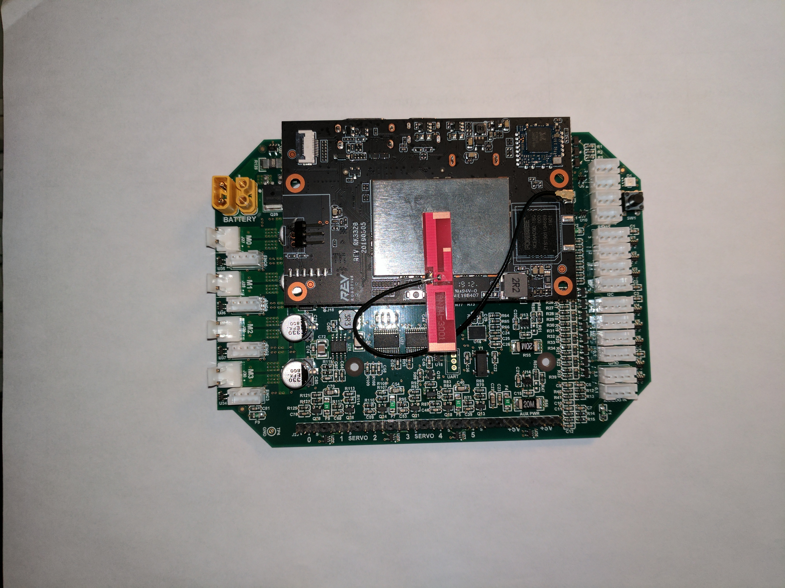
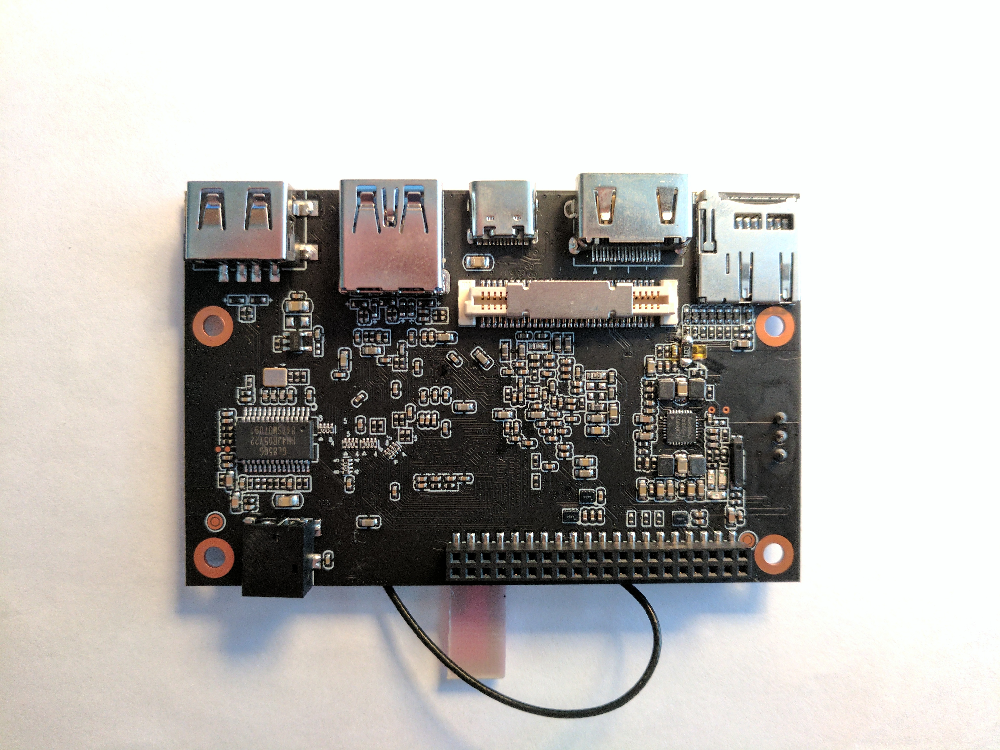

.. include:: <isonum.txt>

Control System Electronics
==========================

This page contains a breakdown of the known electronics in the control system, as well as any notes regarding them

Expansion Hub Internals
---------------------------------

.. warning:: Don't take apart a Control or Expansion Hub unless you really know what you are doing. They can be damaged in the process, especially if one does not know how to properly reassemble it. THIS WILL VOID YOUR WARRANTY!

Lynx Board
^^^^^^^^^^

"Lynx" is the codename of the board within the Expansion Hub and Control Hub that interacts with hardware. References to "Lynx" are made in the FTC\ |reg| SDK refer to this board. It appears to have been developed by both REV and DEKA, possibly for use in *FIRST*\ |reg| Global (judging by the *FIRST* Global silkscreen on the PCB).

.. warning:: Don't take apart a Control or Expansion Hub unless you really know what you are doing. They can be damaged in the process, especially if one does not know how to properly reassemble it.

.. figure:: images/control-system-internals/lynx-board.jpg
   :alt: A Lynx board that was removed from its case

   A Lynx board that was removed from its case

Processor
^^^^^^^^^

The main processor of the Expansion Hub is a Texas Instruments ARM Cortex M4 running at 80 MHZ.

Ports
^^^^^

The expansion hub has the following ports

- Two UART Debug Ports

  - The top port outputs a continuous high speed CSV stream of data from the various subsystems in the hub.
  - The bottom port outputs data at a baud rate of 115200 at a user specified verbosity.
- Four I2C Ports

  - These ports are 100/400 kHz compliant and are connected to a separate bus so there is no need to be concerned about address collisions
  - There are integrated pull up resistors on this port
- Eight DIO Ports

  - 3.3V only, current limited, can briefly supply more than the rated current spec. Pulled up internally.
- Four Analog Ports

  - 5V compliant, you can use a level shifter to supply 5v to the sensor, but take care the analog line bypasses the level shifter. The VIN and GND lines must pass through the level shifter for it to work however.
- Six Servo Ports

  - The 5V supply on the servo ports is default OFF, and will only enable once a servo is used. All six 5V pins are switched on and off together, and disabling PWM on one port will switch all of the ports off unless another servo is used.
- Two 5V Power Ports

  - The 5V supply is shared with the servos
- Four Motor Ports

  - Current limited and have overtemperature protection on the chip. The output does not brake the h-bridge during the PWM off cycle. What this means is that there might be linearity issues while deaccelerating, because of momentum in the motor.
  - The motor driver is a ST Microelectronics VNH5050 motor driver IC, which is capabile of handling well over the maximum amount of current an FTC motor can draw. It has integrated current sensing and has been used since the modern robotics era. It has built in thermal and current safety limits. This motor controller has been used for years, and may even date back to the early HiTechnic based control system.
- Four Encoder Ports

  - **IMPORTANT: Only two of the encoder ports (Ports 0 and 3) appear to be connected via hardware and are reliable at high speed**. There are two methods of connecting an encoder internally to the texas instruments microprocessor, through hardware and software. Hardware ports use the integrated quadrature decoder chip and are extremely accurate at high speed, whereas encoders decoded in software are not reliable at high speeds. As a result, high Count Per Revolution (CPR) encoders, those with more than 4000 counts per revolution, should NOT be used on ports 1 and 2, the ports connected in software.
- Two XT30 Connectors

  - Care should be taken when moving around cables as these connectors have been known to fail and break off the board.
  - In addition, XT30s will wear and get loose with time. Hot glue is recommended if cables come loose.
- Mini USB B Connector

  - Capable of full speed USB 2.0, and 5V output to charge a phone. The 5v output may be unreliable, it depends on the hub.
- Internal Connector

  - This connector is what is used to connect to the android daughterboard. It presumably has UART capability as well as power and ground. All expansion hubs have this connector, whether or not they are a control hub. Presumably this is because the control hub and REV hub were developed together at the same time.

Control Hub
^^^^^^^^^^^

The Control Hub is an Expansion Hub with an embedded Android single-board computer daughterboard connected to it. This enables it to not need a separate Robot Controller phone, as the daughterboard functions as the Robot Controller. Internally, LynxCommands are sent over from the daughterboard to the Lynx board over an internal UART connection.

The control hub daughterboard contains a RK3328 Quad-core ARM Cortex-A53 running a custom version of Android/Linux. This software is open source, but has nothing notible except for some software that manages the wifi access point. It has no thermal spreading, such as heat sinks, on the chip, which can cause thermal throttling when heavy applications such as tensorflow are used.

.. warning:: Don't take apart a Control or Expansion Hub unless you really know what you are doing. They can be damaged in the process, especially if one does not know how to properly reassemble it.

   The single board computer and Lynx board from a Control Hub

   The android board, removed from a control hub
