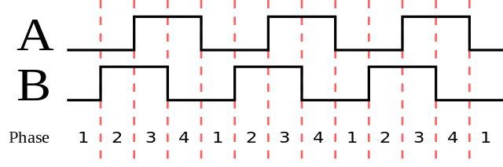

.. include:: <isonum.txt>

SDK Motors
==========

The SDK offers several methods of controlling and communicating with motors, as well as a couple of hidden methods that can be easily accessed.

General Explanation
-------------------

Motor Controller
^^^^^^^^^^^^^^^^
All motor ports are controlled with what is called an H-bridge motor controller, a circuit that can be used to vary the output voltage as well as signage (negative or positive) of the voltage. Negative voltage through a DC Motor reverses a motor, whereas positive motor will make the motor go forward. SDK Motor power (from -1 to 1), represents a multiplier of the input voltage that is output through the motor port. The different voltages are created via PWM, where the port is turned on and off rapidly to create a lower average voltage.

In addition, the zero power behavior of the motor, that is the behavior of the motor when no power is applied, can be configured. In FLOAT mode, the motor controller simply turns off, providing minimal additional resistance. In BRAKE mode, the two motor leads are shorted together internally. Due to the inherent property that all DC brushed motors generate electricity when the shaft spins, shorting the leads causes a reverse power that stops the motor quickly and is resistant to external forces.

.. note:: The motor controller uses the input voltage, this means on a 13 volt battery, setting the power to 1 will create an output voltage of 13 volts. Similarly, on an 11 volt battery, a power of 1 will create an output voltage of 11 volts.

Motor Encoder
^^^^^^^^^^^^^

.. important:: There is no real standardized terminology when dealing with quadrature encoders. Here, we use the terms "count" and "tick" to represent a single rising or falling action in the quadrature wave. You may also see some datasheets list "pulses", which can indicate anything from 1 "count" to 4 "counts". Be careful when reading datasheets!

FTC\ |reg| Encoders use the two wire quadrature format for transmitting relative encoder information. In quadrature, there are two signal wires, A and B. When moving, both A and B generate square waves that are 90 degrees apart, that is one square wave starts half way through the other square wave, and ends half way through the other square wave. When traveling in one direction, the A wire square wave leads the B wire square wave, and in the other direction the B wire square wave leads the A wire square wave. The two waves are combined in XOR to produce the output wave, where each rising and falling action is one "tick", and the faster the wave the faster the encoder is moving.

The REV hub counts the pulses and calculates velocity by using a 5 value "ring buffer", which has a new value added to it every 10 ms. These 5 values are then used to calculate the current velocity.

.. warning:: It is recommended that quadrature encoders be hooked up to special hardware decoded ports to allow them to be read correctly. The expansion hub contains special hardware for reading quadrature encoders, but because there are only two of those controllers, two of the pins are hooked up in "software" instead (the ports are decoded in software instead of in hardware). Effectively, this means that ports 0 and 3, the two ports connected to the special quadrature ports, will always read accurately. **Ports 1 and 2 are connected to the less accurate "software" ports, meaning that with high CPR encoders (encoders that produce more than 4000 counts per revolution, such as the REV Through Bore Encoder or Talon SRX Encoder) they can "lose steps" and drift.**

   An example of a quadrature wave, with channel A leading channel B. Each count is a "count" or "tick"

Hidden Methods
--------------

DcMotorEx
^^^^^^^^^
All REV hub DC motors are instances of ``DcMotorEx``, which exposes some more methods to the user, such as velocity control and current draw measurement.

.. note:: There is no downside to using DcMotorEx, in order to convert a DcMotor to a DcMotorEx the user simply just needs to cast the DcMotor returned by the ``hardwareMap`` to a DcMotorEx.

Tips
~~~~

- While current readings are not bulk read, current alerts (``isMotorOverCurrent()``) is bulk read.
- PID/PIDF coefficients use internal units for the output, a two byte short from -32767 to 32767, instead of the user -1 to 1.
- The default ``getVelocity()`` method returns the encoder velocity in ticks per second.
- The ``RunMode`` ``STOP_AND_RESET_ENCODERS`` is not actually a run mode. Instead, it just sets the power to zero and sends a ``LynxResetMotorEncoderCommand``. This command can be issued manually if one wants to easy reset a motor encoder without changing the run mode.
