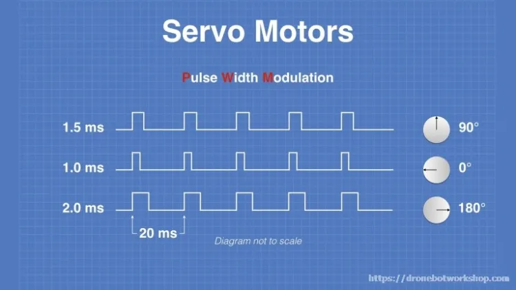

.. include:: <isonum.txt>

SDK Servos
==========

The SDK offers several methods of controlling and communicating with servos, as well as a couple of hidden methods that can be easily accessed.

General Explanation
-------------------

PWM Explanation
^^^^^^^^^^^^^^^

Servos are controlled via a PWM signal. PWM signal is one where the signal turns on for a number of microseconds, then off for a number of microseconds. Servos are controlled by sending variable length pulses every 20 ms, with the length of the pulses dictating what angle the servo should move to (or with CR servos, what speed it should move at). This length of the pulse, expressed in microseconds, is called the PWM pulse width. By default, the sdk generates signals from 600 to 2400 microseconds (with SDK 0 being 600 microseconds, and SDK 1 being 2400 microseconds). However, the expansion hub can actually generate between 500 and 2500 microseconds if the range is set manually.

5V Power
^^^^^^^^^

All servos require a minimum of 5V to operate, and so the expansion hub generates 5V to power the servos. The 5V power is shared between pairs of ports (0-1, 2-3, 4-5). By default, this 5V power is OFF, and doesn't provide power. However, doing any servo operation, such as setting the position of a servo, will turn ON the 5V power to both shared ports. Calling disable PWM seems to turn OFF shared power, however if another servo is used or is active the 5V power will remain ON instead.

   An example of servo PWM waves. NOTE: Servo angles are arbitrarily selected and will not be accurate to all servos

.. warning:: Every pair of **two ports**, (0-1, 2-3, 4-5) share the SAME 2 amp limitation, so care should be taken that pairs of servos do not pull more than 2 amps. Putting servos in every other port is recommended when possible.

Hidden Methods
--------------

ServoImplEx
^^^^^^^^^^^
All REV hub servos are instances of ``ServoImplEx``, which exposes some more methods to the user, such as setting the servo PWM range.

.. note:: There is no downside to using ``ServoImplEx``, in order to convert a ``Servo`` to a ``ServoImplEx`` the user simply just needs to cast the ``Servo`` returned by the ``hardwareMap`` to a ``ServoImplEx``.

**Tips:**

- You can use ``setPwmRange()`` to increase the servo range to a maximum of 500 to 2500 microseconds. This changes the SDK mapping, with 0 becoming the minimum microseconds and 1 becoming the maximum microseconds. **Increasing the range to 500-2500 can give more range when controlling servos that use 500-2500 PWM Range, such as goBILDA servos and REV Smart Robot Servo**
- ``setPwmDisable()`` and ``setPwmEnable()`` can be used to turn on and off the PWM signal to a servo. On some servos, this will cause the servo to de-energize and "turn off" with no holding power. Other servos may stay on and hold their position. Behavior will vary from servo manufacturer to servo manufacturer. It will also disable 5V power if the servo is the only one in its group of ports.

.. tip:: Both REV Smart Robot Servos and goBILDA servos will stop holding their position when ``setPwmDisable`` is called, regardless of if the 5v power is still on or not.
