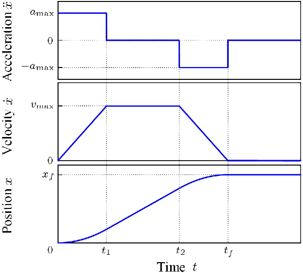

.. include:: <isonum.txt>

Control Loops
=============

Control loops are software used to operate power transmission systems (such as a drivetrain or linear slide) in a fast and controlled fashion. Not only do control loops let you run mechanisms quickly without fear of losing control, in many cases, they help preserve the longevity of mechanisms by reducing rapid change of applied motor voltage.

What is Error?
--------------

The first thing that must be defined when discussing control loops is the concept of error.

Error is defined as the difference between where you are and where you want to be. For instance, say you tell your drivetrain to drive at 30 inches per second, but in actuality, at a time, the drivetrain is driving at 28 inches per second. Since :math:`30-28=2`, the error of the drivetrain's speed at this time :math:`T` is 2 inches per second. In other words, at a time :math:`t=T`, :math:`e(t)=2`.

PID
---

A PID controller (or Proportional Integral Derivative controller) is a control loop that solely uses error to control the system. PID is a form of a **feedback control loop**, or **closed loop control**. This means that data about the variable you are controlling is required in order for the loop to control that variable. In this case, information about the **error** of the system is required to control the system with a PID controller.

The Optional Calculus
^^^^^^^^^^^^^^^^^^^^^

The following equation represents the rigorous mathematical definition of the output of a PID controller :math:`f` at any given time :math:`t`:

.. math:: f(t) = K_p e(t) + K_i \int_o^t e(t) \mathrm{d}t + K_d \frac{\mathrm{d}e(t)}{\mathrm{d}t}

where :math:`K_p`, :math:`K_i`, and :math:`K_d` are constants and :math:`e(t)`, as previously mentioned, is the error in the system.

If you have no experience with calculus, don't worry; while PID is fundamentally rooted in calculus, you do not need any calculus experience to be able to understand it, only basic algebra. However, you are still urged to read the rest of the section regardless of calculus experience, as the formula alone doesn't tell you why it works.

Simplification of the PID formula
^^^^^^^^^^^^^^^^^^^^^^^^^^^^^^^^^

Here is a simplified version of the PID formula: :math:`f(t)=K_p P(t)+K_i I(t)+K_d D(t)`

All we have done is simply take the full formula and replaced part of the terms with functions: :math:`P(t)`, :math:`I(t)`, and :math:`D(t)`.

The Proportional Term
^^^^^^^^^^^^^^^^^^^^^

The first component of the function, :math:`K_p P(t)`, is by far the most simple and easy to understand, as :math:`P(t) = e(t)`. For the sake of example, let's pretend that :math:`K_i=0` and :math:`K_d=0` (a PID controller with only a proportional constant is known as a **P controller**). How will the system behave? Well, if the error is large, the output will be large. Likewise, if the error is small, the output will be small. Also, ideally, given enough time, the system always approaches its destination, assuming :math:`K_p` is of the correct sign.

Say we apply this to a drivetrain. You want to drive a distance :math:`D`, and you decide to set your motor powers using a P controller to accomplish this. In this case, your error is how far away the robot is from the desired location. As you start to drive forward, your error is large, so you drive forward quickly, which is desirable. After all, you aren't concerned with overshooting the target yet if you are far away from it.

But as the robot's distance to the target approaches 0, you will start to slow down, gaining more control over the robot. Once the error is zero, ideally, the robot will stop, and you have reached your destination. If you happen to overshoot, the error will become negative, and the robot will backtrack, repeating the process.

The Derivative Term
^^^^^^^^^^^^^^^^^^^

This term, :math:`K_d D(t)`, is intended to dampen the rate of change of the error. In other words, it tries to keep the error constant. How is this done?

Well, for those of you with calculus under your belt, :math:`D(t)=\frac{de(t)}{dt}`. For those without calculus experience, it represents how fast the error is changing. Graphically, :math:`D(t)` is simply the slope of the error at any given time :math:`t`.

This slope can be calculated by keeping track of the error over successive iterations of the control loop. One iteration occurs at time :math:`t_n` with an error of :math:`e(t_n)`. At the next iteration, the time is :math:`t_{n+1}` with an error of :math:`e(t_{n+1})`. Thus, to find :math:`D(t)`, simply find the slope of :math:`e(t)` given these two points.

The Integral Term
^^^^^^^^^^^^^^^^^

Admittedly, the integral term is the least important term for FTC\ |reg| PID control loops. With a properly tuned :math:`K_p` and :math:`K_d`, you often can just set :math:`K_i` to 0 and call it a day.

However, it can still be useful in some cases. Just like the derivative term, the integral term intends to correct for overshoot. if the system thinks it reached its destination, it will stop, even when, in fact, the error is not yet 0. Perhaps the motor is no longer being supplied enough power to move. Well, given enough time, the integral term will increase the output (in this case, motor power), causing movement towards the destination.

To explain without calculus, the integral term essentially sums the error over a specific interval of time. To do this, error in each loop iteration is added to a variable (in this case, :math:`I(t)`).

However, summing error this way has an unfortunate side effect: the longer the loop takes to complete one iteration, the more slowly this sum increases, which is obviously not desirable, as we don't want lag to affect how the robot moves. To compensate for this, before the error is added to :math:`I(t)`, it is multiplied by how long the previous loop took to-complete, or :math:`t_{n+1}-t_n`, preventing lag from making the system sum more slowly.

So say the robot stops short of the target. The P and D combination aren't strong enough to move it forward to the destination. You can either tune :math:`K_p` and :math:`K_d` to compensate (**this is recommended**), or you can add the integral term to increase output (**this works too, but requires more attention and tuning to achieve the same result**).

PID Pseudocode
^^^^^^^^^^^^^^

.. code-block:: python

   while True:
      current_time = get_current_time()
      current_error = desire_position-current_position

      p = k_p * current_error

      i += k_i * (current_error * (current_time - previous_time))

      if i > max_i:
          i = max_i
      elif i < -max_i:
          i = -max_i

      D = k_d * (current_error - previous_error) / (current_time - previous_time)

      output = p + i + d

      previous_error = current_error
      previous_time = current_time

Tuning a PID Loop
^^^^^^^^^^^^^^^^^

The most important thing to know while tuning a PID loop is how each of the terms affects the output. This can allow you to see which gains need to be adjusted.

For example, if the target is not reached but instead the setpoint begins to oscillate around the target, it means there is not enough D gain. If the target is eventually reached, albeit very slowly, that means there is not enough P gain or the D gain is too high.

In brief, the P variable drives the error towards zero, the I variable corrects for steady state error, and the D variable dampens the effects of the P variable, more so as error approaches zero, which prevents overshoot.

The most common method for tuning a PID controller is as follows:

#. Set the I and D gains to zero
#. Increase the P gain until there are oscillations around the target
#. Increase the D gain until no overshoot occurs
#. If there is steady state error, increase the I gain until it is corrected

An important thing to note is that most systems do not need both I and D control. Generally, systems without a lot of friction do not need an I term, but will need more D control. Systems with a lot of friction, on the other hand, generally do not need D control because the friction facilitates deceleration but need I control because the friction prevents the system from reaching the target otherwise.

For a more in-depth explanation, `click here <https://blog.wesleyac.com/posts/intro-to-control-part-two-pid-tuning>`_

Built-In PID Controller
^^^^^^^^^^^^^^^^^^^^^^^
For situations where one needs to control the velocity or position of a single motor, the built in PID controller can be used.
PID can be enabled by changing the run mode to ``RUN_USING_ENCODER``

.. hint::
    Many misunderstand the use of ``RUN_USING_ENCODER``, many may mistake that it is necessary to use this mode for the encoders to work at all, but this is not true. Instead, ``RUN_USING_ENCODER`` enables velocity feedback using the encoder. If you are using an external PID controller such as one that you implement, generally, it is recommended that you use ``RUN_WITHOUT_ENCODER``.

For official documentation on the built in PID controller, `see here <https://docs.revrobotics.com/duo-control/programming/using-encoder-feedback>`_

Debugging Built-In PID Controller
^^^^^^^^^^^^^^^^^^^^^^^^^^^^^^^^^

+-----------------------------------------------------------+---------------------------------------------------------------------------------------------------------------------------------------------------------------------------+
| Problem                                                   | Solution                                                                                                                                                                  |
+===========================================================+===========================================================================================================================================================================+
| Motor goes at Full Speed regardless of velocity setpoint  | Most of the time this occurs when one of two things occurs:                                                                                                               |
|                                                           |                                                                                                                                                                           |
|                                                           | #1: Your encoder is not connected properly.                                                                                                                               |
|                                                           |                                                                                                                                                                           |
|                                                           |  Diagnosis: Log your encoder position to telemetry, if the position oscillates between 0 - 1 make sure you have the correct cable and it is seated correctly.             |
|                                                           |                                                                                                                                                                           |
|                                                           | #2: Your motor is going in the wrong direction.                                                                                                                           |
|                                                           |                                                                                                                                                                           |
|                                                           |  Diagnosis: Log your velocity to telemetry, if you have a positive reference velocity and the output is negative or vice versa then your motor is plugged in backwards.   |
+-----------------------------------------------------------+---------------------------------------------------------------------------------------------------------------------------------------------------------------------------+
| Motor does not reach full speed with ``.setPower``        | Use the ``.setVelocity`` method as part of DcMotorEx or use ``RUN_WITHOUT_ENCODER`` with an external PID controller.                                                      |
+-----------------------------------------------------------+---------------------------------------------------------------------------------------------------------------------------------------------------------------------------+

PID Controller Sample Rate
^^^^^^^^^^^^^^^^^^^^^^^^^^

For teams who desire the most performance out of their PID controller,
it is essential to consider the Sample rate of the controller.
The Sample rate is when the controller updates its output given new sensor data.
Higher Sample rates allow for more stable control and allow for the usage of more significant PID coefficients to reduce settling time. See this `video <https://www.youtube.com/watch?v=fusr9eTceEo&t=133s>`_ to see how sample rate effects stability in a practical motor control example.
The inbuilt PID controller is locked at a 20hz refresh rate (50ms sample rate). Many top FTC teams optimize their robot loops to run at up to 80hz,
achieving *much* more stable control with an external PID.

Feedforward Control
-------------------

Feedforward control is a method of what is known as "open-loop" control. This is the opposite of closed-loop control and the primary difference is that feedforward does not actively use sensors to control the system.  Instead it "predicts" the desired input based on a model.

Typically feedforward is used to control either rates of change or combat known disturbances from your system.

Feedforward is very powerful because it is immune to noise or other sensor errors.  This is because it is not actively measuring the system, but instead predicting the desired input. However, this also means that it is not very good at correcting for errors. This is why it is often used in conjunction with a closed-loop controller such as PID.

Kv Ka Feedforward Model
^^^^^^^^^^^^^^^^^^^^^^^

The most common feedforward and the one used by libraries such as road-runner is the Kv-Ka feedforward model:

.. math::
   f(t) = K_v \cdot \text{Velocity} + K_a \cdot \text{Acceleration}

Where :math:`K_v` is the velocity gain, :math:`K_a` is the acceleration gain, and :math:`f(t)` is the feedforward output sent to your motors.

These gains can be estimated by giving the controller a series of ramp inputs (such as those computed with a motion profile), measuring the output, and then changing these gains till the robot matches the desired motion.

.. note::
   The gains will change based on the robot's mass, friction, and other factors.
   It is recommended to re-estimate these gains every time you make a significant change to your robot.

Kv Ka Feedforward Pseudocode
^^^^^^^^^^^^^^^^^^^^^^^^^^^^

.. code-block:: python

   while True:
        targetVelocity = getTargetVelocity(time)
        targetAcceleration = getTargetAcceleration(time)
        output = targetVelocity * Kv + targetAcceleration * Ka;

Static Friction Feedforward
^^^^^^^^^^^^^^^^^^^^^^^^^^^
In every system there is bound to be some amount of static Friction. This means that the robot mechanism will not move until a certain amount of power is applied. This can be modeled by adding a constant feedforward term in the direction you want to move.

.. code-block:: python

   while True:
        error = desire_position - current_position;
        sign = signum(error) # sign of error, will be -1, 0, or 1
        output = sign * staticFriction + PID(error); # PID Controller + Friction Feedforward

Motion Profiles
---------------

.. tip::
    Motion profiles are *not* a specific type of control loop, but rather a technique that works well in combination with other control loops such as PID and feedforward.

Motion profiling is a technique popularized in FRC\ |reg| that is starting to find its way to FTC. A motion profile is a function used to change the speed of a power transmission system in a controlled and consistent way by changing desired speed gradually rather than instantaneously.

Let's illustrate this with an example: say you want your drivetrain, which is initially unmoving, to drive forward at full speed. Ordinarily, you would set all drivetrain motors to full power in the code. However, this can be problematic because even though you tell the motors to move at full speed instantaneously, the drivetrain takes time to get to full speed. This can lead to uncontrolled movements which have the potential to make autonomous less consistent and, perhaps more importantly, damage mechanisms.

Motion profiling attempts to solve this issue.

Advantages
^^^^^^^^^^

- More controlled and predictable movements
- Reduces rapid change of applied motor voltage

Disadvantages
^^^^^^^^^^^^^

- Can be slower

There are two main types of motion profiles: **Trapezoidal** profiles and **S-Curve** profiles. Trapezoidal profiles accelerate the system at a constant rate, and S-Curve profiles assume jerk (the speed acceleration changes) is constant. Given that S-Curve profiles are not optimal for controlling 2d trajectories (such as driving) and exist to reduce slippage (which usually only occurs when driving in FTC), trapezoidal profiles are recommended for most FTC applications.

Trapezoidal profiles get their name from the shape of the graph of velocity over time:

   These are the "magic functions" for velocity and acceleration over time alluded to in the feedforward section.

Here is some pseudocode for a trapezoidal profile:

.. code-block:: python

   while True:
      current_velocity = get_current_velocity()
      current_time = get_current_time()

      direction_multiplier = 1

      if position_error < 0:
          direction_multiplier = -1

      # if maximum speed has not been reached
      if MAXIMUM_SPEED > abs(current_velocity):
          output_velocity = current_velocity + direction_multiplier * MAX_ACCELERATION * (current_time - previous_time)
          output_acceleration = MAX_ACCELERATION

      #if maximum speed has been reached, stay there for now
      else:
          outputVelocity = MAXIMUM_SPEED
          outputAcceleration = 0

      #if we are close enough to the object to begin slowing down
      if position_error <= (output_velocity * output_velocity) / (2 * MAX_ACCELERATION)):
          output_velocity = current_velocity - direction_multiplier * MAX_ACCELERATION * (current_time - previous_time)
          output_acceleration = -MAX_ACCELERATION

      previous_time = current_time

The results of the above pseudocode are then used in a feedforward and / or PID loop to control the position of the system in a smooth and predictable way.

A more advanced example of the math for motion profile generation as used in the `Road Runner library <https://github.com/acmerobotics/road-runner>`_ can be found in this `Jupyter Notebook <https://mybinder.org/v2/gh/acmerobotics/road-runner/HEAD?filepath=doc%2Fnotebook%2Froad-runner-lite.ipynb>`_.
