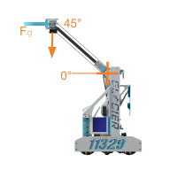

.. include:: <isonum.txt>

Kinematics
==========

Kinematics is the application of geometry to the control of various robot mechanisms. Kinematics equations are used to control mechanisms by providing specific inputs to achieve a desired output.

Many of the kinematics equations here were taken from `Controls Engineering in the FIRST Robotics Competition (book) <https://file.tavsys.net/control/controls-engineering-in-frc.pdf>`_ and `Mobile Robot Kinematics for FTC (paper) <https://github.com/acmerobotics/road-runner/blob/master/doc/pdf/Mobile_Robot_Kinematics_for_FTC.pdf>`_, which contain the relevant derivations. While only tank (differential drive) and mecanum kinematics equations are shown here, these sources also contain derivations for other mechanisms such as swerve and dead wheel odometry.

Forward vs Inverse Kinematics
-----------------------------

Mechanisms may have different sets of equations for their forward and inverse kinematics. Forward kinematics are the equations used to determine the state of a system given the state of its outputs, whereas inverse kinematics determines the output of a system given the desired state. For example, in a drivetrain, forward kinematics would determine body velocity of the robot based on the individual velocities of the wheels, whereas inverse kinematics would determine the required wheel velocities for a desired body velocity.

Tank (Differential Drive)
-------------------------

A tank, or differential drive, is a drivetrain consisting of two sets of wheels on either side of the robot that are independently driven. These are described under further detail in the :doc:`/docs/common-mechanisms/drivetrains/tank` section.

Variables
^^^^^^^^^

The following variables are used in this section.

- :math:`v_r` denotes the linear velocity of the right wheel(s)
- :math:`v_l` denotes the linear velocity of the left wheel(s)
- :math:`v_f` denotes the forward velocity of the robot, relative to itself
- :math:`\omega` denotes the rotational velocity of the robot in radians/second
- :math:`r_b` denotes the base track radius, or the distance between the wheel and center of the robot (half of the distance between wheels)

.. warning::

   These variables, with the exception of :math:`\omega`, represent **linear** velocities NOT **rotational** velocities. Wheel rotational velocity in radians/second can be converted to linear velocity by multiplying by the wheel's radius.

   Positive rotational velocity (:math:`\omega`) will spin the robot COUNTERCLOCKWISE when viewed from above.

Forward Kinematics
^^^^^^^^^^^^^^^^^^

The forward kinematics of a tank drive relate the velocity of the wheels to the forward and rotational velocities of the robot, relative to itself. The forward velocity :math:`v_f` and the rotational velocity :math:`v_{\theta}` is:

.. math::

   v_f = \frac{v_r + v_l}{2}

   \omega = \frac{v_r - v_l}{2 r_b}

Inverse Kinematics
^^^^^^^^^^^^^^^^^^

The inverse kinematics of a tank drive relate the desired velocity of the robot to the velocity required of the wheels. These velocities are as follows:

.. math::

   v_r = v_f + r_d \cdot \omega

   v_l = v_f - r_d \cdot \omega

Mecanum Drive
-------------

Variables
^^^^^^^^^

Mecanum kinematics uses the same variables as differential drive, except with four wheel velocity variables and an additional robot velocity vector for the left to right velocity.

- :math:`v_\mathrm{fr}` denotes the linear velocity of the front (leading) right wheel
- :math:`v_\mathrm{br}` denotes the linear velocity of the back (trailing) right wheel
- :math:`v_\mathrm{fl}` denotes the linear velocity of the front (leading) left wheel(s)
- :math:`v_\mathrm{bl}` denotes the linear velocity of the back (trailing) left wheel(s)
- :math:`v_f` denotes the forward velocity of the robot, relative to itself.
- :math:`v_s` denotes the strafe (sideways) velocity of the robot, relative to itself.
- :math:`\omega` denotes the rotational velocity of the robot in radians/second
- :math:`r_b` represents the base track radius, or the distance between the wheel and center of the robot (half of the distance between wheels)

.. warning::

   These variables, with the exception of :math:`\omega`, represent **linear** velocities NOT **rotational** velocities. Wheel rotational velocity in radians/second can be converted to linear velocity by multiplying by the wheel's radius.

   Positive rotational velocity (:math:`\omega`) will spin the robot COUNTERCLOCKWISE when viewed from above.

Forward Kinematics
^^^^^^^^^^^^^^^^^^

The forward kinematics of a mecanum drive relate the velocity of the wheels to the forward, strafe, and rotational velocities of the robot, relative to itself. These are as follows:

.. math::

   v_f = \frac{v_\mathrm{fr} + v_\mathrm{fl} + v_\mathrm{br} + v_\mathrm{bl}}{4}

   v_s = \frac{v_\mathrm{bl} + v_\mathrm{fr} - v_\mathrm{fl} - v_\mathrm{br}}{4}

   \omega = \frac{v_\mathrm{br} + v_\mathrm{fr} - v_\mathrm{fl} - v_\mathrm{bl}}{4*2r_b}

Inverse Kinematics
^^^^^^^^^^^^^^^^^^

The inverse kinematics of a mecanum drive relate the desired velocity of the robot to the velocity required on the wheels. These are as follows:

.. math::

   v_{fl} = v_f - v_s - (2r_b \cdot \omega)

   v_{bl} = v_f + v_s - (2r_b \cdot \omega)

   v_{br} = v_f - v_s + (2r_b \cdot \omega)

   v_{fr} = v_f + v_s + (2r_b \cdot \omega)

Manipulators
--------------

.. _gravity-compensation:

Gravity Compensation
^^^^^^^^^^^^^^^^^^^^

Often in FTC, teams have arms that swing out around an axis. Controlling these arms requires a bit of thought as depending on the angle they're at, the effect of gravity drastically changes.

Our first step is defining a reference frame. Our recommendation is to define zero as straight to the side, as this is when gravity has the greatest effect on your arm. Other reference frames will still work, but the exact trigonometry will change.

   11329 I.C.E. Robotics

In a reference frame like this, the relative force of gravity will be equal to the cos of the angle. This makes sense as when the cos function is evaluated at zero degrees, it returns 1, while at 90 degrees where there is no effect of gravity, it returns 0.

.. math::
   F_g = g\cos{\theta}

Assuming you have an encoder on your arm, you can find :math:`\theta` (the angle of the arm relative to the vertical) using something similar to the following pseudocode.

.. note:: DEGREE_PER_TICK can be found by taking 360 divided by your encoder resolution all multiplied by your gear ratio. For example, for a `19.2:1 goBILDA Yellow Jacket <https://www.gobilda.com/5203-series-yellow-jacket-planetary-gear-motor-19-2-1-ratio-24mm-length-8mm-rex-shaft-312-rpm-3-3-5v-encoder/>`_, there are 537.7 ticks per revolution, and so :math:`\frac{360}{537.7}` degrees per tick at the gearbox output shaft. If there was a 2:1 gear ratio after that, then the ticks per revolution would instead be :math:`\frac{360}{2 \times 537.7}`

.. code:: java

   current_angle = (TICKS_AT_ZERO - current_tick) * DEGREE_PER_TICK

The typical way to utilize the effect of gravity you just found, is to pass it in as a feedforward parameter to a PID controller. We cover this in :ref:`gravity-compensated-feedforward`.
