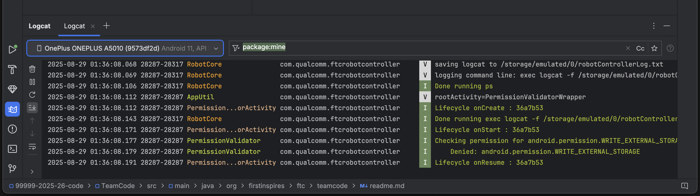

.. include:: <isonum.txt>

Using Android Studio
====================

`Android Studio <https://developer.android.com/studio/intro>`_ is an integrated development environment (IDE) for Android app development based on IntelliJ. It compiles your code which is then installed onto the Robot Controller: either the Control Hub or a legal Android phone.

Downloading Android Studio
--------------------------

If you've already downloaded Android Studio, you can move on to the next step, which is `setting up the SDK`_.

The steps to download and setup Android Studio are:

#. Check to make sure your system meets the `necessary requirements <https://developer.android.com/studio#Requirements>`_
#. Install the latest version of Android Studio from https://developer.android.com/studio/index.html
#. Run the executable, follow the setup wizard, and use any and all recommended development kits

Setting up the SDK
------------------

Now that you have Android Studio installed, you're going to want to use the current season's FTC\ |reg| SDK (software development kit) where you will create your team's code.

Downloading the SDK
^^^^^^^^^^^^^^^^^^^

The SDK is publicly released to a GitHub repository. The current SDK can be found in the `FtcRobotController <https://github.com/FIRST-Tech-Challenge/FtcRobotController>`_ repository.

Downloading and opening the SDK in Android Studio
^^^^^^^^^^^^^^^^^^^^^^^^^^^^^^^^^^^^^^^^^^^^^^^^^

#. Open Android Studio. If you have another project open, close it (File -> Close Project). Make sure "Projects" is selected on the sidebar.

   .. image:: images/using-android-studio/as-welcome.png
      :width: 50em
      :alt: A screen should appear with an option to configure settings and import a project

#. Click on the gear icon in the bottom left corner, and select "check for updates." If you do not have the latest version, download the updates.

#. Select "Get from VCS". Make sure "Repository URL" is selected on the sidebar, then put ``https://github.com/FIRST-Tech-Challenge/FtcRobotController.git`` into the URL text box. Finally, click the Clone button in the bottom right corner to download the SDK.

   .. tip:: Consider also changing the name of the final folder in the Directory textbox from ``FtcRobotController`` to something that reflects your team and the season, e.g. team number 99999 might use ``99999-2025-26-code``.

   .. image:: images/using-android-studio/as-get-from-vcs.png
      :alt: TODO: alt text

#. When asked if you want to trust and open the project, choose "Trust Project".

   .. image:: images/using-android-studio/as-trust-project-dialog.png
      :alt: TODO: alt text

#. Select the hammer icon in the icon group in the top right corner of the window. This will download any needed modules and build the project.

   .. image:: images/using-android-studio/as-make-module.png
      :alt: TODO: alt text

#. Wait for `Gradle`_ to complete the build. This indicator should be located at the bottom of the window by default.

   .. image:: images/using-android-studio/build-gradle.png
      :alt: An in-progress Gradle build
      :width: 50em

Layout
------

Android Studio can look intimidating at first glance, but there are only a few features needed to use it properly.

.. image:: images/using-android-studio/as-layout.png
   :alt: Android Studio layout
   :width: 50em

Creating Classes
^^^^^^^^^^^^^^^^

The first thing to note in the project view is the left panel with the project components. Expand the :code:`TeamCode` folder, then the :code:`java` folder, and you will see an :code:`org.firstinspires.ftc.teamcode` package.

.. image:: images/using-android-studio/code-project-structure.png
   :alt: TeamCode > java > org.firstinspires.ftc.teamcode

This is where you will create your code for the robot. To create a new Java class, right click on the package, select New, and then choose "Java Class."

.. image:: images/using-android-studio/new-java-class.png
   :alt: New > Java Class
   :width: 50em

If you want to create a subfolder for organization purposes, you can select the "Package" option. Then, you can create classes in those packages.

.. tip::
   The :code:`readme.md` file in this directory contains useful documentation, including information on sample programs shipped with the SDK that you can use and modify. We highly recommend you read this information.

Installing Your Program
^^^^^^^^^^^^^^^^^^^^^^^

To install your program onto the Robot Controller, you will use the play button located near the top middle of the application window.

.. image:: images/using-android-studio/build-and-run.png
   :alt: Play button next to device dropdown

Near it you will see a dropdown for devices. When you connect your Robot Controller to your computer, the device should appear in the dropdown after some time. Then, click the play button and your program will install onto the device.

If you run into any problems with this process, refer to the official `REV documentation <https://docs.revrobotics.com/duo-control/>`_. Some useful pages from the REV site are:

- `Troubleshooting the Control System <https://github.com/FIRST-Tech-Challenge/FtcRobotController/wiki/Android-Studio-Tutorial>`_
- `Deploying Code Wirelessly <https://docs.revrobotics.com/duo-control/programming/android-studio-using-wireless-adb>`_

If you're still stuck, you can ask for help in the `FTC Discord <https://discord.com/invite/ftc>`_.

Gradle
------

Gradle is a build tool for software development. In the scope of FTC, it is used to build and manage dependencies for your project.

When you update any of your Gradle files you will need to perform a Gradle sync, which syncs your project to the changes and rebuilds it. In your :code:`build.common.gradle`, you will find information for how your robot controller application is built.

Rebuilding
^^^^^^^^^^

You can rebuild your project easily with the Build menu.

.. figure:: images/using-android-studio/gradle-build.png
   :alt: The build menu at the top of the screen

   Note: On Windows and Linux, the menubar is accessed by clicking the hamburger menu icon at the top left of the window.

To clean your project to allow you to rebuild your project from scratch, choose the ``clean project`` option. This removes old compiled files from your project. To then rebuild your project, choose the rebuild option.

Invalidate and Restart
^^^^^^^^^^^^^^^^^^^^^^

Sometimes you can get errors after moving things around, refactoring, etc. The first step is to try cleaning the project and doing a rebuild. If this doesn't work, you may be able to fix these errors with ``invalidate and restart`` under the ``file`` dropdown. This clears any caches Android Studio has and restarts it.

Adding Dependencies
^^^^^^^^^^^^^^^^^^^

If you want to add dependencies to your project, you can do so in the :code:`build.gradle` file in the TeamCode directory.

There should be a dependencies block at the bottom of the file.

.. code-block:: groovy

    dependencies {
        implementation project(':FtcRobotController')
    }

Some dependencies require changes to your other Gradle files. Make sure to read the installation instructions for whatever dependency you want to add.

Next, you add a line in the dependencies block to implement the dependency. This is generally done with :code:`implementation 'com.developer.package:name:version'`.

.. code-block:: groovy

    dependencies {
        implementation project(':FtcRobotController')

        implementation 'com.developer.package:name:version'
    }

Refer to the instructions of whatever library you are using for the correct package name and version.

Finally, perform a Gradle sync.

Android Debug Bridge (adb)
--------------------------

.. note:: On macOS, Linux, or using PowerShell, you will have to change any commands that start with :code:`adb` to start with :code:`./adb` if you are in the :code:`platform-tools` directory.

Wireless Communication
^^^^^^^^^^^^^^^^^^^^^^

Android Debug Bridge (ADB) is a command-line tool that allows for wireless communication between the robot controller (phone or Control Hub).

ADB should come with the platform tools in Android Studio. Navigate to your :code:`local.properties` file in the root of your project and you should see a path to the Android SDK on your computer, such as :code:`C:\Users\Woodie\AppData\Local\Android\Sdk`. Then navigate to :code:`platform-tools` and an application called adb should be there. To use it, open CLI (like PowerShell or command prompt) and run either :code:`adb devices` or :code:`./adb devices`.

For more information on ADB, you can look at the `ADB documentation <https://developer.android.com/tools/adb>`_.

Setting Up ADB
~~~~~~~~~~~~~~

#. Ensure USB debugging is enabled on your device and it is in developer mode.
#. Make sure you have ADB installed. If you do not, follow the instructions at `this link <https://www.xda-developers.com/install-adb-windows-macos-linux/>`_

.. note:: You can use logcat via ADB with the :code:`adb logcat` command. This is extremely useful for debugging as it allows you to look at the logs wirelessly which saves time. Remember, logcat is the *best* way to debug your software.

Add ADB To PATH
^^^^^^^^^^^^^^^

If you want to use ADB from any directory, add it to PATH. Follow an online tutorial for adding to PATH and set the PATH to include the :code:`platform-tools` directory. Once you do that, you can run ADB commands from anywhere on your system.

Adding variables to PATH:

- `Windows <https://docs.alfresco.com/content-services/latest/admin/troubleshoot/>`_
- `Linux/Unix (bash) <https://unix.stackexchange.com/questions/26047/how-to-correctly-add-a-path-to-path>`_
- `macOS (zsh) <https://koenwoortman.com/zsh-add-directory-to-path/>`_

Connecting to a Control Hub Wirelessly
~~~~~~~~~~~~~~~~~~~~~~~~~~~~~~~~~~~~~~

#. Connect to the Wi-Fi hotspot hosted by the Control Hub. The hotspot should be called "TEAMNUMBER-RC" or some small derivation of that. It may include extra letters if you have multiple devices per team. Refer to R707 in the |cm| for further details on the network naming scheme.
#. Once you're connected to a Control Hub's network, you simply need to connect to it using :code:`adb connect 192.168.43.1:5555`.

   - Alternatively, if you have the `REV Hardware Client <https://docs.revrobotics.com/rev-hardware-client>`_ running, it will attempt to automatically connect ADB to any Control Hub connected via Wi-Fi. This option does not require manually setting up ADB, and is therefore preferred by many teams using supported computers.

Connecting to a Phone Wirelessly
~~~~~~~~~~~~~~~~~~~~~~~~~~~~~~~~

#. Plug the robot controller phone into your computer.
#. Run the command :code:`adb devices` in the :code:`platform-tools` directory and see if the phone shows up.
#. Run :code:`adb usb` and then :code:`adb tcpip 5555`. You can then unplug the phone.
#. Connect to the same Wi-Fi network the device is either hosting or on. The Wi-Fi direct network created by the phone should be called "TEAMNUMBER-RC" or some small derivation of that. It may include extra letters if you have multiple devices per team. Refer to R707 in the |cm| for further details on the network naming scheme.
#. Connect to the phone using :code:`adb connect 192.168.49.1:5555`. If this doesn't work, recheck the IP address of the phone and try again with that IP address if it is different.

Once a connection is established to a Control Hub or phone, it should automatically appear in the device dropdown in Android Studio.

.. _logcat:

Logcat
~~~~~~

Logcat is extremely useful for debugging issues with your code at runtime or figuring out what went wrong. For example, if your app activity crashes and you pull up the log seeing 5000 lines of the same error, there is probably infinite recursion in your code!

To use logcat, plug in your device (or connect via ADB). Then, select the logcat button. Your window should look like this.

.. image:: images/using-android-studio/terminal-logcat-location.png
   :alt: Terminal and logcat tabs near the bottom left

Some useful information on using logcat can be found `here <https://developer.android.com/studio/debug/logcat>`_.

If you have an issue you don't understand, you can take a screenshot of the log or select and copy the error and ask a question in the `FTC discord <https://discord.com/invite/ftc>`_.

Wireless Configuration
~~~~~~~~~~~~~~~~~~~~~~

You can set up a configuration on the Driver Station or Robot Controller like usual. However, you can also create a valid configuration XML file in :code:`TeamCode/src/main/res/xml`. You can find your configuration files in the :code:`/sdcard/FIRST` folder as an XML file with the same name as the configuration.

To get these XML files wirelessly, you can use :code:`adb pull /sdcard/FIRST/config.xml /fully/qualified/path/res/xml`.

If a valid configuration XML file is in :code:`res/xml` it will show up as a configuration you can use for the robot when you push it to the Robot Controller or a Control Hub.

Version Control
---------------

Version control is an extremely useful tool. It allows for looking at (and reverting to) previous versions of code, easy collaboration, having multiple versions of code that can be merged together, etc.

As far as version control systems go, we strongly recommend git, especially when used with a GUI like Android Studio's built in VCS tools or Github Desktop. While a git tutorial is out of scope for |gm0|, here are some git resources:

- `The official git tutorial <https://git-scm.com/docs/gittutorial>`_
- `GitHub's collection of git resources <https://docs.github.com/en/get-started/git-basics/set-up-git>`_
- `GitHub's guide to installing git <https://github.com/git-guides/install-git>`_
- `GitHub Desktop, a git GUI <https://desktop.github.com/>`_
- `Android Studio's/IntelliJ's git integration documentation <https://www.jetbrains.com/help/idea/version-control-integration.html>`_
