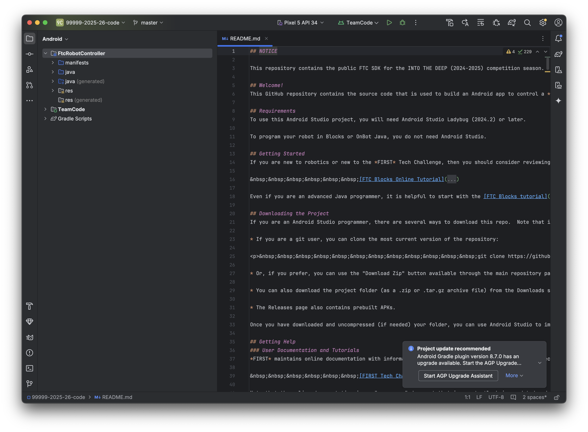
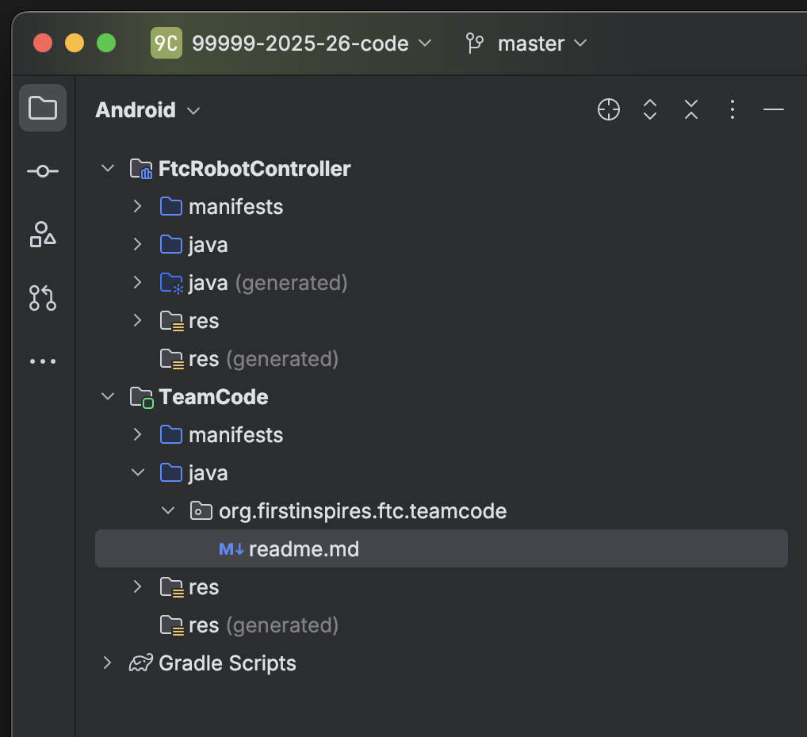
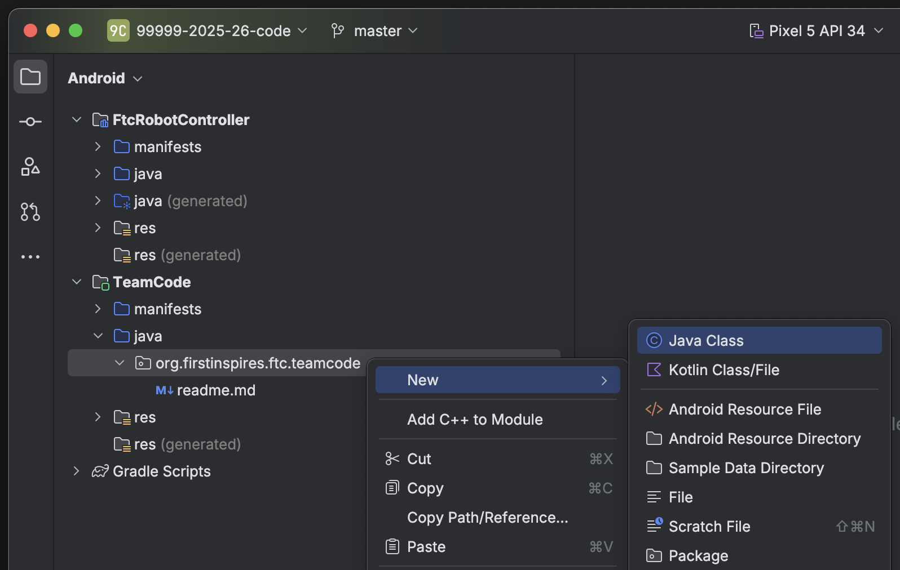
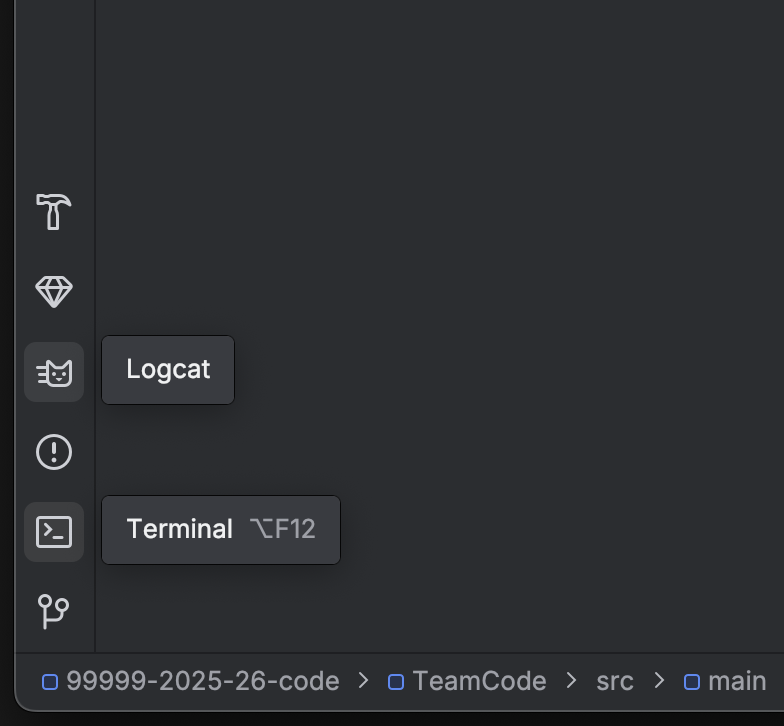
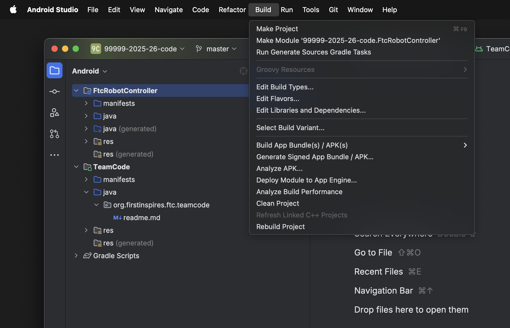
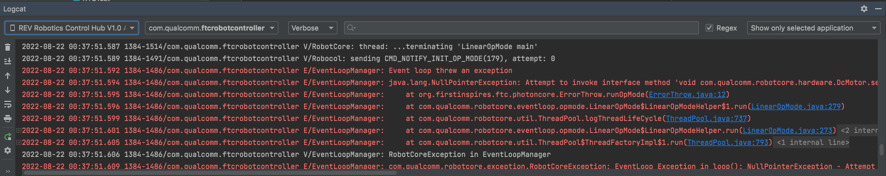

.. include:: <isonum.txt>

Using Android Studio
====================

`Android Studio <https://developer.android.com/studio/intro>`_ is an integrated development environment (IDE) for Android app development based on IntelliJ. It compiles your code to an apk which is then installed onto the Robot Controller: either the Control Hub or a legal Android phone.

Downloading Android Studio
--------------------------

If you've already downloaded Android Studio, you can move on to the next step, which is `setting up the SDK <#setting-up-the-sdk>`_.

The steps to download and setup Android Studio are:

#. Check to make sure your system meets the `necessary requirements <https://developer.android.com/studio#Requirements>`_
#. Install the *latest* version of Android Studio from https://developer.android.com/studio/index.html
#. Run the executable, follow the setup wizard, and use any and all recommended development kits

Setting up the SDK
------------------

Now that you have Android Studio installed, you're going to want to use the current season's SDK (software development kit) where you will create your team's code.

Downloading the SDK
^^^^^^^^^^^^^^^^^^^

The SDK is publicly released to a GitHub repository every season. The current season's SDK can be found in the `FtcRobotController <https://github.com/FIRST-Tech-Challenge/FtcRobotController>`_ repository.

Downloading the ZIP
~~~~~~~~~~~~~~~~~~~

#. When you're at the repository, click the green "code" button. Then, select "Download ZIP."

   .. image:: images/using-android-studio/download-zip.png
      :width: 50em
      :alt: Click the Download ZIP option

#. Then, save it to the desired location in your computer.

   .. image:: images/using-android-studio/save-to-computer.png
      :width: 50em
      :alt: The ZIP file should be called FtcRobotController-master

#. After it is saved, extract the contents of the ZIP and place them into whatever desired location. You should see the contents of the SDK inside of the folder location.

Using GitHub Desktop
~~~~~~~~~~~~~~~~~~~~

#. `Install GitHub Desktop <https://docs.github.com/en/desktop/installing-and-configuring-github-desktop/installing-and-authenticating-to-github-desktop>`_
#. Open the `SDK repository <https://github.com/FIRST-Tech-Challenge/FTCRobotController>`_ in a browser.
#. Click the green "code" button, and then select "Open with GitHub Desktop."

   .. image:: images/using-android-studio/open-with-gh-desktop.png
      :width: 50em
      :alt: Click the Open with GitHub Desktop option
#. Clone the project.

   .. image:: images/using-android-studio/clone-github-desktop.png
      :alt: Clone the repository to your resource folder

From the Command Line
~~~~~~~~~~~~~~~~~~~~~

#. `Install git <https://github.com/git-guides/install-git>`_
#. Open the terminal (probably bash) in the desired resource location.
#. Use :code:`$ git clone https://github.com/FIRST-Tech-Challenge/FtcRobotController.git`

Opening the SDK on Android Studio
^^^^^^^^^^^^^^^^^^^^^^^^^^^^^^^^^

#. Open Android Studio. If you have another project open, close it.

   .. image:: images/using-android-studio/opening-as.png
      :width: 50em
      :alt: A screen should appear with an option to configure settings and import a project

#. Check for updates. Click on the "configure" dropdown and select "check for updates." If you do not have the latest version, download the updates.

   .. image:: images/using-android-studio/check-for-updates.png
      :alt: If you have no new updates, it should say that you have the latest version installed

#. Select "Import Project." Navigate to where you have the SDK saved on your computer. Choose the directory that has the Android logo.

   .. image:: images/using-android-studio/select-the-sdk.png
      :alt: Only select the folder with the Android logo

#. Change to project view. In the top left corner should be a dropdown that allows you to change the way you are looking at your project.

   .. image:: images/using-android-studio/select-project-view.png
      :alt: Change to project view

#. Wait for `Gradle`_ to complete the build. This indicator should be located at the bottom of the window by default.

   .. image:: images/using-android-studio/build-gradle.png
      :alt: An in-progress Gradle build
      :width: 50em

Layout
------

Android Studio can look intimidating at first glance, but there are only a few features needed to use it properly.

Creating Classes
^^^^^^^^^^^^^^^^

The first thing to note in the project view is the dropdown with the name of the project. If you drop that down, you will see all of the Gradle files and directories. Navigate to the TeamCode folder. In the teamcode folder you will see an :code:`org.firstinspires.ftc.teamcode` package.

This is where you will create your code for the robot. To create a new Java class, right click on the package, select New, and then choose "Java Class."

Alternatively, you can select the "Package" option if you want to create a subfolder for organization purposes. Then, you can create classes in those packages.

Terminal and Logcat
^^^^^^^^^^^^^^^^^^^

Near the bottom left of the application, you will find tabs for the local terminal and logcat. These are useful tools for working with your program.

Some useful information on using the logcat can be found `here <https://developer.android.com/studio/debug/am-logcat>`_.

.. note:: You can build your program through the commandline via the local terminal. Click on the terminal tab and then input :code:`gradlew :TeamCode:clean :TeamCode:build`. This will delete the previously compiled files and build your TeamCode module.

Installing Your Program
^^^^^^^^^^^^^^^^^^^^^^^

To install your program onto the Robot Controller, you will use the play button located near the top right of the application window.

.. image:: images/using-android-studio/build-and-run.png
   :alt: Play button next to device dropdown

Next to it you will see a dropdown for devices. When you connect your Robot Controller to your computer (using the correct cable), the device should appear in the dropdown after some time. Then, click the play button and your program will install onto the device.

.. tip::

   Occasionally the app will fail to start on the robot controller, leaving the driver station in a disconnected state. If this occurs you can open the terminal and run

   :code:`adb shell am start -n com.qualcomm.ftcrobotcontroller/org.firstinspires.ftc.robotcontroller.internal.PermissionValidatorWrapper`

   to remotely start the Robot Controller app.

If you run into any problems with this process, refer to the official `REV documentation <https://docs.revrobotics.com/duo-control/>`_. Some useful pages from the REV site are:

- `Troubleshooting the Control System <https://github.com/FIRST-Tech-Challenge/FtcRobotController/wiki/Android-Studio-Tutorial>`_
- `Deploying Code Wirelessly <https://docs.revrobotics.com/duo-control/programming/android-studio-using-wireless-adb>`_

If you're still stuck you can ask for help in the `FTC\ |reg| Discord <https://discord.com/invite/first-tech-challenge>`_.

Gradle
------

Gradle is a build tool for software development. In the scope of FTC, it is used to build and manage dependencies for your project.

When you update any of your Gradle files you will need to perform a Gradle sync, which syncs your project to the changes and rebuilds it. In your :code:`build.common.gradle`, you will find information for how your robot controller application is built.

Rebuilding
^^^^^^^^^^

You can rebuild your project easily with the build dropdown.

To rebuild from a clean project, press the clean project option. This removes old compiled files from your project so you can completely rebuild your project. It clears any production files, generated files, etc. This is useful for making sure old artifacts don't break anything when you build your code. When you next build your project, it will do so from scratch with no old compiled files to which it can refer. To rebuild your project, press the rebuild option.

Invalidate and Restart
^^^^^^^^^^^^^^^^^^^^^^

Sometimes you can get errors after moving things around, refactoring, etc. The first step is to try cleaning the project and doing a rebuild. If this doesn't work, you might have confused Android Studio because it caches information about your project structure.

The most common way to fix these errors is to do an invalidate and restart. In the file dropdown, there will be an option for this and then you will choose Invalidate and Restart. This clears the cache and restarts your Android Studio, which then should perform a Gradle rebuild.

Adding Dependencies
^^^^^^^^^^^^^^^^^^^

If you want to add dependencies to your project, you can do so in the :code:`build.gradle` file in the TeamCode directory.

There should be a dependencies block at the bottom of the file.

.. code-block:: groovy

    // Include common definitions from above.
    apply from: '../build.common.gradle'
    apply from: '../build.dependencies.gradle'

    dependencies {
         implementation project(':FtcRobotController')
         annotationProcessor files('lib/OpModeAnnotationProcessor.jar')
    }

Some dependencies require changes to your other Gradle files. Make sure to read the installation instructions for whatever dependency you want to add.

Next, you add a line in the dependencies block to implement the dependency. This is generally done with :code:`implementation 'com.package.name'`.

.. code-block:: groovy

    dependencies {
        implementation project(':FtcRobotController')
        annotationProcessor files('lib/OpModeAnnotationProcessor.jar')

        implementation 'com.package.name:name:version'
    }

Refer to the instructions of whatever library you are using for the correct package name and version.

Finally, perform a Gradle sync.

Upgrading to Java 8
-------------------

By default, the SDK's version of Java is set to 7. Java 8 is also supported. You might want to upgrade your version of Java from 7 to 8 if you want to use features such as lambdas or generics. Some libraries may also require you to change your Java version.

To upgrade to Java 8, navigate to your :code:`build.common.gradle` file. Scroll down until you find this block:

.. code-block:: groovy

    compileOptions {
        sourceCompatibility JavaVersion.VERSION_1_7
        targetCompatibility JavaVersion.VERSION_1_7
    }

Change the :code:`7` to :code:`8`, like so:

.. code-block:: groovy

    compileOptions {
        sourceCompatibility JavaVersion.VERSION_1_8
        targetCompatibility JavaVersion.VERSION_1_8
    }

Then, perform a Gradle sync.

Android Debug Bridge
--------------------

.. note:: On macOS, Linux, or using PowerShell you will have to change any commands that start with :code:`adb` to start with :code:`./adb` if you are in the :code:`platform-tools` directory.

.. _logcat:

Logcat
^^^^^^

Logcat is extremely useful for debugging issues with your code at runtime or figuring out what went wrong. For example, if your app activity crashes and you pull up the log seeing 5000 lines of the same error, there is probably infinite recursion in your code!

To use logcat, plug in your device (or connect via ADB). Then, select the app you want to view the logs for. Your window should look like this.

If you have an issue you don't understand, you can take a screenshot of the log or select and copy the error and ask a question in the `FTC discord <https://discord.com/invite/first-tech-challenge>`_.

Wireless Communication
^^^^^^^^^^^^^^^^^^^^^^

Android Debug Bridge (ADB) is a command-line tool that allows for wireless communication between the robot controller (phone or Control Hub).

ADB should come with the platform tools in Android Studio. Navigate to your :code:`local.properties` file in the root of your project and you should see a path to the Android SDK on your computer, such as :code:`C:\Users\Woodie\AppData\Local\Android\Sdk`. Then navigate to :code:`platform-tools` and an application called adb should be there. To use it, open CLI (like PowerShell or command prompt) and run either :code:`adb devices` or :code:`./adb devices`.

For more information on ADB, you can look at the `developers page <https://developer.android.com/studio/command-line/adb>`_.

Setting Up ADB
~~~~~~~~~~~~~~

#. Ensure USB debugging is enabled on your device and it is in developer mode.
#. Make sure you have ADB installed. If you do not, follow the instructions at `this link <https://www.xda-developers.com/install-adb-windows-macos-linux/>`_

.. note:: You can use logcat via ADB with the :code:`adb logcat` command. This is extremely useful for debugging as it allows you to look at the logs wirelessly which saves time. Remember, logcat is the *best* way to debug your software.

Add ADB To PATH
^^^^^^^^^^^^^^^

Adding variables to PATH:

- `Windows <https://docs.alfresco.com/content-services/latest/admin/troubleshoot/>`_
- `Linux/Unix (bash) <https://unix.stackexchange.com/questions/26047/how-to-correctly-add-a-path-to-path>`_
- `macOS (zsh) <https://koenwoortman.com/zsh-add-directory-to-path/>`_

If you want to use ADB from any directory, add it to PATH. Follow an online tutorial for adding to PATH and set the PATH to the :code:`platform-tools` directory. Once you do that, you can run ADB commands from anywhere on your system.

Connecting to a Phone Wirelessly
~~~~~~~~~~~~~~~~~~~~~~~~~~~~~~~~

#. Plug the robot controller phone into your computer.
#. Run the command :code:`adb devices` in the :code:`platform-tools` directory and see if the phone shows up.
#. Run :code:`adb usb` and then :code:`adb tcpip 5555`. You can then unplug the phone.
#. Connect to the same WiFi network the device is either hosting or on. The WiFi direct network created by the phone should be called "TEAMNUMBER-RC" or some small derivation of that. It may include extra letters if you have multiple devices per team. Refer to RS01 in |gm1| for further details on the network naming scheme.
#. Connect to the phone using :code:`adb connect 192.168.49.1:5555`. If this doesn't work, recheck the IP address of the phone and try again with that IP address if it is different.

Connecting to a Control Hub Wirelessly
~~~~~~~~~~~~~~~~~~~~~~~~~~~~~~~~~~~~~~

#. Connect to the WiFi hotspot hosted by the Control Hub. The hotspot should be called "TEAMNUMBER-RC" or some small derivation of that. It may include extra letters if you have multiple devices per team. Refer to RS01 in |gm1| for further details on the network naming scheme.
#. Once you're connected to a Control Hub's network, you simply need to connect to it using :code:`adb connect 192.168.43.1:5555`.

Once a connection is established, it should appear in the device dropdown in Android Studio.

Wireless Configuration
~~~~~~~~~~~~~~~~~~~~~~

You can set up a configuration on the Driver Station or Robot Controller like usual. However, you can also create a valid configuration XML file in :code:`TeamCode/src/main/res/xml`. You can find your configuration files in the :code:`/sdcard/FIRST` folder as an XML file with the same name as the configuration.

To get these XML files wirelessly, you can use :code:`adb pull /sdcard/FIRST/config.xml /fully/qualified/path/res/xml`.

If a valid configuration XML file is in :code:`res/xml` it will show up as a configuration you can use for the robot when you push it to the Robot Controller or a Control Hub.

SDK Manager
-----------

You can find the SDK manager in the top right corner of your Android Studio.

.. image:: images/using-android-studio/sdk-manager-icon.png
   :alt: A box with a down-facing arrow

Accepting Licenses
^^^^^^^^^^^^^^^^^^

If you get a warning complaining about licenses not being accepted, follow these steps:

#. Go to the SDK manager and under SDK Platforms.
#. Select the version with the API level specified by the warning.
#. Click "Apply" and wait for the components to install.
#. Once this finishes, press "Finish," then "Ok." Wait for Android Studio to index if it is.
#. Restart Android Studio.

Installing SDK Tools
^^^^^^^^^^^^^^^^^^^^

To install any SDK tools such as platform tools or build tools, open the SDK manager and go to SDK Tools. Select the tools you want to install and install them the same way you would for the SDK platforms.

Version Control
---------------

Version control is an extremely useful tool. It allows for looking at (and reverting to) previous versions of code, easy collaboration, having multiple versions of code that can be merged together, etc.

As far as version control systems go, we strongly recommend git, especially when used with a GUI like Android Studio's built in VCS tools or Github Desktop. While a git tutorial is out of scope for |gm0|, here are some git resources:

- `The official git tutorial <https://git-scm.com/docs/gittutorial>`_
- `GitHub's collection of git resources <https://docs.github.com/en/get-started/quickstart/set-up-git>`_
- `GitHub's guide to installing git <https://github.com/git-guides/install-git>`_
- `GitHub Desktop, a git GUI <https://desktop.github.com/>`_
- `Android Studio's/IntelliJ's git integration documentation <https://www.jetbrains.com/help/idea/version-control-integration.html>`_
