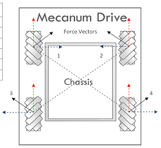

=========================================
Programming Tutorial - Mecanum Drivetrain
=========================================
Mecanum Physics
===============
A very common choice for drivetrain in FTC is :term:`mecanum drive
<Mecanum Wheel>`, but we have noticed that not a lot of people know
how they work or how to properly program them.  :term:`Mecanum wheels
<Mecanum Wheel>` have rollers at a 45° angle to the rest of the wheel.

Since these are in contact with the ground instead of something solid
like in a :term:`traction wheel <Traction wheel>`, instead of the
wheel creating a force parallel to the orientation of the wheel, it
creates one 45° from parallel.  Depending on how the wheels are
driven, X or Y components of the force vectors can cancel which allows
movement in any direction.

.. image:: images/mecanum-drive/mecanum-worms-eye-view.png
    :alt: Force diagram of a single mecanum wheel

Using Vectoring to Create Omnidirectional Movement
==================================================
As stated earlier, depending on how the wheels are driven,
movement in any direction can be created.
This is because with 4 wheels on a robot oriented in and X orientation,
the vectors can be canceled such that movement is created in any direction.
It is important to note that because of friction,
perfect movement isn’t possible in every direction,
so a :term:`mecanum drivetrain <Mecanum Wheel>` will be able to drive slightly
faster forwards/backwards than any other directions.

In that image, 1, 2, 3, and 4 are the force vectors created by the
:term:`mecanum wheels <Mecanum Wheel>` when driven towards the top of the
image.
The blue and red lines are their X and Y components, respectively.
Here are a few examples of how the wheels must be driven to achieve different
movements (It is not recommended to hard code these in;
there is a much better mathematical way to program mecanum that allows for true
omnidirectional movement and is much cleaner):

.. image:: images/mecanum-drive/mecanum-drive-directions.png
    :alt: Examples of ways to move the wheels on mecanum drive to move the robot in different directions
    :width: 45em

Deriving Mecanum Control Equations
==================================
Before thinking about mecanum, envision a scenario where you have a 2 motor
tank drivetrain which you want to control using the left stick Y axis for
forward/backward movement, and the right stick X axis for pivot turning.
The motors are configured so that positive is clockwise for the right motor
when the body is facing away from you, and the left motor is the opposite.
To control only forward/backward movement,
you simply need to set the motor powers to the Y stick value
(flip the sign since Y is reversed)::

    double y = -gamepad1.left_stick_y; // Remember, this is reversed!

    leftMotor.setPower(y);
    rightMotor.setPower(y);

Although at first adding rotation might seem like a difficult task,
it’s actually super simple.
All you need to do is subtract the x value from the right side, and add it to
the left::

    double y = -gamepad1.left_stick_y; // Remember, this is reversed!
    double x = gamepad1.right_stick_x;

    leftMotor.setPower(y + x);
    rightMotor.setPower(y - x);

Here, if the Y stick is pressed upwards,
both of the motors will be fed a positive value, causing the robot to move
forward.
If it is pressed downwards, both of the motors will be fed a negative value,
causing the robot to move backwards.
A similar principle applies for rotation:
if the X stick is pushed rightward, the left wheels will spin forward while the
right spin backward, causing rotation.
The opposite applies for pushing the stick left.
If both sticks are pushed at the same time,
say the Y stick is at 1 and the X stick is also at 1,
the value of the left wheels will be :math:`1+1=2`
(which gets converted to 1 in the SDK) and the right wheels will be
:math:`1-1=0`, which causes a rightward curve.

Applying omnidirectional movement with :term:`mecanum wheels <Mecanum Wheel>`
operates under the same principle as adding turning into the tank example.
The left stick X values will be added or subtracted to each wheel depending on
how that wheel needs to rotate to get the desired movement.
The only difference between adding turning is that rather than wheels on the
same side being the same sign,
wheels diagonal to each other will be the same sign.

We want a positive X value to correlate to rightward strafing.
If we refer back to the vectoring image,
this means that the front left and back right need to rotate forward,
while the back left and front right need to rotate backwards.
So, we should add the x value to the front left and back right and subtract it
from the back right and front left::

    double y = -gamepad1.left_stick_y; // Remember, this is reversed!
    double x = gamepad1.left_stick_x;
    double rx = gamepad1.right_stick_x;

    frontLeftMotor.setPower(y + x + rx);
    backLeftMotor.setPower(y - x + rx);
    frontRightMotor.setPower(y - x - rx);
    backRightMotor.setPower(y + x - rx);

This is the same as the tank example,
except now with 4 motors and the strafing component added.
Similarly to the tank example, the Y component is added to all wheels,
and the right x (rx) is added to the left and subtracted from the right.
Now, we have added another component that will allow us to strafe rightward.
In doing that, however, we have actually allowed for strafing in any direction.
If you think about it, pressing the joystick to the left will do the same thing
in reverse, which is what is needed to strafe left.
If it is pressed at 45 degrees, the x and y components of the joystick will be
equal.
This will cause two diagonal motors to cancel, allowing for diagonal movement.
This same effect applies to every angle of the joystick.

Now that we have a functioning mecanum driving program,
there are a few things that can be done to clean it up.
The first of these would be multiplying the left X value by something to
counteract imperfect strafing.
Doing this will make the drive feel more accurate on non axis aligned
directions, and make field centric driving more accurate.
In this tutorial, we will use 1.5, but it’s really up to driver preference.

::

    double y = -gamepad1.left_stick_y; // Remember, this is reversed!
    double x = gamepad1.left_stick_x * 1.5; // Counteract imperfect strafing
    double rx = gamepad1.right_stick_x;

The other improvement we can make is scale the values into the range of
-1 to 1.
Since the SDK simply rounds if the input is out of that range,
we can lose the ratio we are looking for unless we proactively put all the
numbers back in that range while still maintaining our calculated ratio.
For example, if we calculate values of 0.4, 0.1, 1.1, and 1.4,
plugging those into the motors they will become 0.4, 0.1, 1.0, and 1.0,
which is not the same ratio.
Instead, we need to divide all of them by the largest number (absolute value):
::

    // Put powers in the range of -1 to 1 only if they aren't already (not
    // checking would cause us to always drive at full speed)

    if (Math.abs(frontLeftPower) > 1 || Math.abs(backLeftPower) > 1 ||
        Math.abs(frontRightPower) > 1 || Math.abs(backRightPower) > 1 ) {
        // Find the largest power
        double max = 0;
        max = Math.max(Math.abs(frontLeftPower), Math.abs(backLeftPower));
        max = Math.max(Math.abs(frontRightPower), max);
        max = Math.max(Math.abs(backRightPower), max);

        // Divide everything by max (it's positive so we don't need to worry
        // about signs)
        frontLeftPower /= max;
        backLeftPower /= max;
        frontRightPower /= max;
        backRightPower /= max;
    }
