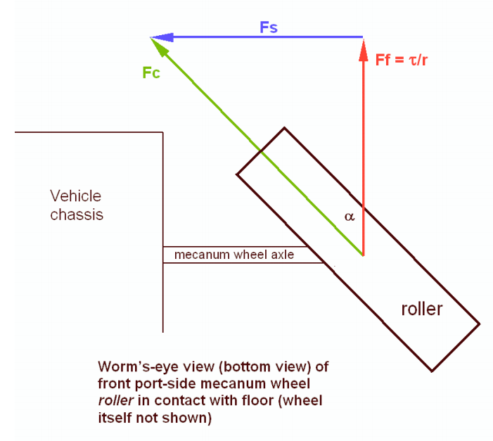
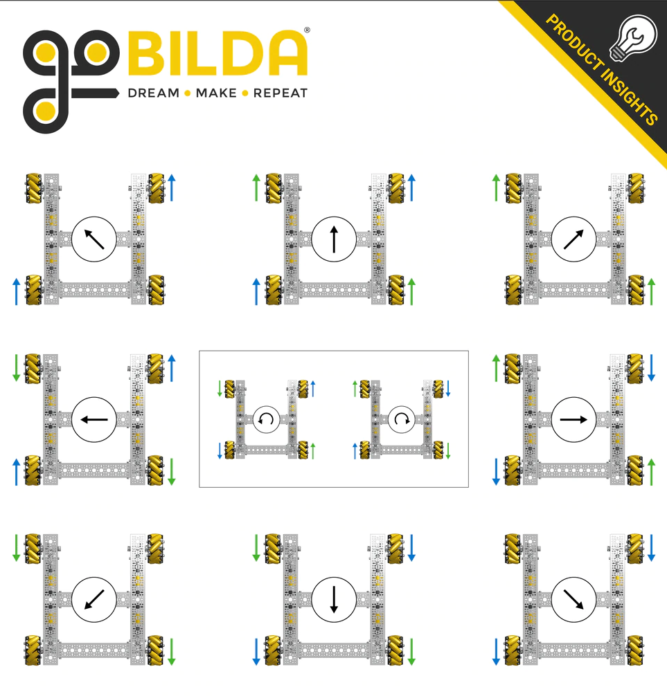

.. include:: <isonum.txt>

Mecanum TeleOp
==============

Mecanum Physics
---------------

:term:`Mecanum drive <Mecanum Wheel>` is a very popular drivetrain type in FTC\ |reg|. Mecanum drivetrains enables holonomic movement. This means that the drivetrain is able to move in any direction while rotating: forwards, backwards, side to side, translating while rotating, etc. `Here is a neat video <https://www.youtube.com/watch?v=pP8ajNMx84k>`_ demonstrating such movement.

.. note:: Some common COTS mecanum drivetrain kits are the `goBILDA Strafer Chassis Kit <https://www.gobilda.com/strafer-chassis-kit-v5/>`_ and the `REV Mecanum Drivetrain Kit <https://www.revrobotics.com/rev-45-2470/>`_.

:term:`Mecanum wheels <Mecanum Wheel>` have rollers at a 45\ |deg| angle to the rest of the wheel. Since these are in contact with the ground instead of something solid like in a :term:`traction wheel <Traction wheel>`, instead of the wheel creating a force parallel to the orientation of the wheel, it creates one 45\ |deg| from parallel. Depending on how the wheels are driven, X or Y components of the force vectors can cancel which allows movement in any direction.

Using Vectoring to Create Omnidirectional Movement
--------------------------------------------------

A standard mecanum drive configuration possesses 4 mecanum wheels oriented in an "X" shape. This means that the rollers are angled towards the center when looking at it from above. This configuration allows one to add up the force vectors generated by the offset rollers and derive movement in any direction. It is important to note that because of friction, perfect movement isn't possible in every direction, so a :term:`mecanum drivetrain <Mecanum Wheel>` will be able to drive slightly faster forwards/backwards than any other directions. Combining translation and rotation will also result in slower movement.

.. image:: images/mecanum-drive/mecanum-drive-force-diagram.png
   :alt: Force diagram of a complete mecanum drive

In the image above, vectors 1, 2, 3, and 4 are the force vectors created by the :term:`mecanum wheels <Mecanum Wheel>` when the chassis is instructed to drive towards the top of the image. All motors are driving forward. The blue and red lines are their X and Y components, respectively. Here are a few examples of how the wheels must be driven to achieve different movements:

.. attention:: It is strongly advised to not hardcode these movements in; there is a much better way described below that allows for true holonomic movement and is much more elegant.

Deriving Mecanum Control Equations
----------------------------------

Before thinking about mecanum, envision a scenario where you have a 2 motor tank drivetrain which you want to control using the left stick Y axis for forward/backward movement, and the right stick X axis for pivot turning. The motors are configured so that positive is clockwise for the right motor when the body is facing away from you, and the left motor is the opposite. To control only forward/backward movement, you simply need to set the motor powers to the Y stick value (flip the sign since Y is reversed):

.. tab-set::

   .. tab-item:: Java
      :sync: java

      .. code-block::

         double y = -gamepad1.left_stick_y; // Remember, Y stick is reversed!

         leftMotor.setPower(y);
         rightMotor.setPower(y);

   .. tab-item:: Blocks
      :sync: blocks

      .. image:: images/mecanum-drive/mecanum-drive-blocks-sample-1.png
         :width: 45em

Although at first adding rotation might seem like a difficult task, it's actually super simple. All you need to do is subtract the right X stick value from the right wheels, and add it to the left:

.. tab-set::

   .. tab-item:: Java
      :sync: java

      .. code-block::

         double y = -gamepad1.left_stick_y; // Remember, Y stick is reversed!
         double rx = gamepad1.right_stick_x;

         leftMotor.setPower(y + rx);
         rightMotor.setPower(y - rx);

   .. tab-item:: Blocks
      :sync: blocks

      .. image:: images/mecanum-drive/mecanum-drive-blocks-sample-2.png
         :width: 45em

Here, if the left stick is pressed upwards, both of the motors will be fed a positive value, causing the robot to move forward. If it is pressed downwards, both of the motors will be fed a negative value, causing the robot to move backwards. A similar principle applies for rotation: if the right stick is pushed rightward, the left wheels will spin forward while the right spin backward, causing rotation. The opposite applies for pushing the stick left. If both sticks are pushed at the same time, say the left Y stick is at 1 and the right X stick is also at 1, the value of the left wheels will be :math:`1+1=2` (which gets clipped to 1 in the SDK) and the right wheels will be :math:`1-1=0`, which causes a rightward curve.

Applying omnidirectional movement with :term:`mecanum wheels <Mecanum Wheel>` operates under the same principle as adding turning into the tank example. The left stick X values will be added or subtracted to each wheel depending on how that wheel needs to rotate to get the desired movement. The only difference from turning is that rather than wheels on the same side being the same sign, wheels diagonal to each other will be the same sign.

We want a positive left stick X value to correlate to rightward strafing. If we refer back to the vectoring image, this means that the front left and back right need to rotate forward, while the back left and front right need to rotate backwards. So, we should add the x value to the front left and back right and subtract it from the back right and front left:

.. tab-set::

   .. tab-item:: Java
      :sync: java

      .. code-block::

         double y = -gamepad1.left_stick_y; // Remember, Y stick is reversed!
         double x = gamepad1.left_stick_x;
         double rx = gamepad1.right_stick_x;

         frontLeftMotor.setPower(y + x + rx);
         backLeftMotor.setPower(y - x + rx);
         frontRightMotor.setPower(y - x - rx);
         backRightMotor.setPower(y + x - rx);

   .. tab-item:: Blocks
      :sync: blocks

      .. image:: images/mecanum-drive/mecanum-drive-blocks-sample-3.png
         :width: 45em

.. important::

   Most FTC motors spin counterclockwise when viewed from their face when given positive power by default, with the exception of NeveRests. If your drivetrain uses an even number of gears, this will reverse the direction the motors spin in.

   On most drivetrains, you will need to reverse the left side for positive power to move forwards with most motors, and reverse the right side with NeveRests. The presence of gearing between the motor gearbox and the wheel may swap this, which is the case for the goBILDA Strafer and the REV Mecanum Drivetrain Kit.

This is the same as the tank example, except now with 4 motors and the strafing component added. Similarly to the tank example, the Y component is added to all wheels, and the right X (rx) is added to the left wheels and subtracted from the right. Now, we have added a left X component (x) that allows us to strafe rightward. In doing that, however, we have actually allowed for strafing in any direction. If you think about it, pressing the left joystick to the left will do the same thing in reverse, which is what is needed to strafe left. If it is pressed at 45 degrees, the x and y components of the joystick will be equal. This will cause two diagonal motors to cancel, allowing for diagonal movement. This same effect applies to every angle of the joystick.

Now that we have a functioning mecanum driving program, there are a few things that can be done to clean it up. The first of these would be multiplying the left X value by something to counteract imperfect strafing. Doing this will make the drive feel more accurate on non axis aligned directions, and make field centric driving more accurate. In this tutorial, we will use 1.1, but it's really up to driver preference.

.. tab-set::

   .. tab-item:: Java
      :sync: java

      .. code-block::

         double y = -gamepad1.left_stick_y; // Remember, Y stick is reversed!
         double x = gamepad1.left_stick_x * 1.1; // Counteract imperfect strafing
         double rx = gamepad1.right_stick_x;

   .. tab-item:: Blocks
      :sync: blocks

      .. image:: images/mecanum-drive/mecanum-drive-blocks-sample-4.png
         :width: 45em

The other improvement we can make is scale the values into the range of -1 to 1.

Since the SDK simply clips (limits) the powers to that range, we can lose the ratio we are looking for unless we proactively put all the numbers back in that range while still maintaining our calculated ratio. For example, if we calculate values of 0.4, 0.1, 1.1, and 1.4, they will be clipped to 0.4, 0.1, 1.0, and 1.0, which is not the same ratio. Instead, we need to divide all of them by the largest power's absolute value when it exceeds 1:

.. tab-set::

   .. tab-item:: Java
      :sync: java

      .. code-block::

         // Denominator is the largest motor power (absolute value) or 1
         // This ensures all the powers maintain the same ratio, but only when
         // at least one is out of the range [-1, 1]
         double denominator = Math.max(Math.abs(y) + Math.abs(x) + Math.abs(rx), 1);
         double frontLeftPower = (y + x + rx) / denominator;
         double backLeftPower = (y - x + rx) / denominator;
         double frontRightPower = (y - x - rx) / denominator;
         double backRightPower = (y + x - rx) / denominator;

   .. tab-item:: Blocks
      :sync: blocks

      .. image:: images/mecanum-drive/mecanum-drive-blocks-sample-5.png
         :width: 45em

Make sure to set the powers on your motor and update this every loop in an opmode!

Robot-Centric Final Sample Code
-------------------------------

.. tab-set::

   .. tab-item:: Java
      :sync: java

      .. code-block::

         package org.firstinspires.ftc.teamcode;

         import com.qualcomm.robotcore.eventloop.opmode.LinearOpMode;
         import com.qualcomm.robotcore.eventloop.opmode.TeleOp;
         import com.qualcomm.robotcore.hardware.DcMotor;
         import com.qualcomm.robotcore.hardware.DcMotorSimple;

         @TeleOp
         public class MecanumTeleOp extends LinearOpMode {
             @Override
             public void runOpMode() throws InterruptedException {
                 // Declare our motors
                 // Make sure your ID's match your configuration
                 DcMotor frontLeftMotor = hardwareMap.dcMotor.get("frontLeftMotor");
                 DcMotor backLeftMotor = hardwareMap.dcMotor.get("backLeftMotor");
                 DcMotor frontRightMotor = hardwareMap.dcMotor.get("frontRightMotor");
                 DcMotor backRightMotor = hardwareMap.dcMotor.get("backRightMotor");

                 // Reverse the right side motors. This may be wrong for your setup.
                 // If your robot moves backwards when commanded to go forwards,
                 // reverse the left side instead.
                 // See the note about this earlier on this page.
                 frontRightMotor.setDirection(DcMotorSimple.Direction.REVERSE);
                 backRightMotor.setDirection(DcMotorSimple.Direction.REVERSE);

                 waitForStart();

                 if (isStopRequested()) return;

                 while (opModeIsActive()) {
                     double y = -gamepad1.left_stick_y; // Remember, Y stick value is reversed
                     double x = gamepad1.left_stick_x * 1.1; // Counteract imperfect strafing
                     double rx = gamepad1.right_stick_x;

                     // Denominator is the largest motor power (absolute value) or 1
                     // This ensures all the powers maintain the same ratio,
                     // but only if at least one is out of the range [-1, 1]
                     double denominator = Math.max(Math.abs(y) + Math.abs(x) + Math.abs(rx), 1);
                     double frontLeftPower = (y + x + rx) / denominator;
                     double backLeftPower = (y - x + rx) / denominator;
                     double frontRightPower = (y - x - rx) / denominator;
                     double backRightPower = (y + x - rx) / denominator;

                     frontLeftMotor.setPower(frontLeftPower);
                     backLeftMotor.setPower(backLeftPower);
                     frontRightMotor.setPower(frontRightPower);
                     backRightMotor.setPower(backRightPower);
                 }
             }
         }

   .. tab-item:: Blocks
      :sync: blocks

      :download:`Blocks file download <block-code/mecanum-drive-sample.blk>`

      .. image:: images/mecanum-drive/mecanum-drive-blocks-sample-complete.png
         :width: 45em

Field Centric
-------------

With field centric mecanum drive, the translation joystick controls the direction of the robot relative to the field, as opposed to the robot frame. This is preferred by some drivers, and make some evasive action easier, as one can spin while translating in a given direction easier. To do this, the x/y components of the joysticks are rotated counter to the robot's angle, which is given by the IMU.

There is an IMU inside of Control Hubs (and older models of Expansion Hubs). Unlike most other hardware, it is recommended to do more than ``hardwareMap.get()`` to begin using it. Note, this is configured when creating a new configuration by default as ``imu``. See the `FTC doc page covering the IMU interface and its parameters <https://ftc-docs.firstinspires.org/programming_resources/imu/imu.html>`_ for more information. The way the IMU will be initialized here is:

.. code-block::

   // Retrieve the IMU from the hardware map
   imu = hardwareMap.get(IMU.class, "imu");
   // Adjust the orientation parameters to match your robot
   IMU.Parameters parameters = new IMU.Parameters(new RevHubOrientationOnRobot(
           RevHubOrientationOnRobot.LogoFacingDirection.UP,
           RevHubOrientationOnRobot.UsbFacingDirection.FORWARD));
   // Without this, the REV Hub's orientation is assumed to be logo up / USB forward
   imu.initialize(parameters);

The angle needs to be read every loop. In addition to this, while the IMU keeps a consistent zero position between OpModes (relevantly, including between autonomous and teleop), adding a bind to reset the angle is important to counteract drift and because the zero can change due to some types of disconnects.

.. note:: ``BNO055`` objects will reset the IMU zero when ``initialize`` is called. The ``BNO055`` class is not recommended for new development. The ``IMU`` class does not have this behavior, and is the appropriate replacement as of SDK v8.1.

.. code-block::

   // This button choice was made so that it is hard to hit on accident,
   // it can be freely changed based on preference.
   // The equivalent button is start on Xbox-style controllers.
   if (gamepad1.options) {
       imu.resetYaw();
   }

   double botHeading = imu.getRobotYawPitchRollAngles().getYaw(AngleUnit.RADIANS);

Then, the translation joystick values need to be counterrotated by the robot heading. The IMU returns heading, however we need to rotate the movement counter to the robot's rotation, so its negative is taken. The joystick values are a vector, and rotating a vector in 2D requires this formula (`proved here <https://matthew-brett.github.io/teaching/rotation_2d.html>`_), where :math:`x_1` and :math:`y_1` are the components of the original vector, :math:`\beta` is the angle to rotate by, and :math:`x_2` and :math:`y_2` are the components of the resultant vector.

.. math::

   x_2=x_1cos \beta - y_1sin \beta \\
   y_2=x_1sin \beta + y_1cos \beta

.. code-block::

   // Rotate the movement direction counter to the bot's rotation
   double rotX = x * Math.cos(-botHeading) - y * Math.sin(-botHeading);
   double rotY = x * Math.sin(-botHeading) + y * Math.cos(-botHeading);

Then, these rotated values can be put into the mecanum kinematics shown earlier.

.. code-block::

   double denominator = Math.max(Math.abs(rotY) + Math.abs(rotX) + Math.abs(rx), 1);
   double frontLeftPower = (rotY + rotX + rx) / denominator;
   double backLeftPower = (rotY - rotX + rx) / denominator;
   double frontRightPower = (rotY - rotX - rx) / denominator;
   double backRightPower = (rotY + rotX - rx) / denominator;

Field-Centric Final Sample Code
^^^^^^^^^^^^^^^^^^^^^^^^^^^^^^^

.. code-block::

   package org.firstinspires.ftc.teamcode;

   import com.qualcomm.robotcore.eventloop.opmode.LinearOpMode;
   import com.qualcomm.robotcore.hardware.IMU;
   import com.qualcomm.robotcore.eventloop.opmode.TeleOp;
   import com.qualcomm.robotcore.hardware.DcMotor;
   import com.qualcomm.robotcore.hardware.DcMotorSimple;
   import com.qualcomm.hardware.rev.RevHubOrientationOnRobot;
   import org.firstinspires.ftc.robotcore.external.navigation.AngleUnit;

   @TeleOp
   public class FieldCentricMecanumTeleOp extends LinearOpMode {
       @Override
       public void runOpMode() throws InterruptedException {
           // Declare our motors
           // Make sure your ID's match your configuration
           DcMotor frontLeftMotor = hardwareMap.dcMotor.get("frontLeftMotor");
           DcMotor backLeftMotor = hardwareMap.dcMotor.get("backLeftMotor");
           DcMotor frontRightMotor = hardwareMap.dcMotor.get("frontRightMotor");
           DcMotor backRightMotor = hardwareMap.dcMotor.get("backRightMotor");

           // Reverse the right side motors. This may be wrong for your setup.
           // If your robot moves backwards when commanded to go forwards,
           // reverse the left side instead.
           // See the note about this earlier on this page.
           frontRightMotor.setDirection(DcMotorSimple.Direction.REVERSE);
           backRightMotor.setDirection(DcMotorSimple.Direction.REVERSE);

           // Retrieve the IMU from the hardware map
           IMU imu = hardwareMap.get(IMU.class, "imu");
           // Adjust the orientation parameters to match your robot
           IMU.Parameters parameters = new IMU.Parameters(new RevHubOrientationOnRobot(
                   RevHubOrientationOnRobot.LogoFacingDirection.UP,
                   RevHubOrientationOnRobot.UsbFacingDirection.FORWARD));
           // Without this, the REV Hub's orientation is assumed to be logo up / USB forward
           imu.initialize(parameters);

           waitForStart();

           if (isStopRequested()) return;

           while (opModeIsActive()) {
               double y = -gamepad1.left_stick_y; // Remember, Y stick value is reversed
               double x = gamepad1.left_stick_x;
               double rx = gamepad1.right_stick_x;

               // This button choice was made so that it is hard to hit on accident,
               // it can be freely changed based on preference.
               // The equivalent button is start on Xbox-style controllers.
               if (gamepad1.options) {
                   imu.resetYaw();
               }

               double botHeading = imu.getRobotYawPitchRollAngles().getYaw(AngleUnit.RADIANS);

               // Rotate the movement direction counter to the bot's rotation
               double rotX = x * Math.cos(-botHeading) - y * Math.sin(-botHeading);
               double rotY = x * Math.sin(-botHeading) + y * Math.cos(-botHeading);

               rotX = rotX * 1.1;  // Counteract imperfect strafing

               // Denominator is the largest motor power (absolute value) or 1
               // This ensures all the powers maintain the same ratio,
               // but only if at least one is out of the range [-1, 1]
               double denominator = Math.max(Math.abs(rotY) + Math.abs(rotX) + Math.abs(rx), 1);
               double frontLeftPower = (rotY + rotX + rx) / denominator;
               double backLeftPower = (rotY - rotX + rx) / denominator;
               double frontRightPower = (rotY - rotX - rx) / denominator;
               double backRightPower = (rotY + rotX - rx) / denominator;

               frontLeftMotor.setPower(frontLeftPower);
               backLeftMotor.setPower(backLeftPower);
               frontRightMotor.setPower(frontRightPower);
               backRightMotor.setPower(backRightPower);
           }
       }
   }
