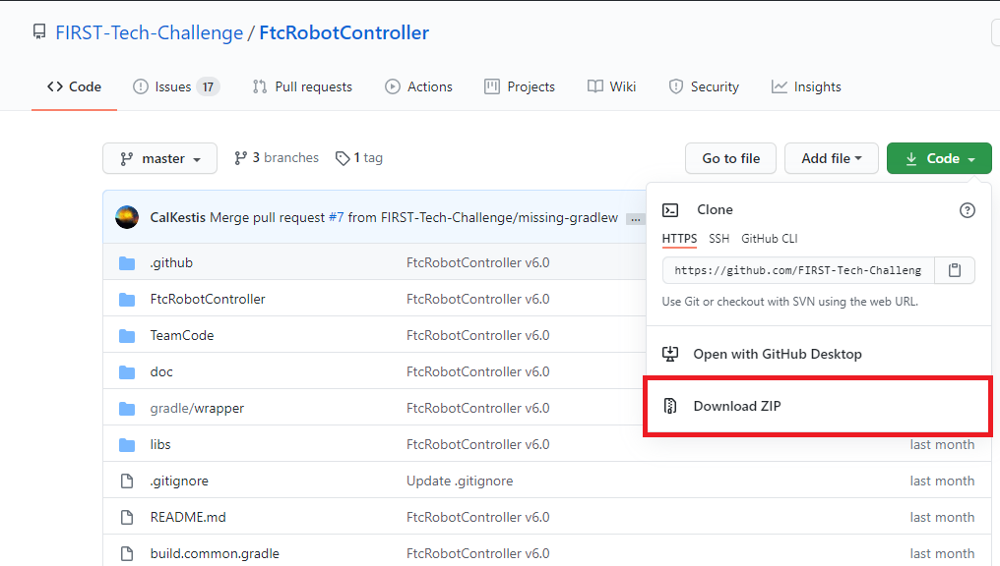
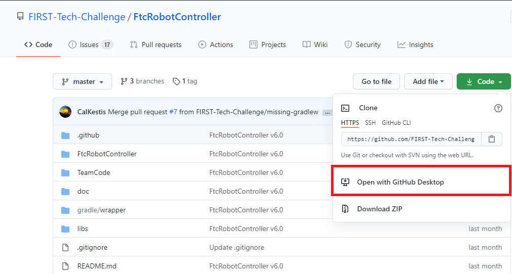
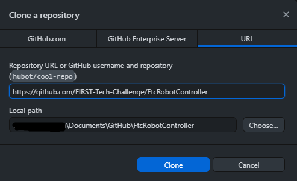
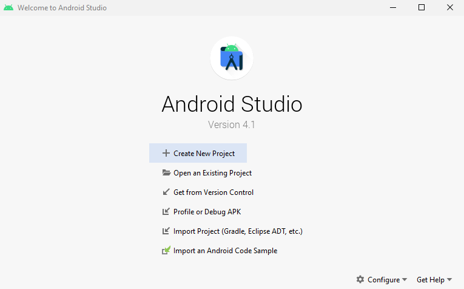
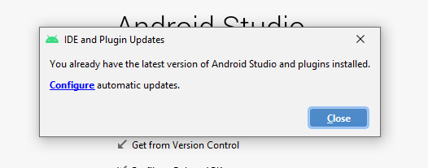
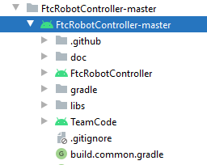

====================
Using Android Studio
====================
`Android Studio <https://developer.android.com/studio/intro>`_
is an integrated development environment (IDE) for
Android app development based on IntelliJ. It compiles
your code to an apk which is then installed onto the
Robot Controller: either the Control Hub or a
legal Android phone.

Downloading Android Studio
==========================

If you've already downloaded Android Studio, you can
move on to the next step, which is
`setting up the SDK <#setting-up-the-sdk>`_.
Downloading and setting up AS can be seemless:

1. Check to make sure your system meets
the `necessary requirements <https://developer.android.com/studio#Requirements>`_

2. Install the *latest* version of Android Studio
using `this link <https://developer.android.com/studio/index.html>`_

3. Run the executable, follow the setup wizard, and use
any and all recommended development kits

Setting up the SDK
==================
Now that you have Android Studio installed,
you're going to want to use the current season's
SDK (software development kit) where you will
create your team's code.

-------------------
Downloading the SDK
-------------------
The SDK is publicly released to a GitHub
repository every season. The current season's
SDK can be found in the
`FtcRobotController <https://github.com/FIRST-Tech-Challenge/FtcRobotController>`_
repository.

Downloading the Zip
-------------------
1. When you're at the repository, click the green
   "code" button. Then, select "Download ZIP."

2. Then, save it to the desired location in your
   computer.

.. figure:: images/using-android-studio/save-to-computer.png
    :width: 50em
    :alt: The ZIP file should be called FtcRobotController-master

3. After it is saved, extract the contents of the ZIP
   and place them into whatever desired location.
   You should see the contents of the SDK inside of the
   folder location.

Using GitHub Desktop
--------------------
1. When you're at the repository, click the green "code" button.
   Then, select "Open with GitHub Desktop."

2. Clone the project.

From the Command Line
---------------------
1. Open your bash tool in the desired resource location.

2. Use :code:`$git clone https://github.com/FIRST-Tech-Challenge/FtcRobotController.git`

---------------------------------
Opening the SDK on Android Studio
---------------------------------
1. Open Android Studio. If you have another project open, close it.

          settings and import a project

2. Check for updates. Click on the "configure"
   dropdown and select "check for updates."
   If you do not have the latest version,
   download the updates.

          you have the latest version installed

3. Select "Import Project." Navigate to where you have
   the SDK saved on your computer. Choose the directory
   that has the Android logo.

4. Change to project view. In the top left corner
   should be a dropdown that allows you to change the
   way you are looking at your project.

.. figure:: images/using-android-studio/select-project-view.png
    :alt: Change to project view

5. Wait for gradle to build.

