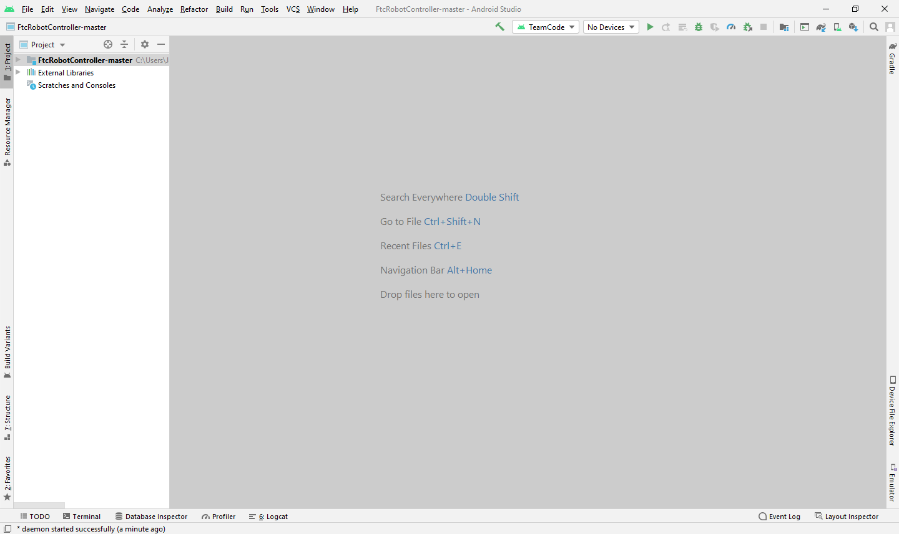
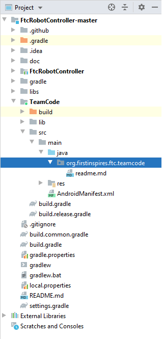
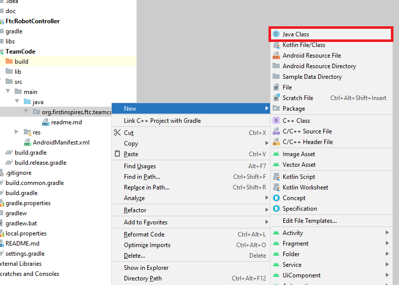
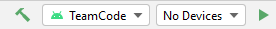

====================
Using Android Studio
====================
`Android Studio <https://developer.android.com/studio/intro>`_
is an integrated development environment (IDE) for
Android app development based on IntelliJ. It compiles
your code to an apk which is then installed onto the
Robot Controller: either the Control Hub or a
legal Android phone.

Downloading Android Studio
==========================

If you've already downloaded Android Studio, you can
move on to the next step, which is
`setting up the SDK <#setting-up-the-sdk>`_.

The steps to download and setup Android Studio are:

#. Check to make sure your system meets
   the `necessary requirements <https://developer.android.com/studio#Requirements>`_
#. Install the *latest* version of Android Studio from
   https://developer.android.com/studio/index.html
#. Run the executable, follow the setup wizard, and use
   any and all recommended development kits

Setting up the SDK
==================
Now that you have Android Studio installed,
you're going to want to use the current season's
SDK (software development kit) where you will
create your team's code.

Downloading the SDK
-------------------
The SDK is publicly released to a GitHub
repository every season. The current season's
SDK can be found in the
`FtcRobotController <https://github.com/FIRST-Tech-Challenge/FtcRobotController>`_
repository.

Downloading the Zip
^^^^^^^^^^^^^^^^^^^
#. When you're at the repository, click the green
   "code" button. Then, select "Download ZIP."

   .. image:: images/using-android-studio/download-zip.png
      :width: 50em
      :alt: Click the Download ZIP option

#. Then, save it to the desired location in your
   computer.

   .. image:: images/using-android-studio/save-to-computer.png
      :width: 50em
      :alt: The ZIP file should be called FtcRobotController-master

#. After it is saved, extract the contents of the ZIP
   and place them into whatever desired location.
   You should see the contents of the SDK inside of the
   folder location.

Using GitHub Desktop
^^^^^^^^^^^^^^^^^^^^
#. `Install GitHub Desktop <https://docs.github.com/en/free-pro-team@latest/desktop/installing-and-configuring-github-desktop/installing-and-authenticating-to-github-desktop>`_
#. Open the `SDK repository <https://github.com/FIRST-Tech-Challenge/FTCRobotController>`_
   in a browser.
#. Click the green "code" button, and then select "Open with GitHub Desktop."

   .. image:: images/using-android-studio/open-with-gh-desktop.png
      :width: 50em
      :alt: Click the Open with GitHub Desktop option
#. Clone the project.

   .. image:: images/using-android-studio/clone-github-desktop.png
      :alt: Clone the repository to your resource folder

From the Command Line
^^^^^^^^^^^^^^^^^^^^^
#. `Install git <https://github.com/git-guides/install-git>`_
#. Open the terminal (probably bash) in the desired resource location.

#. Use :code:`$ git clone https://github.com/FIRST-Tech-Challenge/FtcRobotController.git`

Opening the SDK on Android Studio
---------------------------------
#. Open Android Studio. If you have another project open, close it.

   .. image:: images/using-android-studio/opening-as.png
      :width: 50em
      :alt: A screen should appear with an option to configure
            settings and import a project

#. Check for updates. Click on the "configure"
   dropdown and select "check for updates."
   If you do not have the latest version,
   download the updates.

   .. image:: images/using-android-studio/check-for-updates.png
      :alt: If you have no new updates, it should say that
            you have the latest version installed

#. Select "Import Project." Navigate to where you have
   the SDK saved on your computer. Choose the directory
   that has the Android logo.

   .. image:: images/using-android-studio/select-the-sdk.png
      :alt: Only select the folder with the Android logo

#. Change to project view. In the top left corner
   should be a dropdown that allows you to change the
   way you are looking at your project.

   .. image:: images/using-android-studio/select-project-view.png
      :alt: Change to project view

#. Wait for `gradle <Gradle>`_ to complete the build.

   .. image:: images/using-android-studio/build-gradle.png
      :width: 50em

Layout
======
Android Studio can look menacing at first glance, but
there are only a few features needed to use it
properly.

Creating Classes
----------------
The first thing to note in the project view
is the dropdown with the name of the
project. If you drop that down, you will
see all of the gradle files and directories.
Navigate to the TeamCode folder. In the
teamcode folder you will see an
:code:`org.firstinspires.ftc.teamcode` package.

        > org.firstinspires.ftc.teamcode

This is where you will create your code for
the robot. To create a new Java class,
right click on the package, select New, and
then choose "Java Class."

Alternatively, you can select the "Package"
option if you want to create a subfolder
for organization purposes. Then,
you can create classes in those packages.

Terminal and Logcat
-------------------
Near the bottom left of the application,
you will find tabs for the local terminal
and logcat. These are useful tools for
working with your program.

Some useful information on using the
logcat can be found
`here <https://developer.android.com/studio/debug/am-logcat>`_.

.. note::
    You can build your program through the commandline
    via the local terminal. Click on the terminal
    tab and then input :code:`gradlew :TeamCode:clean :TeamCode:build`.
    This will delete the previously compiled files and
    build your TeamCode module.

Installing Your Program
-----------------------
To install your program onto the Robot Controller,
you will use the play button located near the top right
of the application window.

Next to it you will see a dropdown
for devices. When you connect your Robot Controller
to your computer (using the correct cable),
the device should appear in the dropdown after some time.
Then, click the play button and your program will install
onto the device.

If you run into any problems with this process,
refer to the official
`REV documentation <https://docs.revrobotics.com/rev-control-system/>`_.

Gradle
======

Android Debug Bridge
====================
